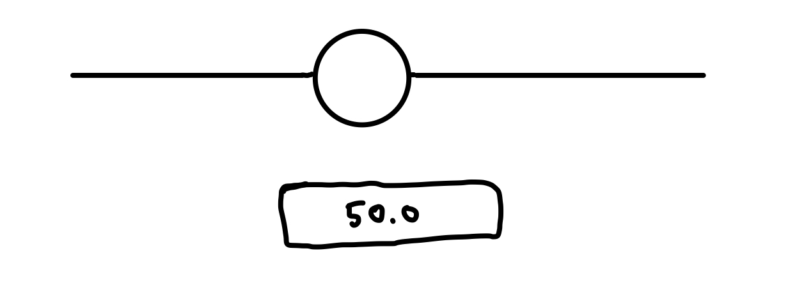
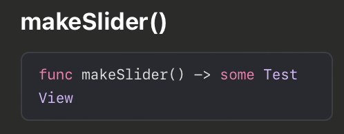

제네릭은 코드의 호출부에서 타입이 결정된다. 함수의 구현부에서 타입을 추상화 한다. 반대로 Opaque Type은 함수 구현부에서 타입이 확정되고 함수 호출부에서는 내부 타입이 어떻게 이루어져 있는지 모른다.

이러한 이유로 Opaque Type을 역 제네릭 타입(reverse generic type)이라고도 부른다.

```swift
func makeArray() -> some Collection {
    return [1, 2, 3]
}
// 출처: https://zeddios.tistory.com/1366 [ZeddiOS:티스토리]
```

위 코드에서 리턴되는 컬렉션의 타입은 `[Int]`로 결정된다. 함수를 호출하는 곳에서는 내부 타입이 어떤 컬렉션으로 이루어졌다는것 밖에 모른다.

위 코드에서 `some Collection`이 아닌 `Collection`을 리턴하게 되면 컬렉션 프로토콜을 채택한 모든 타입을 리턴할 수 있다. 반면 `some Collection`으로 불분명한 타입을 리턴하는 경우 단 하나의 구체 타입을 리턴해야 한다.

```swift
struct TestOne: TestProtocol {}
struct TestTwo: TestProtocol {}

func somethings() -> ✅some✅ TestProtocol {
    let value = true
    if value { return TestOne() }

    return TestTwo()
}
// 출처: https://zeddios.tistory.com/1366 [ZeddiOS:티스토리]
```

위 코드는 에러가 발생하는데, `TestOne`과 `TestTwo`라는 두개의 구체타입을 리턴하고 있기 때문이다. 위 함수에서 `some TestProtocol`로 리턴 타입을 지정하려면 TestProtocol을 채택하는 구체타입 `TestOne` 또는 `TestTwo`중 하나의 타입만 리턴해야 컴파일 에러가 발생하지 않는다.

```swift
func somethings() -> ✅some✅ TestProtocol {
    return TestOne()
}
```

즉 Opaque Type을 사용하면 `somethings`라는 함수가 `TestProtocol`을 채택하는 어떤 객체를 리턴한다는 것은 알지만 해당 프로토콜을 실제로 채택한 구체타입의 내용에 대해서는 알지 못한다는 것이다.

SwiftUI에서 Opaque Type이 자주 사용되는 것을 볼 수 있는데, 아래 코드를 봐보자.

```swift
struct ContentView: View {
    var body: some View {
        VStack {
            Image(systemName: "globe")
                .imageScale(.large)
                .foregroundStyle(.tint)
            Text("Hello, world!")
        }
        .padding()
    }
}
```

위 코드에서 body 속성의 타입이 `some View`로 지정되어서 `View`프로토콜을 채택하는 뷰 요소 하나를 리턴하게 된다. body속성에 단 하나의 뷰 요소만 리턴해야만 하는 이유가 Opaque Type으로 선언되었기 때문임을 알 수 있다.

## Opaque Type 사용 이유

`View`라는 이름의 프로토콜이 있다고 가정해보자. 이 뷰 프로토콜을 채택한 `Text`, `Image`, `Slider`라는 뷰를 구현해보자.

```swift
protocol View {
    func layoutViews()
}

struct Text: View {
    var size: CGSize

    func layoutViews() {
        // ..
    }
}

struct Image: View {
    var size: CGSize

    func layoutViews() {
        // ..
    }
}

struct Slider<T: View, U: View>: View {
    var firstSubview: T
    var secondSubview: U

    func layoutViews() {
        // ..
    }
}
```

슬라이더 컴포넌트의 컨트롤러로 들어갈 이미지와 슬라이더 변경에 따른 수치를 표기해줄 텍스트 뷰가 들어간다고 가정해보자. 대충 그림으로 표현하면 아래와 같은 형태일 것이다. (예시는 예시일 뿐 이런 컴포넌트를 만들 일이 있을까 싶다)



작성된 구체타입을 기반으로 슬라이더 컴포넌트를 생성하면 다음과 같다.

```swift
let image = Image(size: CGSize(width: 10, height: 10))
let text = Text(size: CGSize(width: 10, height: 10))
let slider = Slider(firstSubview: image, secondSubview: text)
```

슬라이더 컴포넌트 생성 시 함수 구현 부에서는 `View`프로토콜을 채택하는 뷰들을 생성자 파라미터로 받아 전달하게 되므로 `Image`와 `Text` 컴포넌트를 전달하는 것을 볼 수 있다.

이때 이니셜라이저 호출 부에서 발생하는 문제는 **제네릭으로 선언된 `Slider` 구체 타입임에도 호출 단에서 내부에 전달되는 특정 타입이 노출된다는 것이다.**

`Image`와 `Text` 타입을 캡슐화해주기 위해 Opaque Type을 활용하면 아래와 같이 코드를 작성해볼 수 있다.

```swift
// Opaque Type - some 키워드 추가
func makeSlider() -> some View {
    let image = Image(size: CGSize(width: 10, height: 10))
    let text = Text(size: CGSize(width: 10, height: 10))
    return Slider(firstSubview: image, secondSubview: text)
}
```

위와 같이 함수를 정의하면 퀵헬프에서 다음과 같은 형태로 나타난다.



`Slider`라는 구체 타입을 리턴하고 있지만 외부 호출단에서 봤을 때는 내부 타입이 캡슐화 되어 있는 것을 알 수 있다.

## Reference

1. [Lionable Medium - [스위프트] Opaque type](https://medium.com/@Lionable/%EC%8A%A4%EC%9C%84%ED%94%84%ED%8A%B8-opaque-type-fa944e92b25b)
2. [zeddios - Opaque Type](https://zeddios.tistory.com/1366)
3. [The Swift Programming Language 한국어 - Opaque Type](https://bbiguduk.gitbook.io/swift/language-guide-1/opaque-types)
