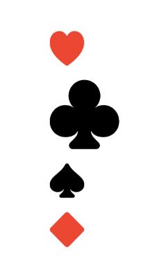
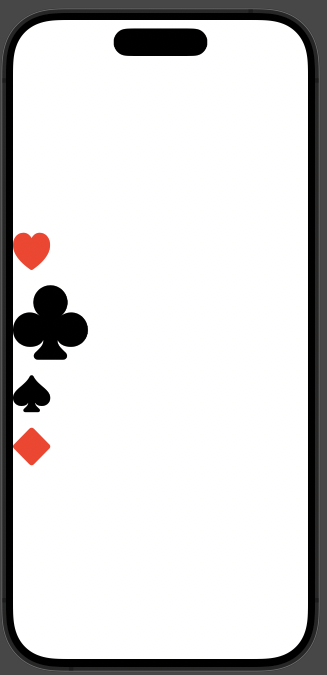
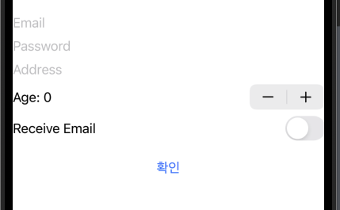
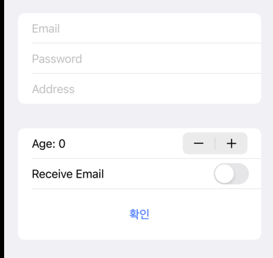

## HStack

컴포넌트들을 수평으로 leading to trailing 방향으로 배치한다.

```swift
var body: some View {
    HStack(alignment: .center,spacing: 0) {
        Text("HI")
        Text("HI")
    }
    .frame(maxWidth: .infinity, maxHeight: .infinity)
}
```

1. 스택 이니셜라이저의 `alignment`를 통해 배치 가능
2. `spacing`으로 기본 설정되어 있는 요소 간격 설정
3. `frame` 모디파이어를 통해 너비 및 높이 설정 가능, `maxWidth` & `maxHeight` `.infinity`로 설정시 화면 기준 차지할 수 있는 최대값으로 지정됨

## VStack

컴포넌트들을 위에서 아래로 배치한다. `maxWidth` 프레임값 지정을 할때 요소들 중 고유 사이즈값이 가장 큰 요소를 기준으로 배치되기 때문에, `leading` 배치를 `maxWidth: .infinity` 기반으로 배치했을때 화면 왼쪽으로 붙지 않고 가장 너비가 긴 요소를 기준으로 좌측에 배치된다.

```swift
var body: some View {
    VStack(alignment: .leading, spacing: 20) {
        heart
        club
        spade
        diamond
    }
    .frame(maxWidth: .infinity, maxHeight: .infinity)
```



화면 기준으로 왼쪽에 붙이려면 스페이서를 활용하는 패턴을 사용한다.

```swift
var body: some View {
    HStack {
        VStack(alignment: .leading, spacing: 20) {
            heart
            club
            spade
            diamond
        }
        .frame(maxHeight: .infinity)

        Spacer()
    }
}
```



## ZStack

나중에 추가한 뷰가 먼저 추가한 뷰의 위에 쌓이는 형태로 배치된다. `ZStack` 이니셜라이저에서 제공하는 `alignment` 초기 배치 레이아웃에서 고유사이즈가 가장 큰 대상 기준으로 센터 배치가 된다.

```swift
var body: some View {
    ZStack(alignment: .topLeading) {
        heart
        club
        spade
        diamond
            .offset(x: 100, y: 100)
    }
}
```

`topLeading` 등 여러 방식으로 배치 가능하다. 스택 내에 배치되는 요소에 대해 `offset` 모디파이어를 사용하면 커스텀 배치도 가능하다.

## LazyStacks & ScrollView

스택은 기본적으로 스크롤뷰를 지원하지 않는다. 스택뷰에 스크롤을 적용하려면 `ScrollView`에 임베딩만 하면 된다. 문제는 스택뷰의 초기화 시점이다.

```swift
var body: some View {
    ScrollView(.horizontal) {
        HStack {
            ForEach(1 ..< 101) { num in
                NumberView(number: num)
            }
        }
    }
}
```

위와 같이 뷰를 구성하면 100개의 뷰가 `body`속성 계산 시점에 한번에 생성된다. `NumberView` 내부 구성에 이미지 처리와 같이 메모리를 사용하는 경우면 큰 오버헤드가 발생한다.

따라서 이러한 경우 스크롤 시점에 동적으로 초기화시키기 위해 `LazyHStack`, `LazyVStack`을 사용한다.

```swift
var body: some View {
    ScrollView(.horizontal) {
        LazyHStack { // Lazy!
            ForEach(1 ..< 101) { num in
                NumberView(number: num)
            }
        }
    }
}
```

스크롤뷰에는 섹션을 추가할 수 있다. `SectionHeaderView`는 커스텀 뷰이다.

```swift
var body: some View {
    ScrollView {
        LazyVStack {
            Section {
                EmojiView(emoji: "😀")
                EmojiView(emoji: "😍")
                EmojiView(emoji: "😎")
            } header: {
                SectionHeaderView(title: "HI")
            }
        }
        .frame(maxWidth: .infinity)
    }
}
```

`LazyVStack` 이니셜라이저에 sticky 헤더 & 풋터를 사용할 수 있다. `pinnedViews` 배열 아규먼트에 `.sectionHeaders` & `.sectionFooters` 열거형을 전달하면 된다.

```swift
LazyVStack(pinnedViews: [.sectionHeaders]) {
    Section {
        EmojiView(emoji: "😀")
        EmojiView(emoji: "😍")
        EmojiView(emoji: "😎")
    } header: {
        SectionHeaderView(title: "EMOJI")
    }
```

:::tip ScrollView 상하좌우 스크롤

모든 방향으로 스크롤하도록 구현하려면 스크롤뷰 컴포넌트 생성자에 `Axis`를 배열 내에 전달하면 된다.

```swift
var body: some View {
    ScrollView([.horizontal, .vertical]) {
        BigPhotoView()
    }
    .ignoresSafeArea()
}
```

:::

## Spacer

스페이서는 기본적으로 배치될 뷰를 제외한 빈 공간을 스페이서 컴포넌트 갯수만큼 나눠 가져간 뒤 요소들을 배치한다.

스페이서를 추가하면 해당 요소를 임베딩하는 컨테이너도 자동으로 확장된다.

```swift
Spacer(minLength: 50)
```

아규먼트로 `minLength`값을 전달하면 스페이서 크기의 최솟값을 지정할 수 있다. 레이아웃 계산에 따라 고정된 값으로 생성되는 것이 아님에 주의한다.

원하는 대로 스페이싱을 조절하고 싶다면 생성자 함수의 `spacing` 아규먼트 값을 조절하거나 스페이서 컴포넌트에 `frame` 모디파이어를 추가한다.

## ViewBuilder & Group

`SwiftUI`에서는 자식 뷰로 추가할 수 있는 최대 갯수가 10개로 제한된다. 스택뷰 내부 코드를 보면 다음과 같다.

```swift
@available(iOS 13.0, macOS 10.15, tvOS 13.0, watchOS 6.0, *)
@frozen public struct VStack<Content> : View where Content : View {

    @inlinable public init(alignment: HorizontalAlignment = .center, spacing: CGFloat? = nil, @ViewBuilder content: () -> Content)

    public typealias Body = Never
}
```

자식 뷰가 `@ViewBuilder`라는 키워드 아래 클로저로 추가되는 형태인데, 자식 뷰들이 추가된 경우 `ViewBuilder.buildBlock()` 함수 파라미터 내에 자식 뷰들이 전달되는 형태로 사용된다. 함수 파라미터가 `c0`..`c9`까지로 열개로 제한되어 있기 때문에 뷰 빌더 최대 갯수가 10개인 것이다.

이러한 문제를 해결하기 위해 `Stack` 혹은 `Section`으로 뷰에 계층화를 적용하는 방식이 사용될 수 있는데, 이는 레이아웃에 대한 정보가 포함된 형태이기 때문에 단순 그룹핑 목적으로만 사용하는 경우 `Group`을 사용한다.

이러한 목적 외에도 공동 모디파이어를 바깥으로 빼기 위해서도 사용한다.

```swift
Group {
    Text("Hello, World!")
    Text("Hello, World!")
    Text("Hello, World!")
    Text("Hello, World!")
    Text("Hello, World!")
    Text("Hello, World!")
    Text("Hello, World!")
    Text("Hello, World!")
    Text("Hello, World!")
    Text("Hello, World!")
}
.font(.title3)
```

`Group`은 레이아웃과 연관이 없기 때문에 `.padding()`과 같은 모디파이어 적용 시 자기 자신에게 적용하지 않고 자식 뷰들에게 각각 상속하여 적용하는 형태로 구현된다.

## Form

사용자 입력 폼을 구현할때 `UIKit` 기반에서는 테이블 뷰로 구성하는 것이 일반적이었다. `SwiftUI`에서도 직접 입력폼 구현을 하기 위해 스택뷰들로 하나 하나 구현하는 것은 불필요하다.



```swift
VStack {
    Section {
        TextField("Email", text: $email)
        SecureField("Password", text: $password)
        TextField("Address", text: $address)
    }

    Stepper("Age: \(age)", value: $age)
    Toggle(isOn: $receiveEmail, label: { Text("Receive Email") })

    Button("확인") {

    }
    .padding()
    .frame(maxWidth: .infinity)
}
```

위 사진은 `VStack`으로 임베딩했을때 구현된 입력 폼이다.

임베딩 방식을 스택이 아닌 `Form`으로 처리하면 엄청난 변화가 생긴다.



## Overlay

오버레이는 뷰 위에 다른 뷰를 쌓을 때 사용된다. `ZStack`과 거의 동일한 형태이지만 뷰 하나에 맞춰 최적화된 덮기용 뷰를 구현할때 오버레이를 사용하면 된다.

```swift
EmojiView(emoji: "😎")
    .overlay(alignment: .bottomTrailing) {
        if selected {
            Image(systemName: "checkmark.circle.fill")
                .foregroundStyle(.blue)
                .font(.largeTitle)
        }
    }
    .onTapGesture {
        selected.toggle()
    }
```
