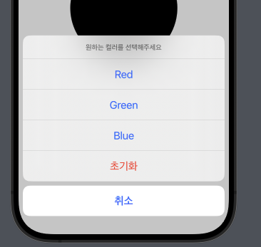

## Alert

SwiftUI 에서 제공하는 알럿창을 사용해본다. 기존에는 `Alert` 생성자를 통해 직접 호출하는 방식이었다면 iOS15 이후부터는 `.alert` 모디파이어 내에서 처리하게 된다.

```swift
struct Alert_Tutorials: View {
    @State private var message = ""
    @State private var showAlert = false

    var body: some View {
        VStack {
            Text(message)
                .font(.largeTitle)

            Button {
                showAlert = true
            } label: {
                Text("Show Alert")
            }
            .padding()
            .alert("경고창", isPresented: $showAlert) {
                // 1. 확인버튼
                Button("확인") {
                    message = "확인"
                }

                // 2. 취소버튼
                Button(role: .cancel) {
                    message = "취소"
                } label: {
                    Text("취소")
                }
            } message: {
                Text("조심하세요!")
            }
        }
    }
}
```

`.alert` 모디파이어는 위치에 구애받지 않고, `@State`를 기반으로 로직 설계만 정상적으로 이루어지면 모든 뷰에 모디파이어로 등록해도 된다.

다만 통상적인 경우 다음과 같은 위치에서 alert 모디파이어를 호출한다.

1. 알럿창의 트리거가 되는 곳 (버튼 등)
2. 트리거 로직 설계가 애매한 경우 취상위 컨테이너

만약 알럿창이 참조하는 데이터가 있는 경우 클로저 바깥의 특정 값을 가리키는 형태보다 `presenting` 파라미터를 갖는 `alert` 모디파이어를 호출하는 것이 좋다.

```swift
// presenting parameter!
.alert("경고", isPresented: $showImageAlert, presenting: imageData) { data in
    Button("필터 적용") {
        message = data.filters.joined(separator: ", ") + "필터를 적용합니다."
    }

    Button(role: .cancel) {
        message = "취소"
    } label: {
        Text("취소")
    }
} message: { data in
    Text("\(data.name) 파일에서 어떤 작업을할까요? \n촬영일자\(data.date)")
}
```

`presenting` 파라미터에 데이터를 전달하면 알럿 액션 클로저의 파라미터로 데이터가 전달된다.

## Confirmation Dialog

컨퍼메이션 다이얼로그는 하단에 노출되며 여러 선택지들 중 하나를 고를 때 사용하는 UI이다.

```swift
.confirmationDialog("컬러 선택", isPresented: $showDialog) {
    Button("Red") {
        color = .red
    }

    Button("Green") {
        color = .green
    }

    Button("Blue") {
        color = .blue
    }

    Button(role: .cancel) {

    } label: {
        Text("취소")
    }

    Button(role: .destructive) {
        color = .black
    } label: {
        Text("초기화")
    }

} message: {
    Text("원하는 컬러를 선택해주세요")
}
```

동작 자체는 알럿 모디파이어와 거의 동일하다. 뷰를 띄우는 바인더 속성 및 메세지, 내부 컴포넌트들을 정의하면 된다. `visibility` 파라미터는 플랫폼별로 기본적으로 제공하는 형태가 달라지므로 굳이 파라미터 지정까지 할 필요는 없다.

`confirmationDialog`는 내부에 선택지가 여러개 들어가므로 버튼 컴포넌트가 중복되어 들어가는 코드가 작성된다. 이를 개선하기 위해 `Identifiable` 프로토콜을 채택한 모델을 새로 정의한 뒤 `ForEach`를 사용하여 구현하면 좋다.



```swift
.confirmationDialog("컬러 선택", isPresented: $showDialog, presenting: ColorData.samples) { colors in
    // ForEach 활용
    ForEach(colors) { item in
        Button(item.title) {
            color = item.color
        }
    }

    Button(role: .cancel) {

    } label: {
        Text("취소")
    }

    Button(role: .destructive) {
        color = .black
    } label: {
        Text("초기화")
    }

} message: { _ in
    Text("원하는 컬러를 선택해주세요")
}
```

## Sheet

카드 모달 혹은 풀스크린 모달을 구현하려는 경우 `.sheet` 모디파이어, `.fullScreenCover` 모디파이어를 사용하면 된다. 화면을 띄우기 위해 `isPresented` 파라미터에 불리언 바인딩 속성을 전달하는 것도 동일하다.

```swift
@State private var presentCardModal = false
@State private var presentFullscreen = false

var body: some View {
    VStack {
        Button {
            presentCardModal = true
        } label: {
            Text("Card Modal")
        }
        .sheet(isPresented: $presentCardModal, content: {
            ImageScene()
        })

        Button {
            presentFullscreen = true
        } label: {
            Text("Fullscreen")
        }
        .fullScreenCover(isPresented: $presentFullscreen, content: {
            ImageScene()
        })
    }
}
```

만약 모달로 띄운 뷰 내에서 특정 뷰 조작을 통해 `dismiss`를 처리하고 싶은 경우 `@Environment` 프로퍼티 래퍼를 통해 `dismiss` 액션을 가져오면 된다.

```swift
@Environment(\.dismiss) var dismiss
Button {
    dismiss()
} label: {
    Text("닫기")
}
```

혹은 위의 방식 외에 바인딩 속성에 대한 참조를 모달 뷰 내에 직접 전달하는 방법도 있다. 예시 코드에서는 `ImageScene`에 바인딩 속성을 전달한다.

```swift
Button {
    presentFullscreen = true
} label: {
    Text("Fullscreen")
}
.padding()
.fullScreenCover(isPresented: $presentFullscreen, content: {
    ImageScene(presentModal: $presentFullscreen) // 여기!
})
```

모달로 띄워지는 뷰에서는 참조를 전달받을 속성을 `@Binding` 프로퍼티 래퍼로 선언한다. 값 할당 없이 타입 지정만 해두면 되고, 프리뷰에서 발생하는 에러는 정적 바인딩으로 처리한다.

```swift
struct ImageScene: View {
    @Environment(\.dismiss) var dismiss
    @Binding var presentModal: Bool

    var body: some View {
        Image("photo")
            .overlay(alignment: .top) {
                Button {
                    // dismiss()
                    presentModal = false // 속성값 바인딩
                } label: {
                    Image(systemName: "x.circle")
                        .resizable()
                        .frame(width: 50, height: 50)
                        .foregroundColor(.white)
                        .padding()
                }
            }
    }
}

#Preview {
    // 정적 바인딩
    ImageScene(presentModal: .constant(true))
}
```

모달을 열어주는 로직이 반드시 불리언일 필요는 없다. `Identifiable` 프로토콜을 채택하는 데이터라면 값이 옵셔널 바인딩 했을때 정상적으로 추출되는 경우 모달을 띄워주는 식으로 설계가 가능하다.

`sheet` 모디파이어에 `item` 속성을 사용하면 된다.

```swift
.sheet(item: $imageData) { data in
    OptionalImageScene(imageData: data)
}
```
