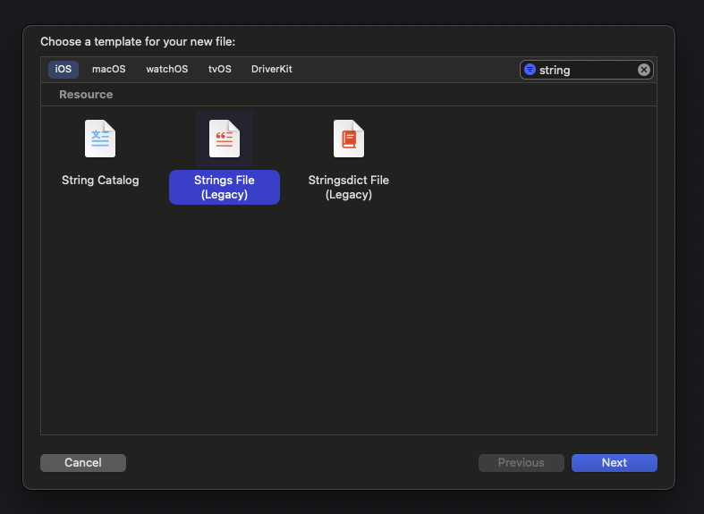
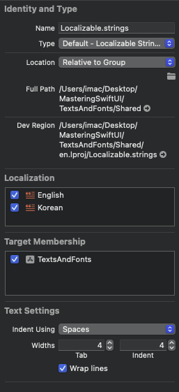
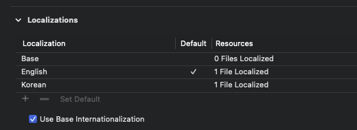

## Text

텍스트 뷰에 전달되는 문자열 값은 로컬라이즈 키값으로 사용된다. 로컬라이징과 관련된 내용인데, 지역별로 뷰에 들어갈 텍스트를 직접 지정해주기 위해서 `Localizable.strings` 파일 생성 후 Localize만 처리해주면 시스템에서 감지한 지역에 따라 문자열을 다르게 표시해준다.

1. New file - String File을 선택한다.
2. 초기 생성시 우측 인스펙터에서 `Localization` 영역이 활성화되어 있지 않다. `Localize` 버튼을 누르면 설정해둔 로컬에 따라 자동으로 로컬 파일들이 생성된다.
3. 프로젝트 info에서 `Localizations` 섹션이 있는데, 하단 + 버튼을 탭하여 원하는 지역 추가를 해준다.







:::warning 동작하지 않으면 ..

로컬라이제이션이 잘 동작하지 않으면 빌드 클린을 진행하자.

:::

이후 SwiftUI 뷰 파일에 다음과 같이 코드를 작성한다.

```swift
struct Text_Tutorials: View {
    var body: some View {
        VStack {
            Text("Hello")
        }
    }
}

#Preview {
    return Text_Tutorials()
        .environment(\.locale, .init(identifier: "en"))
}
```

프리뷰에서 로컬 테스트를 할때 `environment`로 지역화를 쉽게 설정하여 테스트가 가능하다. `Localizable.strings` 파일은 다음과 같이 정의한다.

```swift
"Hello" = "안녕하세요";
```

**세미콜론까지 반드시 붙여야 에러가 나지 않는다.**

SwiftUI에서 텍스트뷰는 라인 수에 제한을 두지 않기 때문에 너비나 높이값이 고정되어 있지 않으면 텍스트 길이에 따라 차지할 수 있는 영역을 최대한으로 넓게 가져간다. 가로가 고정되면 세로를 늘리고, 세로가 고정되면 너비를 넓히는 방식이다.

텍스트뷰 높이값은 `frame`의 height으로도 조절 가능하지만 `.lineLimit` 모디파이어를 통해 조절하는 것도 좋다. `lineSpacing` 모디파이어를 추가하면 행간 부여가 쉽게 가능하다. ㅁㅊ..

```swift
Text(longText)
    .lineSpacing(20)
```

## Label

레이블 뷰는 이미지와 텍스트가 함께 포함된 뷰를 간단히 제작할때 사용된다. 스택으로 구성해도 쉽게 구현 가능하지만, 네비게이션 바에 임베딩할때 뷰 컨텍스트에 맞춰 스타일을 지정할 수 있다.

```swift
NavigationView {
    Label_Tutorials()
        .navigationTitle("HI")
}

// struct Label_Tutorials {}
Label("User Profile", systemImage: "person")
    .font(.largeTitle)
    .labelStyle(.titleAndIcon)
```

레이블 스타일 지정을 통해 타이틀을 가리거나, 아이콘을 가리거나, 둘다 표시하는 등 원하는대로 조절 가능하다.

## Font

`SwiftUI`에서는 기본적으로 다이나믹 타입을 지원한다. 시스템 폰트 사이즈를 기반으로 폰트 사이즈를 재지정해주는데, `SwiftUI`의 `Font` 타입에 사전 설정된 값들에 대해서 다이나믹 타입이 적용된다.

```swift
Text("Default")
    .font(.largeTitle)

Text("Monospaced")
    .font(.system(.largeTitle, design: .monospaced))

Text("Rounded")
    .font(.system(.largeTitle, design: .rounded))

Text("Serif")
    .font(.system(.largeTitle, design: .serif))
```

`.font` 모디파이어에 폰트 사이즈를 지정해줄 수 있다. 폰트 사이즈 외에 시스템에서 제공하는 기본 글꼴을 사용하고 싶으면 `.system`메서드를 호출하여 `design` 파라미터에서 글꼴을 지정하면 된다.

당연하게도 사이즈 및 글 두께 모두 직접 지정하는 것이 가능하다.

```swift
Text("50pt Font")
    .font(.system(size: 50))
```

폰트 스타일링과 관련된 다양한 모디파이어들이 있다.

1. `.bold()`, `.italic()` - 볼드체, 이탤릭체
2. `.underline(active: Bool, color: Color?)` - 언더라인
3. `.strikethrough(active: Bool, color: Color?)` - 취소선
4. `.uppercaseSmallCaps()` - 대문자를 소문자로 변환, `smallCaps`와 관련된 다양한 모디파이어 존재

## TextField #1

텍스트필드는 기본적으로 타이틀, 바인딩 텍스트, 프롬프트를 지정하게 된다. iOS, iPadOS에서는 타이틀이 플레이스홀더 역할을 해서 프롬프트 지정이 필요없지만 MacOS에서는 HTML 폼태그의 레이블과 같이 폼 바깥으로 타이틀값이 빠져 나가게 된다. 맥 기준으로 플레이스홀더 지정을 위해서는 `prompt`에 텍스트뷰를 전달하면 된다.

```swift
TextField("Email", text: $email, prompt: nil)
    .textInputAutocapitalization(.never)
    .autocorrectionDisabled(true)

SecureField("Password", text: $password, prompt: Text("Password"))
    .textInputAutocapitalization(.never)
    .autocorrectionDisabled(true)
```

위와 같이 `.textInputAuthcapitalization` 등 입력과 관련된 여러 모디파이어가 존재한다. 위의 두 모디파이어는 첫 글자를 자동으로 대문자로 변경해주는 것, 자동완성 비활성화 기능을 갖는다.

텍스트필드 내부 입력값을 마스킹하기 위해서는 `TextField`가 아닌 `SecureField`만 사용하면 된다.

텍스트필드와 같이 입력폼은 포커싱 속성을 바인딩하여 입력 포커스를 조절할 수 있다. `@FocusState` 프로퍼티 래퍼로 선언된 속성값을 `.focused(바인딩)` 모디파이어에 바인딩하면 된다.

```swift
@FocusState private var emailFocused: Bool
@FocusState private var passwordFocused: Bool

TextField("Email", text: $email, prompt: nil)
    .focused($emailFocused)

SecureField("Password", text: $password, prompt: Text("Password"))
    .focused($passwordFocused)
```

포커스 상태값은 기본값을 가지지 못하기 때문에 타입만 선언해두면 된다. 버튼 로직에 따라 불리언 값을 조절해주면 된다.

텍스트필드 엔터키 입력과 관련된 모디파이어도 존재한다.

```swift
TextField("Email", text: $email, prompt: nil)
    .submitLabel(.next)
    .onSubmit {
        passwordFocused = true
    }
```

`submitLabel`로 리턴키 형태를 지정할 수 있고, 리턴키 입력 이후의 동작을 `onSubmit`에서 정의한다.

:::tip 필드가 여러개일때

포커스 상태값을 관리할 필드가 많은 경우 `Hashable` 프로토콜을 채택한 열거형을 하나 정의한다. 이후 `@FocusState`로 포커스 상태값 타입을 해당 옵셔널 열거형 타입으로 지정한다.

```swift
enum FieldType: Hashable {
    case email
    case password
}

// struct ..
@FocusState private var focusedField: FieldType?
```

이후 포커스를 옮기는 로직에서 `focusedField = .email`과 같이 열거형 케이스 값을 지정하면 포커스가 옮겨지고, nil을 전달하면 포커스가 해제된다.

`.focused()` 모디파이어에는 포커스 상태값을 그대로 전달하고, `equals` 파라미터에 포커스 대상 열거형 케이스를 함께 지정하면 된다.

```swift
TextField("Email", text: $email, prompt: nil)
    .focused($focusedField, equals: .email) // equals!
    .submitLabel(.next)
    .onSubmit {
        focusedField = .password
    }
```

:::

## TextField #2

```swift
TextField("Email", text: $email, prompt: Text("Input Email"))
    .padding()
    .textFieldStyle(.roundedBorder)
    .textContentType(.username)
```

1. 텍스트 필드의 `.textFieldStyle` 모디파이어를 사용하면 기본 텍스트필드에 스타일을 적용할 수 있다.
2. `.textContentType`을 사용하면 **텍스트필드 입력 시 입력되는 데이터 타입에 맞추어 내부적으로 자동완성 기능을 제공한다.** (키보드 상단)
3. `.keyboardType`으로 키보드 타입도 조작할 수 있다.

`TextField`에 입력되는 모든 값은 `String`으로 처리된다. `TextField`의 `format`파라미터를 지정하면 문자열이 아닌 다른 값에 대한 입력도 처리할 수 있다.

```swift
TextField("Number",value: $favoriteNumber, format: .number, prompt: nil)
```

`format`을 지정하면 포맷에 입력될 데이터 타입에 맞게 값이 바인딩되고, 타입 캐스팅에 실패하면 값이 바인딩되지 않는다.

## TextEditor

텍스트 에디터는 여러 줄 텍스트 입력에 사용되는 뷰이다. 텍스트 에디터는 기본적으로 `safeArea`를 제외하고 최대한의 너비와 높이를 차지하도록 설계되어 있다.

또한 텍스트 입력시 키보드가 올라오는 것을 감지하여 텍스트 뷰와 키보드 사이의 간격을 조절해야 하는데, `SwiftUI`에서 제공하는 텍스트 에디터는 이미 해당 기능을 제공한다.

`padding` 모디파이어를 추가하여 간격을 더 부여할 수 있다.
