## Strava API 테스트

러닝 앱 빌드를 위해 스트라바 API를 사용하는 과정을 정리합니다.

[Strava Developers](https://developers.strava.com/) 페이지로 이동합니다.

앱 생성 페이지로 이동하여 스트라바 API 호출을 위한 앱을 생성합니다.

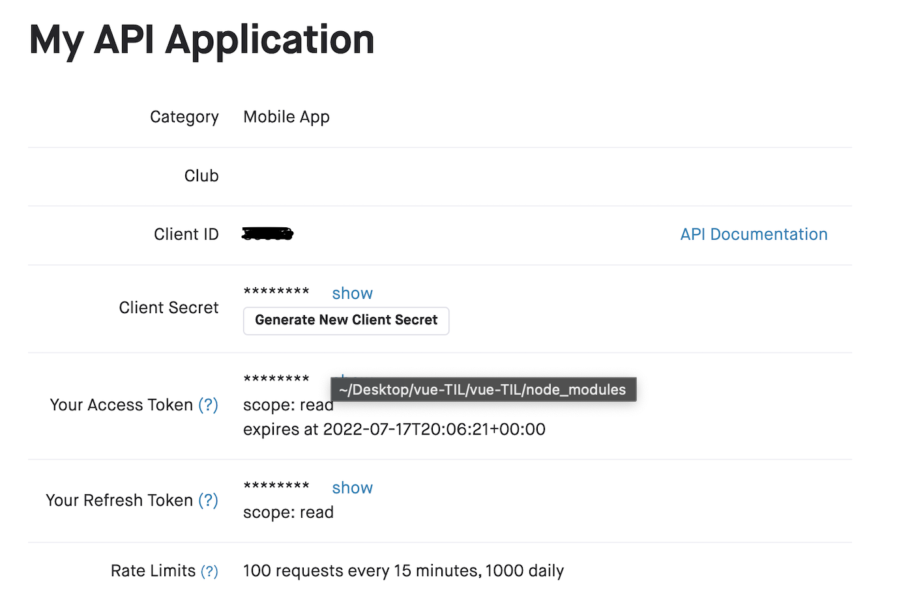

스트라바에서 제공하는 어플리케이션은 여러가지가 있지만 실질적인 러닝 관련 개인 데이터를 불러오기 위해서는 앱에 대한 스코프를 설정해야 합니다.

예를 들어 스트라바의 `List Athlete Activities`(/athlete/activities)를 활용하면 연결된 유저의 활동 내역을 얻어올 수 있습니다. 만들고자 하는 러닝 앱이 사용자 활동 트래킹과 관련된다면 폴리라인을 그려야 할 텐데, 이때 GET한 JSON 데이터의 `map` 프로퍼티의 `summary_polyline` 데이터를 디코딩 하면 지도상에 폴리라인을 그려낼 수 있게 됩니다.

## 액세스토큰 발급 및 스코프 설정

스트라바 앱 생성 후에는 기본적으로 액세스 토큰이 발급되기는 하지만 Auth설정이 된 액세스 토큰을 새로 발급받아야 위와 같은 데이터들을 실제로 활용할 수 있게 됩니다.

[다음의 링크](https://developers.strava.com/docs/getting-started/)를 참조하여 권한 설정을 할 수 있습니다. API테스트는 포스트맨을 기반으로 진행합니다.

먼저 다음의 URL을 복사합니다.

`http://www.strava.com/oauth/authorize?client_id=[REPLACE_WITH_YOUR_CLIENT_ID]&response_type=code&redirect_uri=http://localhost/exchange_token&approval_prompt=force&scope=read`

이때 유의할 점은 URL파라미터의 가장 마지막에 있는 `scope`에 대한 값을 다르게 설정해줘야 한다는 것입니다. `read`로만 스코프 설정을 하게 되면 개인 데이터에는 접근할 수 없습니다.

스트라바 앱 생성 시 받은 클라이언트 아이디를 URL의 `[REPLACE_WITH_YOUR_CLIENT_ID]`에 복사하여 집어넣은 뒤 복사합니다.

이후 브라우저에 가서 위의 이상한 URL을 주소창에 입력합니다. 참고로 `/athlete/activities` API를 활용하려면 `activity:read_all`스코프로 설정해야 합니다. 따라서 이번에 테스트용으로 얻어낼 권한과 클라이언트 아이디까지 합쳐 권한 승인 요청을 할 URL은 아래와 같습니다.

`http://www.strava.com/oauth/authorize?client_id=내꺼_클라이언트_아이디&response_type=code&redirect_uri=http://localhost/exchange_token&approval_prompt=force&scope=activity:read_all`

:::tip Strava API 스코프 확인하는 방법

다양한 스코프에 대한 내용은 스트라바 API playground 사이트에 접속하여 `Authorize`버튼을 클릭하여 확인합니다.

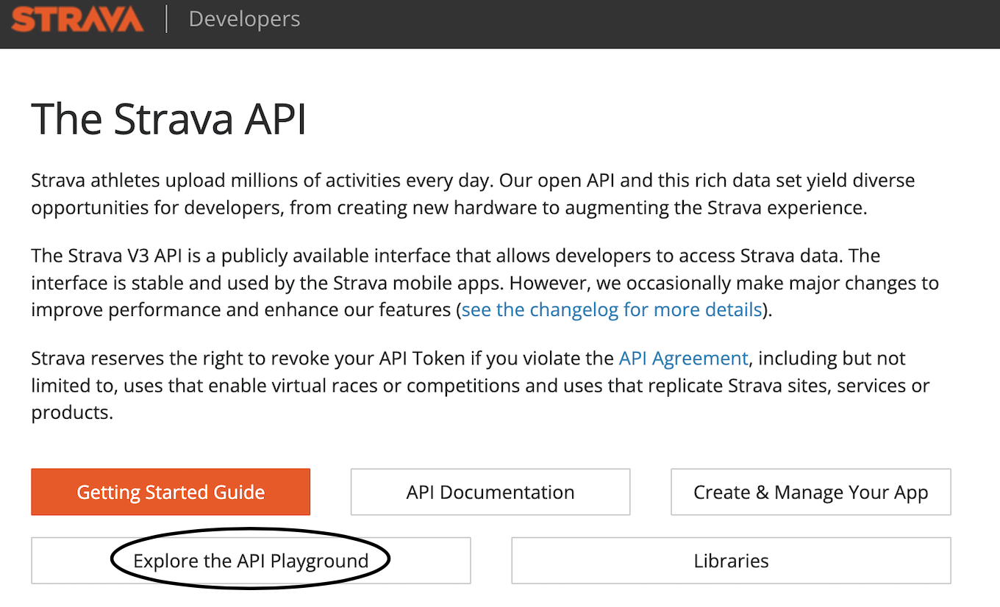

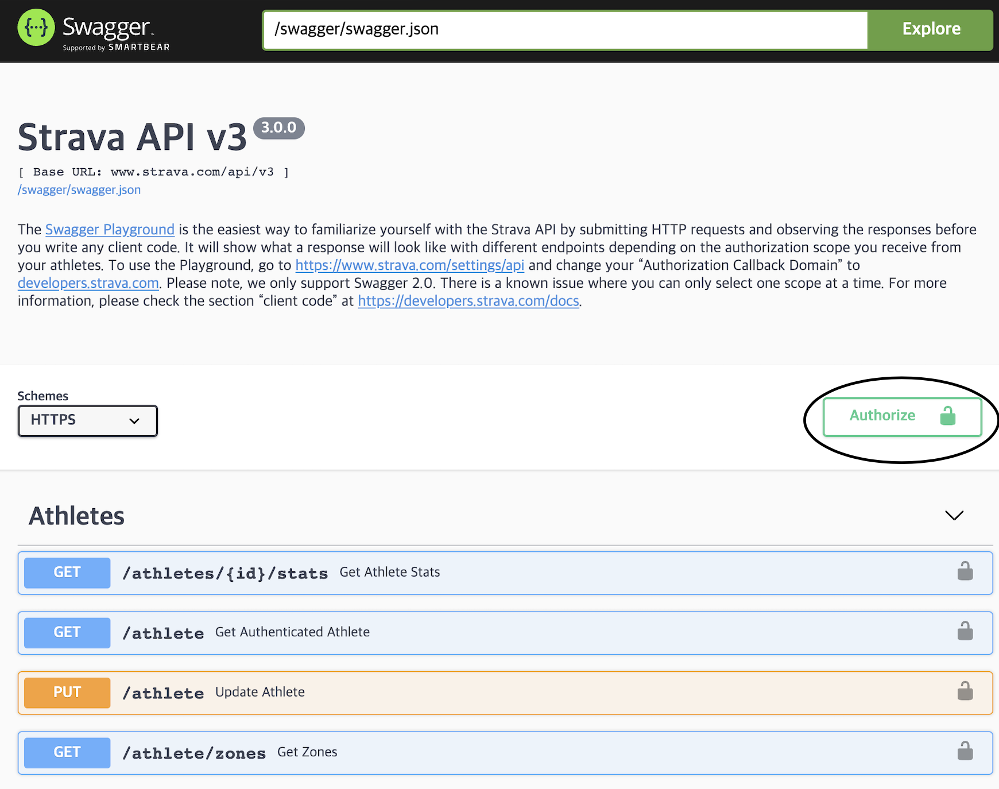

:::

위의 API Auth를 위한 URL로 접속을 시도하면 아래와 같은 화면이 나타납니다.
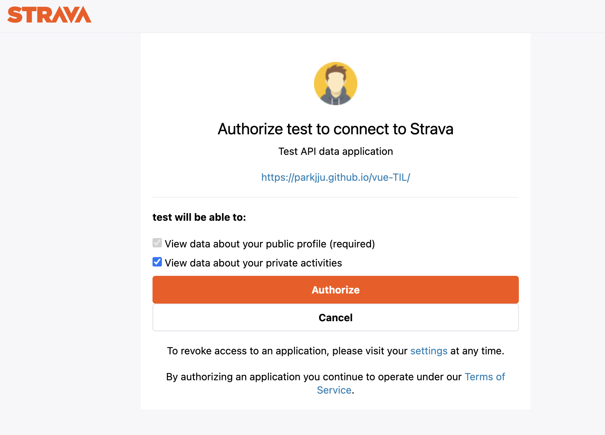

Authorize버튼을 클릭하면 권한 승인과 함께 스코프 설정이 완료된 액세스 토큰을 새로 발급받게 됩니다. 참고로 스트라바 API 앱 생성 시 앱에 대한 정보를 입력할 수 있는 공간이 있습니다. 아래 화면을 보겠습니다.

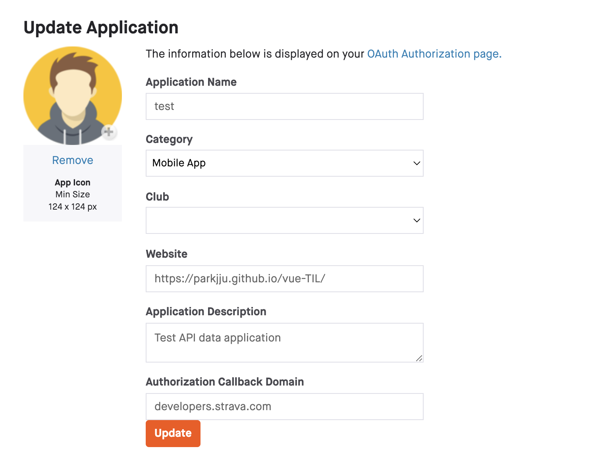

Website는 `https` 프로토콜로 시작하는 사이트 아무거나 입력하시면 되고, `Authorization Callback Domain`은 아래와 같이 `developers.strava.com`으로 합니다.

Authorize 버튼 클릭 후에는 로컬호스트로 접속하게 되며 주소창에 특별한 URL이 생기게 됩니다.

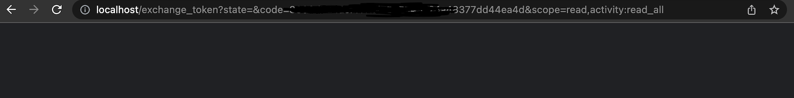

URL 파라미터 중 `code`에 주목하여 권한승인을 통해 새로 발급받은 액세스 토큰을 복사하여 저장해둡니다.

## API 요청

**API요청에 앞서 실제 데이터를 얻고 싶다면 스트라바 어플리케이션을 모바일에서 활용한 상태여야 합니다.** 데이터가 조금이라도 쌓인 상태에서 진행해주세요.

Postman으로 접속합니다. 워크스페이스 생성 후 콜렉션 생성, 생성된 콜렉션을 우클릭하여 Add request를 클릭합니다.

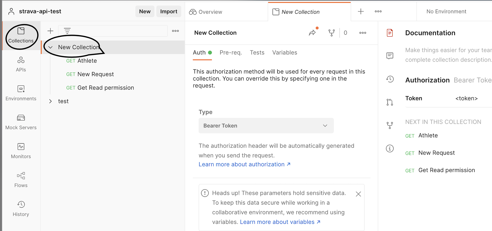
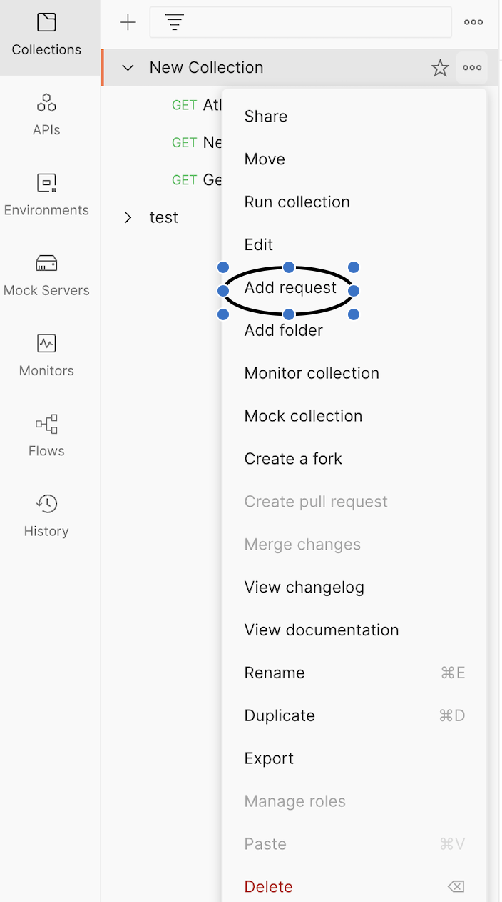

POST요청으로 리퀘스트를 생성합니다.

```sh
curl -X POST https://www.strava.com/oauth/token \
	-F client_id=YOURCLIENTID \
	-F client_secret=YOURCLIENTSECRET \
	-F code=AUTHORIZATIONCODE \
	-F grant_type=authorization_code
```

위의 내용은 cURL을 이용한 리퀘스트 형태인데 위의 의미는 URL이 `https://www.strava.com/oauth/token`이고 `client_id`, `client_secret`, `code`, `grant_type`이라는 URL 파라미터를 설정하여 POST요청을 보낸다는 뜻입니다.

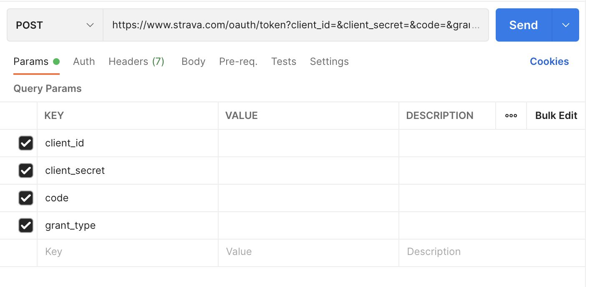

위와 같이 Params탭에 쿼리 파라미터들을 설정해줍니다. Value에 알맞는 값들을 넣어주면 되고 `code`에는 앞에서 로컬호스트 URL을 통해 발급받은 액세스 토큰을 집어넣으면 됩니다. `grant_type`은 이름 그대로 `autorization_code`로 작성하면 됩니다. 다른 값이 아닙니다!

모두 입력을 한 뒤 Send버튼을 클릭하면 아래와 같이 JSON 데이터를 받아올 수 있게 됩니다.

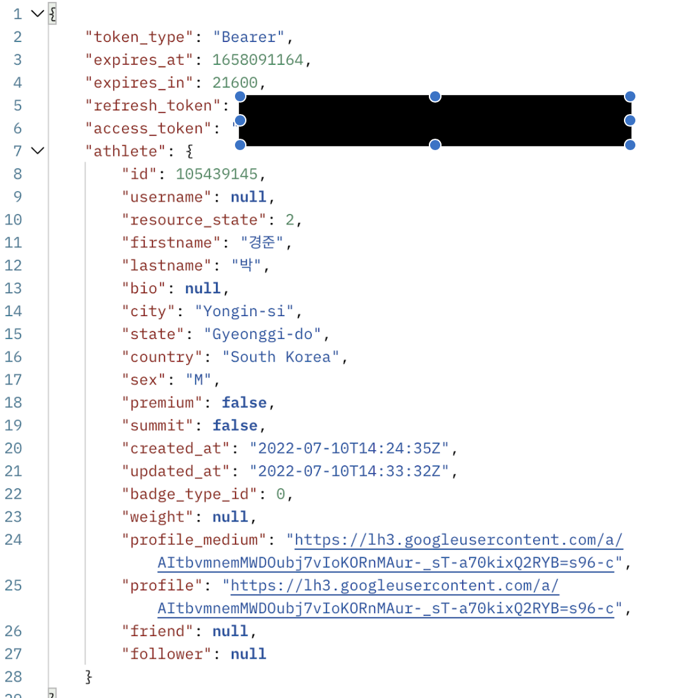

성공적으로 JSON 데이터를 받아왔다면 `access_token` 프로퍼티만 복사해서 저장합니다.

포스트맨 콜렉션에서 새로 Add request를 클릭하여 본격적으로 앱 활용을 위한 요청을 생성합니다. `https://www.strava.com/api/v3/athlete/activities` URL로 GET 요청을 보내게 됩니다.

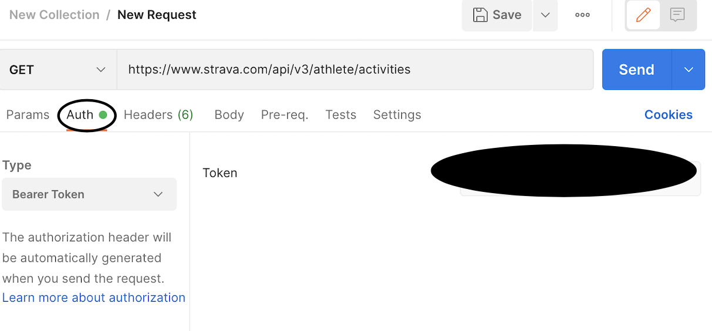

Auth탭의 Token에 권한 승인 후 날라온 JSON의 액세스 토큰을 복사하여 집어넣습니다. 모두 입력한 뒤 Send버튼을 클릭하면 API에 맞는 데이터들이 날라오게 됩니다.

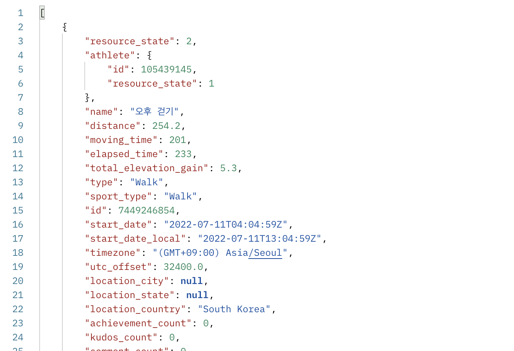
