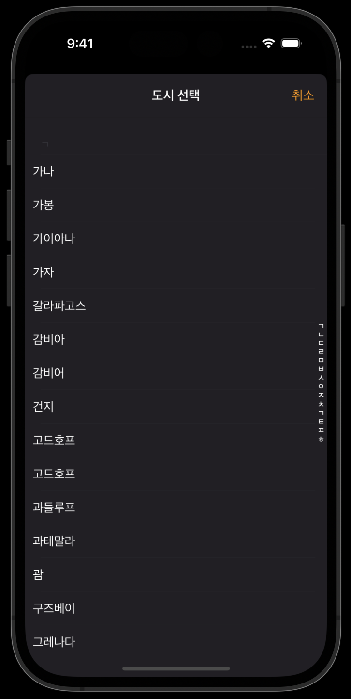

## 세계시간 알아내기

혼자서 시계 앱을 클론코딩 하다가 타임존을 다뤄야 해서 관련 방법을 정리한다.

클론코딩으로 직접 구현한 화면은 아래와 같다.



실제 앱의 경우 각 데이터가 `지역명, 나라명` 형식으로 이루어져 있지만 현재 구현된 형태는 `타임존명`으로만 되어 있다.

## 타임존으로 지역명 얻기

타임존을 불러오기 위한 결과 함수부터 살펴보자.

```swift
func getWorldClockData() -> [(String, TimeZone)]{
    var worldClickArray:[(String, TimeZone)] = []

    // 1. TimeZone.knownTimeZoneIdentifiers
    for tz in TimeZone.knownTimeZoneIdentifiers{
        guard let timezone = TimeZone(identifier: tz) else {
            continue
        }

        // 2. timezone.localizedName(for:locale:)
        guard var regionName = timezone.localizedName(for: .shortGeneric, locale: Locale(identifier:"ko-KR")) else {
            continue
        }

        var data = regionName.split(separator: " ")
        let _ = data.popLast()

        regionName = data.joined()

        // 3. 정규식 검사 로직
        if(!nameValidation(text: regionName) || regionName.first == nil){
            continue
        }

        worldClickArray.append((regionName, timezone))
    }

    // 4. sorting
    worldClickArray.sort { lhs, rhs in
        lhs.0 < rhs.0
    }

    return worldClickArray
}
```

1. `TimeZone.knownTimeZoneIdentifiers` : 타임존 타입속성인 `knownTimeZoneIdentifiers`는 iOS에서 제공하는 타임존의 아이디값들을 제공한다. `[String]` 타입이며 내부 각 요소는 `대륙명/타임존명`으로 이루어진다. (ex - `Asia/Macau`)
    - 위의 각 아이디값을 타임존 타입의 생성자 함수에 전달하여 인스턴스를 생성할 수 있다. - `TimeZone(identifier: "아이디값")`
2. `func localizedName(for style: NSTimeZone.NameStyle, locale: Locale?) -> String?`: 타임존 인스턴스의 메서드인 `localizedName`은 타임존의 이름을 제공해준다.
    - `for` 파라미터에 타임존 네임스타일 열거형을 전달하여 다양한 형태로 출력 가능하다.
    - `locale` 파라미터에 `Locale`인스턴스를 전달하여 원하는 언어로 타임존을 출력할 수 있다. `Locale(identifier: "ko-KR")`를 locale 파라미터에 전달하여 타임존을 한국어로 출력하게 된다.
    - 출력 결과는 `타임존명 시간` 이라는 형태로 나타난다. 뒤에 시간이라는 단어가 자동으로 붙는다. (ex - `대한민국 시간`, `모로코 시간`)
3. `nameValidation`함수: 해당 함수는 직접 커스텀한 함수인데, 타임존 명이 중간중간 공백을 포함한다거나 (ex - `트리니다드 토바고 시간`) 콤마를 포함하는 등의 (ex - `노스다코타주, 베라 시간`) 예외 데이터들을 제외하기 위한 코드이다.
4. sorting: 타임존 리스트를 유니코드 가나다 순으로 정렬한다.

```swift
// nameValidation
private func nameValidation(text: String) -> Bool {
    // String -> Array
    let arr = Array(text)
    // 정규식 pattern. 한글, 영어, 숫자, 밑줄(_)만 있어야함
    let pattern = "^[가-힣ㄱ-ㅎㅏ-ㅣ]$"
    if let regex = try? NSRegularExpression(pattern: pattern, options: .caseInsensitive) {
        var index = 0
        while index < arr.count { // string 내 각 문자 하나하나 마다 정규식 체크 후 충족하지 못한것은 제거.
            let results = regex.matches(in: String(arr[index]), options: [], range: NSRange(location: 0, length: 1))
            if results.count == 0 {
                return false
            } else {
                index += 1
            }
        }
    }
    return true
}
```

## 타임존 기준 현재시각 알아내기

시계 앱의 경우 타임존 선택에 따른 해당 나라의 현재 시각을 알아내야 한다. 아래 코드를 사용하면 된다.

```swift
func getTimeFromTimeZone(timezone: String, isNoon: Bool) -> String{
    guard let timezone = TimeZone(identifier: timezone) else {
        return ""
    }

    // 1. 현재시각 생성
    let worldDate = Date()

    // 2. 타임존으로 시차 적용
    var selectedWorld = Date.FormatStyle.dateTime
    selectedWorld.timeZone = timezone

    var time = worldDate.formatted(selectedWorld).split(separator: " ")
    time.removeFirst()

    if(time.last! == "AM" || time.last! == "PM"){

        return isNoon ? "\(time.last! == "AM" ? "오전" : "오후")" : "\(time.first!)"
    }

    return isNoon ? "\(time.first!)" : "\(time.last!)"
}
```

위의 예시 코드중 `getWorldClockData` 함수를 통해 얻어낸 타임존을 `getTimeFromTimeZone` 함수에 전달하면 시간을 알 수 있게 해준다.

1. `Date()` 생성자 함수를 통해 한국기준 현재에 대한 Date인스턴스를 얻는다.
2. `Date.FormatStyle.dateTime` 속성은 Date 인스턴스에 대한 타임존을 커스텀 할 수 있게 해준다. dateTime에 대한 포맷 스타일 인스턴스를 변수에 저장해둔다.
3. 위에서 생성했던 `Date()` 인스턴스의 `formatted` 메서드의 파라미터로 dateTime 포맷스타일 인스턴스를 전달하면 타임존에 해당하는 현재시각을 알아낼 수 있다.
4. 타임존의 AM, PM 스트링을 스플릿 후 얻어내어 한글명 오전 오후로 번역해주는 작업까지 추가적으로 진행했다.

## Reference

1. [Set time zones with the new date formatting API in iOS 15](https://developer.apple.com/forums/thread/700213)
