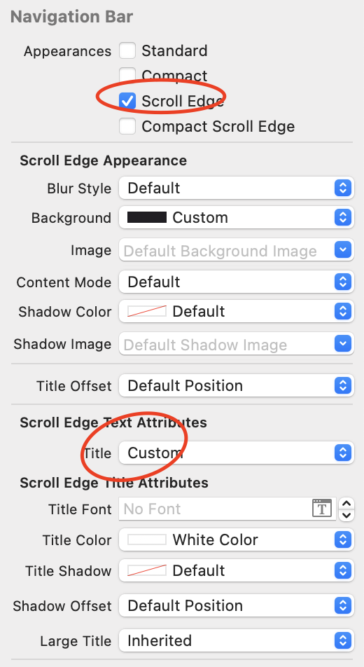

## 네비게이션 바 커스텀


아이폰 시계 어플리케이션에 들어간 뒤 세계시간 탭에서 + 버튼을 누르면 iOS에서 관리하는 타임존 목록에 접근할 수 있다.

이때 해당 목록들을 스크롤링 하면 네비게이션 바의 배경색이 살짝 바뀌는 것을 볼 수 있는데, 이를 커스텀하기 위해서는 몇 가지 과정이 필요하다.

먼저 알아둬야 할 것으로 네비게이션 바 커스텀이 필요한 상황을 나누어 생각해봐야 하는데, 이는 xcode에서도 확인할 수 있듯 몇 가지 되지 않는다. xcode에서 확인하려면 네비게이션 바를 스토리보드상에서 선택한 뒤 인스펙터에서 확인하면 된다.

커스텀 할 수 있는 상황이라고 하면 Appearance 섹션을 확인해보면 된다.

1.  Standard - 스크롤 된 이후의 네비게이션 바
2.  Compact - [다음 이미지를](https://stackoverflow.com/questions/58296535/ios-13-new-pagesheet-formsheet-navigationbar-height)참고하자.
3.  ScrollEdge - 네비게이션 바 내에서 스크롤 기반의 뷰가 부착되어 있을때, 스크롤 가장 끝단에 위치하는 경우
4.  compactScrollEdge - 스크롤 엣지 상황에서 컴팩트 효과를 덤으로 붙인 상황.

위의 캡처 사진에서는 Standard시 네비게이션 바의 배경색이 잠깐 옅어지고, scrollEdge시 네비게이션 바의 배경색이 다시 원래대로 돌아오는 것으로 정리해볼 수 있다.

실제 커스텀하기 위한 예시 코드는 아래와 같다.

```swift
func setupUI(){
    let appearance = UINavigationBarAppearance()

    appearance.titleTextAttributes = [
        NSAttributedString.Key.foregroundColor: UIColor.white
    ]

    appearance.backgroundColor = UIColor(named: "ModalWithScrollColor")

    self.navigationBar.standardAppearance = appearance

}
```

1. `UINavigationAppearance` 인스턴스를 생성한다.
2. 네비게이션 커스텀 상황에 맞게 스타일링을 한다. 텍스트 커스텀은 아래에서 추가 설명
3. `navigationController?.navigationBar`속성에 접근하여 appearance 인스턴스를 할당한다. 스탠다드, 스크롤 엣지 등에 맞게 속성이 마련되어 있으므로 해당 속성에 할당하면 된다.

backgroundColor 속성은 일반적으로 세팅하는것처럼 진행하면 되지만 타이틀의 경우 조금 다르다.

`UINavigationBarAppearance` 인스턴스는 titleTextAttributes 속성을 갖는데, 딕셔너리 타입이며 key값의 타입은 `NSAttributedString.Key`이며, 구조체 타입이고 내부 속성을 원하는대로 커스텀 하면 된다.

:::warning 타이틀 색 설정

타이틀 컬러는 일반적으로 알고 있는 tintColor나 textColor라는 이름의 속성을 갖지 않고 `NSAttributedString.Key.foregroundColor`라는 이름을 갖는다.

:::

스토리보드에서는 어트리뷰트 인스펙터에서 scroll edge, standard 등 Appearances에서 선택을 먼저 한 뒤 Text Attributes 섹션에서 Title을 Inherited가 아닌 Custom으로 설정하면 타이틀 컬러나 폰트 등을 커스텀 할 수 있다.



## UINavigationBar 커스텀

네비게이션 컨트롤러를 사용하지 않고 커스텀 `UIView`에 네비게이션 바를 삽입할 수 있다.

```swift
class CustomView: UIView {

    // 커스텀 네비게이션 바
    let navBar: UINavigationBar = {
        let bar = UINavigationBar()
        // 네비게이션 바 타이틀 설정
        let navItem = UINavigationItem(title: "라이브러리")

        let leftBarButton = UIBarButtonItem(title: "취소", style: .plain, target: self, action: #selector(handleBackButtonTapped))
        let rightBarButton = UIBarButtonItem(title: "완료", style: .done, target: self, action: #selector(handleCompletionButtonTapped))

        // UINavigationItem 속성을 통해 바 버튼 인스턴스 전달
        navItem.leftBarButtonItem = leftBarButton
        navItem.rightBarButtonItem = rightBarButton

        // UINavigationBar의 setItems에 UINavigationItem 전달
        bar.setItems([navItem], animated: false)
        return bar
    }()
}
```

`UINavgationItem` 인스턴스를 생성한 뒤 타이틀 속성값을 지정해준다. 네비게이션 바 중단에 삽입될 문자열에 해당한다.

`UINavigationBar` 인스턴스에는 `setItems` 메서드가 있는데, 이곳 배열 아규먼트에 `UINavigationItem` 인스턴스를 전달하면 된다.

나머지 `leftBarButtonItem`과 `rightBarButtonItem`은 `UINavigationItem`의 속성을 통해 정의할 수 있다.

## Reference

1. [stackoverflow - Changing textTitleAttribute in Swift](https://stackoverflow.com/questions/26868847/changing-titletextattribute-in-swift)
2. [scroll 위치에 따른 네비게이션 바 설정](https://velog.io/@haanwave/scroll-%EC%9C%84%EC%B9%98%EC%97%90-%EB%94%B0%EB%A5%B8-NavigatonBar-%EC%84%A4%EC%A0%95)
3. [stackoverflow - iOS 13 new pageSheet/formSheet navigationBar Height](https://stackoverflow.com/questions/58296535/ios-13-new-pagesheet-formsheet-navigationbar-height)
