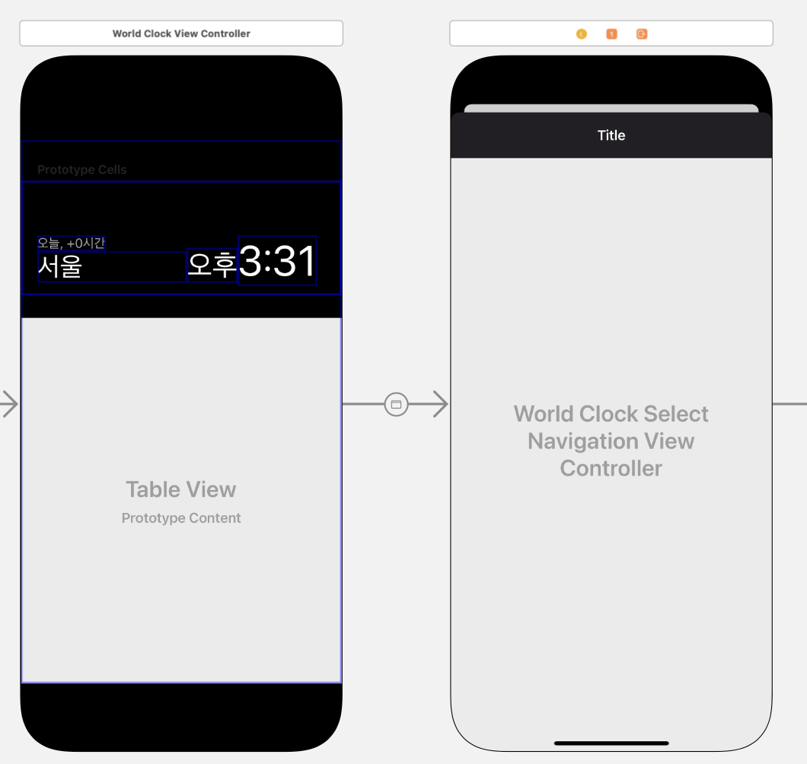
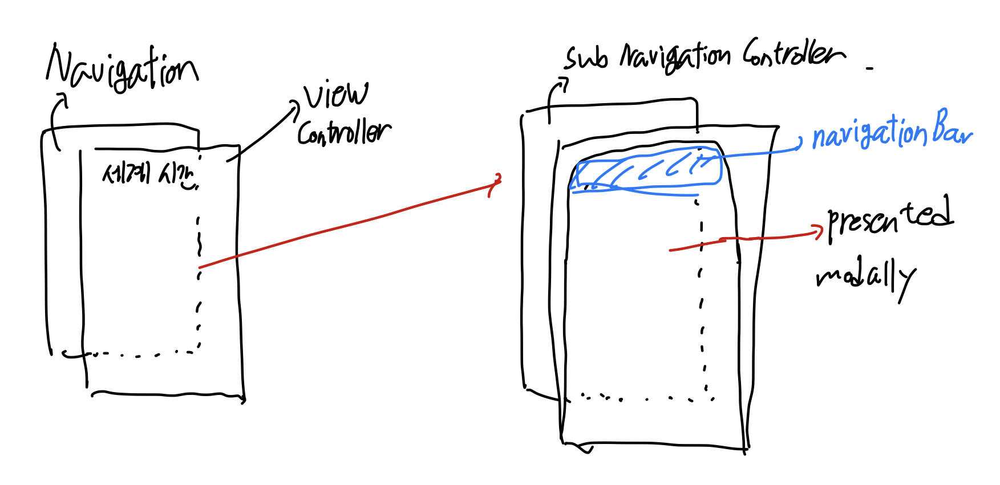

## 들어가며


세계시간 앱을 열고 목록 추가 버튼을 누르면 모달창이 올라온다. 이때 모달창 상단을 보면 `도시 선택`이라는 타이틀, 검색창, 취소 버튼이 상단 네비게이션 바에 나타난다.

네비게이션 컨트롤러는 기본적으로 서브페이지들을 push, pop 기반의 스택 형태로 관리하기 위해서 사용하게 된다. 네비게이션 컨트롤러를 사용하는 뷰에 대해 기본적으로 네비게이션 바를 상단에 제공하는데, 꼭 네비게이션 컨트롤러가 아닌 서브 뷰 컨트롤러에 대해서도 네비게이션 바를 달아줄 수 있는 방법은 있으니 아래 참조 문서들을 확인해보자.

이 문서에서는 모달로 나타나는 뷰에 대해 네비게이션 바를 추가하는 방법을 설명한다.

## 스토리보드

스토리보드 구조를 보면 다음과 같다.


시간 앱의 구조는 네 개의 탭 바(세계 시계, 알람, 스톱워치, 타이머)들로 이루어져 있고 각 탭 바는 네비게이션 컨트롤러로 이루어진다.

세계 시간 메인화면은 네비게이션 컨트롤러로 이루어져 있기 때문에 상단에 네비게이션 바도 보유하고 있다. 이때 `rightBarButtonItem`인 `.add` 버튼을 클릭하게 되면 페이지 하나가 모달 형태로 올라오게 된다.

Navigation controller - View Controller - 도시 선택 페이지의 관계를 갖는 뷰 컨트롤러들이 있다. 이때 중간에 낀 뷰 컨트롤러의 네비게이션 add 버튼을 클릭하여 서브 뷰 컨트롤러를 띄우는데 이때 viewDidAppear 시점에 커스텀 네비게이션 바를 붙여주지 않으면 네비게이션 바가 나타나지 않게 된다.

서브 뷰 컨트롤러를 모달 형태로 띄울때 네비게이션 바를 상단에 유지하기 위해서는 뷰의 구조를 아래와 같이 가져가야 한다.



즉, 뷰 컨트롤러에서 다음 뷰 컨트롤러를 직접적으로 모달로 연결하지 않고 Navigation Controller에 연결한 뒤 Navigation Controller에서 하위 뷰 컨트롤러로 다시 연결하는 간접적 방법을 사용해야 한다는 것이다.

```swift
// View controller -> Navigation Controller
@objc func rightBarButtonTapped(){
    let selectNavigationVC = storyboard?.instantiateViewController(withIdentifier: "WorldClockSelectNavigationController") as! WorldClockSelectNavigationViewController

    self.navigationController?.present(selectNavigationVC, animated: true)
}
```

이후 세그웨이 연결에 따라 네비게이션 컨트롤러의 서브 뷰 컨트롤러로 UI가 전환된다.

## Reference

1. [stackoverflow - Add a navigation bar to a view without a navigation controller](https://stackoverflow.com/questions/23859785/add-a-navigation-bar-to-a-view-without-a-navigation-controller)
2. [stackoverflow - Add navigation bar to a view controller without a navigation controller](https://stackoverflow.com/questions/38003427/add-navigation-bar-to-a-view-controller-without-a-navigation-controller)
3. [stackoverflow - How to present view controller modally while keeping navigation bar present.](https://stackoverflow.com/questions/47100596/how-to-present-view-controller-modally-while-keeping-navigation-bar-present-fo)
