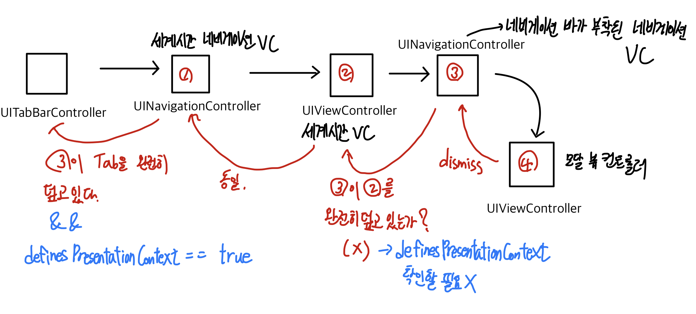

## dismiss와 뷰 관리

구현하고자 하는 시나리오는 다음과 같다.

1. UITableView 인스턴스가 UIViewController 위에 올라와있다.
2. 뷰컨트롤러의 서브 뷰 컨트롤러가 모달형태로 present된다.
3. 서브 뷰 컨트롤러 모달에서 수퍼 뷰 컨트롤러 내에 있는 UITableView 인스턴스의 cell 데이터 정보를 변경한다.
4. 수퍼 뷰 컨트롤러에서는 테이블뷰 reloadData 메서드를 호출하여 화면을 새로고침 해야한다.

먼저 하고자 하는 방법은 수퍼 뷰 컨트롤러의 생명주기인 `viewWillAppear`를 오버라이딩 하여 자체적으로 테이블뷰를 리로딩 해주는 것이다. 이는 정상적으로 작동하는걸까?

네비게이션 컨트롤러를 기준으로 뷰는 push, pop되며 스택 형태로 화면이 관리된다. 이때 pushViewController의 fullScreen 방식이 아닌 모달 형태로 서브 뷰를 띄우게 될 경우 뷰가 메모리에서 어떻게 관리될까?

이를 확인하기 위해서는 `viewWillDisappear`생명주기 함수를 뷰 컨트롤러 내에서 오버라이딩 하여 구현하면 된다.

```swift
override func viewWillDisappear(_ animated: Bool) {
        super.viewWillDisappear(animated)
        print("hi")
    }
```

서브 뷰 컨트롤러가 자신의 위에 올라왔음에도 불구하고 메모리 상에서는 해당 인스턴스가 해제되지 않고 `viewWillDisappear` 생명주기 시점이 발동되지 않는 것이다.

`viewWillDisappear` 함수가 호출되지 않는다는 것은 아무리 서브 뷰 컨트롤러가 모달창으로 왔다갔다 하더라도 `viewWillAppear` 생명주기가 다시 실행되지 않는다는 것이다.

따라서 앱이 켜지거나 실제 뷰 컨트롤러로 다시 이동이 이루어지지 않는 이상 테이블 뷰가 리로딩 되지 않는다는 것이다.

## 솔루션

네비게이션 컨트롤러를 기준으로 관리되고 있다면 `self.navigationController.viewControllers` 속성에 접근하여 뷰 컨트롤러 인스턴스를 얻어내고 **타입 다운캐스팅으로 내부 속성에 접근한다.**

[다음 문서에서의](./230215-12.md) 구조를 따르는 뷰 컨트롤러라면 인스턴스를 얻는 과정이 다소 복잡할 수 있다.

1. 최하위 UIViewController 인스턴스에서 dismiss를 호출한다.
2. UIViewController가 내려가고 메모리상에 UINavigationController가 남는다.
3. UINavigationController 입장에서는 `presentingController`가 UITabBarController이므로 viewWillDisappear 시점에 타입 다운캐스팅을 진행한다.
4. TabBarController의 first 뷰 컨트롤러가 찾고자 하는 navigationController이다.
5. navigationController의 first 뷰 컨트롤러가 찾고자 하는 최종 뷰 컨트롤러이다. 타입 다운캐스팅을 진행한다.
6. 해당 뷰 컨트롤러의 테이블 뷰에 접근하여 리로드 함수를 호출한다.

3번 과정에서 네비게이션 컨트롤러의 presentingController가 상위에서 자신을 호출한 UIViewController가 아닌 UITabBarController인 이유는 보통 `definesPresentationContext`프로퍼티의 불리언 값에 따라 달라진다고 이야기하지만 [다음 문서](https://stackoverflow.com/questions/8437908/self-presentingviewcontroller-returns-uitabbarcontroller-not-the-view-controller)를 참고해보면 탭 인터페이스 기반의 앱에서는 **아이폰의 모달 페이지에 대한 presenting controller는 항상 UITabBarController라는 것이다.**

> So, even though the other view controller pushed it, that view controller's view is covered by the modal view. They walk up the hierarchy until it finds a view controller that doesn't have its view obscured, or has definesPresentationContext set to YES, or until it reaches the root view controller, which in your case was the Tab Bar Controller.

중요한 점은 뷰가 가려지지 않은 컨트롤러에 한해서 `definesPresentationContext` 불리언값이 true인 컨트롤러가 presentingViewController가 된다는 것이다.

최종적으로 dismiss를 하는 뷰 컨트롤러에서 viewWillDisappear 시점에서의 인스턴스 연결 작업 후 테이블 뷰 리로딩 하는 부분을 코드로 작성하면 아래와 같게 된다.

```swift
override func viewWillDisappear(_ animated: Bool) {
    super.viewWillDisappear(animated)

    guard let tabVC = self.presentingViewController as? UITabBarController else {
        return
    }

    guard let firstNavigationVC = tabVC.viewControllers?.first as? UINavigationController else {
        return
    }
    guard let firstVC = firstNavigationVC.viewControllers.first as? WorldClockViewController else {
        return
    }
    firstVC.tableView.reloadData()
}
```

이 모든 움직임을 도식화해보면 아래와 같게 된다.


## Reference

1. [stackoverflow - How can I reload the tableview after dismissal of modal view](https://stackoverflow.com/questions/67434481/how-can-i-reload-the-tableview-after-dismissal-of-modal-view)
2. [stackoverflow - Dismissing a presented view controller](https://stackoverflow.com/questions/14636891/dismissing-a-presented-view-controller)
3. [stackoverflow - presentingViewController getting always UITabBarController](https://stackoverflow.com/questions/10907742/presentingviewcontroller-getting-always-uitabbarcontroller)
4. [iOS UIModalPresentationStyle 알아보기](https://magi82.github.io/ios-modal-presentation-style-01/)
5. [stackoverflow - self.presentingViewController returns UITabBarController not the view controller pushing it with presentModalViewController](https://stackoverflow.com/questions/8437908/self-presentingviewcontroller-returns-uitabbarcontroller-not-the-view-controller)
