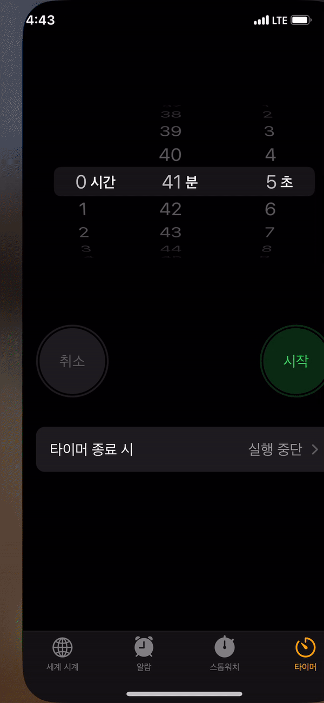

## 테이블뷰 셀 재배치


위 사진을 보면 우측에 작게 햄버거 버튼이 있는 것을 확인할 수 있다. 해당 버튼은 스위프트에서 기본으로 제공하는 reorder control 버튼이다.

테이블 뷰 재배치에 필요한 내용들을 정리해보았다. 기본적인 테이블 뷰 세팅, 테이블 뷰 셀을 스토리보드 위에 올려놓고 시작한다.

## editing 모드

테이블 뷰 셀들을 재배치 하는 것은 기본적으로 테이블 뷰가 `editing` 모드로 진입한다는 것을 의미한다.

시계 앱을 예시로 상단 네비게이션 바의 편집 버튼을 누르면 테이블 뷰 셀마다 삭제버튼, 우측에 재배치 햄버거 버튼이 생기는 것을 볼 수 있다.

뷰 컨트롤러 인스턴스 자체에 editing 모드로 진입하는 메서드가 있다. `override func setEditing(_ editing: Bool, animated: Bool)` 메서드를 오버라이딩 하면 된다.

```swift
// ViewController.swift
// 네비게이션 바의 leftBarButtonItem을 클릭시 호출하는 셀렉터 함수
// 커스텀 하여 생성해둔 상태
func setupNavigationBar(){
    self.title = "세계 시계"

    let leftBarButton = UIBarButtonItem(title: "편집", style: .plain, target: self, action:#selector(leftBarButtonTapped))

    leftBarButton.tintColor = .systemOrange

    self.navigationItem.leftBarButtonItem = leftBarButton
}

// 테이블 뷰는 스토리보드에서 IBOutlet으로 가져온 상태
@objc func leftBarButtonTapped(){
    setEditing(!tableView.isEditing, animated: true)
}
```

테이블 뷰 인스턴스 내에 `isEditing` Bool값이 존재하므로 뷰 컨트롤러가 editing 모드로 진입할지 여부는 테이블 뷰 인스턴스의 `isEditing` 속성값에 따라 결정되도록 메서드를 호출하자.

## 프로토콜 채택 및 함수구현 - UITableViewDataSource

뷰 컨트롤러가 editing 모드로 진입한 뒤 실제로 데이터 삭제 및 셀 재배치를 하기 위해서는 `UITableViewDelegate`와 `UITableViewDataSource`에서 구현해줄 함수가 존재한다.

```swift
extension ViewController: UITableViewDataSource{
    // UITableViewDataSource 기본구현 함수는 구현 완료된 상태
    func tableView(_ tableView: UITableView, canEditRowAt indexPath: IndexPath) -> Bool {
        return true
    }

    func tableView(_ tableView: UITableView, titleForDeleteConfirmationButtonForRowAt indexPath: IndexPath) -> String? {
        return "삭제"
    }

    func tableView(_ tableView: UITableView, canMoveRowAt indexPath:
     IndexPath) -> Bool {
        return true
    }
}
```

`tableView(_:canEditRowAt:)` 함수에 대한 설명은 아래와 같다.

> The method permits the data source to exclude individual rows from being treated as editable. Editable rows display the insertion or deletion control in their cells.

해당 메서드 Bool값에 따라 editing모드에서 삭제 및 수정버튼의 노출 여부가 결정된다. `false`를 리턴하면 햄버거버튼이나 삭제 버튼이 나타나지 않는다.

`func tableView(_ tableView: UITableView, titleForDeleteConfirmationButtonForRowAt indexPath: IndexPath) -> String?`함수는 리턴한 문자열을 삭제버튼 노출 시 나타나는 기본 텍스트 대신 삽입한다. (셀을 좌측 슬라이딩 했을때 노출되는 삭제 텍스트)

`func tableView(_ tableView: UITableView, canMoveRowAt indexPath: IndexPath) -> Bool` 함수는 재정렬 컨트롤 노출이 될지 여부를 결정한다. `canEditRowAt`은 true를 반환하는데 `canMoveRowAt`은 false로 설정하면 삭제버튼은 노출되는데 햄버거 버튼은 노출되지 않는다.

## 프로토콜 채택 및 함수구현 - UITableViewDelegate

```swift
func tableView(_ tableView: UITableView, moveRowAt sourceIndexPath: IndexPath, to destinationIndexPath: IndexPath) {
    // row 움직이고 순서 변경하는 로직 추가
    clockDataManager.updateIndex(sourceData: clockData[sourceIndexPath.row], destinationData: clockData[destinationIndexPath.row]) {
        print("END!")
    }
}
```

테이블뷰 델리게이트 프로토콜에서는 `func tableView(_ tableView: UITableView, moveRowAt sourceIndexPath: IndexPath, to destinationIndexPath: IndexPath)` 함수만 구현하면 된다.

드래그 앤 드롭 로직을 구현할때 사용하게 된다. 위의 예시 코드는 MVC 패턴 기반의 코어데이터를 다루는 예제 코드이다. 직접 활용할때는 `sourceIndexPath`에 해당하는 테이블 뷰를 직접 출력해가며 활용해보자.

## setEditing

네비게이션 바 버튼 아이템 클릭에 따라 뷰 컨트롤러가 editing 모드로 진입하거나 빠져나오게 되면 테이블 뷰에서 특정 동작을 하게 세팅하고 싶을 수 있다.

예를 들면 아래와 같은 상황이 있다.


좌측 버튼 클릭시 편집모드로 진입하며 테이블 뷰 셀마다 햄버거 버튼과 좌측 삭제 버튼이 나타나는 것을 볼 수 있는데 이때 editing 모드 내에서 작업할 내용을 디테일하게 조정하기 위해서는 `setEditing` 메서드를 오버라이딩 해야한다.

```swift
override func setEditing(_ editing: Bool, animated: Bool) {
    super.setEditing(editing, animated: animated)

    tableView.setEditing(editing, animated: true)

    let _ = tableView.visibleCells.map({ cell in
        guard let cell = cell as? WorldClockTableViewCell else {
            return
        }

        cell.timeLabel.isHidden = editing
        cell.noon.isHidden = editing
        cell.noon.constraints.first?.priority = .defaultLow
        cell.timeLabel.constraints.first?.priority = .defaultLow

        if(editing){
            cell.noon.widthAnchor.constraint(equalToConstant: 0).isActive = true
            cell.timeLabel.widthAnchor.constraint(equalToConstant: 0).isActive = true

        }else{
            print("ended")
            cell.noon.constraints.last?.isActive = false
            cell.timeLabel.constraints.last?.isActive = false

        }
    })
}
```

`DataSource` 프로토콜의 필수 구현 함수중 `cellForRowAt` 파라미터를 갖는 함수가 있는데, 이와 매우 유사한 형태로 함수 오버라이딩을 정의하면 된다.

화면 내의 테이블 뷰에 `visibleCells` 프로퍼티에 접근하면 테이블 뷰 내의 셀 전체 목록을 반환 받는다. 배열 map 메서드를 통해 내부 셀들을 각각 조정한다. 셀 레이블의 `isHidden` 속성을 조정하면 뷰 컨트롤러의 editing 모드 진입에 따라 특정 UI를 숨길 수 있다.

:::warning isHidden 빈공간 삭제하기
`isHidden`속성을 `true`로 설정하면 **내부 컨텐츠만 비워지는 것이고 남은 공간은 그대로 차지하게 된다.**

editing 여부에 따라 width 제약조건을 새로 추가하고, 해당 UI에 새로 추가된 제약조건은 `constraints` 배열의 마지막에 push 되는 것이므로 해당 제약조건을 비활성화 해주면 자동으로 런타임에 사라진다.

```swift
if(editing){
    cell.noon.widthAnchor.constraint(equalToConstant: 0).isActive = true
    cell.timeLabel.widthAnchor.constraint(equalToConstant: 0).isActive = true
}else{
    print("ended")
    cell.noon.constraints.last?.isActive = false
    cell.timeLabel.constraints.last?.isActive = false
}
```

:::

## 코어데이터에 바꾼 인덱스대로 저장하기

코어데이터 엔티티 정의에 index라는 속성을 갖는다고 가정하고 아래 코드를 작성한다. (추후 개인적으로 참고하기 위해 기록)

테이블 뷰 인덱스를 조정하는 중심 로직은 **출발지점 인덱스의 요소를 배열에서 꺼내고 도착지점 인덱스에 끼워넣는다는 것이다.**

1. 이때 출발지점이 도착지점보다 이전 인덱스에 있다면, 출발지점부터 도착지점까지의 요소들의 인덱스를 -1씩 빼준다.
2. 출발지점이 도착지점보다 나중 인덱스에 위치한다면, 도착지점부터 출발지점까지의 인덱스를 +1씩 더해준다.

```swift
func updateIndex(sourceData: WorldClockData, destinationData: WorldClockData, completion: @escaping () -> Void){
    let destinationIndex = destinationData.index
    let sourceIndex = sourceData.index

    // ArraySlice 활용
    // 1. source 데이터 빼오기
    // 2. destination index에 끼워넣기
    // 3. 전체 Array 인덱스값 업데이트
    // 4. 코어데이터 컨텍스트 저장
    guard let context = context else {
        print("updateIndex: context load error")
        return
    }

    // 코어데이터는 순서에 대한 표기가 불가능하기 때문에 Index 프로퍼티를 가지고 표현해야한다.
    // index 프로퍼티를 업데이트 하려면?
    // 1. 전체 데이터를 fetch하고 데이터를 변경해준다

    let fetchAllRequest = NSFetchRequest<NSManagedObject>(entityName: self.modelName)
    let indexOrder = NSSortDescriptor(key: "index", ascending: true)
    fetchAllRequest.sortDescriptors = [indexOrder]

    do{
        guard var fetchedData = try context.fetch(fetchAllRequest) as? [WorldClockData] else {
            completion()
            return
        }

        // 데이터 추가 후 index ascending으로 fetch까지는 문제없이 됨.
        // int64나 int나 대수비교에는 큰 차이 없음
        if(sourceData.index < destinationData.index){
            for idx in sourceIndex ..< destinationIndex + 1{
                if(idx == 0){
                    continue
                }
                fetchedData[Int(idx)].index -= 1
            }
            fetchedData[Int(sourceIndex)].index = destinationIndex
        }else{
            for idx in destinationIndex ..< sourceIndex + 1 {
                fetchedData[Int(idx)].index += 1
            }
            fetchedData[Int(sourceIndex)].index = destinationIndex
        }


        print("=======최종!=======")
        print(fetchedData)
        do{
            try context.save()
            completion()
        }catch{
            print("updateIndex: context save error")
            completion()
        }
    }catch{
        print("ERROR in updateIndex")
    }

}
```

## Reference

1. [Oreilly](https://www.oreilly.com/library/view/ios-programming-cookbook/9781786460981/5f9baff2-b66d-42c2-90b6-4f1beca18218.xhtml)
2. [Apple document - showsReorderControl](https://developer.apple.com/documentation/uikit/uitableviewcell/1623243-showsreordercontrol)
3. [stackoverflow - Modify reorder controler icon in tableview editing mode](https://stackoverflow.com/questions/35999511/modify-reorder-control-icon-in-table-view-editing-mode)
4. [Apple document - tableView(\_:canEditRowAt:)](https://developer.apple.com/documentation/uikit/uitableviewdatasource/1614900-tableview)
