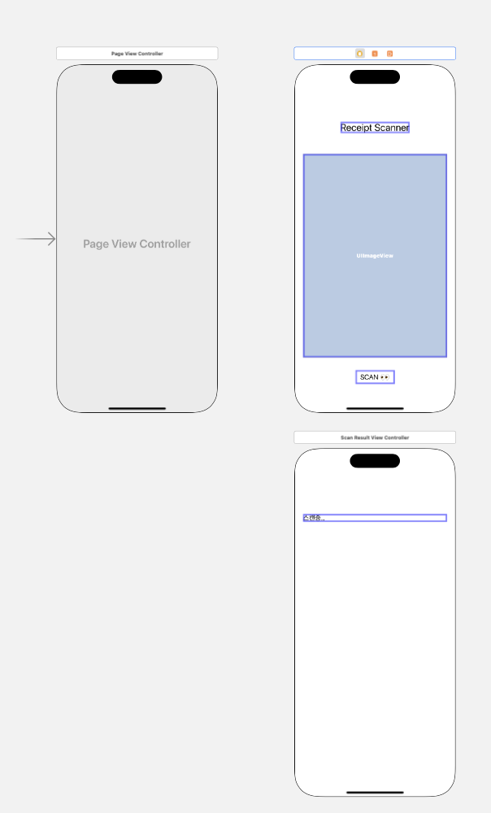
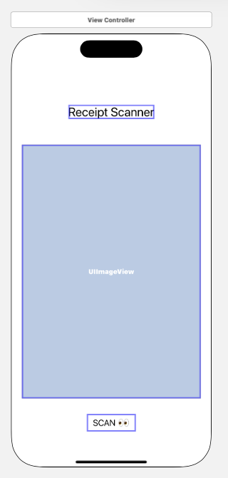
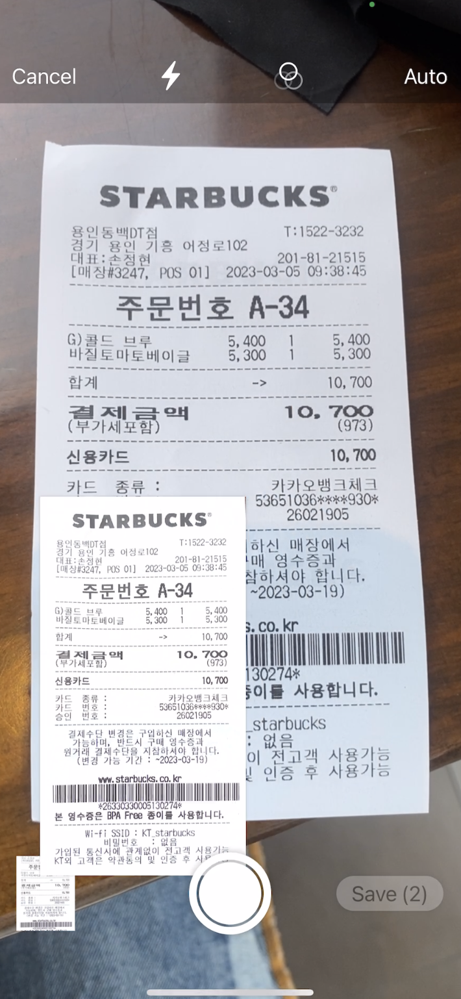

## VisionKit

잠깐 OCR 기능을 서치해야할 상황이 생겨 찾다보니 스위프트 VisionKit 프레임워크에서 OCR 기능을 제공한다는 것을 보게 되었다. 한국어 인식을 지원한지 생각보다 오래 되지 않아서 레퍼런스를 찾느라 꽤 시간이 소요되었던 것 같다.

굿노트 앱을 사용해본 사람은 알겠지만 어플 자체에서 사용 가능한 스캔기능과 유사하게 작동한다.

## 흐름 및 UI 구성

앱의 전체적인 흐름은 다음과 같다.

1. `VNDocumentCameraViewController` 메서드를 통해 카메라 촬영 전용 인스턴스를 화면에 그린다.
2. 이미지 스캔 후 스캔결과를 보여줄 뷰 컨트롤러의 이미지 속성에 데이터를 전달한다.
3. 이미지 세팅 didSet 속성감시자를 통해 OCR을 시작한다.

스토리보드 내의 구조는 아래와 같다.


`UIPageViewController` 인스턴스를 스토리보드 엔트리포인트로 지정한 뒤 메인 뷰 컨트롤러와 OCR 결과 뷰 컨트롤러를 자식 인스턴스로 등록한다.

예제에서 첫 화면에 보여줄 ViewController의 스토리보드 id는 `ScanVC`, 결과를 보여줄 ViewController의 스토리보드 id는 `ScanResultVC`로 지정하였다.

## UIPageViewController

페이지 뷰 컨트롤러는 자식 뷰컨트롤러들을 배열 형태로 관리하며 일반적인 세그웨이 show 및 present 방식으로 화면을 그리는 것이 아닌 슬라이드 형태로 화면을 그리게 된다.

먼저 PageViewController 커스텀 클래스를 생성한다. 이후 클로저 형태로 lazy하게 자식 뷰 컨트롤러 배열을 지연 속성으로 생성해둔다.

`VCInstance` 메서드는 커스텀 메서드이고 추후 페이지 뷰 컨트롤러 자식 인스턴스들에 접근할때 사용하게 된다.

```swift
class PageViewController: UIPageViewController {

    lazy var VCArray: [UIViewController] = {
        return [
            self.VCInstance(name: "ScanVC"),
            self.VCInstance(name: "ScanResultVC")
        ]
    }()

    private func VCInstance(name: String) -> UIViewController{
        return UIStoryboard(name: "Main", bundle: nil).instantiateViewController(withIdentifier: name)
    }
}
```

```swift
class PageViewController: UIPageViewController {
    // lazy var VCArray
    // private func VCInstance

    override func viewDidLoad() {
        super.viewDidLoad()

        self.dataSource = self

        guard let firstVC = VCArray.first else {
            return
        }

        setViewControllers([firstVC], direction: .forward, animated: true)
    }
}
```

`setViewControllers` 메서드는 페이지 뷰 컨트롤러 로드 후 화면을 보여줄 뷰 컨트롤러를 지정한다. 미리 만들어둔 속성 VCArray에 접근한 뒤 첫 화면 뷰 컨트롤러를 instantiateViewController 메서드에 전달하여 스토리보드와 코드를 연결해준다.

페이지 뷰 컨트롤러의 dataSource를 설정해야 화면을 제대로 보여줄 수 있게 되며, 델리게이트 지정 시 필수 구현해야할 함수들이 몇가지 있다. 아래의 확장 내에 구현된 예시 메서드를 보자.

```swift
extension PageViewController: UIPageViewControllerDataSource{
    func pageViewController(_ pageViewController: UIPageViewController, viewControllerBefore viewController: UIViewController) -> UIViewController? {
        guard let viewControllerIndex = VCArray.firstIndex(of: viewController) else {
            return nil
        }

        let previousIndex = viewControllerIndex - 1

        guard previousIndex >= 0 else {
            return nil
        }

        guard VCArray.count > previousIndex else {
            return nil
        }

        return VCArray[previousIndex]
    }

    func pageViewController(_ pageViewController: UIPageViewController, viewControllerAfter viewController: UIViewController) -> UIViewController? {
        guard let viewControllerIndex = VCArray.firstIndex(of: viewController) else {
            return nil
        }

        let nextIndex = viewControllerIndex + 1
        let orderedViewControllersCount = VCArray.count

        guard orderedViewControllersCount != nextIndex else {
            return nil
        }

        guard orderedViewControllersCount > nextIndex else {
            return nil
        }

        return VCArray[nextIndex]
    }
    override func didReceiveMemoryWarning() {
        super.didReceiveMemoryWarning()
    }
}
```

`func pageViewController(_ pageViewController: UIPageViewController, viewControllerBefore viewController: UIViewController) -> UIViewController?` 메서드와 `func pageViewController(_ pageViewController: UIPageViewController, viewControllerAfter viewController: UIViewController) -> UIViewController?` 메서드 둘을 구현해야 한다.

둘의 차이점은 아규먼트 레이블 `viewControllerBefore`와 `viewControllerAfter`가 있다.

화면이 슬라이딩 형태로 그려지는데 before는 왼쪽 방향으로 슬라이딩 될때의 로직, after는 반대 방향으로 슬라이딩 될때의 로직을 구현하게 된다.

전체적인 로직의 흐름은 아래와 같다.

1. VCArray로 관리되는 페이지 뷰 컨트롤러 배열의 count 값에 접근하여 슬라이딩 되는 끝 범위를 얻어낸다.
2. 이전 뷰 컨트롤러 인스턴스에 접근할 경우 0번째 인덱스를 얻어내고 다음 뷰 컨트롤러 인스턴스에 접근할 경우 count 속성을 가지고 비교를 하게 된다.
3. 접근하고자 하는 뷰 컨트롤러의 인덱스가 양끝단을 넘어서는 경우 nil을 리턴하고 그렇지 않을 경우 인덱스를 -1 또는 +1 하여 조회하는 화면을 변경해준다.

VCArray 배열에 접근할 경우 자동으로 VCInstance 커스텀 메서드가 호출되어 화면이 그려지게 된다.

## 메인화면

페이지 뷰 컨트롤러의 VCArray 속성 0번째 인덱스 뷰 컨트롤러를 만들어보자. 스토리보드 구성은 아래와 같이 했다.


상단에 UILabel, 중단에 스캔 결과로 나타나는 imageView, 스캔 결과 페이지로 이동하기 위한 UIButton으로 구성하였다.

```swift
class ViewController: UIViewController {

    // 스토리보드와 연결한 버튼과 이미지뷰
    // 상단 레이블은 만들어진 그대로 사용
    @IBOutlet weak var scanButton: UIButton!
    @IBOutlet weak var imageView: UIImageView!

    var images: Array<Any> = []{
        didSet{
            guard let pageVC = self.parent as? PageViewController else {
                print("?")
                return
            }

            guard let scanResultViewController = pageVC.VCArray[1] as? ScanResultViewController else {
                return
            }
            guard let imageData = images as? [UIImage] else{
                return
            }
            scanResultViewController.imageData = imageData
        }
    }


    override func viewDidLoad() {
        super.viewDidLoad()
        // Do any additional setup after loading the view.

    }

    @IBAction func buttonPressed(_ sender: UIButton) {
        images = []
        visionKit()

    }

    func visionKit(){
        let scan = VNDocumentCameraViewController()
        scan.delegate = self
        self.present(scan, animated: true)
    }
}
```

images 저장속성의 didSet 속성감시자를 통해 스캔 이미지 세팅이 이루어지면 스캔 결과 뷰 컨트롤러 데이터를 세팅해준다.

하단 스캔버튼을 클릭하면 이미지 비전을 위한 카메라 뷰 컨트롤러를 생성하여 present한다. 인스턴스 타입은 `VNDocumentCameraViewController`이다. VisionKit 프레임워크 전용 타입이다.

`VNDocumentCameraViewController`를 위한 델리게이트 메서드가 필요하니 아래에 추가로 구현한 코드를 살펴보자.

```swift
extension ViewController: VNDocumentCameraViewControllerDelegate{
    func documentCameraViewController(_ controller: VNDocumentCameraViewController, didFinishWith scan: VNDocumentCameraScan) {
        for pageNumber in 0 ..< scan.pageCount{
            let image = scan.imageOfPage(at: pageNumber)
            images.append(image)
        }

        imageView.image = (images[0] as! UIImage)

        controller.dismiss(animated: true)
    }
}
```



위 이미지를 보면 스캔 후 좌측 하단으로 이미지가 들어가는 것을 볼 수 있는데 이는 스캔 결과 이미지들이 배열로 쌓인다는 것을 알 수 있게 해준다. 비전킷 카메라 관련 델리게이트는 이와 관련된 메서드를 구현해야 한다는 것을 유추해볼 수 있다.

`didFinishWith` 아규먼트 레이블을 갖는 `scan`의 `pageCount`에 접근하면 스캔이 이루어진 총 결과 이미지의 수를 알 수 있다.

이를 통해 for문을 활용하여 각 스캔 이미지에 접근 후 ScanVC 뷰 컨트롤러 images 배열에 각 스캔 이미지들을 append해준다고 보면 된다.

이미지데이터가 ScanVC 뷰 컨트롤러에 세팅된 후 ScanResultVC에 전달해야하는데, 이때 타입 캐스팅을 통해 접근해야 한다. presentingViewController 속성과 유사하게 ScanVC의 parent 속성을 통해 PageViewController에 이동한 뒤 ScanVC 인스턴스에 데이터를 세팅해준다.

## 스캔 결과 뷰 컨트롤러

```swift
import VisionKit
import Vision

class ScanResultViewController: UIViewController {

    @IBOutlet weak var resultLabel: UILabel!

    var imageData: [UIImage] = []{
        didSet{
            startOCR()
        }
    }
}
```

데이터 전달을 통해 스캔결과 뷰 컨트롤러에 이미지 데이터가 세팅되면 didSet 속성감시자를 통해 OCR을 시작한다. `startOCR` 메서드는 VisionKit 프레임워크 함수가 아니라 **직접 제작한 함수이다.**

```swift
func startOCR(){
    guard let image = imageData.first else {
        return
    }

    guard let cgImage = image.cgImage else {
        return
    }
    let handler = VNImageRequestHandler(cgImage: cgImage, options: [:])
    let request = VNRecognizeTextRequest{ [weak self]request, error in

        guard let observations = request.results as? [VNRecognizedTextObservation],
                error == nil else{
            return
        }

        // 한 줄이 끝나는 부분마다 \n
        let text = observations.compactMap({
            $0.topCandidates(1).first?.string
        }).joined(separator: "\n")

        print(text)

        // ui 변경은 main thread에서만 가능
        DispatchQueue.main.async {
            self?.resultLabel.text = text
            print(text)
        }
    }

    if #available(iOS 16.0, *) {
        let revision3 = VNRecognizeTextRequestRevision3
        request.revision = revision3
        request.recognitionLevel = .accurate
        request.recognitionLanguages =  ["ko-KR"]
        request.usesLanguageCorrection = true

        do {
            var possibleLanguages: Array<String> = []
            possibleLanguages = try request.supportedRecognitionLanguages()
            print(possibleLanguages)
        } catch {
            print("Error getting the supported languages.")
        }
    } else {
        // Fallback on earlier versions
        request.recognitionLanguages =  ["en-US"]
        request.usesLanguageCorrection = true
    }

    do{
        try handler.perform([request])
    } catch {
        // 에러 처리
        self.resultLabel.text = "\(error)"
        print(error)
    }

}
```

이미지데이터를 배열로 관리를 하고 있기는 하지만 배열 first 속성을 통해 스캔 결과의 첫 번째 이미지에 대해서만 OCR을 해보려고 한다. 스캔을 위한 이미지는 `cgImage` 타입으로 사용되어야 하므로 이에 주의하자.

1. `VNImageRequestHandler` 메서드를 통해 cgImage를 전달한다. `UIImage` 인스턴스에는 `cgImage` 속성이 존재한다.
2. `VNRecognizeTextRequest` 메서드를 통해 비전을 위한 콜백 함수를 정의한다. 클로저 내부 코드는 그대로 복사해서 사용하면 된다.

비전 메서드를 통해 텍스트를 추출한 뒤 UI를 변경해야 하는데 이는 비동기적으로 메인 스레드에서 이루어져야 하므로 디스패치 큐에 해당 태스크를 전달한다.

참고로 한국어 인식을 위한 버전은 `VNRecognizeTextRequestRevision3` 이므로 iOS 16 이상에서 활용하도록 available 키워드를 사용해주자.

위 코드까지 모두 작성되면 스캔기능을 사용할 수 있다.

:::warning

ScanVC의 images 데이터 didSet 이후 자동으로 비전이 이루어지는데, 이때 해당 시점에서 ScanResultVC 인스턴스는 스토리보드의 UI와 연결이 안되어 있으므로 loadViewIfNeeded 메서드를 호출하거나 앱 실행 후 슬라이딩으로 전체화면에 한번씩 접근하여 모든 UI를 초기화해둔 뒤에 스캔을 시작해야한다.

:::

아래는 어플리케이션 빌드 후 실제로 스캔이 이루어지는 결과 화면이다.


## Reference

1. [ATOMIC PROJECT - How to Use UIPageViewController in Swift](https://spin.atomicobject.com/2015/12/23/swift-uipageviewcontroller-tutorial/)
2. [tistory - VisionKit OCR Api 예제 한글](https://ohwhatisthis.tistory.com/17)
