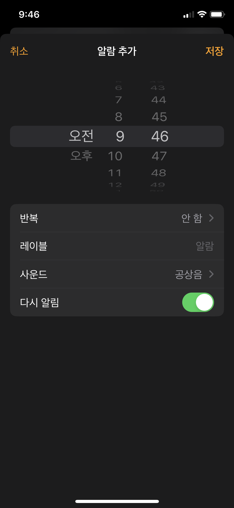
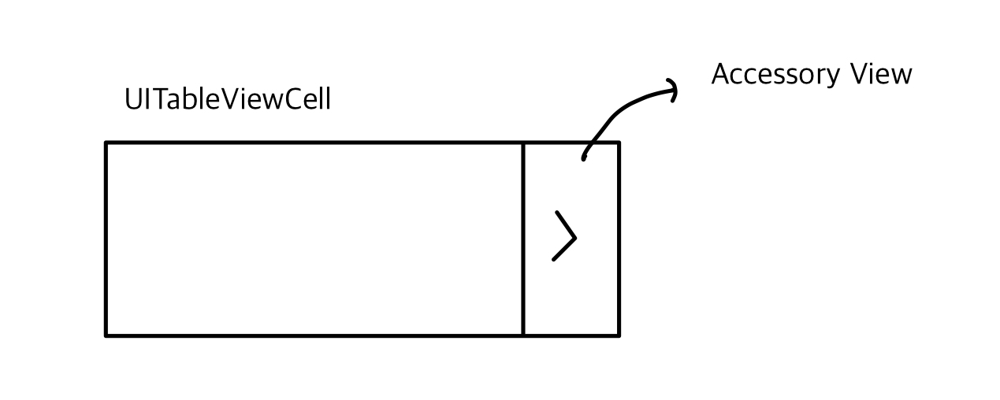

## 테이블뷰 악세서리 뷰

시계 앱 클론중에 아래와 같은 UI가 있었다.


시계 앱의 세부 설정기능이 있는데, 각 세부 설정들을 모아서 관리하는 테이블 뷰가 있다. 이때 해당 테이블 뷰 각 셀마다 우측에 Chevron 이미지가 붙어있는 것을 확인할 수 있는데, 이는 스위프트 자체적으로 테이블 뷰 셀에 할당한 타입 중 하나이다.

스토리보드 상에서 우측 Attributes inspector 메뉴를 보면 중간에 Accessory라는 드롭다운 메뉴가 있다. 이를 None이 아닌 다른 값으로 설정하게 되면 테이블 뷰 셀 자체에 Accessory View라는 영역이 새롭게 할당되며 내부에 컨텐츠를 각 타입에 맞춰 자동으로 넣어준다.



## 악세서리 뷰 커스텀

테이블 뷰 editing 모드 하에 햄버거 메뉴를 커스텀하는 것에 한계가 있었던 것 처럼 악세서리 뷰의 disclosure indicator같은 이미지들의 tintColor를 커스텀 하는 것은 애플에서 지원하지 않는다고 한다.

[다음 문서를](https://stackoverflow.com/questions/58023245/uitableviewcells-accessoryview-has-a-gray-background-color-on-ios-13) 참고하면 disclosure indicator 이미지의 컬러를 변경해줄 수 있다.

다음은 문서에 작성되어 있었던 코드이다.

```swift
extension UITableViewCell {
    func createCustomCellDisclosureIndicator(chevronColor: UIColor) {
        //MARK: Custom Accessory View
        //Chevron img
        if #available(iOS 13.0, *) {
            let chevronConfig = UIImage.SymbolConfiguration(pointSize: 14, weight: .medium)
            guard let chevronImg = UIImage(systemName: "chevron.right", withConfiguration: chevronConfig)?.withTintColor(chevronColor, renderingMode: .alwaysTemplate) else { return }
            let chevron = UIImageView(image: chevronImg)
            chevron.tintColor = chevronColor

            //chevron view
            let accessoryViewHeight = self.frame.height
            let customDisclosureIndicator = UIView(frame: CGRect(x: 0, y: 0, width: 15, height: accessoryViewHeight))
            customDisclosureIndicator.addSubview(chevron)

            //chevron constraints
            chevron.translatesAutoresizingMaskIntoConstraints = false
            chevron.trailingAnchor.constraint(equalTo: customDisclosureIndicator.trailingAnchor,constant: 0).isActive = true
            chevron.centerYAnchor.constraint(equalTo: customDisclosureIndicator.centerYAnchor).isActive = true

            //Assign the custom accessory view to the cell
            customDisclosureIndicator.backgroundColor = .clear
            self.accessoryView = customDisclosureIndicator
        } else {
            self.accessoryType = .disclosureIndicator
            self.accessoryView?.tintColor = chevronColor
        }
    }
}
```

disclosure indicator를 커스텀하고자 하는 테이블 뷰 셀에 대해 커스텀 클래스 파일을 cocoa touch class 파일로 하나 생성 및 연결한 뒤, 해당 클래스의 확장에 위의 함수를 붙여넣으면 된다.

이후 테이블 뷰 셀 `awakeFromNib()` 함수 호출단계에서 위의 확장 함수를 호출하면 된다.

## Reference

1. [stackoverflow - UITableViewCell's accessoryView has a gray background color on iOS 13](https://stackoverflow.com/questions/58023245/uitableviewcells-accessoryview-has-a-gray-background-color-on-ios-13)
