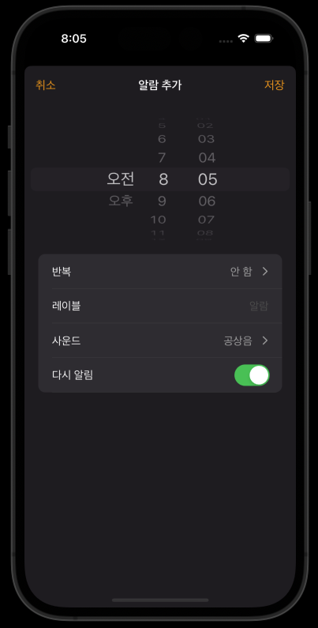

## 필요한 상황

테이블뷰 셀의 경우 일반적으로 각 셀이 동일 속성들로 구성될 때가 많다. 아래의 사진을 보면


테이블 뷰 셀들이 이미지, 타이틀, 서브타이틀로 구성되어 있고 이러한 형식이 내부 셀 데이터만 다르지 전체적으로 달라지지 않는다. 시계 앱 클론코딩 중 아래와 같은 테이블 뷰를 구현해야 하는 상황이다.


동일한 테이블 뷰의 자식으로 셀들이 만들어지지만 그 셀들은 각각의 구성이 다 다르다. 왼쪽에 UILabel로 구성되는 것 외에 오른쪽 UI들이 UITextField로 구성되거나 스위치로 구성되는 등 조금씩 다른 부분이 있다.

일반적으로 테이블 뷰 셀을 만들때 `tableView.dequeueReusableCell`을 통해 전체 셀들을 동일한 형태로 강제하게 되는데, 서로 다른 형태의 테이블 뷰 셀을 만들려면 어떻게 해야할까?

## switch문 활용

단순한 방법이다. 커스텀하고자 하는 테이블 뷰 셀을 UITableViewCell을 상속하는 커스텀 클래스로 새로 정의하고 indexPath.row의 값에 따라 switch문으로 셀을 생성해주면 된다.

`UITableViewDataSource` 프로토콜을 채택하여 `cellForRowAt` 파라미터를 갖는 함수를 구현해주자.

```swift
// UITableViewDataSource
func tableView(_ tableView: UITableView, cellForRowAt indexPath: IndexPath) -> UITableViewCell {
    switch indexPath.row{
    // 커스텀클래스 1
    case 0:
        let cell = tableView.dequeueReusableCell(withIdentifier: "AlarmSettingRepeatTableViewCell", for: indexPath) as! AlarmSettingRepeatTableViewCell
        cell.backgroundColor = UIColor(named: "ModalSettingTableViewColor")
        return cell
    case 1:
    // 커스텀클래스 2
        let cell = tableView.dequeueReusableCell(withIdentifier: "AlarmSettingLabelTableViewCell", for: indexPath) as! AlarmSettingLabelTableViewCell
        cell.backgroundColor = UIColor(named: "ModalSettingTableViewColor")
        return cell
    // ...
    default:
        break
    }
}
```

:::warning dequeueReusableCell
셀마다 서로 다른 인스턴스를 사용한다고 해서 `dequeueReusableCell` 메서드를 사용하지 않으면 안된다. iOS 자체적으로 테이블 뷰 셀을 메모리적인 관점에서 효율적으로 관리하기 위해 `dequeueReusableCell`로 테이블 뷰 셀을 등록하는 것인데, 당장 화면 상에 보이는 것만을 목적으로 하여 테이블 뷰 셀을 고정된 UI로 구현하면 어떤 예외사항이 벌어질 지 모른다.

가령 매우 작은 사이즈의 기종이 새로 출시되어 테이블 뷰를 드래그하여 dequeueReusableCell에 등록하지 않은 테이블 뷰 셀이 화면 바깥으로 나가게 되면 해당 셀은 메모리적으로 reusable될 수 없다.
:::

## Reference

1. [UITableView with more than one custom cells with swift](https://stackoverflow.com/questions/30774671/uitableview-with-more-than-one-custom-cells-with-swift)
