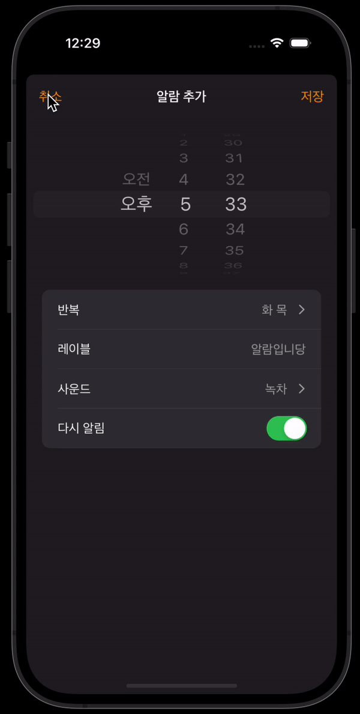
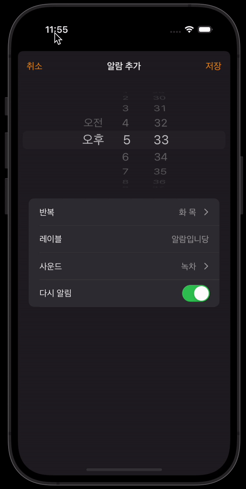

## 문제상황

시계 앱을 클론하는 과정에서 코어데이터로부터 가져온 데이터를 가지고 CRUD중 Update에 해당하는 로직 구현이 필요했다.



스토리보드로 테이블 뷰 셀과 디테일 뷰 컨트롤러를 연결해두었고, 데이터 전달을 위해 performSegue 호출 이전에 자동으로 세그웨이 destination 뷰 컨트롤러에 데이터 세팅을 해주는 prepare 메서드를 오버라이딩 하는 중이었다.

destination 뷰 컨트롤러를 커스텀 클래스로 타입캐스팅 해준 뒤 내부 UI 요소들에 접근해야 했는데, 위의 사진에서 볼 수 있듯 디테일 뷰 컨트롤러 내부에 여러 UI 요소들에 직접 접근하여 데이터를 세팅해야 하는 상황이었다.

사실, 디테일 뷰 컨트롤러에 대해 destination 뷰 컨트롤러 타입캐스팅 후 직접 저장속성을 세팅해주면 코드 자체로는 정상적으로 동작하게 된다. 무엇이 문제가 되는지 다시 살펴보자.



화면이 한번 깜빡인 뒤에 데이터가 세팅되는 것처럼 보인다. 위와 같은 현상이 벌어지는 이유는 뷰 컨트롤러 내의 UI 요소들이 인스턴스 생성이 이루어지지 않은 상태에서 내부 프로퍼티에 접근하려고 할때 nil값에 대한 접근으로 인식되어 **모든 UI가 생성되는 화면의 생명주기 단계에서 데이터 세팅을 해줘야 하기 때문이다.**

`viewDidAppear` 메서드를 뷰 컨트롤러 내에 오버라이딩 하여 모든 스토리보드 기반 UI들이 인스턴스로 생성되었을 때에 내부 속성에 접근하여 데이터를 세팅하다 보니 잠깐의 텀이 사용자에게 노출되는 것이다.

## loadViewIfNeeded()

이때 사용되는 것이 바로 `loadViewIfNeeded()`라는 메서드이다.

위 상황에서 이전 뷰 컨트롤러에서 디테일 뷰 컨트롤러로 데이터를 전달하며 UI 내부 프로퍼티를 조작할 때에 `prepare` 메서드가 어떻게 호출되는지 살펴보자.

```swift
override func prepare(for segue: UIStoryboardSegue, sender: Any?) {
    if segue.identifier == "AlarmViewController", let indexPath = tableView.indexPathForSelectedRow{

        guard let destinationNavigationVC = segue.destination as? AlarmGenerateNavigationController else {
            return
        }

        guard let destinationVC = destinationNavigationVC.viewControllers.first as? AlarmGenerateViewController else {
            return
        }

        destinationVC.alarmData = alarmData[indexPath.row]

        // 여기!
        destinationVC.loadViewIfNeeded()

        // UI를 조작하는 커스텀 코드
        destinationVC.datePicker.setDate(alarmData[indexPath.row].time!, animated: false)
        destinationVC.tableView.reloadData()
        setupRepeatCell(generateTableView: destinationVC.tableView, alarm: alarmData[indexPath.row])
        setupLabelCell(generateTableView: destinationVC.tableView, alarm: alarmData[indexPath.row])
        setupSoundCell(generateTableView: destinationVC.tableView, alarm: alarmData[indexPath.row])
        setupAgainCell(generateTableView: destinationVC.tableView, alarm: alarmData[indexPath.row])
    }
}
```

스토리보드 구조 상 구현 형태가 각자마다 달라지게 되겠지만, 위 코드에서 중요한 것은 `destinationVC.loadViewIfNeeded()` 메서드가 호출되는 시점이다.

prepare메서드가 호출되는 시점에서 도착지 뷰 컨트롤러를 커스텀 클래스로 타입캐스팅 한 뒤 뷰 컨트롤러의 loadViewIfNeeded 메서드를 호출하게 되면 **해당 뷰 컨트롤러 내부의 UI들이 인스턴스로 먼저 생성되게 된다.**

따라서 내부 UI의 프로퍼티를 PresentingViewController 단에서 직접적으로 조작할 수 있게 되는 것이다.

## Reference

1. [Testing the presented UITableViewCell in a UITableView](https://stackoverflow.com/questions/56592213/testing-the-presented-uitableviewcell-in-a-uitableview)
