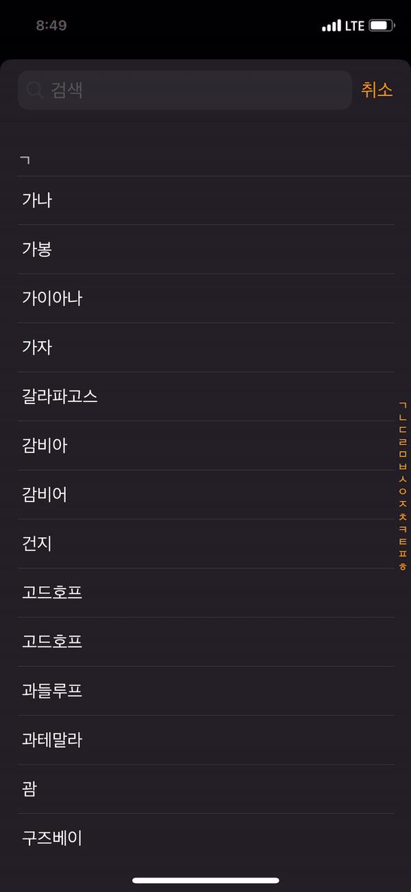
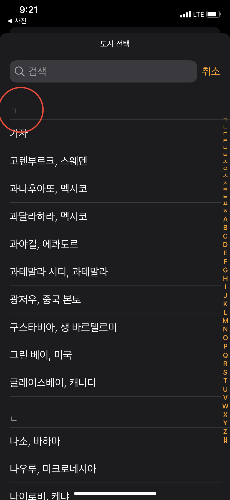

## 테이블뷰 인덱싱

테이블뷰 기반으로 만들어진 UI들을 보다보면 ABC-가나다 순으로 빠르게 인덱싱 할 수 있게 해주는 기능을 제공한다.



이번 글에서는 테이블뷰의 인덱싱 기능을 활용하는 방법에 대해 정리해보려고 한다.

## 프로토콜 메서드 구현

테이블뷰에 인덱싱 기능을 추가하기 위해 구현해야하는 메서드는 `UITableViewDataSource` 프로토콜에 존재한다. 그도 그럴것이 테이블 뷰에 대한 데이터 관리에 대한 메서드들이 이 프로토콜에 있기 때문이다.

프로토콜 메서드 구현에 앞서 필요한 것은 어떤 데이터를 가지고 인덱싱을 할 지에 대해 정해야 한다는 것이다. 이 글에서는 ㄱㄴㄷ 순으로 인덱싱을 할 것이므로 뷰 컨트롤러의 저장속성을 하나 생성할 것이다.

```swift
let sectionTitles = ["ㄱ","ㄴ","ㄷ","ㄹ","ㅁ","ㅂ","ㅅ","ㅇ","ㅈ","ㅊ","ㅋ","ㅌ","ㅍ","ㅎ"]
```

이때 위와 같이 생성한 이유는 아래의 한글 자모분리 이슈에서 추가적으로 정리할 것이다.

이번에는 구현해야할 프로토콜 메서드들을 정리해보자. 구현에는 필수적인 부분과 선택적인 부분이 있다. 필수적인 부분을 구현하지 않는다고 해서 에러가 나지 않을 수 있지만, 인덱싱 활용을 위해서는 꼭 구현해줘야 하는 부분이니 체크하고 넘어가면 좋다.

1. `func tableView(_ tableView: UITableView, willDisplayHeaderView view: UIView, forSection section: Int)`: 취향에 따라 구현하면 되며, 테이블 뷰의 섹션 헤더를 꾸미고 싶을때 구현하면 된다.
2. `func sectionIndexTitles(for tableView: UITableView) -> [String]?`: 필수 구현 대상이며, 섹션별 타이틀 요소를 관리하는 전체 리스트를 리턴하면 된다.
3. `func tableView(_ tableView: UITableView, sectionForSectionIndexTitle title: String, at index: Int) -> Int`: 필수 구현이며, 섹션 위치별 인덱스를 리턴하게 된다.
4. `func numberOfSections(in tableView: UITableView) -> Int`: 필수 구현이며, 섹션의 전체 개수를 리턴하면 된다.
5. `func tableView(_ tableView: UITableView, titleForHeaderInSection section: Int) -> String?`: 필수 구현이며, sectionForSectionIndexTitle로부터 리턴된 index값을 통해 섹션별 타이틀 문자열을 정의한다.
6. `func tableView(_ tableView: UITableView, numberOfRowsInSection section: Int) -> Int`: 필수 구현이며, 매우 중요하게 다뤄져야 하는 메서드이다. 섹션별 행의 개수를 관리하게 된다. 전체 데이터 인덱싱 시 section에 대한 인덱싱과 각 섹션의 row에 대한 접근으로 이루어지게 된다.
7. `func tableView(_ tableView: UITableView, cellForRowAt indexPath: IndexPath) -> UITableViewCell`: 테이블 뷰를 다룬다면 위 메서드에 대한 중요성은 설명하지 않아도 될 것 같다. 각 셀의 데이터를 정의하게 되는데, 이때 섹션에 대한 내용이 추가적으로 들어가므로 해당 내용에 대해서만 간단히 언급하려고 한다.

## 1. willDisplayHeaderView

섹션 헤더를 꾸미기 위해서는 `willDisplayHeaderView` 메서드를 구현하면 된다. 아래는 예시 코드이다.

섹션 헤더는 아래 사진에 체크된 부분을 나타낸다.



```swift
func tableView(_ tableView: UITableView, willDisplayHeaderView view: UIView, forSection section: Int) {
    if let headerView = view as? UITableViewHeaderFooterView {
        headerView.textLabel?.textColor = .lightGray
        headerView.contentView.backgroundColor = UIColor(named: "ModalColor")
    }
}
```

1. 파라미터로 전달된 `view`값을 `UITableViewHeaderFooterView`로 타입캐스팅해준다.
2. 섹션 헤더의 기본 속성인 textLabel과 contentView에 접근하여 텍스트컬러 및 배경색을 변경해준다.

## 2. sectionIndexTitles, sectionForSectionIndexTitle,

위에서 생성해두었던 `let sectionTitles = ["ㄱ","ㄴ","ㄷ","ㄹ","ㅁ","ㅂ","ㅅ","ㅇ","ㅈ","ㅊ","ㅋ","ㅌ","ㅍ","ㅎ"]` 이라는 저장속성을 활용하여 위 메서드를 구현한다.

```swift
func sectionIndexTitles(for tableView: UITableView) -> [String]? {
    return sectionTitles
}
```

인덱싱할 섹션 전체를 한 곳에서 배열 형태로 관리해야 하며 위 메서드에서 해당 배열을 리턴해주면 iOS 내부적으로 처리를 할 수 있게 된다.

아래는 sectionForSectionIndexTitle 파라미터를 갖는 메서드이다.

```swift
func tableView(_ tableView: UITableView, sectionForSectionIndexTitle title: String, at index: Int) -> Int {
    return index
}
```

위 메서드는 화면 우측에 섹션 인덱싱을 위한 작은 공간이 마련되면 사용자와의 인터랙션 시 인덱스에 해당하는 문자열과 배열 인덱스 값을 내부적으로 관리하게 해주는 기능을 한다. 단순하게 그냥 index 파라미터를 다시 리턴하면 된다고 생각하면 된다.

## 3. numberOfSections

섹션 전체 개수를 리턴한다. ㄱㄴㄷ순으로 정리된 sectionTitles 저장속성을 사용할 것이라면 코드는 아래와 같게 된다.

```swift
func numberOfSections(in tableView: UITableView) -> Int {
    return sectionTitles.count
}
```

## 4. titleForHeaderInSection

섹션 헤더뷰의 textLabel에 들어갈 텍스트를 정의하게 된다. 이때 파라미터로 전달받는 section 파라미터를 활용하여 섹션별 문자값을 사용할 수 있게 된다.

```swift
func tableView(_ tableView: UITableView, titleForHeaderInSection section: Int) -> String? {
    return sectionTitles[section]
}
```

리턴값이 nil인 경우도 고려하고 있는데, 이러한 경우를 다루게 되는 상황은 서치바와 테이블 뷰를 함께 관리할때의 상황을 생각해볼 수 있다. 자세한 내용은 추후 서치바에 대한 문서를 정리할 예정이다.

## 5. numberOfRowsInSection

섹션별 테이블 뷰 row의 수를 정의한다.

```swift
func tableView(_ tableView: UITableView, numberOfRowsInSection section: Int) -> Int {
    guard let clockDataWithSectionArray = clockDataWithSection[sectionTitles[section]] else {
        return 0
    }
    return clockDataWithSectionArray.count
}
```

코드는 위와 같이 작성하였는데, 이에 대한 내용은 바로 아래에서 한글 자모분리 이슈에 대해서 함께 연계하여 설명하도록 하겠다.

## 6. cellForRowAt

코드를 살펴보자.

```swift
func tableView(_ tableView: UITableView, cellForRowAt indexPath: IndexPath) -> UITableViewCell {
    let cell = tableView.dequeueReusableCell(withIdentifier: "WorldClockSelectCell", for: indexPath) as! WorldClockSelectTableViewCell

    guard let clockDataWithSectionArray = clockDataWithSection[sectionTitles[indexPath.section]] else {
        return UITableViewCell()
    }

    cell.data = clockDataWithSectionArray[indexPath.row]

    return cell

}
```

위의 코드에서 각 섹션 내의 셀에 데이터를 정의할때 `indexPath.row`로 인덱싱하는 것을 볼 수 있다. 데이터 구조가 아래와 같다고 가정해보자.

```swift
let data = [
    "ㄱ": ["가자", "가나"],
    "ㄴ": ["노르웨이", "난마돌"]
]
```

예제 코드에서 먼저 `indexPath.section`으로 인덱싱하는 부분을 볼 수 있는데, 이 코드는 `data["ㄱ"]`의 형태로 인덱싱 하는 것이다.

`data["ㄱ"]`의 결과값은 `ㄱ` 인덱스에 해당하는 값이 없을 수 있기 때문에 nil이 반환될 수 있는 것이고 이에 따라 `guard let` 바인딩을 처리해주는 것이다.

파라미터로 전달된 `section`을 통해 `ㄱ`과 `ㄴ` 섹션에 인덱싱 할 수 있게 되는 것이고, 1차적으로 섹션에 접근했다면 반환받은 섹션 내의 각 배열에 `indexPath.row` 형태로 접근하게 되는 것이다.

## 한글 인덱싱 유니코드 이슈

우리가 전체 데이터를 테이블 뷰로 관리하는 입장에서 어떤 데이터가 어떤 섹션으로 들어가야 할 지 미리 알고 인덱싱 처리를 하게 되는 것일까?

예를 들어 전체 타임존 리스트를 우리가 직접 관리한다고 가정해보자. 관리해야될 데이터는 아래와 같다.

```swift
가나 가봉 가이아나 가자 갈라파고스 감비아 감비어 건지 고드호프 고드호프 과들루프 과테말라 괌 구즈베이 그레나다 그리스 글라스베이 기니 기니비사우 나미비아 나우루 나이지리아 남수단 남아프리카 네덜란드 네덜란드령카리브 네팔 네팔 노롱야 노르웨이 노보시비르스크 노보쿠즈네츠크 노퍽섬 놈 뉴욕 뉴질랜드 뉴질랜드 뉴칼레도니아 니우에 니제르 니카라과 니코시아 니피곤 다윈 대만 대한민국 데이비스 덴마크 덴마크샤븐 덴버 덴버 도미니카 도미니카공화국 도슨 도슨크릭 독일 동티모르 뒤몽뒤르빌 디트로이트 라리오하 라오스 라이베리아 라트비아 랭킹인렛 레바논 레소토 레시페 레위니옹 레이니강 로데라 로드하우 로스앤젤레스 루마니아 루붐바시 루이빌 룩셈부르크 르완다 리비아 리오가예고스 리자이나 리졸루트 리투아니아 리히텐슈타인 린데만 마가단 마나우스 마다가스카르 마데이라 마르티니크 마사틀란 마세이오 마셜제도 마요트 마카사르 마카오 마퀘사스 마타모로스 말라위 말레이시아 말리 맥머도 맥쿼리 맨섬 메노미니 메리다 메틀라카틀라 멕시코시티 멘도사 멜버른 모나코 모로코 모리셔스 모리타니 모스크바 모슨 모잠비크 몬테네그로 몬테레이 몬트세라트 몰도바 몰디브 몰타 몽턴 미국령버진아일랜드
// ........
```

이 외에도 수십가지의 데이터가 존재하는 상황이다. 테이블뷰 섹션과 관련된 메서드는 **자동으로 섹션별 데이터를 배치해주지 않는다.** 섹션별로 구분된 형태로 우리가 데이터를 미리 정의해두어야 하는 책임이 있다.

위와 같은 데이터를 섹션 속성을 갖도록 하려면 어떻게 해야할까? 이때 딕셔너리가 사용된다. 딕셔너리 타입은 `[String: [String]]`으로 정의하면 될 것이다.

```swift
let dict = [
    "ㄱ": ["가나", "가봉", ...],
    "ㄴ": ["나미비아", "나우루", ...],
    ...
]
```

그렇다면 우리가 보유중인 나라별 데이터를 하나씩 순회하며 딕셔너리를 직접 마련해야 되는 상황이다. 이때 전체 데이터가 한글로 관리되기 때문에 `가나` 라는 요소를 `"ㄱ"` 섹션에 집어넣기 위해 초성 `"ㄱ"`을 빼와야 하는 상황이다.

## Reference

1. [UITableView - change section header color](https://stackoverflow.com/questions/813068/uitableview-change-section-header-color)
