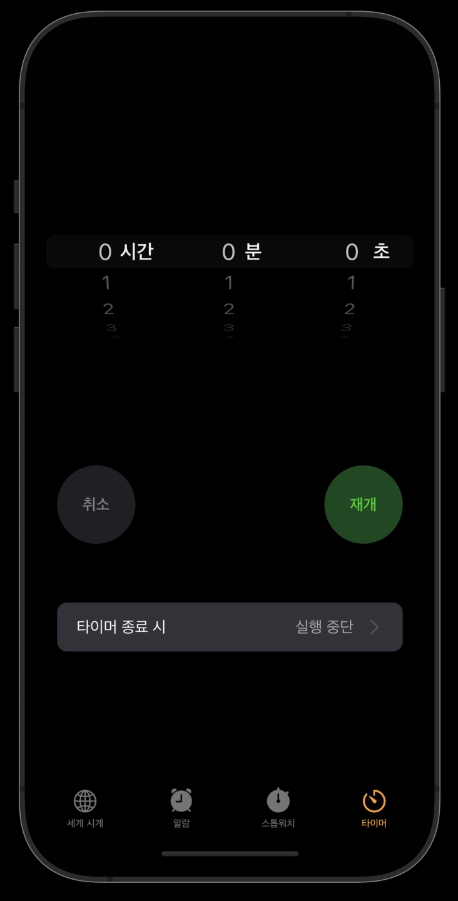

## UIDatePicker vs UIPickerView



시계 앱 클론 과정에서 기본 `UIDatePicker` 인스턴스에서 제공하지 않는 형식의 피커뷰를 만들어야 했다. 데이트피커의 경우 `.datePickerMode` 속성을 통해 여러 양식의 피커뷰를 기본적으로 사용할 수 있게 해준다.

카운트다운 타이머 기능을 구현할때에 시간-분-초 세 가지 컬럼을 갖는 피커뷰를 만들어야 했는데 UIDatePicker에서 제공하는 `datePickerMode`의 `countDownTimer`는 `Locale`속성에 상관 없이 컬럼 명이 영어로 나타날 뿐더러, 컬럼 역시 분-초 두 가지 속성밖에 제공하지 않는다.

이 문서에서는 피커뷰를 직접 생성해보고, 컬럼 명까지 붙여보는 예제 코드를 살펴볼 것이다.

## UIPickerView delegate, dataSource

피커뷰 역시 인스턴스의 데이터 표현 책임을 뷰 컨트롤러에 전가하는 패턴이기 때문에, `UIPickerViewDelegate`와 `UIPickerViewDataSource` 프로토콜에 대한 메서드 구현이 필요하다.

메서드 구현에 앞서 표현하고자 하는 데이터의 구조를 먼저 정의하고 시작해야 한다. 위의 이미지에서는 시-분-초 라는 데이터를 표현해야 하므로 세 컬럼이 필요하다. 컬럼을 UIPickerView에서는 `component`라는 속성으로 다룬다.

```swift
var time = [
    [0,1,2,3,4,5,..... , 23], // 24시간
    [0,1,2,3,4....., 59], // 60분
    [0,1,2,3,4,.....,59], // 60초
]
```

0번째 컴포넌트는 24시간, 1번째는 60분, 2번째는 60초를 나타내게 되며 위의 데이터들을 피커뷰 DataSource 메서드에서 다루게 되는 것이다.

데이터 표현을 위한 프로토콜 메서드를 살펴보자.

```swift
extension TimerViewController: UIPickerViewDataSource{
    func pickerView(_ pickerView: UIPickerView, numberOfRowsInComponent component: Int) -> Int {
        return time[component].count
    }

    func numberOfComponents(in pickerView: UIPickerView) -> Int {
        return time.count
    }
}
```

1. `func pickerView(_ pickerView: UIPickerView, numberOfRowsInComponent component: Int) -> Int`: 컴포넌트 별 요소들의 개수를 리턴하면 된다. 시간 컬럼의 경우 0부터 23까지 총 24개의 요소가 있고, 나머지는 60개의 요소들이 있다. 데이터소스 메서드에서는 `component`라는 파라미터를 제공하므로 데이터구조만 제대로 갖춰져 있다면 자동으로 메서드가 호출된다.
2. `func numberOfComponents(in pickerView: UIPickerView) -> Int`: 컴포넌트의 총 개수를 리턴하면 된다. 시-분-초 세 가지 컬럼을 가지므로 하드코딩 형식으로 3을 리턴해도 되고, 데이터 구조 변경에 따라 동적으로 리턴하고 싶다면 위의 예시 코드대로 리턴해도 된다.

위의 코드는 `UIPickerViewDataSource` 프로토콜에 대한 구현 내용이다. 다음으로는 `UIPickerViewDelegate` 프로토콜을 살펴보자.

```swift
extension TimerViewController: UIPickerViewDelegate{
    func pickerView(_ pickerView: UIPickerView, titleForRow row: Int, forComponent component: Int) -> String? {
        switch(component){
        case 0:
            return "\(time[component][row])"
        case 1:
            return "\(time[component][row])"
        case 2:
            return "\(time[component][row])"
        default:
            return nil
        }
    }
}
```

`UIPickerViewDelegate`에서는 컬럼과 행별로 어떤 데이터를 나타내줄 지 커스텀 할 수 있다. 컴포넌트 인덱스별로 switch 분기를 진행하여 데이터 컴포넌트를 선택하고, row파라미터를 통해 row값에 해당하는 데이터를 불러올 수 있고 이를 문자열 보간법으로 리턴하면 된다.

이때 `return "\(time[component][row])"` 형태의 리턴에 `return "\(time[component][row]) 시간"` 과 같은 형태로 리턴하면 시간 값에 해당하는 Int 데이터만 동적으로 변하고 뒤에 붙은 `시간`이라는 문자열은 고정되게 되지만, **모든 row에 걸쳐 동일한 문자열이 중복되어 나타난다는 문제가 발생한다.**

## 컬럼명 커스텀하여 삽입하기

피커뷰 컴포넌트별로 레이블을 설정하는 방법은 [다음 문서를](https://medium.com/@luisfmachado/uipickerview-fixed-labels-66f947ded0a8)참조했다.

```swift
extension UIPickerView{
    func setPickerLabels(labels: [Int:UILabel], containedView: UIView) { // [component number:label]

        let fontSize:CGFloat = 20
        let labelWidth:CGFloat = containedView.bounds.width / CGFloat(self.numberOfComponents)

        let x:CGFloat = self.frame.origin.x
        let y:CGFloat = (self.frame.size.height / 2) - (fontSize / 2)

        for i in 0...self.numberOfComponents {
            if let label = labels[i] {
                if(label.text!.count == 2){
                    label.frame = CGRect(x: x + labelWidth * CGFloat(i) + 36, y: y, width: labelWidth, height: fontSize)
                }else{
                    label.frame = CGRect(x: x + labelWidth * CGFloat(i) + 24, y: y, width: labelWidth, height: fontSize)
                }

                if self.subviews.contains(label) {
                    label.removeFromSuperview()
                }

                label.font = UIFont.boldSystemFont(ofSize: fontSize)
                label.backgroundColor = .clear
                label.textAlignment = NSTextAlignment.center
                label.textColor = .white
                self.addSubview(label)
            }
        }
    }
}
```

위 코드를 정리하면 아래와 같다.

1. 파라미터로 딕셔너리와 뷰를 받는다. 이들은 각각 `[피커뷰 컴포넌트의 인덱스값: 삽입하려는 UILabel 인스턴스]` 형태의 딕셔너리와 피커뷰가 부착될 수퍼뷰를 의미한다.
2. 폰트 사이즈를 지정하고, 파라미터에 전달받은 UILabel 각각이 가질 레이블 너비를 지정한다. 이는 파라미터에 전달된 뷰의 너비를 총 컴포넌트 개수로 나눈 값이다. 컬럼 레이블의 너비를 피커뷰 기준으로 등분하여 갖게 되는 것이다.
3. 위치에 대한 정보를 x와 y에 지정한다.
4. 컴포넌트 인덱싱을 하면서 레이블의 x좌표 위치를 지정해줘야 하는데, 이 부분은 구현하는 UI디자인 형태에 맞춰 커스텀하면 된다. 위에 작성된 코드는 시간 컬럼인 경우 표현해야할 컬럼명이 두글자이므로, UILabel을 오른쪽으로 살짝 더 옮겨주는 형태의 코드이다.
5. 레이블을 피커뷰 서브뷰에 부착하고, 레이블 자체 속성들을 커스텀한다.

위에 직접 확장한 메서드를 호출하는 예시는 아래와 같다.

```swift
func setupPickerLabel(){
    let hourLabel = UILabel()
    hourLabel.text = "시간"

    let minuteLabel = UILabel()
    minuteLabel.text = "분"

    let secondLabel = UILabel()
    secondLabel.text = "초"

    // timePicker가 UIPickerView 인스턴스
    // 레이블 인스턴스 생성 후 인덱스값과 함께 딕셔너리로 전달하고 있다.
    timePicker.setPickerLabels(labels: [0:hourLabel, 1: minuteLabel, 2: secondLabel], containedView: self.view)
}
```

`setPickerLabels` 확장메서드 호출 시 `containedView` 파라미터에 전체 뷰를 전달했던건 leading, trailing이 최상위 수퍼뷰 기준 constraint 0값으로 지정되어 피커뷰가 부착된 형태였기 때문에 위와 같이 아규먼트를 구성했다.

특정 수퍼뷰의 서브뷰로 피커뷰가 부착되는 것이라면 수퍼뷰를 파라미터에 전달하면 된다.

### Reference

1. [Using UIPickerView in Swift forms: Tutorial with examples](https://blog.logrocket.com/using-uipickerview-swift-forms-tutorial/#what-is-uipickerview)
2. [How to use UIPickerView](https://www.hackingwithswift.com/example-code/uikit/how-to-use-uipickerview)
3. [UIPickerView — Fixed Labels](https://medium.com/@luisfmachado/uipickerview-fixed-labels-66f947ded0a8)
