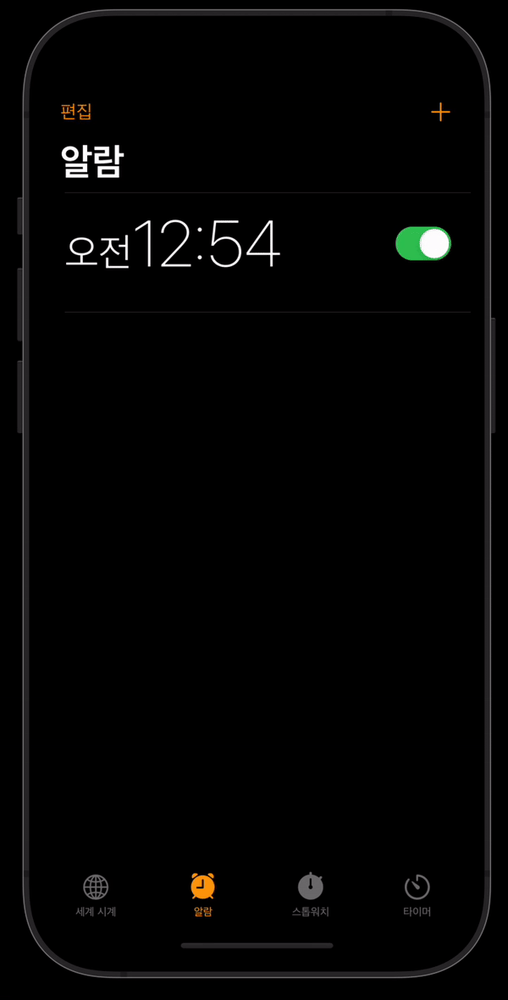
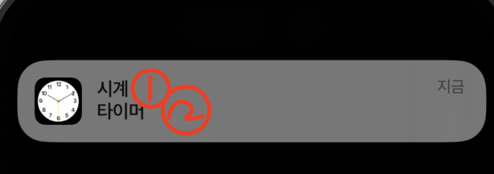
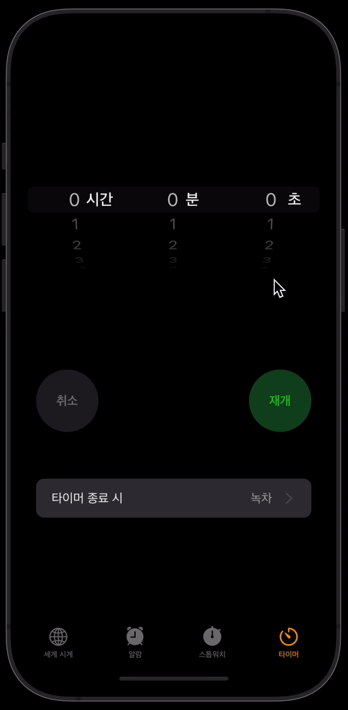

알람 앱 클론코딩중에 푸시알람을 구현하게 되었다. APN을 통한 원격 푸시알람이 아닌 **디바이스 자체 생성 푸시알람에 대해** 정리해보려고 한다.

## 1. 권한 설정

APN은 서버와 클라이언트 사이의 푸시 알람 통신을 중개해주는 서비스이다. 디바이스 토큰을 관리하며 푸시알람에 대한 라우팅 작업을 지원한다.

서버에서 내려받는 알람이 아닌 디바이스 자체적으로 생성하는 로컬 푸시알람의 경우 APN이 불필요하다. 추후 원격 푸시알람 기능을 구현하게 될때 추가적으로 문서를 정리할 예정이다.

푸시알람에는 앱 초기 로드 시에 사용자로부터 요청해야할 권한이 있다. 해당 권한요청은 로컬이던 원격이던 상관없이 모든 푸시알람 형태에 대해 공통적으로 요청해야 하는 권한이다.

:::tip NotificationService.swift
알람 설정과 관련된 함수 및 속성들은 싱글톤 패턴으로 클래스를 하나 정의하는 것이 편하다. 스위프트 디렉토리 구조 베스트 프랙티스 관련 문서를 참고해보면, 웹서비스 관련 프로세스들을 `Service`라는 그룹 내에 정의하는 것을 볼 수 있다. 푸시알람도 원격 알람의 경우 APN이라는 웹 서비스를 사용하기 때문에 해당 그룹으로 묶일 수 있다.

```swift
import Foundation
import UserNotifications
import UIKit

// NSObject 클래스를 상속받는다
class NotificationService: NSObject{

    // 싱클톤 클래스
    private override init(){}
    static let sharedInstance = NotificationService()

    let UNCurrentCenter = UNUserNotificationCenter.current()

    var pendingNotificationArray: [UNNotificationRequest]?

    // AlarmData 모델 매니저에서 현재 보유중인 알람데이터들 불러오기
    let alarmManager = AlarmManager.shared
}
```

:::

위에 정의한 `NotificationService`클래스 내에 푸시 알람과 관련된 로직들을 모두 집어넣으면 된다. 아래에 정의할 푸시알람 권한 요청에 대한 함수도 추가로 클래스 내에 정의한다.

```swift
func authorizeNotification(){
    let options: UNAuthorizationOptions = [.alert, .badge, .sound]

    UNCurrentCenter.requestAuthorization(options: options){ (granted, error) in
        print(error ?? "No UNAuthorize error")

        guard granted else {
            print("사용자가 알람 권한을 허용하지 않았습니다.")
            return
        }

        self.UNCurrentCenter.delegate = self
    }
}
```

푸시알람에 대한 옵션들을 지정하고 **NotificationService** 클래스 내에 정의되어 있는 저장속성 `UNCurrentCenter`의 `requestAuthorization` 메서드를 옵션 파라미터와 함께 전달한다.

`grant`를 바인딩으로 추출하고, 추출이 실패할 경우 사용자가 권한 허용을 하지 않은 것이기 때문에 이에 대한 추가 예외처리를 진행한다.

`UNCurrentCenter` 인스턴스에 대해 `delegate`속성 역시 `self`로 지정해줘야 나중에 필요한 델리게이트 메서드들을 동작시킬 수 있다.

## 2. 알람요청

로컬 푸시알람은 세 가지 타입으로 생성할 수 있다.

1. 특정 날짜가 되었을때 알람
2. 지정한 시간 이후에 알람
3. 특정 장소(좌표)에 도달했을때 알람

직접 구현해본 것은 1번과 2번이므로 추후 3번과 관련된 기능을 구현하게 되면 문서를 정리해보려고 한다.

푸시알람 요청은 다음과 같은 흐름으로 이루어진다.

1. 푸시알람 컨텐츠 정의
2. 푸시알람 발동 조건 정의
3. 대기리스트에 등록

아래부터 작성할 `requestAlarmNotification`이라는 함수는 `NotificationService` 클래스의 메서드로 직접 정의한 것이다.

### 2-1. 푸시알람 컨텐츠 정의

푸시알람 컨텐츠는 `UNMutableNotificationContent` 인스턴스에 정의하면 된다.

```swift
func requestAlarmNotification(title: String, subtitle: String, sound: String, repeatedly:Bool = false, withInterval interval: TimeInterval?, notificationId: String){

    let content = UNMutableNotificationContent()
    content.title = title
    content.subtitle = subtitle

    // ... 나머지
}
```

컨텐츠 인스턴스를 생성하고 `title`과 `subtitle` 속성을 정의한다. 알람을 요청하는 뷰 컨트롤러로부터 타이틀 및 서브타이틀 값을 전달받으면 된다. (구현 형태는 개발자 마음)



위 사진의 1번이 title 속성이고, 2번이 subtitle 속성에 해당한다.

:::tip 알람 사운드 커스텀
구현하려고 했던 기능이 알람 기능이다보니 띠링 하는 일반적인 알람사운드가 아닌 30초가량 되는 긴 사운드를 재생하고 싶었다. 다행히 `UNMutableNotificationContent` 인스턴스에는 `sound`라는 속성을 제공한다.

```swift
content.sound = UNNotificationSound(named: UNNotificationSoundName(rawValue: "\(sound).wav"))
```

`UNNotificationSound` 생성자 함수로 인스턴스를 생성하면 되고 named 파라미터에 `UNNotificationSoundName`인스턴스를 전달하면 된다. 사운드 명은 번들 목록에 포함되어 있는 사운드에 해당하는 파일명을 전달하면 된다.

참고로 위의 작업까지만 하면 5초정도 알람이 유지되다가 사운드 종료와 함께 알람이 자동으로 닫히는데, 이러한 부분은 개발 단에서 조절할 수 없고 어플리케이션을 설치한 사용자가 직접 설정해줘야 하는 부분이다. 이는 클론코딩 레포지토리 리드미에 정리해두었다.[(링크)](https://github.com/Parkjju/clock-app#2-4-%EC%95%8C%EB%9E%8C%EC%82%AC%EC%9A%B4%EB%93%9C-%EC%BB%A4%EC%8A%A4%ED%85%80-%EB%B0%8F-%EB%B0%B0%EB%84%88%EC%8A%A4%ED%83%80%EC%9D%BC-%EB%B3%80%EA%B2%BD)

:::

### 2-2. 푸시알람 발동조건 정의

위에서 언급했듯 푸시알람을 발동시킬 수 있는 조건이 세 가지가 있다. 시간과 관련된 두 가지에 대해 정리를 해보려고 한다.

먼저 `UNCalendarNotificationTrigger`이다. 본인은 트리거 구현시 `getTrigger`라는 메서드를 추가로 생성하였다.

```swift
func requestAlarmNotification(date: Date, title: String, subtitle: String, sound: String, repeatedly:Bool = false,notificationId: String){

    let content = UNMutableNotificationContent()
    content.title = title
    content.subtitle = subtitle

    let trigger = getTrigger(date: date)
    // ... 나머지
}

func getTrigger(date: Date?) -> UNCalendarNotificationTrigger{
    var date = date!
    var dateComponents = Calendar.current.dateComponents([.day,.month,.year,.hour,.minute], from: date)

    return UNCalendarNotificationTrigger(dateMatching: dateComponents, repeats: false)
}
```

`UNCalendarNotificationTrigger` 객체 생성시에는 `dateComponents`로 날짜정보를 따로 빼와야 한다. 위에 작성된 `dateComponents` 함수타입이 아닌 `Calendar.current.dateComponents(in: TimeZone, from:Date)` 타입도 오버로딩 되어 존재하는데, 이렇게 생성한 dateComponent 객체는 `UNCalendarNotificationTrigger`의 dateMatching 아규먼트로 사용해도 **동작하지 않는다.** 월-일-시-분-초 등의 명확한 시간 속성들을 직접 빼와야 한다.

---

`UNTimeIntervalNotificationTrigger` 객체는 TimeInterval값을 트리거 조건으로 사용한다.

```swift
func getTrigger(interval: TimeInterval?, notificationId: String) -> UNTimeIntervalNotificationTrigger{

    let interval = interval!

    return UNTimeIntervalNotificationTrigger(timeInterval: interval, repeats: false)
}
```

### 2-3. 대기리스트에 등록

발동 조건까지 정의했다면 알람을 대기 리스트에 등록해야한다.

```swift
func requestAlarmNotification(date: Date, title: String, subtitle: String, sound: String, repeatedly:Bool = false,notificationId: String){

    let content = UNMutableNotificationContent()
    content.title = title
    content.subtitle = subtitle

    let trigger = getTrigger(date: date)

    let request = UNNotificationRequest(identifier: notificationId, content: content, trigger: trigger)
    // ... 나머지
}
```

대기 리스트 등록에 앞서 요청 객체를 생성해야 한다. `UNNotificationRequest` 생성자 함수를 사용하고 `identifier`, `content`, `trigger` 파라미터를 사용한다. 아이디값은 알람 생성이 겹치면 안되기 때문에 고유 값으로 지정해야하고, `content`는 위에서 정의한 `UNMutableNotificationContent`, `trigger`는 `UNCalendarNotificationTrigger` 또는 `UNTimeIntervalNotificationTrigger` 등의 객체를 전달하면 된다.

현재 생성하는 알람에 대해 아이디 값이 고유해야 하기에 이에 대한 코드 작성에 개발자가 주의를 하는게 맞지만 휴먼 에러에 대한 예방책으로 `requestAlarmNotification` 함수에 알람 생성 아이디값을 전달하여 기존 등록된 알람이 있다면 지우도록 로직을 추가하는 것도 좋다.

```swift
func requestAlarmNotification(date: Date, title: String, subtitle: String, sound: String, repeatedly:Bool = false,notificationId: String){

    let content = UNMutableNotificationContent()
    content.title = title
    content.subtitle = subtitle

    let trigger = getTrigger(date: date)

    let request = UNNotificationRequest(identifier: notificationId, content: content, trigger: trigger)

    // 기존 알람 삭제
    NotificationService.sharedInstance.UNCurrentCenter.removePendingNotificationRequests(withIdentifiers: [notificationId])

    // 알람 등록
    NotificationService.sharedInstance.UNCurrentCenter.add(request)

    // ... 나머지
}
```

싱글톤 객체의 `removePendingNotificationRequests` 함수를 호출한다. 혹시 모를 중복 아이디값 알람까지 삭제했다면 최종적으로 알람을 등록하기만 하면 된다. 이 또한 싱글톤 객체 메서드를 사용하며 `add` 메서드를 사용한다.

위의 단계까지 하면 알람 생성이 완료된다. 참고로 싱글톤 객체로 관리되는 알람 기능 특성상 다양한 뷰 컨트롤러로부터 알람 요청이 들어오게 되는데 이때 함수 오버로딩을 적용해보면 코드가 한결 간단해지는 것을 느낄 수 있다.

## 델리게이트 1. 커스텀 액션 정의

푸시알람은 커스텀 액션을 정의할 수 있다. 특별한 것은 아니고, 알람 기능 기준으로 알람이 울렸을때 배너를 길게 클릭하면 15분 연장한다던지 등의 기능을 정의할 수 있다.



`NotificationService` 클래스를 확장하여 `UNUserNotificationCenterDelegate` 프로토콜 메서드를 구현한다.

```swift
  func userNotificationCenter(_ center: UNUserNotificationCenter, didReceive response: UNNotificationResponse, withCompletionHandler completionHandler: @escaping () -> Void) {
        print(response.actionIdentifier)
        switch response.actionIdentifier{
        case UNNotificationDismissActionIdentifier:
            print("dismiss")
        case UNNotificationDefaultActionIdentifier:
            print("default")
        case "custom":
            print("custom")
        default:
            break
        }
        completionHandler()
    }
```

푸시알람 response에는 `actionIdentifier`라는 속성이 존재하는데, 해당 속성을 switch문 분기처리를 통해 액션에 대한 동작들을 `didReceive` 파라미터를 갖는 `userNotificationCenter`함수에서 구현할 수 있다.

다음은 각 액션 아이디값에 대한 설명이다.

1. `UNNotificationDefaultActionIdentifier`: 푸시알람 클릭시 어플리케이션 열림과 동시에 자동으로 배너가 닫히는 액션
2. `UNNotificationDismissActionIdentifier`: 커스텀액션 클릭시 배너가 닫히는 액션을 `dismiss` 액션으로 인식함.

배너가 닫히는 액션이면 모두 `UNNotificationDismissActionIdentifier`라고 생각할 수 있지만 알람이 닫히는 것을 대응하는 것은 생각보다 쉽지 않다. 차라리 아래에서 설명할 `willPresent` 시점에서 알람이 닫히는 액션에 대해 정의하는 것이 좋다.

커스텀 액션을 정의하는 방법은 아래와 같다.

1. `UNMutableNotificationContent` 인스턴스의 속성 중 `categoryIdentifier`를 정의한다.
2. `UNNotificationAction` 객체를 생성한다.
3. `UNNotificationCategory` 객체를 생성하면서 파라미터에 `UNNotificationAction` 객체를 전달한다.
4. `NotificationService` 싱글톤 객체의 `setNotificationCategories([카테고리 객체])` 함수를 호출한다.

아래는 예시 코드이다.

```swift
func requestAlarmNotification(title:String, subtitle:String, sound: String, repeatedly: Bool = false, notificationId: String){
    let content = UNMutableNotificationContent()
    content.title = title
    content.subtitle = subtitle

    // categoryIdentifier 정의
    content.categoryIdentifier = "Alarm"

    // UNNotificationAction 객체 생성
    //
    let customAction = UNNotificationAction(identifier: "response.actionIdentifier에 사용할 액션명", title: "액션 메뉴에 사용하게 될 타이틀", options: [])

    let category = UNNotificationCategory(identifier: "content.categoryIdentifier에 정의한 카테고리 값", actions: [customAction], intentIdentifiers: [])

    // 싱글톤 객체에 카테고리 등록
    self.UNCurrentCenter.setNotificationCategories([category])

    // 나머지 코드..
}
```

## 델리게이트 2. willPresent

알람 앱 구현을 할때 푸시알람 트리거 후 알람이 `dismiss`되고 테이블뷰를 리로딩 하고 싶은 경우가 있다. 예를 들어 루트 뷰 컨트롤러에 코어데이터 형태로 데이터 리스트를 쭉 불러왔을때, 알람 활성화 여부를 표현해주는 토글버튼 컴포넌트를 off 상태로 하고 싶은 것이다.

이러한 경우 default 액션 카테고리 내에서 해당 로직을 구현해도 상관 없겠지만, 본인은 `willPresent` 메서드 내에서 이러한 로직을 구현하였다.

```swift
func userNotificationCenter(_ center: UNUserNotificationCenter, willPresent notification: UNNotification, withCompletionHandler completionHandler: @escaping (UNNotificationPresentationOptions) -> Void) {
    // 알람 탭의 테이블뷰가 저장속성에 로드되었다면
    // 알람 울림과 동시에 테이블뷰 리로딩
    if let reloadTable{
        reloadTable.reloadData()
    }

    let options: UNNotificationPresentationOptions = [.banner, .sound]
    completionHandler(options)
}
```

위 예시 코드는 로직 구현에 의존적인 형태라 예제로 적합하지는 않다. `NotificationCenter` 클래스에 `reloadTable`이라는 저장속성을 하나 추가하고 `willPresent` 함수가 호출되는 시점에 테이블뷰를 리로딩 해주어 속성 변경을 뷰에 반영하는 로직이라고 이해만 하면 되겠다.

## Reference

1. [medium - Complete Guide of Rich Push Notifications With Video, Image, GIF and Many More](https://betterprogramming.pub/the-complete-guide-for-configuring-ios-push-notifications-3161d0cddd46)
2. [stackoverflow - Best practice for an Xcode project groups structure?](https://stackoverflow.com/questions/39945727/best-practice-for-an-xcode-project-groups-structure)
3. [stackoverflow - is there a way to manage the duration of the remote notification to be displayed longer on the banner?](https://stackoverflow.com/questions/60967992/is-there-a-way-to-manage-the-duration-of-the-remote-notification-to-be-displayed)
