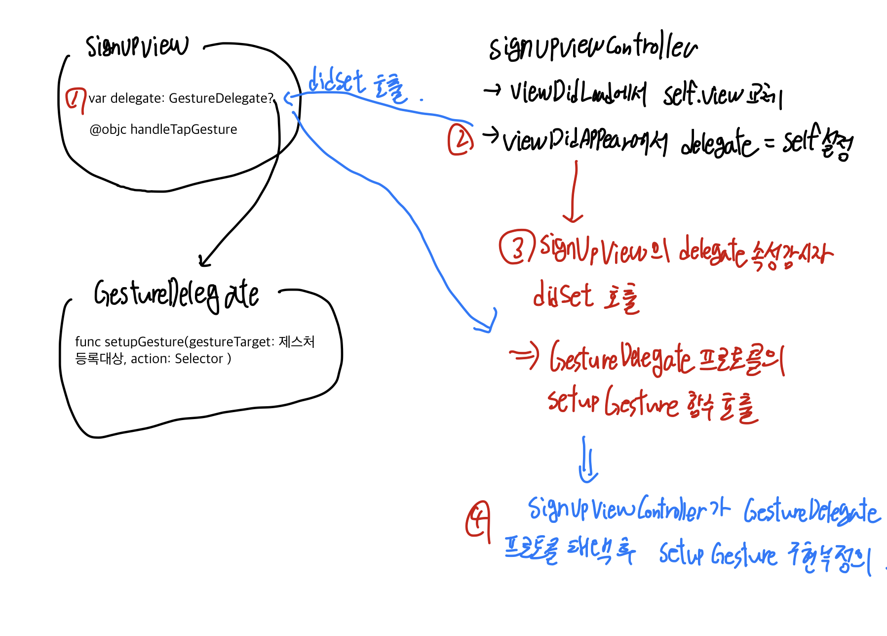

## UITapGesture 프로토콜 정의

MVC 형태로 앱을 구현하기 위해 컨트롤러와 뷰를 분리하다 보니 제스처 관련 셋업 코드를 컨트롤러에 작성하고 싶었다. 커스텀 프로토콜을 정의한 뒤 사용할 뷰 컨트롤러에서 이를 채택하여 뷰 특정 요소에 탭제스처를 등록하는 방식으로 구현해보았다.

델리게이트 패턴으로 상호작용이 일어나는 대상은 두 인스턴스이다. 하나는 `View`에 대한 정보를 담고 있는 `SignUpView`, 하나는 제스처 등록 및 각종 이벤트 처리를 담당하는 `SignUpViewController`이다.

```swift
import UIKit

class SignUpViewController: UIViewController {

    override func viewDidLoad() {
        super.viewDidLoad()

        let signupView = SignUpView()
        self.view = signupView
    }

    override func viewDidAppear(_ animated: Bool) {
        guard let signupView = self.view as? SignUpView else {return}
        signupView.delegate = self
    }
}

extension SignUpViewController: GestureDelegate{
    func setupGesture(gestureTarget: UIView, action: Selector) {

        guard let signupView = self.view as? SignUpView else {return}

        let gesture = UITapGestureRecognizer(target: signupView, action: action)
        signupView.제스처등록대상.addGestureRecognizer(gesture)
        signupView.제스처등록대상.isUserInteractionEnabled = true
    }
}
```

불필요한 UI 관련 설정 코드를 모두 제외한 `SignUpView` 코드는 아래와 같다.

```swift
import UIKit

class SignUpView: UIView {

    weak var delegate: GestureDelegate?{
        didSet{
            delegate?.setupGesture(gestureTarget: profileImageContainerView, action: #selector(handleTapGesture))
        }
    }

    // MARK: setup UI components
    let profileImageContainerView: UIView = {
        let view = UIView()
        return view
    }()

    // MARK: default method
    override init(frame: CGRect) {
        super.init(frame: frame)
        setupUI()
    }

    required init?(coder aDecoder: NSCoder) {
        super.init(coder: aDecoder)
        setupUI()
    }

    @objc func handleTapGesture(){
        print("hi")
    }
}

protocol GestureDelegate: AnyObject{
    func setupGesture(gestureTarget: UIView, action: Selector)
}
```

두 인스턴스간에 상호작용이 이루어지는 순서를 정리하면 다음과 같다.

1. `SignUpViewController`의 `viewDidLoad` 시점에서 VC의 view가 `SignUpView`로 교체되며, 동시에 `SignUpView.delegate` 속성이 `SignUpViewController`로 연결된다.
2. `delegate` 연결과 동시에 `SignUpView` 인스턴스에서 `didSet` 속성감시자 함수가 호출된다. `delegate` 속성은 제스처를 셋업하기 위한 함수 정의부가 담긴 프로토콜을 타입으로 갖는다.
3. 제스처 셋업을 위한 함수는 `setupGesture`이며, 파라미터로 제스처 셋업 대상 뷰 인스턴스를 `gestureTarget`이라는 이름으로 전달받고 `action` 파라미터에는 제스처 동작이 정의된 셀렉터를 전달받는다.
4. `didSet` 호출과 함께 `setupGesture`함수가 호출된다. **함수의 선언부는 `GestureDelegate` 프로토콜을 채택한 SignUpViewController**에 정의되어 있다.
5. 다시 `SignUpViewController`로 이동하여 확장 내에 정의된 `GestureDelegate`프로토콜 `setupGesture`함수 정의부를 살펴보자. `init(target: Any?, action: Selector?)` 생성자 함수를 호출하고 있다.
6. `SignUpViewController.view`속성은 `viewDidLoad`시점에 `SignUpView`인스턴스로 이미 교체되어 있는 상태이다. 따라서 `guard let` 바인딩으로 `SignUpView`인스턴스를 추출한 뒤, 제스처 등록 대상에 `addGestureRecognizer` 메서드로 제스처를 추가할 수 있다. `isUserInteractionEnabled` 속성을 true로 설정하는 것도 잊어서는 안된다.

:::warning UITapGestureRecognizer target 파라미터

`UITapGestureRecognizer` 생성자 함수의 `target` 파라미터는 제스처를 인식할 대상 인스턴스를 가리킨다. 보통 커스텀 `UIView`나 뷰컨트롤러를 전달하게 되는데, 이때 MVC패턴에 따라 뷰와 컨트롤러를 분리한 형태를 갖는 앱이라면 `target` 파라미터 지정에 주의해야한다.

위의 예시 코드에서 `UITapGestureRecognizer` `target` 파라미터에 `self`를 전달하면 인스턴스가 `SignUpViewController`가 되어버리는데, 뷰컨에는 `action` 파라미터에 전달된 `handleTapGesture` objc 함수가 정의되어 있지 않으며, 셀렉터로 해당 함수를 선택할 수 없다.

**탭 제스처에 전달되는 Selector는 반드시 target 인스턴스 내에 정의되어 있어야한다.** 그렇지 않으면 unrecognized selector 에러가 발생하게 된다!

:::

위의 과정을 도식화 하면 아래와 같다.



## Reference
