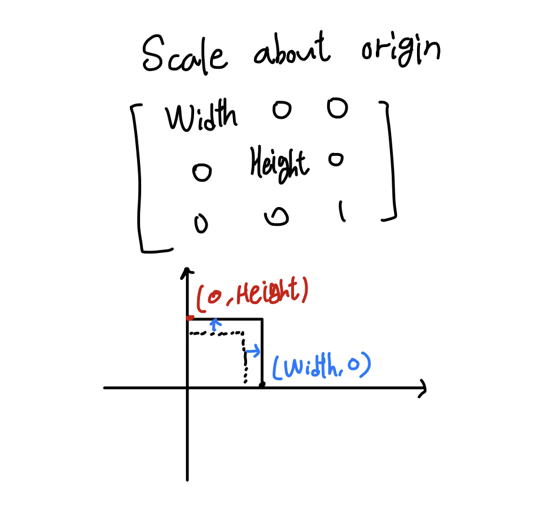
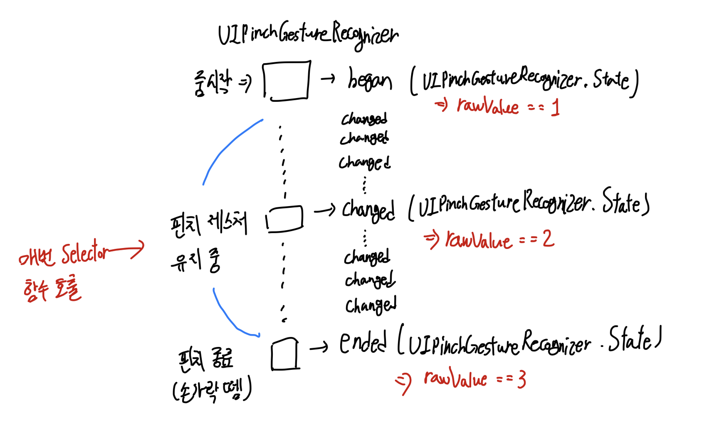
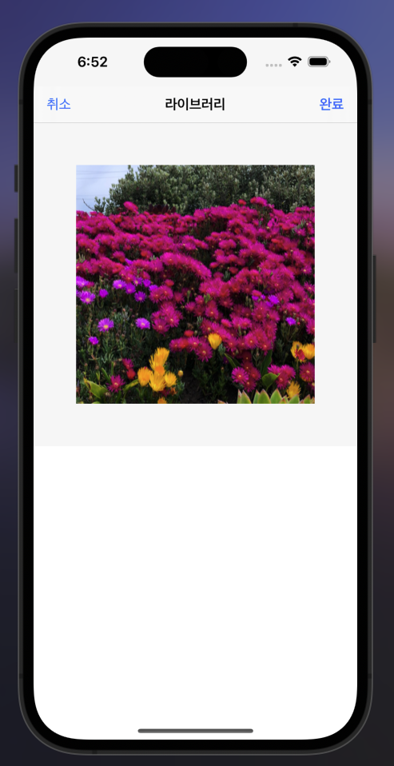
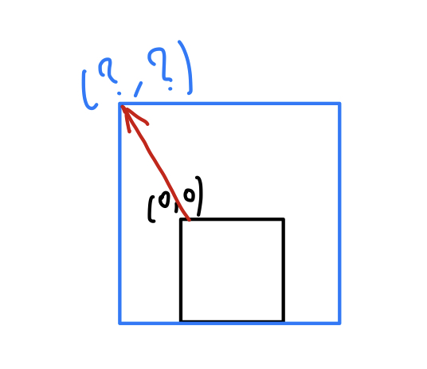
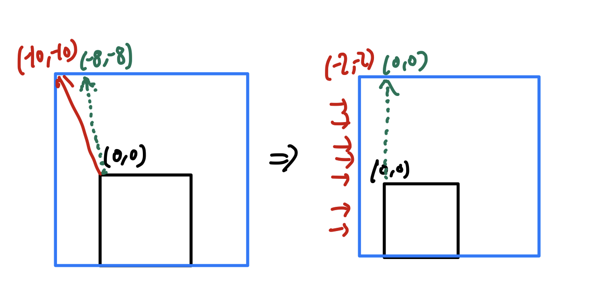

프로필사진 설정 과정에서 crop기능을 구현하려고 했는데, 해당 기능 구현에 앞서 이미지 확대 및 이동 관련 로직을 추가해야 했다. 구현 과정에서 새롭게 알게된 내용들을 정리한다.

## 이미지 확대 및 축소

이미지 스케일링은 `CGAffineTransform`을 통해 이루어진다. `UIPinchGestureRecognizer` 제스처와 연계하여 구현하였다.

```swift
func enableZoom(){
    let pinchGesture = UIPinchGestureRecognizer(target: self, action: #selector(startZooming))
    self.isUserInteractionEnabled = true
    self.addGestureRecognizer(pinchGesture)
}

@objc func startZooming(_ sender: UIPinchGestureRecognizer){
    if(sender.view!.transform.a > 0.6){
        let scaleResult = sender.view?.transform.scaledBy(x: sender.scale, y: sender.scale)

        guard let scale = scaleResult else { return }
        sender.view?.transform = scale
        sender.scale = 1
    }

    if(sender.state == .ended){
        checkImageOriginIsZero(sender)
    }

}

func checkImageOriginIsZero(_ sender: UIPinchGestureRecognizer){
    if(sender.view!.frame.origin.x > 0 || sender.view!.frame.origin.y > 0){
        let imageView = sender.view as! UIImageView
        UIView.animate(withDuration: 0.3) {
            sender.view!.transform.a = 1
            sender.view!.transform.d = 1

            sender.view!.frame.origin.x = 0
            sender.view!.frame.origin.y = 0

            imageView.image = imageView.image?.scalePreservingAspectRatio(targetSize: CGSize(width: sender.view!.superview!.frame.width, height: sender.view!.superview!.frame.width), autoResize: true)
        }
    }
}
```

### 1. 아핀행렬

구현 자체는 이미지를 관리하는 `UIImageView`클래스를 확장하여 구현하였고, `imageView.enableZoom()` 메서드를 원하는 타이밍에 호출하도록 하였다. 이는 개발자 취향이니 앞으로 전개될 내용에 크게 관련은 없다!

`enableZoom` 호출을 통해 이미지뷰 인스턴스에 핀치 제스처가 등록이 된 후 이벤트 리스닝에 따라 호출되는 `startZooming` 함수를 살펴보자.

핀치가 감지되는 빠른 순간마다 `startZooming`함수가 매번 호출된다. 함수 내부에서 분기처리 로직이 실행되는 기준은 `sender.view.transform`인데, `sender`는 이벤트를 리스닝 하는 대상이고 이로부터 이벤트가 실제 발생한 `view`를 추출할 수 있다. `sender.view`는 `UIImageView`가 되도록 코드를 작성해둔 상태이다.

이미지뷰에는 `transform` 속성이 있는데, 여기서 **아핀변환** 이라는 개념이 등장한다.

$\begin {bmatrix} x'\\y'\\1\end{bmatrix}=A\begin{bmatrix}x\\y\\1\end{bmatrix}=\begin{bmatrix}a_{11}&a_{12}&a_{13}\\a_{21}&a_{22}&a_{23}\\0&0&1\end{bmatrix}\begin{bmatrix}x\\y\\1\end{bmatrix}$

A라는 행렬을 `[x,y,1]` 3 by 1 행렬에 곱하여 변환해주는 것을 의미한다. 이때, `[x,y,1]` 행렬에서 x는 원본 이미지의 너비, `y`는 높이를 의미한다.

A행렬의 $a_{11}$, $a_{22}$ 성분의 값을 변환시켜줌으로써 원본 이미지의 스케일은 변환할 수 있다.



애플 [공식문서의 설명](https://developer.apple.com/documentation/corefoundation/cgaffinetransform/1456003-a)을 보면 다음과 같이 설명이 작성되어 있다.

> The entry at position [1,1] in the matrix. (transform.a)

> The entry at position [2,2] in the matrix. (transform.d)

위에 작성한 그림에서 아핀변환에 사용되는 A 행렬의 $a_{11}$ 요소와 $a_{22}$ 요소가 `CGAffineTransform`객체에서 `a`,와 `d` 속성값과 동일한 것이다.

따라서 이미지 크기에 대한 스케일링을 진행할 때에 `CGAffineTransform` 객체의 a와 d값을 변경해주면 된다. 이미지 핀치 제스처 감지에 따라 실행되는 셀렉터 함수에는 `UIPinchGestureRecognizer` 파라미터를 `sender`로 사용할 수 있다. 셀렉터 함수를 받는지 여부에 따라 두 함수가 오버로딩 되어 있는 상태이다. [공식 문서를](https://developer.apple.com/documentation/uikit/uigesturerecognizer/) 참조하면 다음과 같이 함수 타입이 정의되어 있다.

```swift
@IBAction func myActionMethod()
@IBAction func myActionMethod(_ sender: UIGestureRecognizer)
```

스케일 변경을 위한 `a`, `d`는 셀렉터 함수에 전달된 `sender`로부터 가져올 수 있다. 핀치 정도를 측정하여 반환해주는 `sender.scale`속성이 있다. `sender.view?.transform.scaledBy` 메서드 호출을 통해 아핀변환 행렬의 $a_{11}$ $a_{22}$ 값을 변경해줌으로써 이미지 크기를 변환하게 된다.

:::warning sender.scale = 1

`sender`의 스케일값을 통해 이미지 크기 변환을 1회 진행한 뒤, 다시 1로 초기화해주는 코드를 볼 수 있다. 그 이유는 제스처 객체가 가지는 `state`속성때문인데, 이를 도식화해보면 다음과 같다.



핀치 제스처가 조금이라도 움직이게 되면 `UIPinchGestureRecognizer`의 `State` 상태값이 `changed`가 되면서 `sender.scale`값이 변하게 된다.

이때 우리가 알고싶은 것은 **핀치에 따른 현재 스케일의 변화 값 자체가 아닌, 이전 핀치로부터 현재 핀치에 전달된 스케일의 값이 얼마나 변했는 지에 대한 변화율이다.**

`sender.scale`값을 1로 초기화 해주지 않는다고 가정해보자. 기존 너비와 높이가 1이라는 값을 가진다고 하고 핀치 확대를 통해 첫 번째로 전달된 `sender.scale`의 값이 `a`와 `d` 모두 `1.1`이 되었다고 하자.

핀치 제스처를 통해 넓이는 `1 * 1.1`이 되어 총 넓이는 `1.1`이라는 값을 갖는다.

이때 핀치를 유지하며 다시 확대가 이루어지면서 다시 호출된 셀렉터 함수에 `sender.scale`값은 `1.2`가 된다. 너비와 높이에 대해 아핀변환 `1.2`값들을 너비와 높이 각각에 적용하게 되면 `(1 * 1.1) * 1.2`라는 넓이를 갖게 되는 것과 마찬가지이다.

위와 같이 수식을 적용한 로직을 작성하게 되면 **핀치 동작에 따른 스케일링 속도가 감당하지 못할정도로 너무 빨라지게 된다.**

따라서, `sender.scale`을 1로 초기화 해준 뒤 제스처 `changed`에 따라 다시 호출된 스케일을 계산하게 되면 아핀 변환 행렬에 전달되는 조정값이 `1.1`이 되는 것이 아니라 `0.1`이 되는 것이다. 원본 기준 크기에 0.1만큼 크기를 키워주는 방향으로 로직을 구현해야 한다.

:::

### 로직설명

`transform.a`값이 0.6보다 클때만 변환하도록 강제한 이유는 축소 범위를 제한하기 위해서이다. 핀치가 종료되면서 호출되는 마지막 `startZooming` 셀렉터 함수에서는 최종 if문에서 `sender.state == .ended`로 분기된다. 이때 `checkImageOriginIsZero` 함수가 호출된다.

`checkImageOriginIsZero`함수는 함수 이름처럼 이미지의 `origin`값이 `(0,0)`위치에 있는지 여부를 판단한다.



위와 같은 상황인데, 이미지가 축소된 후 핀치제스처가 종료된 경우 이미지의 `origin`에 해당하는 맨 좌측 상단 좌표값이 이미지뷰를 감싸는 `Wrapper` 뷰인 `UIView` 기준으로 x값 또는 y값이 0보다 큰 경우 이미지 축소를 더 유지할 필요가 없기 때문에 스케일값을 뷰에 맞추도록 수정해주는 것이다. (제자리로 돌려보낸다고 이해하면 된다.)

## 이미지 이동

### frame vs center

로직 설명에 앞서 레이아웃과 관련하여 알아야 할 것이 있다. `frame`속성은 `CGRect` 구조체 타입이다. 너비, 높이, origin값들을 관리하는 구조체이다.

크기정보와 위치정보를 모두 포함하는 상대적으로 규모가 큰 구조체이다. 이러한 이유로 `frame`속성에 접근하여 `origin`값을 직접 변경할 때에 내부적으로 `setFrames()` 함수가 호출되는데 이에 따라 `frame` 내부 정보의 변경 주기가 짧은 경우 성능문제가 발생할 수 있다.

우리가 다루려는 `UIPanGestureRecognizer` 제스처의 경우 스크롤 순간마다 셀렉터 함수를 호출하여 위치정보를 변경해줘야 하기 때문에 `frame`속성이 아닌 `center`속성을 다뤄야 한다. `center`속성은 뷰의 중심에 대해 좌표정보를 갖는다. 별 다른 크기정보는 관리하지 않기 때문에 `frame`에 비해 값 세팅에 대한 오버헤드가 적다.

`UIPanGestureRecognizer`는 드래그 제스처를 의미한다.

:::tip bounds

> this property is not a positioning property, but defines the drawable area of the UIView "relative" to the frame. By default this property is usually (0, 0, width, height). Changing this property will allow you to draw outside of the frame or restrict drawing to a smaller area within the frame. - stackoverflow

bounds속성은 **위치정보를 수정하기 위한 속성이 아니다.** 우리가 원을 그릴때 `clipsToBounds`라는 속성을 사용했던 것 처럼 frame이 그림을 그릴 수 있는 영역을 지정하기 위한 속성이라고 보면 된다.

[frame vs bounds](https://programmingwithswift.com/difference-between-frame-and-bounds-in-swift/)과 관련된 설명 중 한 부분을 발췌해보았다. 다음 글을 읽어보자.

> You can think of the frame as a picture frame. The frame will be framing the view. So if we rotate the view, the frame will adjust its size in order to fit the rectangle, the same happens with the x and y coordinates.

프레임 속성은 액자 프레임이라고 이해를 하면 된다. 수퍼뷰를 기준으로 속성값 재할당이 이루어지는데, 가령 회전과 같은 변환이 이루어진 경우 origin좌표가 변환되는 것 외에도 너비와 높이값도 변환되는 것이다.

고정된 프레임 안에서 컨텐츠가 회전할때 컨텐츠 전체를 그대로 유지하길 원한다면 어쩔 수 없이 컨텐츠 크기를 줄이는 방법밖에 없다.

:::

### 로직 설명

```swift
func enableDrag(){
    let panGesture = UIPanGestureRecognizer(target: self, action: #selector(startDragging))
    self.isUserInteractionEnabled = true
    self.addGestureRecognizer(panGesture)
}

@objc func startDragging(_ sender: UIPanGestureRecognizer){
    // 이동량을 더하는 형태 -> 계속 누적되어 목표값을 넘어서게됨
    // 직전의 translate값을 저장
    // 변화하는 상태값을 계속 트래킹하며 이미지뷰 origin위치를 변경해줘야함
    if(sender.view!.transform.a > 1 ){
        sender.view!.center.x += sender.translation(in: sender.view).x
        sender.view!.center.y += sender.translation(in: sender.view).y

        sender.setTranslation(.zero, in: sender.view)
    }else{
        sender.view?.frame.origin = sender.translation(in: sender.view)
    }

    if(sender.state == .ended){
        checkImageOriginIsZero(sender)
    }
}

func checkImageOriginIsZero(_ sender: UIPanGestureRecognizer){
    if(sender.view!.transform.a != 1){
        // 프레임이 왼쪽경계보다 안쪽으로 당겨질때
        if(sender.view!.frame.origin.x > 0){
            UIView.animate(withDuration: 0.3) {
                sender.view!.center.x -= sender.view!.frame.origin.x
            }
        }

        // 프레임이 위쪽경계보다 안쪽으로 당겨질때
        if(sender.view!.frame.origin.y > 0  ){
            UIView.animate(withDuration: 0.3) {
                sender.view!.center.y -= sender.view!.frame.origin.y
            }
        }

        // 프레임이 오른쪽 경계보다 안쪽으로 당겨질때 - 이미지 wrapper UIView 너비로 체크
        if(sender.view!.frame.maxX < sender.view!.superview!.frame.width){
            UIView.animate(withDuration: 0.3) {
                sender.view!.center.x += (sender.view!.superview!.frame.width - sender.view!.frame.maxX)
            }
        }

        // 프레임이 아래쪽 경계보다 안쪽으로 당겨질때 - 이미지 wrapper UIView 높이로 체크
        if(sender.view!.frame.maxY < sender.view!.superview!.frame.height){
            UIView.animate(withDuration: 0.3) {
                sender.view!.center.y += (sender.view!.superview!.frame.height - sender.view!.frame.maxY)
            }
        }

    }else{
        if(sender.view!.frame.origin.x > 0 || sender.view!.frame.origin.x < 0 || sender.view!.frame.origin.y > 0){
            UIView.animate(withDuration: 0.3) {
                sender.view?.frame.origin.x = 0
                sender.view?.frame.origin.y = 0
            }
        }
    }
}
```

로직이 줌 동작에 비해 길어보이지만 어렵지 않다. 로직에 대한 이해를 하기 전 염두에 두고 가야할 것들을 먼저 생각하면 좋다.

1. `UIPanGestureRecognizer`를 통해 `sender`에서 트래킹되는 터치 좌표정보는 값 자체가 궁금한 것이 아니라, **이전 터치로부터 현재 터치 좌표까지 얼마나 변화하였는 지에 대한 변화율이 궁금하다.** 위에서 `UIPinchGestureRecognizer`에서 `sender.scale = 1`로 초기화 했던 코드가 어딘가에 들어가 있을 것이다.
2. view의 `frame.origin`으로 위치정보를 수정하는 것이 아니라 `view.center` 속성에 접근하여 위치정보를 수정해야 할 것이다.

`enableDrag`함수를 호출하여 팬 제스처를 먼저 인스턴스에 등록해주자. 이후 `startDragging` 함수를 살펴보자.

:::tip sender.view.transform.a > 1만 고려한 이유

`sender.view.transform.a`값이 1보다 크다는 것은 원본 이미지가 아핀변환되어 너비가 길어졌다는 것을 의미한다. 1보다 작은 경우는 이미지가 도리어 축소되었다는 것을 의미하기 때문에, 어차피 `checkImageOriginIsZero` 함수가 호출되면서 스케일값이 원래대로 돌아왔을 것이기 때문에 고려할 필요가 없다.

또한 아핀변환 벡터의 `d`값을 살펴볼 필요도 없는 것은 핀치에 따라 너비 뿐 아니라 높이도 자동으로 확대하기 때문에 `view.transform.d`값도 함께 1보다 커져있을 것이다.

:::

위치정보를 `center`속성으로 변경해주고 있다. 드래그 제스처를 통한 좌표의 **변화율**이 `center` 각 x,y좌표에 더해짐으로써 이미지 뷰가 이동하게 된다. frame `origin`을 통한 위치정보 변환시 성능문제로 뷰 이동이 이루어지지 않는 경우가 발생한다. 아핀변환 이후의 origin좌표값 계산이 내부적으로 부정확할 수 있다는 것이다. 그렇기 때문에 완전히 독립적인 속성으로 관리되는 `center`를 가지고 위치 정보를 변경해주어야 한다.

위치 변화 후 제스처 좌표정보를 반환하는 `translation` x,y값을 0으로 초기화해준다.`sender.setTranslation(.zero, in: sender.view)` 코드가 이에 해당한다. 해당 코드가 `UIPinchGestureRecognizer`에서의 `sender.scale = 1`코드와 동일한 기능을 한다. 변화율 계산을 위한 코드이다.

팬 제스처가 종료되면 state값 변화에 따라 `checkImageOriginIsZero` 함수를 호출하게 된다. 이 함수에는 상 하 좌 우 네 가지 경계를 좌표값으로써 정의하고 이를 넘어서는 뷰의 위치정보 변경이 이루어졌을 경우 경계값으로 뷰를 재배치해주는 로직이 구현되어 있다.

각 주석에 맞춰 경계값이 어떤식으로 이루어지는지 직접 확인해보자.

아핀변환 이후 만약 `center`속성이 아닌 `frame.origin.x` 등으로 위치정보값을 변화시켰다면 어떻게될까?

첫 번째 `프레임이 왼쪽경계보다 안쪽으로 당겨질때` 경우에 대해 함수를 새롭게 정의해보자.

```swift
func checkImageOriginIsZero(_ sender: UIPanGestureRecognizer){
    if(sender.view!.transform.a != 1){
        // 프레임이 왼쪽경계보다 안쪽으로 당겨질때
        if(sender.view!.frame.origin.x > 0){
            UIView.animate(withDuration: 0.3) {
                sender.view!.frame.origin.x = 0
                // sender.view!.center.x -= sender.view!.frame.origin.x => 원래 코드
            }
        }
    // 나머지 코드 ....
}
```

프레임 기준 origin x좌표가 양수라는 것은 뷰가 안쪽으로 더 당겨져있다는 것을 의미한다. 이때 origin x좌표값을 왼쪽 끝 경계인 0으로 세팅하게 되면 **뷰의 좌측 끝 경계가 수퍼뷰 기준으로 왼쪽 끝에 붙을 수도, 붙지 않을 수도 있다.**

예를 들어 `origin`좌표가 (0,0)인 상태에서 아핀변환으로 이미지 스케일이 커졌다고 가정해보자. 이때 이미지 확대에 따라 origin값이 자동적으로 계산될텐데, 이미지가 확대되었으므로 일반적인 경우 Origin이 좌측 상단으로 밀려나게 된다. 다음 그림을 보자.



재 계산된 `origin`값이 정상적인 성능을 발휘했을때 예를 들어 `(-10, -10)`이라는 좌표를 가져야 했다면, 엄청나게 빠른 `UIPinchGestureRecognizer`셀렉터 함수 호출에 따른 origin값 계산이 `(-8, -8)`과 같은 값을 반환하게 될 수도 있다는 것이다. **반면 크기 정보는 달라지지 않기 때문에,** 달라진 크기를 기준으로 origin의 좌표 경계를 단순히 0으로 초기화해버리면 다음과 같은 그림처럼 배치가 될 수 있다는 것이다.



잘못 계산된 좌표값으로 인해 **더 이동해야할 좌표가 덜 이동되어** 제스처 종료 이후에도 경계에 뷰가 붙어있지 않게 된다는 것이다.

`checkImageOriginIsZero` 함수는 위와 같은 점들을 고려하여 `center`속성으로 위치 정보를 변환해주고 있다.

:::tip 경계값 기준은 잘못 계산될 수 없나요?

경계값에 대한 기준 자체는 잘못 계산될 수 없는 영역이다. `view.frame.maxX`나 `view.frame.origin.x`값이 잘못 계산되었다고 치더라도 이들은 어쨌든 경계를 넘어선 값들이다.

이를 어떤 경계에 맞추느냐는 결국 아핀변환 이전의 뷰에 대한 origin 정보, 즉 `(0,0)`에 맞추면 되고 우측 끝 경계의 경우 `sender.view`의 수퍼뷰가 갖는 `width`값에 맞추면 된다. 이는 아핀변환에 영향을 받지 않는 불변의 요소들이다.

:::

## Reference

1. [Resize UIImage Without Stretching in Swift](https://www.advancedswift.com/resize-uiimage-no-stretching-swift/)
2. [medium - Swift Transforms](https://medium.com/weeronline/swift-transforms-5981398b437d)
3. [Apple document - CGAffineTransform](https://developer.apple.com/documentation/corefoundation/cgaffinetransform/1456003-a)
4. [Apple document - UIGestureRecognizer](https://developer.apple.com/documentation/uikit/uigesturerecognizer/)
5. [stackoverflow - CGAffineTransform not scaling origin correctly](https://stackoverflow.com/questions/55373905/cgaffinetransform-not-scaling-origin-correctly)
6. [Why can't we directly change size or origin of a UIView frame?](https://stackoverflow.com/questions/9411429/why-cant-we-directly-change-size-or-origin-of-a-uiview-frame)
7. [Difference between Frame and Bounds in Swift](https://programmingwithswift.com/difference-between-frame-and-bounds-in-swift/)
