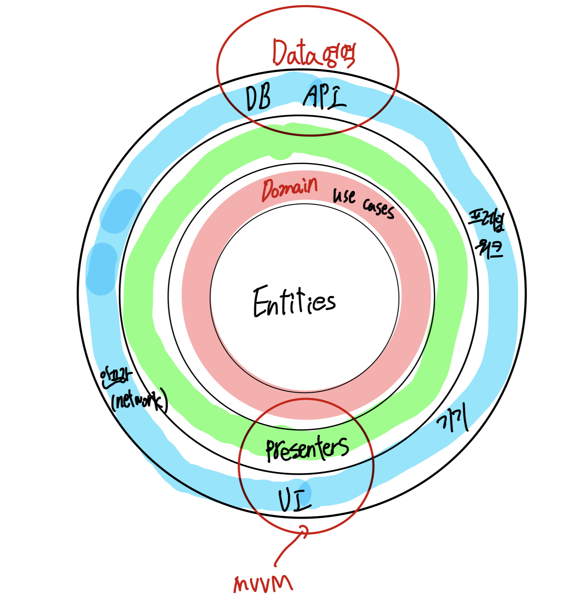
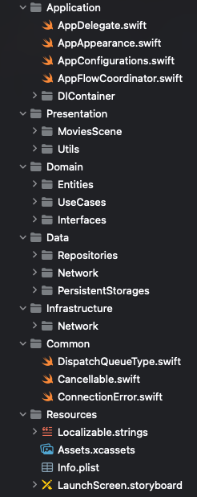
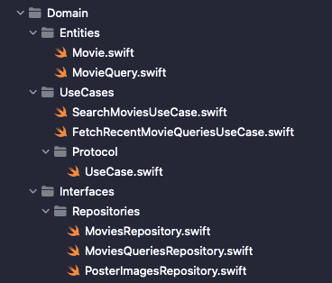

아래 문서는 [Medium - Clean Architecture and MVVM on iOS](https://tech.olx.com/clean-architecture-and-mvvm-on-ios-c9d167d9f5b3) 문서를 읽고 정리한 내용입니다.

## 아키텍처

MVVM 패턴의 프로젝트는 크게 다섯가지 영역으로 구분할 수 있다.

1. `Application`
2. `Domain`
3. `Presentation`
4. `Data`
5. `Infrastructure`

이들 중에는 같은 뎁스에 있는 이들도 있고 다른 뎁스에 있는 이들도 있다.



위의 도식화된 그림이 아래와 같이 실제 프로젝트에 표현된다.



위의 프로젝트 예시를 기반으로 5가지 영역의 실제 역할들을 정리하면 아래와 같다.

1. `Application`
    - 기본 델리게이트 파일들
    - 코디네이터 패턴 파일 - 화면 플로우 컨트롤
    - 의존성 주입 컨테이너
2. `Presentation`
    - MVVM기반의 뷰 관리
3. `Domain`
    - 엔티티, useCase, 인터페이스 정의
    - 모델 및 비즈니스 로직이 담긴 곳이라고 생각하면 됨
4. `Data`
    - 로컬DB를 사용한다면 `PersistentContainer` 객체를 사용
    - 네트워크 통신을 사용한다면 `Endpoint`를 네트워크 그룹 내에 저장
    - 쿼리 함수들은 모두 `Repositories`에 위치시킨다.
5. `Infrastrcutrue`
    - 엔드포인트를 제네릭으로 선언
    - 네트워크 기본 설정에 대한 프로토콜 정의
    - 추상화된 네트워크 정보들을 정의하는 곳

MVVM 클린 아키텍쳐의 대전제는 **의존성의 방향이 반드시 바깥에서 안으로 향해야 한다는 것이다.**

1. Domain계층에는 모델과 이를 관리하는 데이터 비즈니스 로직들에 대한 정보가 담겨있다. **반드시 다른 계층과 완전 독립적으로 존재해야 한다.**
2. Presentation 계층은 `UIView & UIViewControllers`를 포함하는 UI와 이들이 의존하는 ViewModel로 구성되어 있다.
3. Data계층은 네트워크 요청을 다루며, 로컬DB또는 원격 DB의 정보를 포함한다. 도메인 계층의 모델을 기준으로 `Decodable`프로토콜을 채택하여 디코딩하는 등의 로직들을 포함한다.

데이터의 흐름은 다음과 같다.

1. UI가 뷰모델의 메서드를 호출한다.
2. 뷰모델이 use case를 실행한다.
3. use case가 데이터를 레포지토리에 반영한다.
4. 변경사항을 네트워크 또는 로컬 DB로부터 반환받는다.
5. UI가 업데이트된다.

## Domain Layer

[다음 링크에는](https://github.com/kudoleh/iOS-Clean-Architecture-MVVM) MVVM 예시 프로젝트가 있는데, 해당 그룹의 구성은 다음과 같다.



1. `Entity`: 모델에 대한 기본적인 정의이다. 모델 정의와 URL 파라미터에 대한 쿼리를 구조체로 함께 정의해둔다.
2. `UseCase`: 모델데이터 요청을 위한 로직으로 구성되어 있다. 엔티티에 대한 일련의 동작을 프로토콜에 정의해둔 뒤 이를 비즈니스 룰이 정의된 커스텀 `UseCase`에서 채택하여 함수 내부를 구현하는 방식으로 사용된다.

:::tip Use Case란?

> The use cases orchestrate the flow of data to and from the entities, and direct those entities to use their Critical Business Rules to achieve the goals of the use case.

use case는 데이터 흐름을 지휘하며 비즈니스 룰을 통해 use case를 최종적으로 달성하게 된다.

```swift
import Foundation

protocol UseCase {
    @discardableResult
    func start() -> Cancellable?
}
```

```swift
import Foundation

// This is another option to create Use Case using more generic way
final class FetchRecentMovieQueriesUseCase: UseCase {

    struct RequestValue {
        let maxCount: Int
    }
    typealias ResultValue = (Result<[MovieQuery], Error>)

    private let requestValue: RequestValue
    private let completion: (ResultValue) -> Void
    private let moviesQueriesRepository: MoviesQueriesRepository

    init(
        requestValue: RequestValue,
        completion: @escaping (ResultValue) -> Void,
        moviesQueriesRepository: MoviesQueriesRepository
    ) {

        self.requestValue = requestValue
        self.completion = completion
        self.moviesQueriesRepository = moviesQueriesRepository
    }

    func start() -> Cancellable? {

        moviesQueriesRepository.fetchRecentsQueries(
            maxCount: requestValue.maxCount,
            completion: completion
        )
        return nil
    }
}

```

:::

## Presentation Layer

뷰모델에서는 UI로부터의 인풋, UI로의 아웃풋이 정의되어야 한다. 인풋은 뷰의 이벤트 리스트를 정리해둔 프로토콜이고, 아웃풋은 UI에 바인딩될 속성들의 목록을 프로토콜에 정리해둔 것이다.

```swift
protocol MoviesListViewModelInput {
    func viewDidLoad()
    func didLoadNextPage()
    func didSearch(query: String)
    func didCancelSearch()
    func showQueriesSuggestions()
    func closeQueriesSuggestions()
    func didSelectItem(at index: Int)
}

protocol MoviesListViewModelOutput {
    var items: Observable<[MoviesListItemViewModel]> { get } /// Also we can calculate view model items on demand:  https://github.com/kudoleh/iOS-Clean-Architecture-MVVM/pull/10/files
    var loading: Observable<MoviesListViewModelLoading?> { get }
    var query: Observable<String> { get }
    var error: Observable<String> { get }
    var isEmpty: Bool { get }
    var screenTitle: String { get }
    var emptyDataTitle: String { get }
    var errorTitle: String { get }
    var searchBarPlaceholder: String { get }
}
```

뷰모델은 레포지토리가 로컬 DB에 접속하는지, 네트워크에 접속하는지 알 필요가 없다. `ViewModel -> UseCase -> Repository` 형태로 연결된다.

```swift
// MARK: - ViewModel Init
init(
    searchMoviesUseCase: SearchMoviesUseCase,
    actions: MoviesListViewModelActions? = nil,
    mainQueue: DispatchQueueType = DispatchQueue.main
) {
    self.searchMoviesUseCase = searchMoviesUseCase
    self.actions = actions
    self.mainQueue = mainQueue
}
```

```swift
// 도메인에 연결되는 usecase 프로토콜
protocol SearchMoviesUseCase {
    func execute(
        requestValue: SearchMoviesUseCaseRequestValue,
        cached: @escaping (MoviesPage) -> Void,
        completion: @escaping (Result<MoviesPage, Error>) -> Void
    ) -> Cancellable?
}
```

옵저버 패턴을 기반으로 데이터 바인딩을 진행하고, 이벤트 처리 역시 뷰모델에 모든 로직 구현을 위임한다. (옵저버 패턴은 RxSwift 정리할때 자세히 정리 예정)

뷰모델은 또한 화면 이동에 대한 로직 호출도 담당한다. 먼저 어떤 기능별로 화면 전환양상이 다르므로, 의존성 주입을 통해 확장성있는 설계를 기반으로 한다.

```swift
protocol MoviesSearchFlowCoordinatorDependencies{
    func makeMoviesListViewController() -> UIViewController
    func makeMoviesDetailsViewController(movie: Movie) -> UIViewController
}

final class MoviesSearchFlowCoordinator {

    private weak var navigationController: UINavigationController?
    private let dependencies: MoviesSearchFlowCoordinatorDependencies

    init(navigationController: UINavigationController,
         dependencies: MoviesSearchFlowCoordinatorDependencies) {
        self.navigationController = navigationController
        self.dependencies = dependencies
    }

    func start() {
        // 액션 구조체는 멤버와이즈 생성자로 활용하게 된다.
        let actions = MoviesListViewModelActions(showMovieDetails: showMovieDetails)
        let vc = dependencies.makeMoviesListViewController(actions: actions)

        navigationController?.pushViewController(vc, animated: false)
    }

    private func showMovieDetails(movie: Movie) {
        let vc = dependencies.makeMoviesDetailsViewController(movie: movie)
        navigationController?.pushViewController(vc, animated: true)
    }
}

// viewModel
struct MoviesListViewModelActions {
    /// Note: if you would need to edit movie inside Details screen and update this Movies List screen with updated movie then you would need this closure:
    /// showMovieDetails: (Movie, @escaping (_ updated: Movie) -> Void) -> Void
    let showMovieDetails: (Movie) -> Void
    let showMovieQueriesSuggestions: (@escaping (_ didSelect: MovieQuery) -> Void) -> Void
    let closeMovieQueriesSuggestions: () -> Void
}
```

코디네이터 패턴에서는 Flow 속에서 액션 클로저나 `self`호출이 메모리상에서 해제되지 않도록 하기 위해 강한 참조를 기반으로 한다. Flow는 각 씬 단위로 구현된다.

코디네이터 패턴을 적용하는 경우 뷰가 달라져도 뷰모델에서는 뷰의 흐름만 조정하기 때문에 코드상에 변화는 없게 된다.

## 데이터 계층

```swift
final class DefaultMoviesRepository {

    private let dataTransferService: DataTransfer

    init(dataTransferService: DataTransfer) {
        self.dataTransferService = dataTransferService
    }
}
```

레포지토리의 최소한의 기능 구현상태이다. `DataTransfer`는 엔드포인트 요청 형태에 대해 제네릭으로 정의해둔 클래스이다.

```swift
protocol DataTransferService {
    typealias CompletionHandler<T> = (Result<T, DataTransferError>) -> Void

    @discardableResult
    func request<T: Decodable, E: ResponseRequestable>(
        with endpoint: E,
        on queue: DataTransferDispatchQueue,
        completion: @escaping CompletionHandler<T>
    ) -> NetworkCancellable? where E.Response == T

    @discardableResult
    func request<T: Decodable, E: ResponseRequestable>(
        with endpoint: E,
        completion: @escaping CompletionHandler<T>
    ) -> NetworkCancellable? where E.Response == T
    // ... 이외에도 엄청 많음 ..
}
```

위의 기본 형태에 `extension`들을 덧붙여 레포지토리의 기능들을 구현하게 된다.

```swift
extension DefaultMoviesRepository: MoviesRepository {
    public func fetchMoviesList(query: MovieQuery, page: Int, completion: @escaping (Result<MoviesPage, Error>) -> Void) -> Cancellable? {

        let endpoint = APIEndpoints.getMovies(with: MoviesRequestDTO(query: query.query, page: page))

        // 제네릭으로 선언된 DataTransfer타입의 저장속성의 클로저를 구현하게 된다.
        return dataTransferService.request(with: endpoint) { (response: Result<MoviesResponseDTO, Error>) in
            switch response {
            case .success(let moviesResponseDTO):
                completion(.success(moviesResponseDTO.toDomain()))
            case .failure(let error):
                completion(.failure(error))
            }
        }
    }
}
```

엔드포인트 요청 성공에 따라 `Result`의 `Success`타입을 클로저로 획득할 수 있는데, 이때 해당 타입은 `DTO, Data Transfer Object`로 정의하게 된다.

요청에 대한 DTO와 응답에 대한 DTO를 각각 정의하며, 응답 DTO는 특별히 모델 자체를 클래스 내에 내장시키고 이를 인스턴스 형태로 획득할때는 `toDomain()`이라는 메서드로 획득한다.

```swift
struct MoviesRequestDTO: Encodable {
    let query: String
    let page: Int
}

struct MoviesResponseDTO: Decodable {
    private enum CodingKeys: String, CodingKey {
        case page
        case totalPages = "total_pages"
        case movies = "results"
    }
    let page: Int
    let totalPages: Int
    let movies: [MovieDTO]
}
...
// MARK: - Mappings to Domain
extension MoviesResponseDTO {
    func toDomain() -> MoviesPage {
        return .init(page: page,
                     totalPages: totalPages,
                     movies: movies.map { $0.toDomain() })
    }
}
```

## 네트워크 계층 (인프라)

알라모파이어 프로토콜 정의와 같은 로직들이 포함된다.

## Reference

1. [Medium - Clean Architecture and MVVM on iOS](https://tech.olx.com/clean-architecture-and-mvvm-on-ios-c9d167d9f5b3)
2. [Github - Clean Architecture and MVVM on iOS](https://github.com/kudoleh/iOS-Clean-Architecture-MVVM)
3. [Medium - Swift | A use cases approach.](https://medium.com/@leo.durazod/swift-a-use-cases-approach-580ac0654103)
4. [아기개발자의 성장일지 - Repository패턴이란](https://eunjin3786.tistory.com/198)
