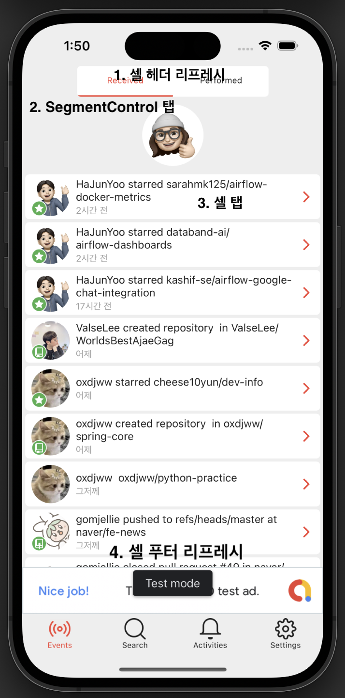
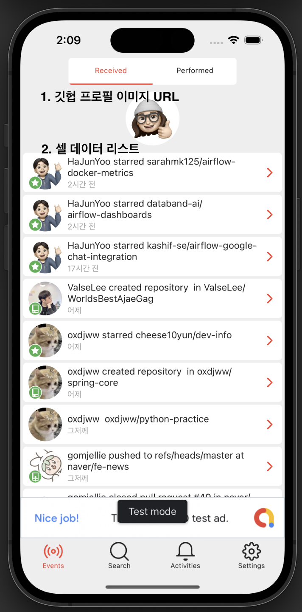
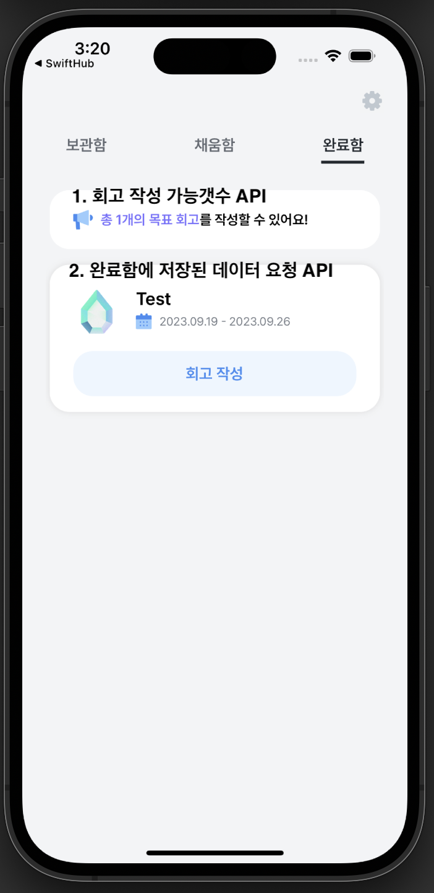
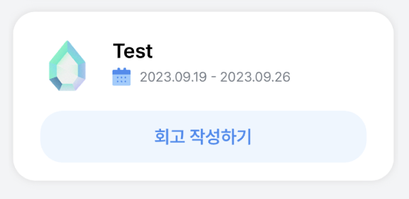
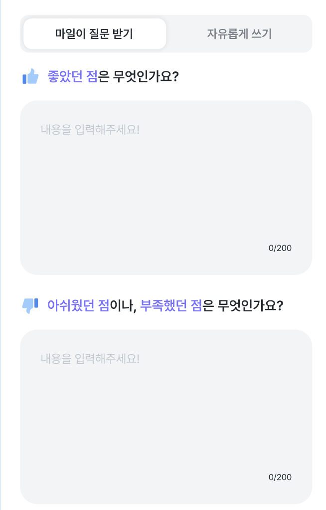

<!-- # RxSwift Input & Output -->

## 개요

MVVM 아키텍처 기반의 킥스타터 앱이 오픈소스로 열리게 되어 해당 앱의 소스코드를 살펴보며 뷰모델을 실제로 디자인해보려고 한다.

[RxSwift Sample App](https://github.com/khoren93/SwiftHub/tree/master#design)에 리스트업된 앱을 로컬에 설치한 뒤 빌드 후 직접 결과물을 테스트한다. 로컬에 세팅하는 과정은 리드미를 그대로 따라가면 된다.

```sh
cd SwiftHub
bundle install
bundle exec fastlane setup
```

## 뷰모델 디자인

아래 화면은 SwiftHub 앱의 이벤트 탭에 해당하는 뷰이다. 위 화면에서 사용자로부터 인풋으로 들어올 수 있는 대상을 표시하면 다음과 같다.



1. 헤더 & 푸터 리프레시
2. 세그먼트 컨트롤 탭
3. 셀 셀렉션 이벤트

이들을 각각 인풋 프로토콜 내에 옵저버블 혹은 드라이버 타입으로 정의해둔 뒤 nested 구조체 타입으로 클래스 내에 정의한다. **이때 각 뷰모델 클래스들은 기본 뷰모델 인풋과 아웃풋 각각을 associatedType으로 갖는 저장속성을 구현 대상으로 하여 프로토콜을 하나 채택해야 한다.**

해당 프로토콜은 아래와 같다. 인풋으로 들어온 대상들을 아웃풋으로 내보내게 되는데, 뷰의 변경사항들은 반드시 아웃풋 중첩 구조체 타입에만 접근해야 한다.

```swift
protocol ViewModelType {
    associatedtype Input
    associatedtype Output

    func transform(input: Input) -> Output
}
```

```swift
// 원래 코드에는 모든 뷰모델에 베이스가 되는 ViewModel 프로토콜이 작성되어 있지만, 예시에서는 제외
class EventViewModel: ViewModelType {
    struct Input {
        let headerRefresh: Observable<Void>
        let footerRefresh: Observable<Void>
        let segmentSelection: Observable<EventSegments>
        let selection: Driver<EventCellViewModel>
    }
}
```

뷰에서 뷰모델을 참조하여 화면에 바인딩해야할 데이터는 크게 다음과 같이 나타난다.



1. 깃헙 프로필 이미지 URL
2. 테이블뷰 셀에 바인딩할 배열 데이터
3. 그 외

실제 코드상에는 더 다양한 아웃풋 리스트들이 있다. 일단 기억할 것은 `imageUrl` 속성과 `items`정도가 된다.

`userSelected`와 `repositorySelected`의 경우 앱 기능에 특정적인 내용이므로 직접 실행해가며 이해하면 된다. userSelected는 셀 내의 프로필이미지 영역을 탭했을때 푸시되는 뷰이고, repositorySelected의 경우 그 외 영역을 탭했을때 나타나는 뷰이다. 푸시되는 뷰가 다르니 직접 확인하면 된다.

```swift
class EventViewModel: ViewModelType {
    struct Input {
        // ...
    }

    struct Output {
        let navigationTitle: Driver<String>
        let imageUrl: Driver<URL?>
        let items: BehaviorRelay<[EventCellViewModel]>
        let userSelected: Driver<UserViewModel>
        let repositorySelected: Driver<RepositoryViewModel>
        let hidesSegment: Driver<Bool>
    }
}
```

인풋과 아웃풋에 대한 정의가 끝났으면 인풋으로 들어온 이벤트를 적절히 데이터로 정제하여 뷰에 뿌려줘야 한다. 이 역할을 `transform` 함수가 한다.

위 예시 기준으로 리프레시 이벤트가 전달되었다고 가정하고 `transform` 함수 코드를 작성하면 다음과 같은 흐름으로 이루어진다.

1. `input` 파라미터를 구독한다.
2. API 요청 이후 반환된 데이터를 릴레이 객체에 accept로 전달한다.
3. 릴레이 객체는 **클래스 저장속성이 아닌 함수 내에서 변수로 선언한 뒤, 뷰 내에서만 사용하고 메모리에서 해제되도록 설계한다.**

```swift
func transform(input: Input) -> Output {
    let elements = BehaviorRelay<[데이터 모델]>(value: [])

    input.headerRefresh
        .flatMapLatest({ [weak self] () -> Observable<[EventCellViewModel]> in
            guard let self = self else { return Observable.just([]) }
            self.page = 1
            return APIRequest() // API 요청 후 [데이터모델] 반환
        })
        .subscribe(onNext: { (items) in
            elements.accept(items)
        }).disposed(by: rx.disposeBag)

    // ...
}
```

인풋을 통해 아웃풋에 담을 데이터 정의가 끝났다면, `Output` 중첩 타입 객체를 생성하여 리턴하며 함수를 종료한다.

```swift
func transform(input: Input) -> Output {
    let elements = BehaviorRelay<[데이터 모델]>(value: [])

    // Input을 통해 elements에 데이터 담기

    return Output(navigationTitle: .... , items: elements, ....)
}
```

이렇게 정의된 뷰모델을 뷰 컨트롤러에서 다루게 되는 흐름은 다음과 같다. 뷰모델 중첩타입 인풋에 접근하여 인스턴스를 생성, 뷰 컨트롤러 내의 뷰모델 바인딩 함수에서 `transform` 함수 호출에 대한 파라미터에 이를 전달한다.

아래 코드에서 `headerRefreshTrigger`, `segmentSelected` 등의 코드 역시 예제에 종속되는 코드이므로 직접 돌려가며 이해하면 된다.

```swift
func bindViewModel() {
    let refresh = Observable.of(Observable.just(()), headerRefreshTrigger, segmentSelected.mapToVoid().skip(1)).merge() // 리프레시 옵저버블 생성

    // 인풋객체 생성 후 변수에 할당
    let input = EventsViewModel.Input(headerRefresh: refresh,
                                        footerRefresh: footerRefreshTrigger,
                                        segmentSelection: segmentSelected,
                                        selection: tableView.rx.modelSelected(EventCellViewModel.self).asDriver())

    // 아웃풋객체 할당받은 후 본격적인 데이터바인딩 시작
    let output = viewModel.transform(input: input)

    // 바인딩할 대상은 여러개지만, 우선 예시로 테이블뷰 데이터들만 바인딩 진행
    output.items.asDriver(onErrorJustReturn: [])
        .drive(tableView.rx.items(cellIdentifier: reuseIdentifier, cellType: EventCell.self)) { tableView, viewModel, cell in
            cell.bind(to: viewModel)
        }.disposed(by: rx.disposeBag)
}
```

## 코드 리팩토링

현재 프로젝트에서 사용하는 뷰모델을 리팩토링하려고 한다. 화면은 다음과 같다.



현재 코드를 살펴보면 다음과 같다.

```swift
class CompletionViewModel: BindableViewModel {

    // MARK: BindableViewModel Properties
    var apiSession: APIService = APISession()

    var bag = DisposeBag()

    // MARK: - Output
    var goalResponse: Observable<Result<BaseModel<GoalResponse>, APIError>> {
        requestAllGoals(lastGoalId: -1, goalStatusParameter: .complete)
    }

    var enabledRetrospectCountResponse: Observable<Result<BaseModel<RetrospectCount>, APIError>> {
        requestEnabledRetrospectCount()
    }

    var goalData = BehaviorRelay<[ParentGoal]>(value: [])

    var goalDataCount = PublishRelay<Int>()
    var enabledRetrospectCount = BehaviorRelay<Int>(value: 0)
    let isTableviewUpdated = BehaviorRelay<Bool>(value: false)

    var isLoading = BehaviorRelay<Bool>(value: false)
    var presentModal = BehaviorRelay<Bool>(value: false)

    let retrospect = PublishRelay<Retrospect>()
    var lastPageId = -1
    var isLastPage = false

    deinit {
        bag = DisposeBag()
    }
}

extension CompletionViewModel {
    func retrieveGoalData() {
        isLoading.accept(true)

        goalResponse
            .subscribe(onNext: { [unowned self] result in
                switch result {
                case .success(let response):
                    self.goalData.accept(response.data.contents)
                    self.goalDataCount.accept(response.data.contents.count)
                    self.lastPageId = response.data.contents.last?.goalId ?? -1
                    self.isLoading.accept(false)
                    self.isTableviewUpdated.accept(true)
                case .failure(let error):
                    print(error)
                    self.isLoading.accept(false)
                }
            })
            .disposed(by: bag)
    }

    func retrieveGoalDataAtIndex(index: Int) -> ParentGoal {
        return goalData.value[index]
    }

    func retrieveRetrospectWithId(goalId: Int) {
        requestRetrospect(goalId: goalId)
            .subscribe(onNext: { [unowned self] result in
                switch result {
                case .success(let response):
                    self.retrospect.accept(response.data)
                case .failure(let error):
                    print(error)
                }
            })
            .disposed(by: bag)
    }

    func retrieveRetrospectCount() {
        enabledRetrospectCountResponse
            .subscribe(onNext: { [unowned self] result in
                switch result {
                case .success(let countResponse):
                    enabledRetrospectCount.accept(countResponse.data.count)

                    self.retrieveGoalData()

                case .failure(let error):
                    print(error)
                }
            })
            .disposed(by: bag)
    }

    /// 로딩 & lastPage 관련 로직도 추가 필요
    func retrieveMoreRetrospect() {
        isLoading.accept(true)
        requestAllGoals(lastGoalId: lastPageId, goalStatusParameter: .complete)
            .subscribe(onNext: { [unowned self] result in
                switch result {
                case .success(let response):
                    self.isLoading.accept(false)
                    var newData = self.goalData.value
                    newData.append(contentsOf: response.data.contents)
                    self.goalData.accept(newData)
                    self.isLastPage = !response.data.next
                    if !isLastPage {
                        self.lastPageId = response.data.contents.last?.goalId ?? -1
                    }
                case .failure:
                    self.isLoading.accept(false)
                }
            })
            .disposed(by: bag)
    }
}

/// input
extension CompletionViewModel {

    @discardableResult
    func saveRetrospect(goalId: Int, retrospect: Retrospect) -> Observable<Result<BaseModel<Int>, APIError>> {
        return postReview(higherLevelGoalId: goalId, retrospect: retrospect)
    }

    func handlingPostResponse(result: Result<BaseModel<Int>, APIError>) {
        switch result {
        case .success:
            isLoading.accept(false)
            self.presentModal.accept(true)
        case .failure(let error):
            isLoading.accept(false)
            print(error)
        }
    }
}
```

나름 인풋과 아웃풋을 역할에 따라 extension으로 구분하여 정의해두긴 했지만, 직관적이지가 않은 상황이다. 또한 문제는 뷰모델 클래스 인스턴스 자체에 저장속성을 마련하여 클래스 자체가 무거워진다는 단점도 있다.

`Input` & `Output` 프로토콜 정의 후 위 코드를 간단히 수정해보자.

## 리팩토링 1. 원시타입 데이터 바인딩

위 뷰의 인풋은 아래와 같이 정의된다.

1. 완료함 세그먼트 컨트롤 탭에 의해 뷰가 로드되는 시점
2. 테이블뷰 셀 버튼 클릭을 통해 다음 뷰로 푸시

세그먼트 컨트롤의 경우 주의할 점은, 현재 코드의 구성이 세그먼트 아래에 세 개의 서브 뷰컨트롤러를 관리하는 형태이므로 세그먼트 동작 자체를 뷰모델에 삽입하기에 까다로운 상태이다. 따라서 완료함 뷰 자체에 대해서만 인풋과 아웃풋을 정의해야 한다.

```swift
class RefactoredCompletionViewModel: ViewModelType, BindableViewModel {

    var bag = DisposeBag()
    var apiSession: APIService = APISession()

    struct Input {
        let viewDidAppear: Observable<Void>
    }

    struct Output {
        let retrospectCount: BehaviorRelay<Int>
    }

    func transform(input: Input) -> Output {
        // 카운트값 외에 테이블뷰 셀 바인딩을 위한 데이터 요청 로직은 테이블뷰 작성시 추가 예정
        let count = BehaviorRelay<Int>(value: 0)

        input.viewDidAppear
            .flatMapLatest { [unowned self] () -> Observable<Result<BaseModel<RetrospectCount>, APIError>> in
                return self.requestRetrospectCount()
            }
            .subscribe(onNext: {
                switch $0 {
                case .success(let response):
                    count.accept(response.data.count)
                case .failure:
                    count.accept(0)
                }
            })
            .disposed(by: bag)

        return Output(retrospectCount: count, items: elements)
    }

    // apiSession은
    func requestRetrospectCount() -> Observable<Result<BaseModel<RetrospectCount>, APIError>> {
        apiSession.request(.requestEnabledRetrospectCount)
    }

    deinit {
        bag = DisposeBag()
    }
}
```

1. 데이터 요청이 시작되는 트리거를 인풋으로 설정하여 옵저버블로 선언한다.
2. 뷰 컨트롤러에서 생성한 Input 객체를 파라미터로 전달받아 트리거 옵저버블을 구독한다.
3. API 요청후 flatMap 연산자로 데이터를 추출하고 릴레이 객체에 값으로 전달한다.
4. 아웃풋 리턴시 추출된 릴레이 객체를 속성에 담아주고 뷰 컨트롤러에서 해당 값을 바인딩하면 된다.

아래는 뷰 컨트롤러에서의 호출 과정이다.

```swift
// 클래스 내 저장속성 - 트리거 옵저버블
let viewDidAppearTrigger = PublishSubject<Void>()

override func viewDidAppear(_ animated: Bool) {
    super.viewDidAppear(animated)

    // viewDidAppear 트리거 후 next 전달
    viewDidAppearTrigger.onNext(())
}

func bindViewModel() {
    // viewDidAppear를 트리거 하여 API 호출이 이루어진다
    let input = RefactoredCompletionViewModel.Input(viewDidAppear: viewDidAppearTrigger, selection: tableView.rx.modelSelected(Retrospect.self).asDriver())

    let output = refactoredViewModel.transform(input: input)

    output.retrospectCount
        .map { count -> NSAttributedString in
            print("COUNT : \(count)")
            let stringValue = "총 \(count)개의 목표 회고를 작성할 수 있어요!"
            let attributedString: NSMutableAttributedString = NSMutableAttributedString(string: stringValue)
            attributedString.setColorForText(textForAttribute: "총 \(count)개의 목표 회고", withColor: .pointPurple)
            return attributedString
        }
        .bind(to: alertBox.label.rx.attributedText)
        .disposed(by: disposeBag)
}
```

## 리팩토링 2. 테이블뷰 바인딩 - 뷰 푸시를 하지 않을때

테이블뷰 내의 셀들에 데이터들을 바인딩해주는 방식을 정리한다. 레퍼런스 프로젝트의 경우 **각 셀에 해당하는 데이터들에 직접 데이터를 바인딩해주지 않고, 뷰모델 클래스를 따로 정의하여 뷰모델을 바인딩해주고 있다.**

아래 예제코드를 살펴보자.

```swift
output.items.asDriver(onErrorJustReturn: [])
    .drive(tableView.rx.items(cellIdentifier: reuseIdentifier, cellType: EventCell.self)) { tableView, viewModel, cell in
        cell.bind(to: viewModel)
    }.disposed(by: rx.disposeBag)
```

셀에 대한 뷰모델을 정의해두고, 뷰모델 객체 자체를 바인딩해주는 방식으로 코드를 구현하게 된다. 이렇게 되면 테이블 뷰를 부착하는 컨트롤러가 비대해지지 않고 셀에 대한 UI 바인딩 로직이 셀 클래스로 분리된다.



셀이 위와같은 UI로 구성되어 있을때 뷰모델을 정의하면 다음과 같게 된다.

```swift
class CompletionTableViewCellViewModel {
    let title = BehaviorRelay<String>(value: "")
    let startDate = BehaviorRelay<String>(value: "")
    let endDate = BehaviorRelay<String>(value: "")
    let reward = BehaviorRelay<String>(value: "")
    let hasRetrospect = BehaviorRelay<Bool>(value: false)

    let parentGoalSelected = PublishSubject<ParentGoal>()

    init(with parentGoal: ParentGoal) {
        title.accept(parentGoal.title)
        startDate.accept(parentGoal.startDate)
        endDate.accept(parentGoal.endDate)
        reward.accept(parentGoal.reward ?? "")
        hasRetrospect.accept(parentGoal.hasRetrospect)
    }
}
```

1. `title`: 셀 타이틀
2. `startDate` & `endDate`: 시작일자, 종료일자
3. `reward`: 다이아 이미지
4. `hasRetrospect`: 회고 작성 여부에 따른 버튼 스타일 분기

셀 생성자 함수를 구현하여 인스턴스 생성과 동시에 데이터 바인딩을 바로 진행하게 된다.

뷰모델 클래스 정의는 이루어졌으니, 뷰모델 객체를 셀에 바인딩하는 로직을 작성하면 된다. `UITableViewCell` 클래스 내에 커스텀 함수로 `bind(to: 셀 뷰모델)`를 새롭게 정의한다.

```swift
class CompletionTableViewCell: BaseTableViewCell {
    func bind(to viewModel: CompletionTableViewCellViewModel) {
        viewModel.title.asDriver().drive(label.rx.text).disposed(by: disposeBag) // 레이블 바인딩

        // 셀 내의 각종 UI요소 바인딩
    }
}
```

바인딩 로직을 작성했으니, 위의 함수를 적절한 타이밍에 호출만 하면 된다. 현재 API요청은 회고 작성가능 수에 대해서만 이루어지고 있다. `viewDidAppear`시점에 테이블뷰 셀에 바인딩할 `items` 배열 데이터를 아웃풋으로 내보내야 한다.

이때 주의할점은 Output 객체의 `items`속성 타입은 실제 모델 클래스를 참조하지 않고 **데이터를 바인딩할 뷰모델 클래스를 참조한다는 것이다.**

중첩타입 `Output` 구조체의 `items`속성 타입을 테이블뷰 셀 클래스의 뷰모델로 지정한 것을 볼 수 있다.

```swift
struct Output {
    let retrospectCount: BehaviorRelay<Int>
    let items: BehaviorRelay<[CompletionTableViewCellViewModel]>
}
```

컨트롤러에서 output객체를 생성한 뒤 `tableView.rx.items` 메서드로 바인딩을 진행한다.

```swift
output.items.asDriver(onErrorJustReturn: [])
    .drive(tableView.rx.items(cellIdentifier: CompletionTableViewCell.identifier, cellType: CompletionTableViewCell.self)) { row, viewModel, cell in
        cell.bind(to: viewModel)
    }
    .disposed(by: disposeBag)
```

어떤 셀에 바인딩할지 셀 클래스에 대한 메타 데이터들을 `items` 메서드에 전달하고 클로저 파라미터로 전달되는 `items` 속성의 각 원소를 셀에 바인딩해주면 된다.

위와 같이 코드를 작성하면 `bind` 메서드가 자동적으로 호출되며 데이터가 셀 내에 바인딩된다.

## 리팩토링 2-1. Single Trait 활용

기존 코드에서 API 요청을 할때는 아래와 같이 프로토콜을 정의하여 함수를 구현했다.

```swift
protocol APIService {
    func request<T: Codable> (_ request: APIRouter) -> Observable<Result<T, APIError>>
}
```

옵저버블에 `Result`타입을 결합하여 구독시 switch-case 분기처리를 통해 **onNext** 이벤트로 전달된 데이터임에도 해당 클로저에서 에러를 처리해야만 했다. 이러한 코드 구성은 에러 처리에 직관성을 떨어트린다.

참고한 예시 프로젝트에서는 API 요청에 대한 응답 타입을 Rx의 `Single` Trait을 활용하는 것을 볼 수 있었다. 한개의 에러 혹은 정상값을 반환하기때문에 switch-case 분기처리 없이 `onError`에서 에러처리를 하면 된다.

기존 APISession 객체의 `request` 함수의 구현부를 살펴보면 다음과 같다.

```swift
func request<T: Codable> (_ request: APIRouter) -> Observable<Result<T, APIError>> {
    return Observable<Result<T, APIError>>.create { observer in
        let request = API.session.request(request, interceptor: APIInterceptor()).responseDecodable { (response: DataResponse<T, AFError>) in

            guard let statusCode = response.response?.statusCode else {
                observer.onNext(.failure(.unknown))
                return
            }

            guard (200 ... 399).contains(statusCode) else {
                observer.onNext(.failure(.http(status: statusCode)))
                return
            }

            guard let decoded = response.data?.decode(T.self) else {
                observer.onNext(.failure(.decode))
                return
            }

            observer.onNext(.success(decoded))
            observer.onCompleted()
        }

        return Disposables.create {
            request.cancel()
        }
    }
}
```

형태 자체는 `Single` Trait을 활용한 리팩토링 이후와 양식이 거의 유사하다. 달라지는 점은 에러 전달형태 및 함수 리턴타입에만 있다.

```swift
func requestSingle<T: Codable> (_ request: APIRouter) -> Single<T> {
    return Single<T>.create { observer -> Disposable in
        let request = API.session.request(request, interceptor: APIInterceptor()).responseDecodable { (response: DataResponse<T, AFError>) in
            guard let statusCode = response.response?.statusCode else {
                observer(.failure(APIError.unknown))
                return
            }

            guard (200 ... 399).contains(statusCode) else {
                observer(.failure(APIError.http(status: statusCode)))
                return
            }

            guard let decoded = response.data?.decode(T.self) else {
                observer(.failure(APIError.decode))
                return
            }

            observer(.success(decoded))
            return
        }

        return Disposables.create {
            request.cancel()
        }
    }
}
```

`Single` Trait의 Success로 반환되는 타입을 제네릭으로 선언하여 리턴하면 되고, 에러 전달시에는 기존 `request` 함수에서 `Result` 타입의 `failure`케이스처럼 명시적으로 에러 타입을 지정해놓지 않은 상황이기 때문에 타입 추론이 불가능하다.

따라서 `observer(.failure(APIError.어떤에러))`와 같이 `Error` 프로토콜을 채택한 에러 객체만 전달하면 된다.

API 요청에 대한 제네릭 함수 수정 후 실제 라우터 전달과 함께 특정 API에 요청을 보내는 함수를 정의한다. 아래는 기존 코드이다.

```swift
func requestRetrospects() -> Observable<Result<BaseModel<GoalResponse>, APIError>> {
    apiSession.request(.requestAllGoals(lastGoalId: -1, goalStatus: .complete))
}
```

APISession 객체의 리턴 타입이 `Result` 타입을 래핑한 옵저버블이었으므로 함수 리턴타입도 동일하게 Result를 래핑한 옵저버블이 된다.

해당 코드를 수정하면 아래와 같다.

```swift
 func requestRetrospectsSingle() -> Observable<[CompletionTableViewCellViewModel]> {
    var request: Single<BaseModel<GoalResponse>> = apiSession.requestSingle(.requestAllGoals(lastGoalId: -1, goalStatus: .complete))

    return request.map {
        $0.data.contents.map { [unowned self] parentGoal -> CompletionTableViewCellViewModel in
            let viewModel = CompletionTableViewCellViewModel(with: parentGoal)
            viewModel.parentGoalSelected.bind(to: self.parentGoalSelected)
                .disposed(by: self.bag)
            return viewModel
        }
    }.asObservable()
}
```

APISession의 요청 리턴값을 함수 내에 잠시 저장해두고, 적절한 정제 이후 해당 요청을 리턴하게 된다. 정제 과정은 다음과 같다.

1. Single Trait으로 리턴된 변수 저장
2. 테이블뷰 셀들을 위한 데이터를 요청하는 것이므로, 기본적으로 Single Trait의 디코딩 데이터는 배열이다.
3. 배열을 map으로 순회하며 각 요소를 뷰모델 객체로 변환한다.
4. 생성된 뷰모델 배열 객체를 기존 Single에서 옵저버블에 새롭게 담아 리턴한다.
5. 인풋 트리거 옵저버블에 next 이벤트가 방출되면 데이터 바인딩을 진행하고, 에러 발생시 기존에는 switch-case로 `failure` 분기처리를 했다면 Single에서는 `onError`에서 에러처리를 하면된다
   .

```swift
input.viewDidAppear
    .flatMapLatest { [unowned self] () -> Observable<[CompletionTableViewCellViewModel]> in
        return self.requestRetrospectsSingle()
    }
    .subscribe(onNext: { // Single Trait 에러처리는 onError에서!
        elements.accept($0)
    }, onError: {
        // 에러처리
    })
    .disposed(by: bag)
```

## 리팩토링 3. 테이블뷰 바인딩 - 뷰를 푸시할때

위와 같이 테이블뷰 데이터를 바인딩하면 UI구성은 완료된다. 셀 탭후 선택된 셀이 가지고 있던 데이터들을 기반으로 새로운 뷰를 푸시해야 하는 경우도 있는데, 기존 코드에서 구현했던 방식은 셀의 인덱스값을 기준으로 각각의 셀 데이터를 루트 뷰모델에서 한번 더 요청하는 방법으로 구현했다.

이렇게 되면 루트 뷰모델의 크기가 방대해지고, 관리할 옵저버블도 많아져 메모리상 문제가 발생할 가능성이 높다. 따라서 각 셀에 대입할 데이터 뷰모델을 따로 정의해야 하며 뷰 푸시와 데이터바인딩 타이밍을 이해하고 있는 것이 중요하다.

먼저 셀의 탭은 루트 뷰모델의 `Input`에 속한다. 위의 예시에서는 `viewDidAppear`시점을 트리거하기 위한 인풋만 정의해두었는데, 셀 탭에 대한 인풋을 새롭게 정의하면 된다.

```swift
struct Input {
    let viewDidAppear: Observable<Void>
    let selection: Driver<CompletionTableViewCellViewModel> // 테이블뷰 셀렉션 트리거 - 뷰모델 정의
}
```

해당 인풋의 트리거는 뷰 컨트롤러에서 인풋 객체를 생성할때 `modelSelected` 옵저버블을 `asDriver`로 변환하여 생성자 함수 내에서 할당한다.

```swift
// 프로젝트에 사용한 코드
func bindViewModel() {
    // 테이블뷰 modelSelected
    let input = RefactoredCompletionViewModel.Input(viewDidAppear: viewDidAppearTrigger, selection: tableView.rx.modelSelected(CompletionTableViewCellViewModel.self).asDriver())

    let output = refactoredViewModel.transform(input: input)
    // ...
}
```

:::tip modelSelected vs items

테이블뷰의 `modelSelected`를 사용하는 이유는 셀을 표현하는 데이터를 **객체로** 받아 다음 뷰에 전달하기 위함이다. 데이터를 **UI상에 바인딩할때는** `items`메서드를 쓰는게 맞는데, 반대로 선택된 테이블뷰로부터 **데이터를 객체로 반환받을때는** `modelSelected`를 사용하는 것이다.

:::

지금까지의 흐름을 정리하면 다음과 같다.

1. 루트 뷰모델에 셀 탭에 대한 드라이버를 Input에 정의한다. 반환 타입은 셀에 바인딩할 클래스를 사용한다. (셀 뷰모델)
2. 뷰 컨트롤러에서 인풋객체 생성시 Input 생성자 함수 파라미터에 테이블뷰의 `modelSelected`반환 옵저버블 객체를 `asDriver`로 변환하여 전달한다.

모델 객체가 인풋으로 뷰모델에 들어온 상황이므로 이를 적절히 변환하여 Output으로 내보낸다. 예제코드의 경우 아래와 같이 `userSelected`, `repositorySelected`가 드라이버에 담겨 사용된다.

```swift
struct Output {
    let navigationTitle: Driver<String>
    let imageUrl: Driver<URL?>
    let items: BehaviorRelay<[EventCellViewModel]>
    let userSelected: Driver<UserViewModel>
    let repositorySelected: Driver<RepositoryViewModel>
    let hidesSegment: Driver<Bool>
}
```

여기서 필요한건 새로 푸시되는 화면에 대한 뷰모델이다. 현재 리팩토링중이던 프로젝트의 경우 뷰모델 안에 셀들에 대한 데이터들도 한꺼번에 관리하고 있다.

```swift
func retrieveGoalDataAtIndex(index: Int) -> ParentGoal {
    return goalData.value[index]
}
```

뷰모델 클래스 내에 위와 같은 함수를 두고 인덱싱을 하여 구현을 하고 있었는데, 이러면 인덱스 관리에 대한 로직이 뷰 컨트롤러 내에 추가되어야 한다. 인덱싱은 `modelSelected`로 내부적인 구현이 되어있기 때문에 신경쓸 필요가 없다.

`modelSelected` 드라이버로 들어온 인풋으로부터 데이터를 추출한 뒤, 이를 새로 푸시될 뷰에 전달해야 한다. 이러한 작업이 `Output` 내에 정의된다.

1. input으로 테이블뷰 셀 모델 데이터를 뷰모델에서 구독하여 받아온다.
2. transform 함수에서 데이터 추출 후 Output으로 반환한다.
3. 해당 객체를 Output 생성자 함수에 전달 후 리턴한다.

정의된 `Input`과 `Output`을 보자.

```swift
struct Input {
    // 나머지
    let selection: Driver<CompletionTableViewCellViewModel> // 테이블뷰 셀렉션 트리거 - 뷰모델 정의
}

struct Output {
    // 나머지
    let parentGoalSelected: Driver<CompletionReviewViewModel> // 아웃풋으로 내보낼 뷰모델 타입
}
```

위의 코드를 기반으로 한 `transform` 함수를 살펴보자.

```swift
func transform(input: Input) -> Output {
    // retrospectCount, items는 생략

    let parentGoalDetail = input.selection.map { completionCell -> CompletionReviewViewModel in
        let viewModel = CompletionReviewViewModel(parentGoal: completionCell.parentGoal)
        return viewModel
    }

    return Output(retrospectCount: count, items: elements, parentGoalSelected: parentGoalDetail)
}
```

기존의 테이블뷰 셀 뷰모델에서 뷰 바인딩에 대한 옵저버블 객체들을 제외하고 실제 모델을 기반으로 한 데이터들을 쉽게 추출하기 위해 셀 내에 저장속성으로 데이터를 할당하고 있어야 한다.

위의 `input.selection.map` 클로저에서 `completionCell` 파라미터 타입이 아래와 같아야 한다는 것이다.

```swift
class CompletionTableViewCellViewModel {
    // UI 바인딩을 위한 Relay 객체들 ..
    let parentGoal: ParentGoal // 실제 데이터

    init(with parentGoal: ParentGoal) {
        self.parentGoal = parentGoal

        // UI 바인딩..
    }
}
```

뷰모델 객체 생성시 실제 모델데이터에 대해 의존성을 뷰모델에 주입하는 방식으로 `Output`의 옵저버블 객체를 생성한다.

최종적으로 뷰 컨트롤러에서는 아래와 같은 코드가 작성된다.

```swift
output.parentGoalSelected
    .drive(onNext: { [unowned self] in
        if !$0.parentGoal.hasRetrospect {
        } else {
        }
    })
    .disposed(by: disposeBag)
```

위의 코드는 셀에 바인딩되는 데이터가 회고가 작성되어야 한다면 회고를 작성할 텍스트필드들이 있도록 뷰를 구성하여 푸시하고, 그게 아니라면 조회하는 뷰를 푸시하는 코드이다.

이때 리팩토링 이전의 코드에서는 단순히 뷰 컨트롤러 객체를 생성하고, 직접 해당 뷰 컨트롤러 저장속성에 접근하여 뷰모델 저장속성을 할당하는 방식으로 구현했었다.

```swift
if !$0.parentGoal.hasRetrospect {
    let VC = MyViewController()
    VC.viewModel = MyViewModel()

    self.pushViewController(VC)
} else {
    // ..
}
```

위와 같은 코드가 아닌 의존성 주입 형태로 코드를 리팩토링 해보려고 한다. 대략 아래와 같은 형태로 코드가 수정된다.

```swift
if !$0.parentGoal.hasRetrospect {
    let VC = MyViewController(viewModel: MyViewModel())

    self.pushViewController(VC)
} else {
    // ..
}
```

위와 같이 의존성 주입 방식을 택하는 이유는 Mock 뷰모델을 생성하여 테스트에 용이성을 더하기 위함이다. 추후 테스트코드에 대한 문서도 작성해보려고 한다.
우선 의존성 주입의 형태로 코드를 리팩토링 해보자.

## 리팩토링 4. 뷰모델을 뷰에 주입

예제 코드에서 베이스가 되는 뷰 컨트롤러에는 생성자 함수가 구현되어 있다.

```swift
class ViewController: UIViewController, Navigatable {

    var viewModel: ViewModel?
    var navigator: Navigator! // 스토리보드 기반의 네비게이터 객체

    init(viewModel: ViewModel?, navigator: Navigator) {
        self.viewModel = viewModel
        self.navigator = navigator
        super.init(nibName: nil, bundle: nil)
    }

    // ...
}
```

현재 코드에는 베이스 뷰모델 클래스가 따로 정의되어 있지만 현재 프로젝트에는 따로 구현되어 있지 않기 때문에 뷰컨트롤러 클래스마다 직접 생성자 함수를 구현해주도록 하겠다.

예를 들어 아래와 같은 뷰를 푸시하기 위해 클래스를 정의한다고 생각해보자. 기존 코드 역시 `BaseViewController`를 상속받는 형태이기 때문에



```swift
class 회고VC: BaseViewController {
    // MARK: Subviews
    var viewModel: 회고뷰모델

    override init(viewModel: MyViewModel) {
        self.viewModel = viewModel

        super.init()
    }

    // 필수생성자 재정의
    required init?(coder: NSCoder) {
        fatalError("init(coder:) has not been implemented")
    }
}
```

:::warning required 생성자

기본적으로 뷰 컨트롤러를 상속할때는 필수생성자 `init(coder: NSCoder)`를 오버라이딩 해야한다. 필수생성자를 가진 클래스를 상속할때 반드시 하위 클래스에서 재정의 해야한다.

:::

실제로 테이블뷰 셀 탭을 통해 다음 뷰를 푸시할때 뷰모델을 주입하는 형태로 코드를 작성하면 아래와 같아진다.

```swift
output.parentGoalSelected
    .drive(onNext: { [unowned self] in
        if !$0.parentGoal.hasRetrospect {
            // 리뷰
            let retrospectVC = RefactoredCompletionReviewViewController(vm: CompletionReviewViewModel(parentGoal: $0.parentGoal))
            self.push(viewController: retrospectVC)
        } else {
            // 조회 관련 로직
        }
    })
    .disposed(by: disposeBag)
```

`parentGoalSelected`는 테이블뷰의 `modelSelected` 인풋에 대한 transform 결과물이므로, 셀 탭을 통해 자동으로 드라이브된다.

`transform`내에서 뷰모델 객체를 생성하여 next 이벤트로 방출하기 때문에 다음 뷰에서 사용할 뷰모델을 주입할 수 있게 되는 것이다.

## Reference

1. [RxSwift + MVVM: how to feed ViewModels](https://medium.com/blablacar/rxswift-mvvm-66827b8b3f10)
2. [Dealing with Massive View Models using MVVM on iOS](https://medium.com/etermax-technology/dealing-with-massive-view-models-using-mvvm-on-ios-74b2697557ce)
3. [iOS Swift : MVVM/RxSwift Unit Testing](https://medium.com/@saad-eloulladi/ios-swift-mvvm-rxswift-unit-testing-b71183ecaf44)
4. [RxSwift Unit Testing Explained in 2 Minutes](https://betterprogramming.pub/rxswift-unit-testing-explained-in-3-minutes-c024b7a26d)
5. [kickstarter/ios-oss: Kickstarter for iOS. Bring new ideas to life, anywhere.](https://github.com/kickstarter/ios-oss)
6. [SwiftHub](https://github.com/khoren93/SwiftHub/tree/master#design)
