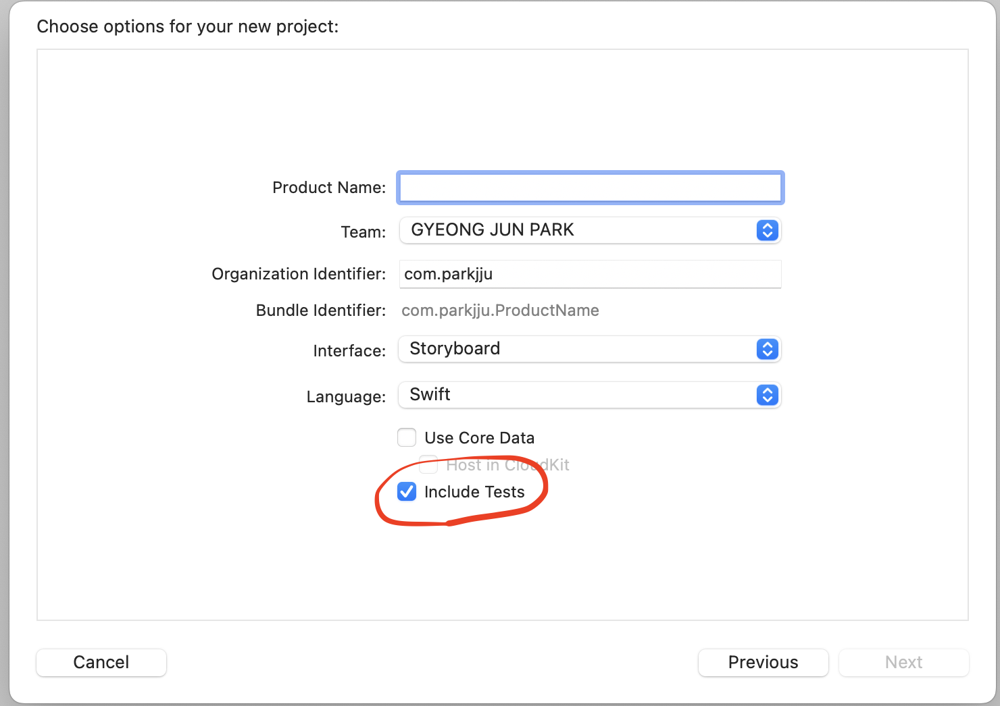
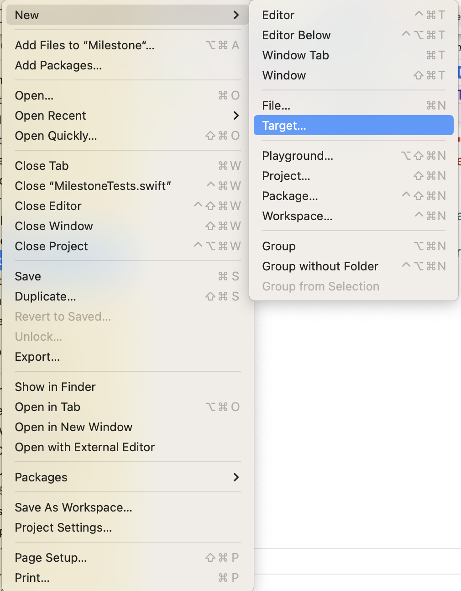
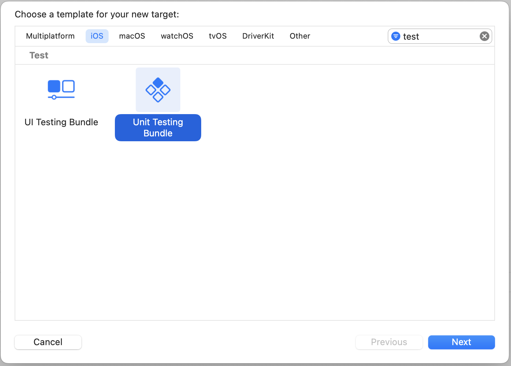
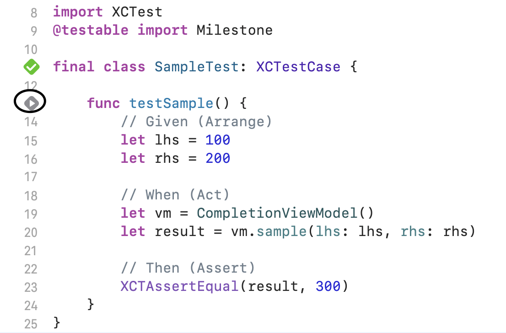
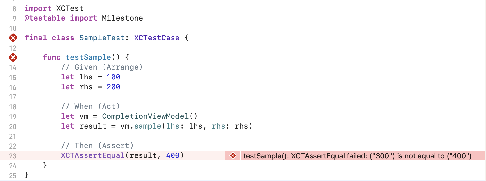
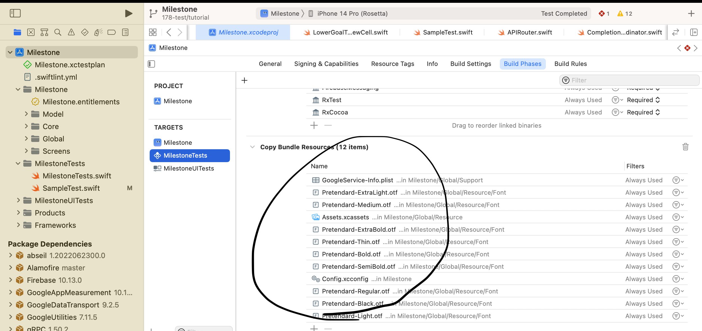
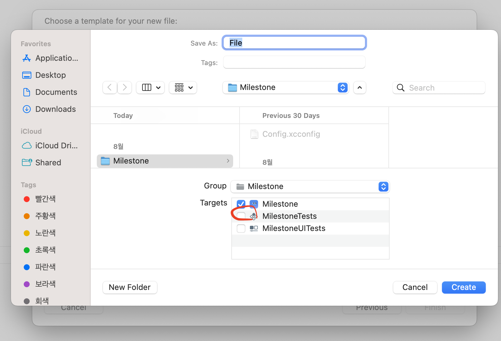
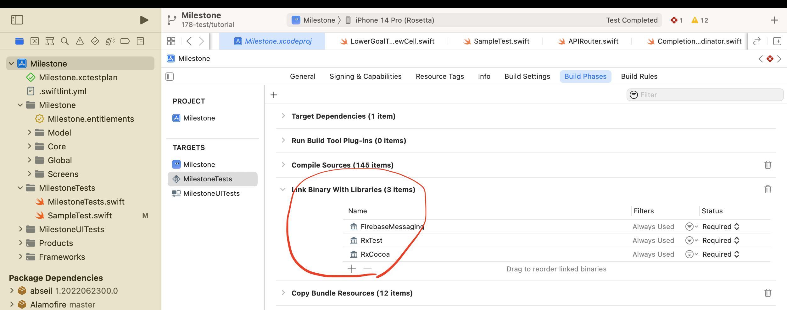

# RxSwift 유닛 테스트

`RxSwift` 기반 코드에서 테스트 코드를 작성하는 방법에 대해 정리합니다.

## 개요

MVC에서 MVVM으로의 아키텍처 전환 시 챙길 수 있는 이점으로 테스트가 쉬워진다는 점은 유명하다. 실제로 적용해본 적이 없을 뿐.. MVVM 아키텍처를 택한 이유에 대해 좀 더 설득력있는 근거가 스스로에게 필요하여 관련 내용들을 정리하고 실제로 적용해보려고 한다. 비즈니스 로직에 대한 테스트 코드를 먼저 작성하고, 이후 UI 테스트까지 작성해볼 수 있으면 시도해보려고 한다!

본격적인 테스트코드 작성에 앞서 [다음 영상](https://www.youtube.com/watch?v=opkU2UuPk0A&t=431s)을 보고 오는 것을 추천한다. 유닛테스트에 대한 기본적인 개념을 잘 설명해주는 영상이다.

유닛 테스트는 특정 함수에 대해 원하는 대로 동작하고 있는 지를 테스트하는 방법론이라고 생각하면 된다. 예컨대 Int형 파라미터 둘을 받아 값을 더하여 반환하는 함수를 작성했다고 가정해보자.

```swift
func add(lhs: Int, rhs: Int) -> Int {
    return lhs + rhs
}
```

`add` 함수에 1, 2를 전달하고 난 결과값은 3으로 나오는 것이 정상적인 상태이다. 만약 내부적인 문제로 인해 결과값이 4가 반환되었다고 가정하면 테스트에 통과하지 못한 것이고 해당 부분을 살펴보면 된다.

## 테스트환경 구축

테스트환경 구축을 위해서는 직접 테스트 타겟 멤버십을 생성하거나 프로젝트 생성 단계에서 `include Tests`를 체크해주면 된다.

<figure style="display:flex; align-items:center; flex-direction:column">

<figcaption style="font-size:1rem; color:grey; font-weight:bold; margin-top:0.8rem; margin-bottom:1rem;">Include Tests 체크</figcaption>
</figure>

<figure style="display:flex; align-items:center; flex-direction:column">

<figcaption style="font-size:1rem; color:grey; font-weight:bold; margin-top:0.8rem; margin-bottom:1rem;">타겟 멤버십 생성 1</figcaption>
</figure>

<figure style="display:flex; align-items:center; flex-direction:column">

<figcaption style="font-size:1rem; color:grey; font-weight:bold; margin-top:0.8rem; margin-bottom:1rem;">타겟 멤버십 생성 2</figcaption>
</figure>

:::warning 테스트 파일 생성시 주의

위에 링크해둔 영상에도 나오지만 테스트파일 생성 시 타겟 멤버십에서 메인 앱은 체크를 해제해줘야 한다. (기본적으로 해제되어 있음)

:::

유닛 테스트 번들이 생성되면 기본적으로 제공하는 보일러플레이트는 다음과 같다.

```swift
import XCTest

@testable import 앱이름

final class 앱이름Tests: XCTestCase {
    override func setUpWithError() throws { }
    override func tearDownWithError() throws { }
    func testExample() throws { }
    func testPerformanceExample() throws { }
}
```

기본적인 함수 몇 가지가 추가된다.

1. `setUpWithError`: 테스트케이스마다 각 테스트가 동일한 상태에서 시작될 수 있도록 초기화하는 코드들을 작성 (디스포즈백 초기화 등)
2. `tearDownWithError`: 테스트케이스 종료 시 호출되는 함수
3. `testExample`: 예시로 생성되는 기본 테스트 함수. 네이밍 시 한글로 작성하기도 한다.
4. `testPerformanceExample`: 성능테스트를 위한 함수. 기본 생성함수이므로 textExample과 함께 지워도 무방

아주 간단한 예시로 프로젝트 뷰 컨트롤러 내에 다음과 같은 함수를 정의한다.

```swift
class MyVC {
    // ..
    func sample(lhs: Int, rhs: Int) -> Int {
        return lhs + rhs
    }
    // ..
}
```

이후 테스트파일로 돌아와 해당 함수에 대한 테스트를 진행한다.

```swift
import XCTest
@testable import 앱이름

final class SampleTest: XCTestCase {

    func testSample() {
        // Given (Arrange)
        let lhs = 100
        let rhs = 200

        // When (Act)
        let vc = MyVC()
        let result = vc.sample(lhs, rhs)

        // Then (Assert)
        XCTAssertEqual(result, 300)
    }
}
```

:::tip 옵셔널 타입으로 선언하기

테스트 대상을 `XCTestCase` 클래스 내에 옵셔널 프로퍼티로 선언하면 `setupWithError`와 `tearDownWithError`에서 초기화하기 용이하다. 셋업 단계에서 값을 초기화해주고 해제 시점에 nil값으로 초기화해주면 테스트케이스 간 값의 충돌 문제를 해결할 수 있다.

:::

테스트는 크게 세 가지 구조로 이루어진다.

1. Given(Arrange) - 값의 인풋에 대한 정의
2. When(Act) - 인풋을 투입시킨 뒤 동작을 진행
3. Then(Assert) - 동작의 결과가 어떻게 될 것이라는 예측

이러한 구조 내에서 위의 테스트코드를 이해해보면 다음과 같은 흐름으로 이해할 수 있다.

1. 덧셈 연산에 필요한 피연산자 둘을 마련
2. 뷰컨트롤러 생성 후 덧셈연산 함수를 호출
3. 인풋 100, 200의 덧셈 결과는 300으로 예상되므로, 연산의 결과가 300일 것이라는 주장을 한다.

함수 작성 후 xcode에서 다음 사진에 나타난 버튼을 탭하면 테스트가 시작된다.



정상적으로 테스트가 진행되고 나면 회색 재생버튼이 초록색으로 바뀐다. 만약 테스트에 실패하게 되는 경우 경고창이 나타난다.



## 비동기함수 테스트

```swift
func test_makeRandomValue호출시_randomValue를_잘설정해주는지() {
    // given
    let promise = expectation(description: "It makes random value") // expectation
    sut.randomValue = 50 // 기본값이 0~30에 포함되면 무조건 테스트에 통과하므로 범위에서 벗어난 값을 할당

    // when
    sut.makeRandomValue {
        // then
        XCTAssertGreaterThanOrEqual(self.sut.randomValue, 0)
        XCTAssertLessThanOrEqual(self.sut.randomValue, 30)
        promise.fulfill() // fulfill
    }

    wait(for: [promise], timeout: 10) // wait
}
```

비동기함수는 `expectation`, `fulfill`, `wait` 세 가지 메서드를 활용한다.

1. expectation(description:): 어떤 것이 수행되어야 하는지를 description으로 정해줍니다.
2. fulfill(): 정의해둔 expectation이 충족되는 시점에 호출하여 동작을 수행했음을 알립니다.
3. wait(for:timeout:): expectation을 배열로 담아 전달하여 배열 속의 expectation이 모두 fulfill 될 때까지 기다립니다. timeout을 설정하여 시간을 제한할 수 있습니다.

## 테스트 환경 구축 이슈

1. [Multiple commands produce](#1-multiple-commands-produce) - [링크](https://zetal.tistory.com/entry/Multiple-commands-produce-Error-%ED%95%B4%EA%B2%B0%EB%B2%95)
2. [module not found & did you forget to declare 이슈](#2-module-not-found--did-you-forget-to-declare-이슈)
3. [xcode missing required module 라이브러리 링크 관련 이슈](#3-xcode-missing-required-module)

### 1. Multiple commands produce

위 이슈는 프로젝트 멤버십 간에 빌드될 때에 파일명이 중복되어 발생한 에러이다. 에러가 발생한 파일을 테스트 멤버십 내의 `Copy Bundle Resources` 리스트에서 제거해줌으로써 해결하였다.



### 2. Module not found & did you forget to declare 이슈

`did you forget to ..` 경고문구는 초기 프로젝트 세팅 시 `info.plist`파일 위치와 관련된 이슈로 종종 등장한다. 여기서는 `Module not found` 에러와 동일하게 처리 가능하다.

메인 앱 내에서 파일을 생성할때 타겟 멤버십을 설정하게 되는데, 여기서 체크되지 않은 채로 파일을 생성하면 테스트파일 내에서 `@testable import 앱`을 해도 파일을 인식하지 못하게 된다. 파일 생성시 이러한 점에 주의하도록 하자!



이미 생성된 파일의 경우에도 테스트 멤버십에 대해 체크되어 있지 않은지 확인해보자.

### 3. xcode missing required module

해당 이슈는 테스트 타겟 멤버십 내에 라이브러리를 추가해주지 않아서 발생한 이슈이다. 빌드 과정에서 경고창에 누락되었다고 알려주는 라이브러리를 추가하면 된다.



:::tip 테스트 코드 작성에 앞서

TDD를 도입하게 되면 필연적으로 빌드 시간이 늘어날 수 밖에 없다. TDD는 실패-성공-개선의 단계로 코드 작성이 이루어지기 때문에 앱 규모가 커질수록 빌드 (횟수)시간이 늘어나고 이는 작업의 효율을 해치게 된다.

따라서 염두해야 할 점으로는 코드를 병렬처리 해야 한다는 것이다.

-   `private`을 기본 접근제한자로 사용 -> 객체 간 의존성 고려
-   앱 모듈화 후 해당 모듈만 테스트

:::

TDD는 입출력 스펙에 대한 이해를 공유하는 것이 중요하다. RxSwift 기반으로 뷰모델을 작성할때 필히 인풋과 아웃풋, 변환에 대한 로직을 갖는 클래스로 작성해야 하는 이유가 여기서 나타난다.

:::tip TDD 과정

TDD는 만들어진 코드를 테스트하는 방법론이 아니다. 함수 골격을 작성하고, 테스트에 통과하지 못한 케이스들을 생성해가며 코드를 계속해서 개선해가는 과정인 것이다.

아래와 같은 함수가 있다.

```swift
func add(lhs: Int, rhs: Int) {
    return 0
}
```

위 함수는 `XCTAssertEqual(result, 0)`이라는 테스트에서는 통과하겠지만, 그 외의 값들에서는 전부 실패할 것이다. 이를 개선하여 코드를 아래와 같이 수정하게 된다.

```swift
func add(lhs: Int, rhs: Int) {
    return lhs + rhs
}
```

이러한 형태로 점차 코드를 개선해가는 과정이 바로 TDD 방법론이다.

:::

## 네트워크 통신 목업

테스트에서 주로 검증해야할 대상은 바로 네트워크 통신의 결과물이다. 하지만 테스트코드의 경우 **외부 환경에 의존하지 않아야 된다는 점이 중요하다.** 예컨대 네트워크 통신의 경우 문자 그대로 네트워크라는 외부 환경에 의존하며 서버 프로덕션 환경을 오염시킬 수 있다는 문제가 있다.

기존 네트워크 통신 과정에서는 `URLSession`으로 시작되어 실제 통신이 이루어지지만 테스트 환경에서는 목업 데이터를 가짜 `URLSession`객체에 전달하여 데이터 통신이 이루어졌다고 인식하도록 한다.

위의 가짜 `URLSession`와 같은 이들을 통해 테스트가 어려운 상황에서도 진행 가능하도록 도움을 주는 객체들을 **테스트 더블**이라고 한다. 테스트 더블의 종류들은 다음과 같은 것들이 있다.

1. Dummy - 인스턴스화된 객체 (데이터 전달을 위해 사용)
2. Stub - 실제 코드를 대신해서 동작해주는 객체
3. Fake - 실제 로직처럼 보이지만 실제 앱의 동작에서는 적합하지 않은 객체
4. Spy - Stub의 역할을 가지면서 중간 과정에서의 약간의 정보들을 기록하는 객체
5. Mock - 실제 객체와 가장 비슷하게 구현된 수준의 객체 (행위들에 대한 시나리오를 만들고 시나리오대로 동작했는 지에 대한 여부를 검사)

## Reference

1. [Medium - iOS Swift : MVVM/RxSwift Unit Testing](https://medium.com/@saad-eloulladi/ios-swift-mvvm-rxswift-unit-testing-b71183ecaf44)
2. [Medium - RxSwift Unit Testing Explained in 2 Minutes](https://betterprogramming.pub/rxswift-unit-testing-explained-in-3-minutes-c024b7a26d)
3. [Medium - 설마 아직도 테스트 코드를 작성 안 하시나요?](https://ssowonny.medium.com/%EC%84%A4%EB%A7%88-%EC%95%84%EC%A7%81%EB%8F%84-%ED%85%8C%EC%8A%A4%ED%8A%B8-%EC%BD%94%EB%93%9C%EB%A5%BC-%EC%9E%91%EC%84%B1-%EC%95%88-%ED%95%98%EC%8B%9C%EB%82%98%EC%9A%94-b54ec61ef91a)
4. [Sean Allen - Intro to Unit Testing in Swift](https://www.youtube.com/watch?v=opkU2UuPk0A&t=431s)
5. [SyncSwift 2022 - 당신이 TDD를 시도했다가 포기해봤다면](https://www.youtube.com/watch?v=HFrwu0r6IgE)
6. [야곰닷넷 - Unit Test 작성하기](https://yagom.net/courses/unit-test-%ec%9e%91%ec%84%b1%ed%95%98%ea%b8%b0/)
7. [medium Najin님 - swift mock을 이용한 network unit test 하기](https://sujinnaljin.medium.com/swift-mock-%EC%9D%84-%EC%9D%B4%EC%9A%A9%ED%95%9C-network-unit-test-%ED%95%98%EA%B8%B0-a69570defb41)
8. [How to mock Alamofire and URLSession requests in Swift](https://www.avanderlee.com/swift/mocking-alamofire-urlsession-requests/)
