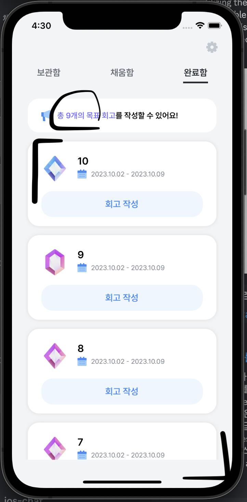
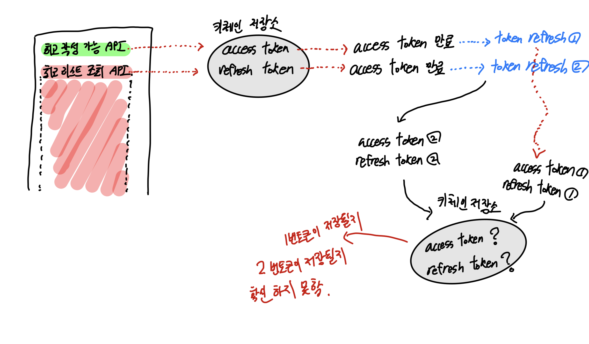
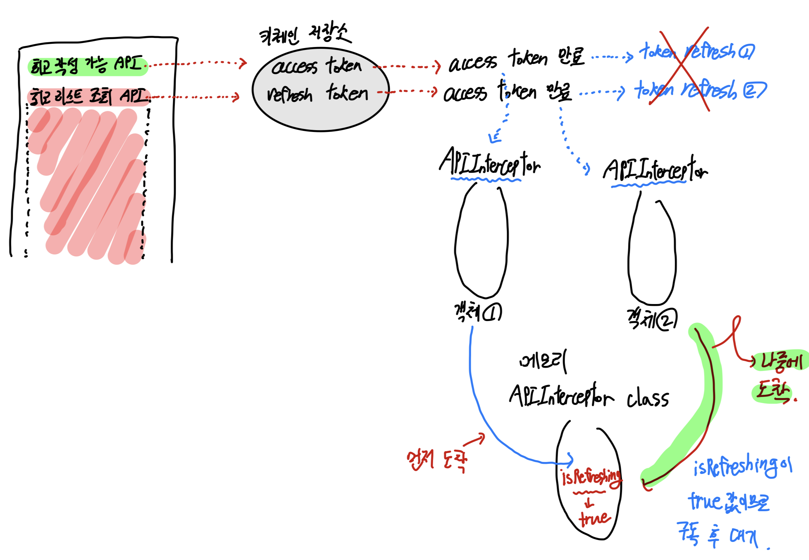

# Alamofire 401 중복 호출문제 개선

## 문제상황

다음 화면을 보자.



뷰 상단의 회고 작성 가능 갯수를 요청하는 API와 하단 회고 작성 대상을 요청하는 API가 한 뷰에서 병렬적으로 처리된다.

한 뷰에서 동시적으로 요청되는 API의 구조 자체는 문제가 없지만, 두 API가 공유 리소스에 접근하고자 할 때에 문제가 발생하게 된다. API 요청 시 접근하게 될 공유 리소스는 바로 **액세스 토큰과 리프레시 토큰을 저장하는 키체인이다.**

사용자 인증이 필요한 API의 경우 키체인에 토큰을 저장해두고 `토큰값 로드 - 만료 시 재발급 - 키체인 업데이트 - 읽어오기 - API retry`의 흐름으로 요청이 이루어지게 된다.

토큰이 만료되지 않았을 때에는 **만료되지 않은 토큰을 꺼내오는 작업만 하기 때문에** 경쟁상황이 발생하더라도 키체인의 토큰 값이 변하지 않는다는 것을 보장할 수 있기에 별 문제가 없지만, **토큰 만료 이후 서버로부터 리프레시를 받는 과정에서** 어떤 토큰이 저장될 지 모른다는 점에서 문제가 발생하게 된다.

## API의 중복 호출과 경쟁상황의 발생 시나리오

401에러 발생 이후 토큰을 재발급 받는 과정은 POST요청의 body에 담아 보내는 리프레시 토큰을 서버 단에서 디코딩하여 `exp` 속성을 기준으로 TTL(Time To Live) 토큰 만료 기간 계산 및 블랙리스트 등록 or 재발급 과정을 거친다.

이때 위의 예시 화면에서처럼 API 호출이 동시에 진행될때를 (실제로는 매우 짧은 텀으로 이루어짐) 도식화하면 다음과 같다.



1. API 요청이 병렬적으로 이루어지면서 두 API가 동시적으로 키체인에 접근하여 토큰을 가져온다. 여기까지는 문제가 없다.
2. 만약 키체인에 저장되어 있던 토큰이 만료된 상태였다면 두 API 모두 401 에러를 응답으로 받게 된다.
3. API 각각에 대해 독립된 객체로 `APIInterceptor`가 생성되면서 토큰을 2번 발급받는다.
4. 당연히 독립된 인터셉터 객체에서 각각 발급받은 토큰은 서로 다른 값을 가진다.
5. 키체인 저장소에 각 API에서 새로 발급받은 토큰을 저장한다.

문제는 5번 과정에서 발생하게 된다. 키체인은 공유 리소스이며 동시적으로 API가 요청이 이루어지고 내부 스케줄링에 따라 토큰 발급의 순서가 만료때마다 랜덤하게 배치된다.

발급 순서 자체에 문제가 있다기 보다, 각 API를 1번과 2번 토큰이라고 명명했을때 클라이언트 입장에서는 마지막에 키체인에 저장된 토큰이 **만료된 토큰일때가 최악의 상황인 것이다.**

API 요청이 중복되면서 토큰 리프레시 요청도 중복되는데, **이때 동일한 리프레시 토큰을 기준으로 두 개의 토큰 쌍을 발급받기 때문에** 이를 서버에서 탈취 시나리오로 간주하여 하나의 리프레시 & 액세스 토큰 쌍을 만료시키게 된다.

경쟁상황이 발생하게 되어 키체인에 저장되는 토큰이 **만료된 토큰인지, 정상발급된 토큰인지 보장할 수 없는 상황이기에** 이러한 부분에 대한 대응이 필요한 것이다.

## 반응형 로직을 통한 동시성 처리

문제 해결의 핵심은 바로 토큰 리프레시가 한 토큰에 대해 두번 중복되어 발생한다는 점이다. 하나의 토큰에 대해 두 `APIInterceptor`객체가 생성되어 리프레시를 두번 요청하게 되는 것을 방지하는 것이 중요한 키포인트이다.

`APIInterceptor` 클래스를 살펴보면 타입속성 두개를 마련해둔걸 볼 수 있다.

```swift
class APIInterceptor: RequestInterceptor {
    var disposeBag = DisposeBag()
    var retryDisposeBag = DisposeBag()

    static var isRefreshing = false
    static let retryObservable = PublishSubject<Void>()
    // adapt..
    // retry..
}
```

새로고침 여부를 타입속성으로 마련함으로써 객체가 독립적으로 저장되더라도 새로고침 여부를 동일하게 판단할 수 있게 한다.

`retryObservable`의 역할이 중요한데, 아래 그림을 다시 살펴보자.



로직의 흐름을 먼저 정리하면 아래와 같다.

1. API 병렬요청
2. 키체인 저장소 접근 및 토큰 만료를 응답으로 수신
3. 401 에러처리 과정에서 `APIInterceptor` 객체의 `retry`함수를 호출
4. `APIInterceptor` 클래스 타입속성의 `isRefreshing`속성값을 먼저 도착한 객체쪽에서 참조하여 `true`값으로 설정
5. 나중에 도착한 `APIInterceptor`객체에서는 false 분기처리 구문으로 이동하여 `APIInterceptor` 클래스의 타입속성인 API 재호출 옵저버블을 구독하고 다른 먼저 도착한 `APIInterceptor` 객체에서 토큰 재발급이 끝났을때 `next` 이벤트를 방출하여 해당 이벤트를 수신한 객체가 retry를 정상적으로 진행한다.

```swift
if APIInterceptor.isRefreshing {
    // 나중에 도착한 APIInterceptor 객체
    APIInterceptor.retryObservable
        .subscribe(onNext: { [unowned self] in
            completion(.retry)
            self.retryDisposeBag = DisposeBag() // API 재요청과 동시에 재요청 옵저버블 dispose
        })
        .disposed(by: retryDisposeBag)
    APIInterceptor.isRefreshing = false
} else {
    // 먼저 도착한 APIInterceptor 객체
    APIInterceptor.isRefreshing = true

    APIRefreshTask().requestRefreshToken() // 토큰 리프레시 API 요청
        .subscribe(onNext: {[unowned self] result in
            switch result {
            case .success(let response):
                // 키체인 내에 response 토큰값 저장
                saveTokensToKeychain(response)
                APIInterceptor.isRefreshing = false
                APIInterceptor.retryObservable.onNext(()) // 작업 완료 후 next이벤트 방출
                completion(.retry) // 토큰 정상발급이 끝났으니 API 재요청
            case .failure:
                // 리프레시 토큰이 만료된 것이므로 재요청하지 않고 종료
                completion(.doNotRetry)
            }
        })
        .disposed(by: disposeBag)
}
```

`APIInterceptor`를 통해 401을 만난 후 그 즉시 `isRefreshing`불리언을 `true`로 설정하여 재발급 진행중 상태임을 표기해둔다.

나중에 도착한 객체에서 타입속성을 참조했을때 `isRefreshing`이 `true`로 설정되어 있으므로 해당 로직이 실행되는데, 잠시 코드를 다시 살펴보자.

```swift
APIInterceptor.retryObservable
    .subscribe(onNext: { [unowned self] in
        completion(.retry)
        self.retryDisposeBag = DisposeBag() // API 재요청과 동시에 재요청 옵저버블 dispose
    })
    .disposed(by: retryDisposeBag)
APIInterceptor.isRefreshing = false
```

만약 독립된 객체 `APIInterceptor`에서 먼저 `isRefreshing`을 조정하였다면 이후 들어온 인터셉터 객체에서는 타입속성의 옵저버블인 `retryObservable`객체를 구독해두고 대기한다.

해당 옵저버블의 구독이 갖는 의미는 다른 `APIInterceptor`객체에서 토큰 재발급 요청이 모두 끝난 뒤 `completion(.retry)`까지 진행된 시점에 새로 발급받아 키체인에 저장된 토큰이 만료되지 않은 안전한 토큰임을 알리는 신호탄과 같게 되는 것이다.

## 후기

[다음 링크](https://github.com/Alamofire/Alamofire/issues/3177)를 보면 인터셉터 객체가 retry를 동시에 호출하는 점에 대해 여러 사람들이 고민하는 부분이라는 것을 알 수 있다.

스택오버플로우나 다른 블로그를 참조해보면 `NSLock`과 같은 세마포어와 유사한 방식들이 제시되고 있지만 이는 키체인 저장시 접근 제어와 관련된 문제이지 결국 새로운 API 요청 순서에 따른 토큰 만료 여부를 제어할 수는 없다는 점이 문제이다.

위의 해결 방법은 내가 직접 고안한 내용이며 독립 객체의 토큰 세팅을 관찰하다가 API 재요청까지의 흐름을 유지할 수 있다는 점이 큰 장점이다.

한계점은 현재 API 병렬 호출을 두가지로만 처리하고 있어 `true`, `false`값을 갖는 불리언 타입만으로도 `isRefreshing`처리를 할 수 있었는데 2개 이상의 `APIInterceptor`객체가 생성된다면 어떻게 처리될지에 대한 디버깅은 필요하다.

## Reference

1. [401 인증 관련 리팩토링 & 동시성 관련 정리 - 프로젝트 PR](https://github.com/dnd-side-project/dnd-9th-1-ios/pull/198)
2. [Github Alamofire issues - RequestInterceptor retry enter twice #3177](https://github.com/Alamofire/Alamofire/issues/3177)
