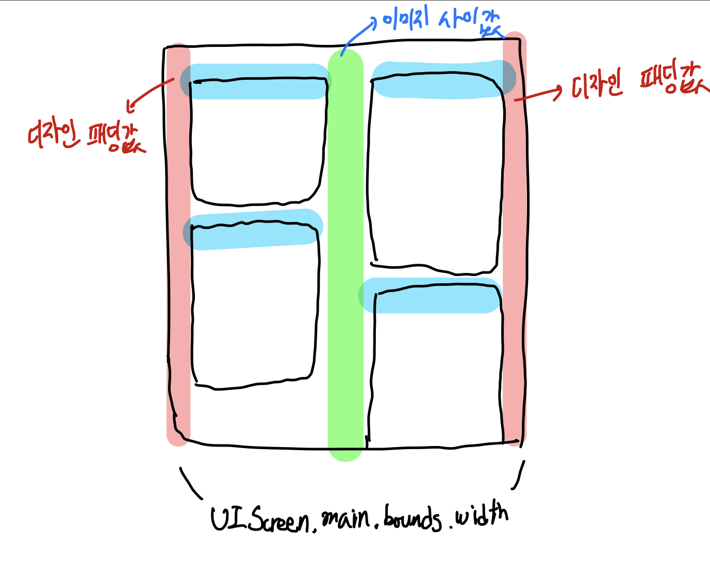
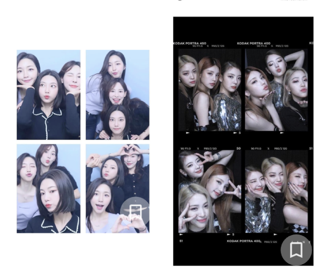
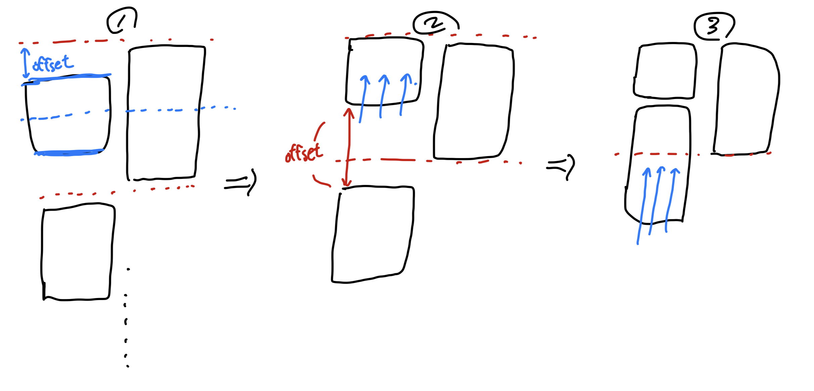

## 핀터레스트 레이아웃


핀터레스트 화면을 보면 이미지 고유의 비율값을 유지하면서 자유분방하게 레이아웃 배치를 진행하는 것을 볼 수 있다. 가로 값은 기기 자체 화면 너비를 반으로 나눈 값으로 고정하고 이 값과 이미지 고유의 가로 세로 비율을 비교하여 세로값을 동적으로 산정하는 식의 로직이다.

웹의 경우 계산된 이미지들을 하나씩 붙여넣는 방식으로 쉽게 구현이 되지만 스위프트에서는 새로 생기는 객체들을 동적으로 UI에 붙이면서 스크롤 형태로 기존의 이미지 레이아웃을 재사용하지 않으면 성능적 이슈가 발생할 가능성이 농후하다.

따라서 컬렉션 뷰로 핀터레스트 레이아웃을 구현해야만 한다.

실제 구현 결과물을 먼저 살펴보고, 구현 과정을 살펴보도록 하자.


코드 자체에 대한 작성이나 설명은 [다음 링크](https://www.kodeco.com/4829472-uicollectionview-custom-layout-tutorial-pinterest)에 가장 자세히 나와있으니 참고하자.

여타 다른 블로그들이 위의 글을 원본으로 하여 정리해둔 것이 일반적인 모습이라 이 글에서는 코드의 흐름 정도만 짚어보고 이미지 캐시 처리와 엮었을때 발생하는 문제점을 중점적으로 톺아보려 한다.

## 이미지 고유사이즈 계산

`UIScreen.main.bounds.width`를 활용하면 기기별 너비값을 얻을 수 있다. 컬렉션뷰 좌우 패딩값과 이미지 사이 틈새값 모두 상수 형태로 고정되어 있으므로 이미지 너비값도 고정된다.



즉 위 그림을 토대로 고정된 이미지 하나의 너비값을 계산하면 `(UIScreen.main.bounds.width - (imagePadding * 2) - imageSpacing) / 2`의 값을 갖게 된다.

고정된 너비 상수값이 있고 이미지 고유 사이즈에 대한 비율 역시 계산할 수 있다. 이로부터 세로 길이를 도출하기 위해서는 아래와 같은 함수를 작성해볼 수 있다.

```swift
func newSizeImageWidthDownloadedResource(image: UIImage) -> UIImage {
    let targetWidth = (UIScreen.main.bounds.width - 56) / 2 // 이미지 하나의 너비
    let newSizeImage = image.resize(newWidth: targetWidth) // UIImage 리사이징 익스텐션 함수
    return newSizeImage
}

// UIImage+.swift
// UIImage 익스텐션
func resize(newWidth: CGFloat) -> UIImage {
    let scale = newWidth / self.size.width // 가로 비 계산
    let newHeight = self.size.height * scale // 비율 기준으로 새로 도출된 높이값 계산

    let size = CGSize(width: newWidth, height: newHeight)
    let render = UIGraphicsImageRenderer(size: size)
    let renderImage = render.image { context in
        self.draw(in: CGRect(origin: .zero, size: size))
    } // 정의된 가로 세로값을 기준으로 이미지 redraw
    return renderImage
}
```

위 과정을 거치고 나면 기본 `UICollectionViewFlowLayout`를 기준으로 배치를 했을때 다음과 같은 결과물이 나타난다.

## 커스텀 레이아웃 구현

iOS에서 컬렉션뷰 구성을 위해서는 `UICollectionView` 셀 등록과 같은 객체 자체에 대한 설정들도 필요하지만 그만큼 중요한 것이 레이아웃 객체를 전달하는 것이다. 보통의 경우 `itemSize`나 아이템간 간격에 대한 수치들을 전달하여 기본 `UICollectionViewFlowLayout`객체를 사용하지만 핀터레스트 레이아웃의 경우 완전히 커스텀을 진행한 레이아웃 객체이다.

컬렉션뷰나 테이블 뷰의 레이아웃을 커스텀하고자 할때 가장 먼저 생각해야할 것은 시스템 내부적으로 레이아웃 계산이 완전히 끝난 시점에 해당 레이아웃 수치들을 초기화하고 하나부터 열까지 배치를 직접 한다는 것이다.

이미지 고유 사이즈 비율로 리사이징을 진행한 뒤 `UICollectionViewFlowLayout` 기본 객체로 컬렉션뷰 레이아웃 배치를 지시하게 되면 다음과 같은 화면이 나타나게 된다.



컬렉션뷰는 만약 `vertical` 스크롤을 기반으로 동작한다고 가정했을때 같은 행에 위치한 뷰의 크기 차이가 날때 **더 사이즈가 큰 뷰를 기준으로 중앙정렬 처리를 한다.** 오른쪽 이미지의 사이즈가 더 크기 때문에 왼쪽 이미지가 오른족 이미지의 `centerY`값으로 자동 맞춤이 이루어진 것이다.

커스텀 레이아웃 배치를 하기 위해서는 `UICollectionViewFlowLayout`를 상속받는 클래스를 새롭게 정의해야 한다. 컬렉션뷰 레이아웃 클래스를 상속받은 형태이기 때문에 참조하고 있는 컬렉션뷰 객체도 얻어올 수 있다.

이때 컬렉션뷰 객체에서 제공하는 `collectionView.numberOfItems(inSection: Int)` 메서드를 통해 섹션별 셀 갯수를 얻을 수 있고 셀을 하나씩 순회하며 `offset`값을 직접 조정해주는 흐름을 갖는다.



## Reference

1. [Kodeco - UICollectionView Custom Layout Tutorial: Pinterest](https://www.kodeco.com/4829472-uicollectionview-custom-layout-tutorial-pinterest)
