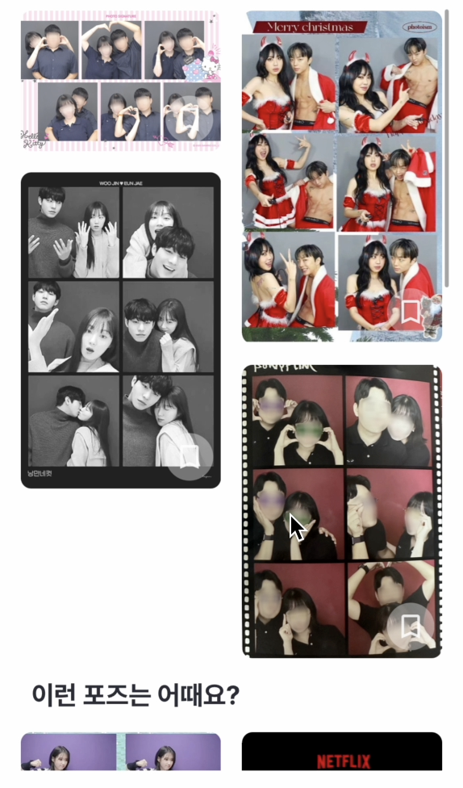

# RxDataSource 컬렉션뷰 헤더 SupplementaryView

## 구현 결과물

`RxDataSource` 라이브러리를 사용하면 어렵지 않게 테이블 뷰에 바인딩할 객체를 섹션별로 분류할 수 있다. 테이블뷰는 섹션 객체를 바인딩하는 클로저에 직접적으로 함수를 할당할 수 있어서 어렵지 않게 구현이 가능하지만 컬렉션뷰의 경우 데이터소스 객체 정의 시 셀에 대한 정의와 더불어 컬렉션 뷰 `supplementaryView`에 대한 정의가 함께 들어가야 해서 테이블뷰와 다른 형태로 구현된다.

:::tip RxDataSource?

`RxDataSource` 라이브러리는 테이블뷰 및 컬렉션뷰 구현 시 섹션 객체에 대한 구현과 더불어 셀 애니메이션 구현에 큰 도움을 주는 라이브러리이다.

헤더 및 푸터 삽입시 데이터소스 객체를 삽입하여 직접 구현할 수 있다.

:::

구현 결과를 살펴보면 다음과 같다.


위의 구현결과를 보면 컬렉션뷰의 구성이 크게 두 가지로 구분되는 것을 알 수 있다.



태그 적용 후 상단 영역에 배치되는 이미지들이 첫 번째 섹션이고 하단의 `이런 포즈는 어때요?` 라는 레이블 밑으로 배치되는 이미지들이 두 번째 섹션에 해당한다.

앞으로의 글에서는 섹션 객체를 만들고 바인딩하는 과정을 정리한다. 참고로 해당 글은 핀터레스트 레이아웃을 기반으로 한 컬렉션뷰의 구현이기 때문에 [다음 글을](https://parkjju.github.io/vue-TIL/trash/231123-34.html) 참고하는 것도 좋다.

## 데이터소스 정의

글 작성에 앞서 해당 구현 방식은 주관적으로 구현한 흐름이므로 정답이 아님을 밝힌다.

`RxDataSource`는 먼저 데이터소스 객체를 정의하도록 한다. 뷰모델 내의 저장속성으로 이를 구현하여 뷰 컨트롤러에서 참조하도록 구현하였다. 컬렉션뷰 데이터소스 객체는 `RxCollectionViewSectionedReloadDataSource`를 사용한다.

컬렉션뷰에서는 테이블뷰와 다르게 헤더라는 표현을 사용하지 않고 `SupplementaryView`라는 표현을 사용한다. 서플먼트 뷰도 내부적으로 재사용되어야 하기 때문에 `dequeueReusable..` 메서드 기반으로 구현된다. 서플먼트 뷰 전용 `dequeueReusableSupplementaryView` 메서드를 사용하면 된다.

```swift
// Viewmodel.swift
lazy var dataSource = RxCollectionViewSectionedReloadDataSource<PoseSection>(configureCell: { dataSource, collectionView, indexPath, item in
    guard let cell = collectionView.dequeueReusableCell(withReuseIdentifier: PoseFeedPhotoCell.identifier, for: indexPath) as? PoseFeedPhotoCell else { return UICollectionViewCell() }

    // ...
    // 셀 정의
    // ...

    return cell
}, configureSupplementaryView: { dataSource, collectionView, kind, indexPath -> UICollectionReusableView in
    if indexPath.section == 0 {
        let header = collectionView.dequeueReusableSupplementaryView(ofKind: UICollectionView.elementKindSectionHeader, withReuseIdentifier: PoseFeedEmptyView.identifier, for: indexPath) as! PoseFeedEmptyView

        // ...
        // 섹션 1번 서플먼트 뷰 헤더 정의
        // ...

        return header
    } else if indexPath.section == 1 {
        let header = collectionView.dequeueReusableSupplementaryView(ofKind: UICollectionView.elementKindSectionHeader, withReuseIdentifier: PoseFeedHeader.identifier, for: indexPath) as! PoseFeedHeader
        let title = dataSource.sectionModels[indexPath.section].header
        header.configureHeader(with: title)

        // ...
        // 섹션 2번 서플먼트 뷰 헤더 정의
        // ...

        return header
    } else { return UICollectionReusableView() }
})
```

서플먼트 뷰 정의시에는 메서드 내에 두 가지를 정의해줘야 한다.

1. `ofKind`: 컬렉션뷰 섹션의 헤더에 들어갈지 푸터에 들어갈 지에 대한 값. 열거형이 아닌 `String` 타입이다.
2. `identifier`: 컬렉션뷰 헤더로 사용할 클래스의 아이디값을 전달한다.

컬렉션뷰 헤더 커스텀 클래스는 `UICollectionReusableView`를 상속해야 한다. 해당 클래스 상속만 해두면 나머지 서브뷰 구현은 셀 구현과 동일하다.

```swift
class PoseFeedEmptyView: UICollectionReusableView {

    // MARK: - Subviews
    let mainLabel = UILabel()
        .then {
            $0.textAlignment = .center
            $0.textColor = .textSecondary
            $0.font = .h4
            $0.text = "신비한 포즈를 찾으시는군요!"
        }

    // MARK: - Properties
    static let identifier = "PoseFeedEmptyView"

    // MARK: - Initialization
    override init(frame: CGRect) {
        super.init(frame: frame)

        render()
        configUI()
    }

    @available(*, unavailable)
    required init?(coder: NSCoder) {
        fatalError("init(coder:) has not been implemented")
    }

    // MARK: - Functions
    func render() {
        // 서브뷰 레이아웃 지정
    }

    func configUI() {
        // UI 속성값 조정
    }
}
```

## 섹션 모델 정의 및 객체 바인딩

데이터소스 정의 이후 섹션에 대한 모델을 추가적으로 정의해야 한다.

```swift
import RxDataSources

struct PoseSection {
    var header: String
    var items: [Item]
}

extension PoseSection: SectionModelType {
    typealias Item = PoseFeedPhotoCellViewModel

    init(original: PoseSection, items: [PoseFeedPhotoCellViewModel]) {
        self = original
        self.items = items
    }
}
```

섹션에는 헤더 문자열과 섹션 내부를 구성할 아이템 배열로 구성된다. 데이터 타입은 `typealias`로 하여 섹션 모델 익스텐션에서 타입을 지정하도록 한다.

:::tip 셀 뷰모델

셀 자체에 대한 클래스를 `Item` 타입으로 지정하고 있지 않고 셀에 대한 뷰모델을 타입으로 연결해주고 있는데, 이러한 구현 방식은 MVVM 아키텍쳐 패턴 기반으로 구현을 진행할때 셀에 대한 뷰모델을 정의하는 방식에서 기인한 것이다.

자세한 내용은 [다음 글을](https://parkjju.github.io/vue-TIL/trash/230918-31.html) 참고하자.

:::

생성자 함수 `init(original: Self, items: [Item])`은 `SectionModelType` 프로토콜을 채택하면 구현해야 되는 대상이다.

`original`에는 섹션모델 구조체를 전달하고 `items`에는 섹션 아이템 타입을 전달하면 된다.

섹션모델이 정의되었으면 뷰모델 내에서 바인딩할 `BehaviorRelay` 객체를 정의한다.

```swift
let sectionItems = BehaviorRelay<[PoseSection]>(value: [PoseSection(header: "", items: []), PoseSection(header: "이런 포즈는 어때요?", items: [])])
```

위의 구현 결과물을 보면 섹션이 동적으로 생성되는 경우가 아니기에 초기 섹션들을 하드코딩 형태로 추가해두었다. 릴레이 객체 타입을 섹션 모델의 배열로 정의해두고 구현 목표에 따라 헤더 지정 및 초기 섹션 아이템 값들을 추가한다.

```swift
/// 필터 섹션 & 추천 섹션 결합 후 셀 아이템에 바인딩
Observable.combineLatest(filterSection, recommendSection)
    .subscribe(onNext: { filter, recommend in
        let newSectionItems = [PoseSection(header: "", items: filter), PoseSection(header: "이런 포즈는 어때요?", items: recommend)]
        sectionItems.accept(newSectionItems)
    })
    .disposed(by: disposeBag)
```

위와 같이 새로운 섹션 아이템들을 옵저버블로 정의해두고 API 통신에 따라 추가되는 객체들을 받아 섹션 아이템에 `accept`한다.

위의 `filterSection`, `recommendSection` 옵저버블은 다음과 같이 정의된다.

```swift
let filterSection = BehaviorRelay<[PoseFeedPhotoCellViewModel]>(value: [])
let recommendSection = BehaviorRelay<[PoseFeedPhotoCellViewModel]>(value: [])
```

두 개의 각 섹션 객체들은 API 통신에 따라 새로 `accept`된다. 하나의 예시를 보면 다음과 같이 구현되는 것을 볼 수 있다.

```swift
input.requestAllPoseTrigger
    .flatMapLatest { [unowned self] _ -> Observable<PoseFeed> in
        loadable.accept(true)
        return self.apiSession.requestSingle(.retrieveAllPoseFeed(pageNumber: self.currentPage, pageSize: 8)).asObservable()
    }
    .map { $0.content }
    .flatMapLatest { [unowned self] posefeed -> Observable<[PoseFeedPhotoCellViewModel]> in
        return self.retrieveCacheObservable(posefeed: posefeed)
    }
    .subscribe(onNext: {
        loadable.accept(false)
        filterSection.accept($0) // 추천섹션에 데이터 연결
    })
    .disposed(by: disposeBag)
```

## 뷰 컨트롤러 데이터소스 바인딩

뷰 컨트롤러에서 컬렉션뷰에 데이터소스 객체를 전달하여 본격적으로 바인딩을 진행한다.

```swift
// ViewController.swift
output.sectionItems
    .bind(to: poseFeedCollectionView.rx.items(dataSource: viewModel.dataSource))
    .disposed(by: disposeBag)
```

컬렉션뷰 `items`메서드 중 `dataSource`파라미터를 받는 메서드를 사용한다. 뷰모델 객체 내에 데이터소스 객체를 정의해두었기 때문에 해당 값을 참조한다.

## 컬렉션뷰 커스텀 레이아웃 관련 이슈

지금까지의 `RxSwift`에서 컬렉션뷰 서플먼트 뷰 구현을 위한 내용들을 살펴봤다. 흐름을 정리하면 다음과 같다.

1. 뷰모델 내에 데이터소스 객체 정의
    - `configureCell` 클로저에서 셀 정의
    - `configureSupplementaryView`에서 헤더 혹은 푸터 정의
2. `SectionModelType` 프로토콜을 채택한 섹션 모델 정의
3. 뷰모델 내에 API 통신을 통해 받아올 `BehaviorRelay` 섹션 객체 정의 및 `accept`로 데이터 저장
4. 뷰 컨트롤러에서 `collectionView.rx.items(dataSource: 데이터소스 객체)`로 데이터 바인딩

위의 일련의 과정만 거치면 어렵지 않게 구현이 된다.

문제는 구현 과정에서 핀터레스트 형태의 커스텀 레이아웃으로 구현된다는 것인데, [핀터레스트 레이아웃과 관련된 글을](https://parkjju.github.io/vue-TIL/trash/231123-34.html) 먼저 읽어보고 오길 권한다.

커스텀 레이아웃 구현을 위해 `UICollectionViewFlowLayout`을 상속받게 되면 전체적인 레이아웃 수치들이 완전히 초기화된다. 따라서 직접 서플먼트 뷰의 레이아웃 어트리뷰트 객체에 접근하여 높이값을 지정해줘야 한다.

```swift
class PinterestLayout: UICollectionViewFlowLayout {
    private var cache: [UICollectionViewLayoutAttributes] = []

    override func prepare() {
        // ...
        // ...
        let filteredSectionIndex = IndexPath(item: 0, section: 0)
        let filteredHeaderAttributes = UICollectionViewLayoutAttributes(forSupplementaryViewOfKind: UICollectionView.elementKindSectionHeader, with: filteredSectionIndex) // 컬렉션뷰 헤더 레이아웃 객체
        filteredHeaderAttributes.frame = CGRect(x: 0, y: 0, width: UIScreen.main.bounds.width - 32, height: filteredSectionNumberOfItems > 0 ? 0 : 300)
        cache.append(filteredHeaderAttributes) // 프레임을 통해 레이아웃 직접 할당
        // ...
    }

    // 레이아웃 적용
    override func layoutAttributesForItem(at indexPath: IndexPath)
        -> UICollectionViewLayoutAttributes? {
      return cache[indexPath.item]
    }
}
```

커스텀 레이아웃 객체는 내부 라이프사이클에 따라 조정되는데 레이아웃 수치들을 자동으로 적용하는데 이때 호출되는 함수가 `layoutAttributesForItem`이다. 레이아웃 객체 속성에 수치들을 저장한 레이아웃 배열을 저장해놓고 `layoutForAttributesForItem`메서드가 호출될때 `indexPath`값을 기준으로 레이아웃 캐시값에 인덱싱하여 레이아웃 수치를 지정하면 된다.

위의 코드를 보면 섹션 `indexPath`를 기준으로 컬렉션뷰 레이아웃 객체를 얻어내는 것을 볼 수 있다. 이후 프레임에 높이 및 너비값을 직접 할당하고 있다. 만약 위와 같이 너비 및 높이값을 할당하지 않으면 해당 값들이 모두 0으로 초기화 되어 컬렉션뷰에 나타나지 않게 된다.

레이아웃을 지정해주었으면 반드시 레이아웃 객체의 캐시 배열에 추가해주어야 한다. (`cache.append(레이아웃 객체)`)

## Reference

1. [RxSwift Input & Output](https://parkjju.github.io/vue-TIL/trash/230918-31.html)
2. [예시 프로젝트](https://github.com/pose-picker/PosePicker-iOS/blob/main/posepicker/Modules/PoseFeed/PoseFeedViewModel.swift)
3. [핀터레스트 레이아웃](https://parkjju.github.io/vue-TIL/trash/231123-34.html)
