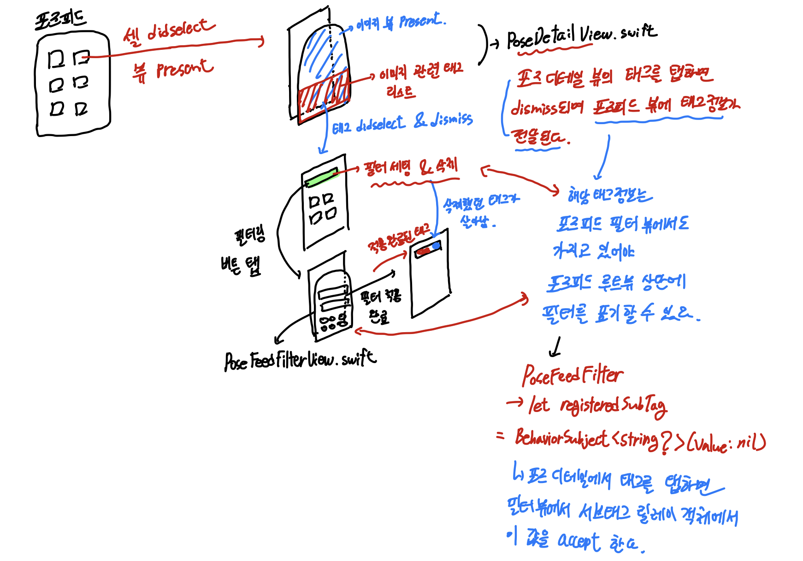
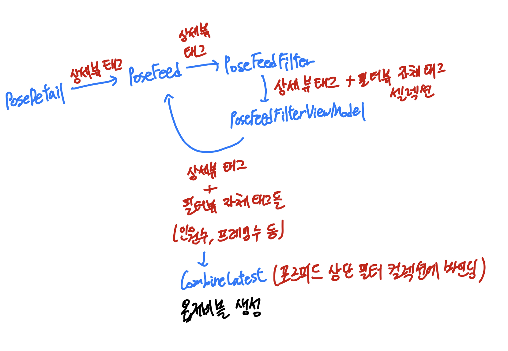

# RxSwift와 loadViewIfNeeded의 활용

## 문제 상황

문제의 화면을 보자.


1. 포즈피드 뷰에서 태그를 선택하여 1차 필터링 진행
2. 추가한 필터 다시 삭제
3. 필터링 모달창을 띄우고 필터 새로 적용
4. **2번에서 삭제한 필터가 갑자기 재등장**

왜 이런 문제가 발생하고 있는걸까?

## 설계된 화면의 흐름

본격적인 문제의 해결에 앞서 설계된 화면이 어떤 흐름으로 데이터를 주고받는지를 알아야 한다.



1. 포즈피드 루트 뷰에서 이미지 셀을 탭하면 포즈 상세정보를 표기하는 뷰가 모달 형태로 `present` 된다.
2. 이미지와 관련된 태그정보들을 서버로부터 받아와 컬렉션뷰가 구성된다.
3. 이미지 관련 태그 셀을 탭하면 포즈 상세 뷰가 dismiss되고 태그 정보가 **포즈피드 루트뷰를 거쳐 포즈피드 필터 뷰로 전달된다.**
4. 포즈피드 루트 뷰에 포즈 상세 뷰에서 탭한 태그를 기준으로 필터링이 진행된다.
5. UI 바인딩이 단방향으로 이루어지기 때문에 **포즈피드 루트 뷰의 필터 컬렉션뷰는 반드시 포즈피드 필터 뷰의 태그 정보값들을 옵저버블 형태로 가지고 있을때 해당 데이터를 바인딩하는 방식으로 구현된다.**

5번 과정이 문제의 핵심이다. 포즈피드의 루트 뷰는 필터에 대한 정보를 포즈피드 루트 뷰모델에 가지고 있지 않고 **포즈피드 필터에서 방출하는 옵저버블로부터 바인딩을 진행하는 것이다.**

모달창을 보면 인원 수, 프레임 수, 메인 태그들을 지정하는 영역이 있는데 각 태그 속성마다 열거형으로 직접 타입화되어 있기 때문에 모든 태그 정보들을 포즈피드 필터 뷰모델에서 `Observable.combineLatest`로 종합한 이후의 태그 정보를 포즈피드 루트 뷰와 포즈피드 필터 뷰에 각각 뿌려주게 되는 것이다.



문제는 포즈 상세 뷰에서 태그를 탭하여 포즈피드 필터 뷰로 선택된 태그 정보를 전달할 때에 **포즈피드 필터 뷰 객체가 메모리 상에 올라와있는지 여부는 상관하지 않고 데이터 전달을 시도한다는 것이다.**

포즈피드 필터 뷰에서는 필터 뷰 자체 셀렉션과 더불어 각종 UI 바인딩을 처리하는 작업이 뷰 컨트롤러 내부의 `bindViewModel` 함수에서 이루어진다.

상세 뷰로부터 `accept`되는 서브태그 정보는 포즈피드 필터 뷰 컨트롤러의 저장속성 `BehaviorRelay`내에 저장된다. 코디네이터를 통해 포즈 상세 뷰에서 포즈피드 필터 뷰 릴레이 객체에 태그정보값이 저장은 되지만 **bindViewModel 함수가 호출되지 않은 상태이기 때문에 각종 셀렉션과 같은 반응형 동작들이 구독되지 않은 상태인 것이다.**

포즈피드 루트 뷰 상단의 필터 컬렉션 뷰 셀의 탭은 **포즈피드 필터 뷰모델로 현재 태그 정보들을 업데이트 하는 인풋으로써 사용된다.** 모달창을 직접 띄우지 않는 이상 포즈피드 필터뷰의 옵저버블들이 구독되지 않은 상태이기에 포즈피드 루트뷰 초기 진입이후에 **모달창을 띄우지 않은 상태에서 서브태그의 추가와 삭제가 이루어져도 그 다음 새로 태그를 선택했을때 삭제했던 태그가 다시 되살아나는 것으로 보이는 것이다.**

## loadViewIfNeeded 의 활용

복잡하게 서술된 위의 문제를 간단히 정리하면 다음과 같다.

1. 뷰 컨트롤러에 표기할 데이터들을 옵저버블 형태로 정의해둔 뷰모델을 구독해야만 반응형 로직이 처리되기 시작한다.
2. 옵저버블 구독을 전체적으로 진행하는 뷰 컨트롤러 내의 함수가 호출되지 않은 상태에서 인풋 데이터가 주어진 상황이다.
3. 인풋 데이터가 주어지기 전 뷰 컨트롤러 내의 함수를 로드하여 호출하면 문제가 해결된다.

loadViewIfNeeded의 설명을 보자.

> Discussion: Calling this method loads the view controller’s view from its storyboard file, or creates the view as needed based on the established rules.

메모리 상에 뷰 컨트롤러 객체 자체는 올라와 있는 상태이지만 뷰가 lazy하게 로드된다는 특성 때문에 내부 함수들이 호출되지 않는 상태이기 때문에, 코디네이터에서 뷰가 로드되기 이전 시점에 데이터를 전달하고자 하는 경우 `loadViewIfNeeded` 함수를 호출해주는 것이다.

```swift
// PoseFeedCoordinator.swift
func dismissPoseDetailWithTagSelection(tag: String) {
    guard let posefeedViewController = self.navigationController.viewControllers.first as? PoseFeedViewController else { return }

    // 셀렉션 초기화
    self.poseFeedFilterViewController.loadViewIfNeeded() // 옵저버블들 구독 진행

    // ....
    // ....
}
```

```swift
// PoseFeedFilterViewController.swift
// loadViewIfNeeded를 통해 bindViewModel함수가 호출되어
// 뷰모델로부터 만들어진 각종 옵저버블들이 구독처리된다.
override func bindViewModel() {
    let input = PoseFeedFilterViewModel.Input(headCountSelection: headCountSelection.buttonTapTrigger.asObservable(), frameCountSelection: frameCountSelection.buttonTapTrigger.asObservable(), tagSelection: tagCollectionView.rx.modelSelected(PoseFeedFilterCellViewModel.self).asObservable(), registeredSubTag: registeredSubTag, tagSelectCanceled: cancelTrigger.asObservable(), isPresenting: isPresenting.asObservable(), resetButtonTapped: resetButton.rx.tap, dismissState: dismissState.asObservable(), viewWillDisappearTrigger: viewWillDisappearTrigger.asObservable(), countTagRemoveTrigger: countTagRemoveTrigger.asObservable(), filterTagRemoveTrigger: filterTagRemoveTrigger.asObservable(), subTagRemoveTrigger: subTagRemoveTrigger, detailViewDismissTrigger: detailViewDismissTrigger, filteredTagAfterDismiss: filteredTagAfterDismiss.asObservable())

    let output = viewModel.transform(input: input)

    output.tagItems
        .drive(tagCollectionView.rx.items(cellIdentifier: PoseFeedFilterCell.identifier, cellType: PoseFeedFilterCell.self)) { _, viewModel, cell in
            cell.bind(to: viewModel)
        }
        .disposed(by: disposeBag)

    output.headCountTag
        .drive(onNext: { [unowned self] in
            self.headCountSelection.pressIndex.accept($0)
            guard let headCountTag = PeopleCountTags.getTagFromTitle(title: self.headCountSelection.buttonGroup[$0]) else { return }
            self.selectedHeadCount.accept(headCountTag)
        })
        .disposed(by: disposeBag)

    output.frameCountTag
        .drive(onNext: { [unowned self] in
            self.frameCountSelection.pressIndex.accept($0)
            guard let frameCountTag = FrameCountTags.getTagFromTitle(title: self.frameCountSelection.buttonGroup[$0]) else { return }
            self.selectedFrameCount.accept(frameCountTag)
        })
        .disposed(by: disposeBag)

    output.registeredTags
        .drive(onNext: { [unowned self] in
            self.selectedTags.accept($0)
        })
        .disposed(by: disposeBag)

    subTagRemoveTrigger
        .subscribe(onNext: { [unowned self] in
            self.registeredSubTag.accept(nil)
        })
        .disposed(by: disposeBag)

    tagCollectionView.updateCollectionViewHeight()
}
```

## Reference

1. [뷰 컨트롤러 설계 코드](https://github.com/pose-picker/PosePicker-iOS/blob/main/posepicker/Modules/PoseFeed/PoseFeedViewController.swift)
