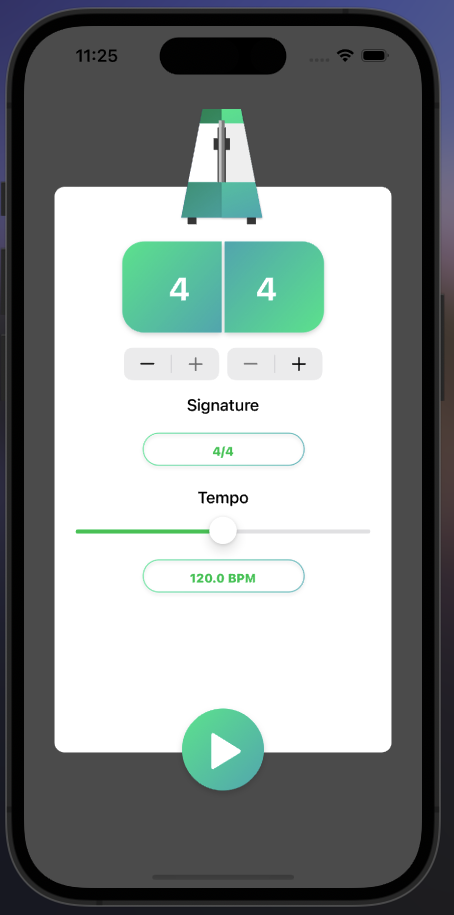
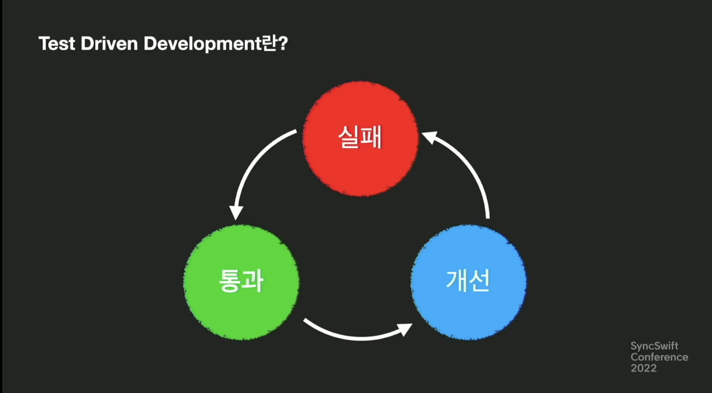
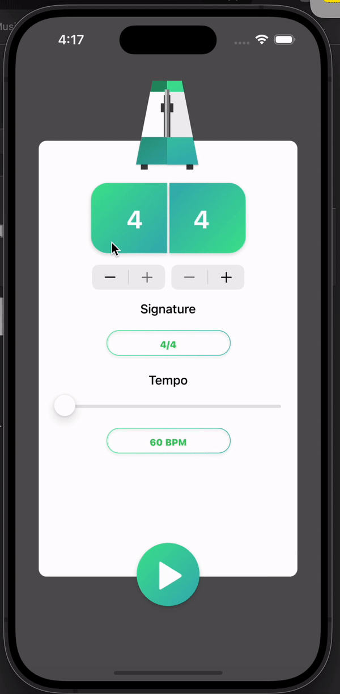
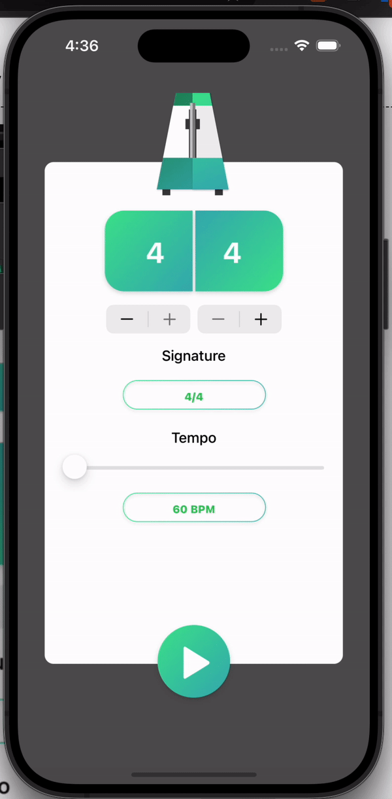

# 유닛테스트 적용

유닛테스트에 대한 환경 세팅은 [이전 글에서](./230918-32.md) 정리해두었다. 이번 글에서는 유닛테스트에 대한 레퍼런스 프로젝트를 기초로 하여 테스트 몇가지를 작성해보고 실제 프로젝트에도 적용해보려고 한다.

만들어진 기능에 대한 테스트 작성과 더불어 특정 비즈니스 로직은 약간의 TDD를 덧붙여 적용해보려고 한다. 주로 참고하는 프로젝트는 [레이웬더리치 Kodeco의 Raytronome](https://www.kodeco.com/7408-testing-your-rxswift-code) 메트로놈 프로젝트이다.

## RxBlocking

RxBlocking은 옵저버블 스트림을 `BlockingObservable` 타입으로 컨버팅하여 테스팅을 용이하게 해주는 테스팅 프레임워크이다. 스레드 차단 후 **RxBlocking이 지시하는 연산자에 따라 특정 값을 얻어낼 수 있다.**

일반적으로 뷰모델로부터 컨트롤러로 데이터 바인딩을 진행할때 `BehaviorRelay` 객체를 통해 초기값이 세팅되어 있는 경우가 많은데, 이때 `RxBlocking`의 `first` 연산자를 사용하면 쉽게 테스트 가능하다.

우선 구현 화면을 보자.



먼저 초기값에 대한 테스트코드를 작성하려고 한다.

1. 메트로놈 시작과 동시에 메트로놈이 좌 우로 움직이게 되지만 초기 상태는 가운데에 고정되어 있어야 한다. 메트로놈 위치는 `BeatType`이라는 열거형으로 `.center`, `.left`, `.right`으로 지정하였다.
2. 초기 박자가 4/4 박자여야 한다.
3. 초기 BPM값이 120으로 설정되어 있어야 한다.

위와 같은 테스트 시나리오에 기반한 뷰모델을 작성한다.

```swift
class MetronomeViewModel {

    var disposeBag = DisposeBag()

    enum BeatType: String {
        case left = "MetronomeLeft"
        case right = "MetronomeRight"
        case center = "MetronomeCenter"
    }

    struct Input {

    }

    struct Output {
        let numeratorText: Driver<String> // 분자 박자
        let denomitorText: Driver<String> // 분모 박자
        let beatType: Driver<BeatType> // 비트타입 (메트로놈 위치)
        let tempo: Driver<Float> // 템포값
    }

    func transform(input: Input) -> Output {
        let numeratorText = BehaviorRelay<String>(value: "4")
        let denomitorText = BehaviorRelay<String>(value: "4")
        let beatType = BehaviorRelay<BeatType>(value: .center)
        let tempo = BehaviorRelay<Float>(value: 120)

        return Output(numeratorText: numeratorText.asDriver(), denomitorText: denomitorText.asDriver(), beatType: beatType.asDriver(), tempo: tempo.asDriver())
    }
}
```

위의 뷰모델 클래스와 중첩타입 Input과 Output을 **테스트케이스 클래스 내에 저장속성으로 추가한다.** 타입으로만 지정해두고 객체 할당은 테스트 라이프사이클의 첫 시작인 `setUp` 함수 내에서 진행한다.

```swift
final class metronomeTests: XCTestCase {
    var viewModel: MetronomeViewModel! // 뷰모델 추가
    var input: MetronomeViewModel.Input! // 인풋 객체
    var output: MetronomeViewModel.Output! // 아웃풋 객체

    override func setUp() {
        viewModel = MetronomeViewModel()
        input = MetronomeViewModel.Input()
        output = viewModel.transform(input: input)
    }

    func test_numerator_denomitor_시작값이_4인지() {
        XCTAssertEqual(try output.denomitorText.toBlocking().first(), "4")
        XCTAssertEqual(try output.numeratorText.toBlocking().first(), "4")
    }

    func test_메트로놈_첫_타입이_center인지() {
        XCTAssertEqual(try output.beatType.toBlocking().first(), .center)
    }

    func test_메트로놈_첫_BPM이_120인지() {
        XCTAssertEqual(try output.tempo.toBlocking().first(), 120)
    }
}
```

:::warning 테스트 함수 이름 작명

테스트함수는 반드시 **test**라는 이름으로 prefix를 붙여야지만 테스트 함수로써 xcode에서 인식하게 된다. 그 외에는 함수 이름 자체를 한글로 작성하여 어떤 시나리오에 대한 테스트인지 명확하게 표기해주어도 된다.

:::

위 테스트 함수를 보면 아웃풋의 옵저버블들을 `toBlocking`을 통해 `BlockObservable`로 컨버팅한 뒤 **첫 시점에 방출되는 값을 가져와 비교하고 있다.**

RxBlocking에서 제공하는 연산자는 다음과 같다.

1. `first`: 처음 방출되는 값을 기다렸다가 리턴한다.
2. `last`: 시퀀스 종료 시점까지 기다렸다가 마지막에 방출된 아이템을 리턴한다.
3. `toArray`: 시퀀스 종료 시점까지 기다렸다가 그 동안 방출된 모든 값을 배열에 담아 리턴한다.

## RxTest

`RxBlocking`은 간편하지만 몇 가지 한계점이 존재한다.

1. RxBlocking은 **시점이 명확한** 시퀀스 테스팅에만 유용하다. 즉 종료되지 않는 시퀀스나 처음과 끝이 아닌 중간 어딘가의 스트림으로부터 테스트를 유도하기에는 유연성이 부족하다.
2. RxBlocking은 스레드 블록킹을 기반으로 동작하기 때문에 옵저버블에 딜레이가 있거나 비동기적 동작을 하는 경우 블록 옵저버블이 대기하는 시간이 길어진다.
3. 타이머 기반으로 동작하는 옵저버블을 정의한 뒤 이를 테스트하는 경우, 메인 스케줄러에서 동작시키는 것이 일반적이기에 스레드 블록을 기반으로 동작하는 RxBlocking은 활용할 수 없다.
4. 비동기적 인풋이 옵저버블 이벤트 방출에 대한 트리거가 되는 경우 테스트가 어렵다.

이러한 한계점을 극복하기 위해 사용하는 것이 `RxTest`이다. `RxTest`는 자체 스케줄러인 `TestScheduler`를 제공하기 때문에 훨씬 더 유연한 테스트가 가능하다.

테스트 스케줄러는 목 옵저버블과 목 옵저버를 생성하여 이벤트를 레코딩하고 테스트한다. 테스트 클래스 내에서 구독하는 등의 작업이 이루어져야 하기 때문에 클래스 저장속성으로 디스포즈백을 저장해야 하며, 스케줄러 객체 또한 추가해야 한다.

테스트 라이프사이클의 `tearDown`시점에 디스포즈 백을 다시 초기화시켜 구독자들을 해제한다.

```swift
final class metronomeTests: XCTestCase {
    var viewModel: MetronomeViewModel!
    var input: MetronomeViewModel.Input!
    var output: MetronomeViewModel.Output!
    var scheduler: TestScheduler!
    var disposeBag: DisposeBag!

    override func setUp() {
        viewModel = MetronomeViewModel()
        input = MetronomeViewModel.Input()
        output = viewModel.transform(input: input)
        scheduler = TestScheduler(initialClock: 0)
        disposeBag = DisposeBag()
    }

    // ==========
    // 테스트코드...
    // ==========

    override func tearDown() {
        disposeBag = DisposeBag()
    }
}
```

`RxTest`를 사용하여 테스트하고자 하는 시나리오는 다음과 같다.

1. 버튼 탭 컨트롤이벤트를 뷰모델에 인풋으로 전달
2. 버튼 탭 Void 이벤트 방출마다 isPlaying 속성값을 변경

위의 시나리오에 대한 테스트코드 작성을 위해서는 뷰모델에 대한 중첩 인풋 & 아웃풋 타입 객체를 정의하는 것이 필연적이다. 문제는 인풋 객체 정의시에 옵저버블을 기본적으로 전달해야 한다는 것인데, 이와 관련한 레퍼런스를 따로 찾지 못해 직접 구현한 방식을 정리하려고 한다.

인풋 아웃풋 기반의 테스트 구현 과정은 다음과 같다. `RxBlocking`을 통해 명확한 시점에 대한 시퀀스 테스트 코드가 작성되어 있다는 것을 전제로 한다.

1. `RxBlocking`으로 초기값 테스트 코드가 작성되어 있기 때문에 테스트 클래스에는 인풋과 아웃풋에 대한 객체가 저장속성으로 추가되어 있다.
2. 모든 테스트 라이프사이클에서 저장속성에 추가된 인풋 & 아웃풋 객체를 동일하게 참조하게 된다.
3. 문제는 각 인풋마다 테스트 하려는 옵저버블의 형태가 다르다. 테스트 스케줄러를 통해 전달할 이벤트의 형태가 자유로워야 하는데, 테스트 클래스에서 참조하는 인풋의 옵저버블을 새롭게 할당하면 해당 인풋을 다른 라이프 사이클에서 테스트 코드가 함께 참조하게 되어 원하는 테스트 결과가 나오지 않게 된다.
4. 따라서, 기본적으로 가장 디폴트 이벤트만을 보유하는 인풋 객체를 리턴하는 함수를 테스트 클래스 내에 정의한다.
5. 뷰모델 클래스의 Input 중첩타입은 `var`로 선언하여 새로운 옵저버블을 할당할 수 있게 선언해둔다.
6. 테스트 스케줄러의 `createObserver` 함수를 통해 옵저버 객체를 생성한다.
7. 특정 인풋 테스트를 위한 테스트코드 함수 내에서 테스트용 인풋 객체를 정의하기 위해 4번 과정에서 만든 함수를 통해 초기 인풋 객체를 할당받는다.
8. 테스트 스케줄러의 `createColdObseravble` 혹은 `createHotObservable`을 통해 이벤트 방출 형태를 새로 정의한다. 생성된 옵저버블을 7번 과정에서 만들어진 인풋 객체의 테스트 대상 옵저버블에 할당한다.
9. 테스트 클래스 내의 뷰모델 저장속성 `transform` 메서드를 통해 테스트 인풋으로 만들어진 테스트 아웃풋 객체를 새로 변수에 저장한다.
10. 테스트 아웃풋 객체에서 테스트하고자 하는 옵저버블을 6번에서 생성한 테스트 스케줄러 전용 옵저버에 바인딩한다.
11. `scheduler.start()`를 통해 스케줄러를 동작시킨다.
12. `Assert`문을 통해 테스트 코드를 작성한다.

길고 복잡해보이지만, 작성된 코드를 보면 이해가 어렵지 않다.

```swift
final class metronomeTests: XCTestCase {
    var viewModel: MetronomeViewModel!
    var input: MetronomeViewModel.Input!
    var output: MetronomeViewModel.Output!
    var scheduler: TestScheduler!
    var disposeBag: DisposeBag!

    override func setUp() {
        viewModel = MetronomeViewModel()
        scheduler = TestScheduler(initialClock: 0)
        disposeBag = DisposeBag()

        // 1. 기본 옵저버블 생성 및 Input 객체 추가
        // 2. 테스트 내에서 인풋 특정 요소만 조정 후 output 새롭게 transform
        input = retrieveDefaultInputObservable()
        output = viewModel.transform(input: input)
    }

    // RxBlocking을 활용한 옵저버블 초기값 테스팅
    func test_numerator_denomitor_시작값이_4인지() throws {
        XCTAssertEqual(try output.denomitorText.toBlocking().first(), "4")
        XCTAssertEqual(try output.numeratorText.toBlocking().first(), "4")
    }

    // 트리거 옵저버블 기반으로 동작하는 테스트코드
    func test_버튼_탭_이후_isPlaying_속성값이_변경되는지() {
        let isPlaying = scheduler.createObserver(Bool.self) // 6번 과정

        var testInput = retrieveDefaultInputObservable() // 7번 과정

        // 8번 과정
        testInput.controlButtonTapped = scheduler.createColdObservable([
            .next(10, ()),
            .next(20, ()),
            .next(30, ())
        ]).asObservable()

        let newOutput = viewModel.transform(input: testInput) // 9번 과정

        // 10번 과정
        newOutput.isPlaying
            .drive(isPlaying)
            .disposed(by: disposeBag)

        // 11번 과정
        scheduler.start()

        // 12번 과정
        XCTAssertEqual(isPlaying.events, [
            .next(0, false),
            .next(10, true),
            .next(20, false),
            .next(30, true)
        ])
    }

    override func tearDown() {
        disposeBag = DisposeBag()
    }

    // 디폴트 인풋객체 정의 - 4번 과정
    func retrieveDefaultInputObservable() -> MetronomeViewModel.Input {
        let controlButton: TestableObservable<Void> = scheduler.createColdObservable([])

        return MetronomeViewModel.Input(controlButtonTapped: controlButton.asObservable())
    }
}
```

:::tip 테스터블 옵저버블 생성 시 제네릭 사용하기

스케줄러를 통해 옵저버블을 생성할때 빈 배열로 생성하기 위해서는 배열 요소에 대한 타입을 지정해줘야 한다. `TestableObservable`타입 제네릭에 `Element`타입을 직접 지정해주면 된다.

:::

:::tip hotObservable vs coldObservable

테스트 과정에서 옵저버블을 생성하는데, 핫 옵저버블과 콜드 옵저버블 두 형태로 나뉜다. 핫 옵저버블은 생성과 동시에 이벤트 방출이 시작되어 구독한 시점에는 이전 값들을 얻을 수 없는 스트림이다. 쉽게 릴레이 객체를 생각하면 된다. 초기값을 지정한 뒤 `accept`를 하다가 결국 구독한 이후 시점에는 최종적으로 `accept`되었던 값을 받아오는 것을 볼 수 있다.

반면 콜드 옵저버블은 구독 이후 시점부터 이벤트 생성 및 방출을 시작하는 옵저버블이다. 네트워크 통신과 관련된 옵저버블이 이에 해당한다.

자세한 내용은 [공식 문서를](https://github.com/ReactiveX/RxSwift/blob/main/Documentation/HotAndColdObservables.md) 참조하자.

:::

:::tip Time Value

RxTest는 `createObservable` 내에서 방출하는 이벤트의 시간값을 `VirtualTimeUnit`이라는 특별한 타입으로 관리한다.

위의 예시 테스트코드에서 `controlButtonTapped` 컨트롤 이벤트에 몇가지 이벤트들을 방출할 때에 10, 20, 30의 시간값에 방출했다. 이때 각각 10, 20, 30은 실제 10초와 같이 실질적 시간 단위를 나타내는 것이 아닌 상대적 타이밍을 추상화한 값이다.

10이 20에 더 앞선 타이밍이기 때문에 스케줄링을 이에 맞춰 하는것을 직관적으로 이해할 수 있게끔 마련한 수단이지 실제 시간을 나타내는 것이 아니다.

:::

## TDD 적용


(출처 - AsyncSwift2022 당신이 TDD를 시도했다가 포기해 봤다면, [링크](https://www.youtube.com/watch?v=HFrwu0r6IgE))

### 1. 실패하는 테스트의 작성

TDD의 시작은 실패하는 테스트의 작성이다. 테스트할 대상은 메트로놈 슬라이더값 변경에 따라 BPM 텍스트가 변경되는지이다.

먼저 뷰모델 중첩타입 인풋에 슬라이더값 옵저버블을 속성으로 추가한다.

```swift
struct Input {
    var controlButtonTapped: Observable<Void>
    var numeratorStepperChanged: Observable<Double>
    var denomitorStepperChanged: Observable<Double>
    var sliderValueChanged: Observable<Float> // 추가
}
```

뷰 컨트롤러에서 인풋객체를 생성할때 슬라이더의 컨트롤 프로퍼티를 전달한다.

```swift
let input = MetronomeViewModel.Input(controlButtonTapped: controlButton.rx.tap.asObservable(), numeratorStepperChanged: numeratorStepper.rx.value.asObservable(), denomitorStepperChanged: denomitorStepper.rx.value.asObservable(), sliderValueChanged: slider.rx.value.asObservable()) // slider.rx.value 전달
```

뷰모델 중첩 인풋 타입이 변경되었으니 이에 맞게 테스트 클래스에서도 초기 인풋 객체에 옵저버블을 추가한다.

```swift
func retrieveDefaultInputObservable() -> MetronomeViewModel.Input {
    let controlButton: TestableObservable<Void> = scheduler.createColdObservable([])
    let numeratorChanged: TestableObservable<Double> = scheduler.createColdObservable([])
    let denomitorChanged: TestableObservable<Double> = scheduler.createColdObservable([])

    // 슬라이더값 변경 옵저버블 추가
    let sliderChanged: TestableObservable<Float> = scheduler.createColdObservable([])

    return MetronomeViewModel.Input(controlButtonTapped: controlButton.asObservable(), numeratorStepperChanged: numeratorChanged.asObservable(), denomitorStepperChanged: denomitorChanged.asObservable(), sliderValueChanged: sliderChanged.asObservable())
}
```

실패하는 테스트 케이스를 작성한다. `retrieveDefaultInputObservable` 함수 내에서 슬라이더 값 변경 옵저버블 방출 이벤트로 `.next(10, Float(122))`를 정의해두었는데, 해당 옵저버블에 대해 뷰모델 내에서 로직 처리를 해두지 않았기 때문에 이벤트를 받아도 아무 일도 벌어지지 않는다.

따라서 테스트 스케줄러의 옵저버에 바인딩하더라도 값 변경없이 그대로 120값이 유지된다. 당장에는 실패하는 테스트를 작성해야 하기에 `.next(10, Float(122))`값을 Equal 테스트 케이스로 추가해둔다.

```swift
func test_tempo슬라이더_조정이후_BPM텍스트가_변경되는지() {
    let bpm = scheduler.createObserver(Float.self)

    var testInput = retrieveDefaultInputObservable()

    var testOutput = viewModel.transform(input: testInput)

    testOutput.tempo
        .drive(bpm)
        .disposed(by: disposeBag)

    scheduler.start()

    XCTAssertEqual(bpm.events, [
        .next(0, Float(120)),
        .next(10, Float(122)) // 실패하게 되는 케이스
    ])
}
```

### 2. 테스트 통과시키도록 코드 작성

뷰모델 `transform`함수 내에 다음 코드를 추가한다.

```swift
func transform(input: Input) -> Output {
    let tempo = BehaviorRelay<Float>(value: 120)

    /// 3. 슬라이더 값 변경에 따라 bpm 값 바인딩
    input.sliderValueChanged
        .subscribe(onNext: {
            tempo.accept($0)
        })
        .disposed(by: disposeBag)

    return Output(tempo: tempo.asDriver())
}
```

테스트 케이스를 추가한다.

```swift
func test_tempo슬라이더_조정이후_BPM텍스트가_변경되는지() {
    let bpm = scheduler.createObserver(Float.self)

    var testInput = retrieveDefaultInputObservable()

    testInput.sliderValueChanged = scheduler.createColdObservable([
        .next(10, Float(122)),
        .next(20, Float(123)),
        .next(30, Float(124))
    ]).asObservable()

    let testOutput = viewModel.transform(input: testInput)

    testOutput.tempo
        .drive(bpm)
        .disposed(by: disposeBag)

    scheduler.start()

    XCTAssertEqual(bpm.events, [
        .next(0, Float(120)),
        .next(10, Float(122)),
        .next(20, Float(123)),
        .next(30, Float(124)),
    ])
}
```

### 3. 개선

위 코드는 개선 여부가 필요 없을 정도로 간단한 코드이다. 위의 예시가 아닌 다른 예시를 기준으로 테스트코드를 통한 개선 과정을 다시 살펴보려고 하는데, 다음 화면을 보자.



1. 디노미터 증가를 통해 뉴머레이터 최대값이 바인딩되며 증가 폭이 증가하게 된다.
2. 디노미터 8 기준으로 뉴머레이터를 7까지 증가시킨다.
3. 디노미터를 다시 4로 감소시켰을때 뉴머레이터는 여전히 7로 유지된다.

3번 과정이 바로 테스트 케이스로 발견해야 하는 문제인 것이다. 뷰모델 내에서 메트로놈 뷰 컨트롤러로 맥스값을 바인딩 하며 뉴머레이터 증감 버튼 활성화 여부는 정상적으로 구현되는데, 디노미터 감소에 따라 뉴머레이터 값이 최대값 이상일때의 바인딩 로직이 덜 구현된 것이다.

따라서 현재 코드로 다음 테스트케이스를 새로 작성하면 테스트 통과에 실패하게 된다.

```swift
func test_stepper_탭_이후_numerator속성값이_변경되는지() {
    let numerator = scheduler.createObserver(String.self)
    let denomitor = scheduler.createObserver(String.self)
    let numeratorMaxValue = scheduler.createObserver(Double.self)

    var testInput = retrieveDefaultInputObservable()

    testInput.numeratorStepperChanged = scheduler.createColdObservable([
        .next(10, 4), // numerator 4
        .next(20, 6) // numerator 6 -> denomitor가 8이므로 정상
    ]).asObservable()

    // denomitor 감소에 따라 numerator 스트링값도 변경되어야됨
    testInput.denomitorStepperChanged = scheduler.createColdObservable([
        .next(10, 1.0),
        .next(20, 2.0),
        .next(30, 1.0) // 디노미터 감소
    ]).asObservable()

    let testOutput = viewModel.transform(input: testInput)

    testOutput.numeratorText
        .drive(numerator)
        .disposed(by: disposeBag)

    testOutput.denomitorText
        .drive(denomitor)
        .disposed(by: disposeBag)

    testOutput.numeratorMaxValue
        .drive(numeratorMaxValue)
        .disposed(by: disposeBag)

    scheduler.start()

    XCTAssertEqual(numerator.events, [
        .next(0, "4"),
        .next(10, "4"),
        .next(20, "6"),
        .next(30, "4") // 통과되지 않을 테스트케이스
    ])
}
```

마지막 `XCTAssertEqual`코드를 보면 스케줄러 30에 4로 값이 감소하는 테스트 케이스가 추가되었는데 디노미터 감소가 현재는 뉴머레이터 값에 새로운 값을 할당하도록 트리거로 동작하는 로직이 구현되지 않았기 때문에 앞의 `next`이벤트 세개까지만 정상적으로 통과한다.

뷰모델 내에 다음 코드를 추가하면 모든 테스트 케이스를 통과하게 된다.

```swift
input.denomitorStepperChanged
    .map { Int($0)}
    .subscribe(onNext: {
        denomitorText.accept("\(pow(2, $0 + 1))")

        let maxValue = Double(truncating: pow(2, $0 + 1) as NSNumber)
        numeratorMaxValue.accept(maxValue)

        // 추가된 코드
        if maxValue < Double(numeratorText.value)! {
            numeratorText.accept("\(Int(maxValue))")
        }
    })
    .disposed(by: disposeBag)
```

디노미터 스텝퍼 값이 변경된 이후 뉴머레이터 현재 값을 뉴머레이터 맥스값과 비교하여 더 큰 경우 맥스값으로 새롭게 초기화하는 로직을 추가했다.

위와 같이 개선하면 다음과 같이 화면이 변경된다.



## 스케줄러 기반 로직을 구현할때

뷰모델의 데이터를 뿌려주는 로직이 타이머와 같이 스케줄러를 활용하게 될 때 뷰모델에 스케줄러를 주입시켜주어야 한다. 테스트 환경에서는 `TestScheduler`를 사용하고 실제 빌드 환경에서는 `SerialDispatchQueueScheduler` 타입을 사용해야 하기 때문이다.

`SchedulerType`으로 뷰모델의 스케줄러 속성 타입을 선언해두고 스케줄러 주입 단계에서 타입캐스팅이 이루어지도록 구현하면 된다.

```swift
// viewmodel.swift
var scheduler: SchedulerType

init(scheduler: SchedulerType = SerialDispatchQueueScheduler(qos: .default)) {
    self.scheduler = scheduler
}
```

디폴트값으로 동작하는 생성자 함수이기 때문에 테스트 클래스에서 객체를 생성하는게 아니면 스케줄러를 주입하지 않아도 된다.

스케줄러 주입 외에도 중요한 부분이 바로 테스트 스케줄러 생성시 `resolution`을 지정하는 부분이다. 이 값은 `VirtualTimeUnit`인데, 메인 스케줄러에서 1초가 되지 않는 짧은 시간에 돌아가는 기능들을 테스트할때 지정한다.

계산 로직은 `round(timeInterval / resolution)`인데, `TimeInteraval`이 바로 실제 빌드 환경에서의 시간값에 해당한다.

예컨대 `0.0625`틱에 이벤트를 방출하고 그 다음 `0.5`에 이벤트를 방출하는 것에 대해 테스트 스케줄러에서 테스트를 진행한다고 가정할때 기본 `resolution`값이 1로 지정되어 있기 때문에 반올림까지 진행하면 모든 이벤트가 `1`이라는 타이밍에 방출되게 되는 것이다.

`resolution`값을 0.01로 수정하면 이벤트 방출의 가상시간이 새롭게 계산되어 `6`, `50`으로 테스트 가능한 수준으로 바뀌게 된다.

## Reference

1. [Kodeco - Testing your rxswift code](https://www.kodeco.com/7408-testing-your-rxswift-code)
2. [stackoverflow - Xcode does not recognize new test functions](https://stackoverflow.com/questions/49394635/xcode-does-not-recognize-new-test-functions)
3. [RxSwift - Hot and Cold Observables](https://github.com/ReactiveX/RxSwift/blob/main/Documentation/HotAndColdObservables.md)
4. [AsyncSwift2022 - 당신이 TDD를 시도했다가 포기해 봤다면](https://www.youtube.com/watch?v=HFrwu0r6IgE)
