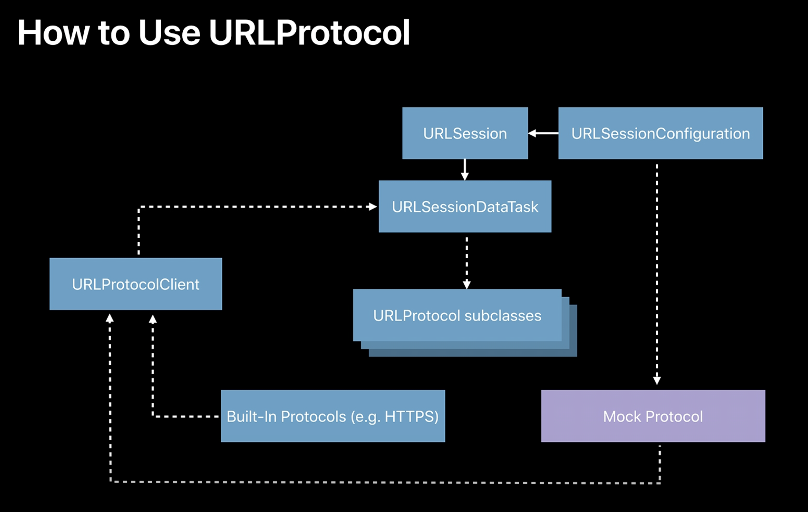

# 네트워크 목업 테스트

테스트 코드 작성은 외부 환경에 의존하면 안된다는 전제가 있다. 이러한 전제에 따라 네트워크 환경도 목킹해야 한다. 이 글에서는 네트워크 환경 목업에 대한 내용들을 정리하려고 한다.

## Mocks vs Stubs vs Fake

본격적인 내용 정리에 앞서 용어를 정리한다.

1. `Faking`: 프로덕션에서 사용되지 않는 클래스의 구현
2. `Mocking`: 객체의 메서드 호출에 대한 가짜 응답을 제공하는 것. 이를 통해 메서드 호출 및 응답으로 온 객체 속성값을 체크할 수 있다.
3. `Stubbing`: 메서드 호출에 따른 가짜 응답 자체를 가리키는 말.

## Unit Testing & Test Doubles

1. `Unit Testing`: `SUT`의 상태값을 `Assert`등을 통해 테스팅하는 것을 의미한다. `SUT`는 `System Under Test`의 준말로 테스트하고자 하는 주요 대상을 말한다. (상태 기반 테스트)
2. `Test Doubles`: 유닛 테스트를 위해 실 구현을 대체하는 가짜 컴포넌트 및 객체를 가리킨다. (행위 기반 테스트)
    1. `Stub`: 메서드 호출에 대한 가짜 응답. 백엔드 구축이 아직 덜 이루어진 경우 스텁을 통해 가짜 백엔드 모델을 정의해볼 수 있다. 스텁 객체에 대한 네이밍은 `메서드명 + toBeReturned`로 한다.
    2. `Spies`: 메서드 호출 형태를 정보로 저장하는 스텁이다. 메서드 호출이 정상적으로 이루어졌는지, 몇번이나 호출되었는지를 기록한다.
    3. `Mock`: 스텁과 유사하지만 메서드 호출이 실행되었는지, 객체 속성값이 세팅되었는지를 체크한다. 스텁은 상태 검증에 사용되고 목은 행위 검증에 사용된다.

아래는 [다음 문서에 작성되어 있는 스텁 예제 코드이다.](https://bocato.medium.com/test-doubles-in-swift-68d04884de73)

```swift
final class PostsServiceStub: PostsServiceProtocol {
    var fetchAllResultToBeReturned: Result<[Post], Error> = .success([])
    func fetchAll(then: (Result<[Post], Error>) -> Void) {
        then(fetchAllResultToBeReturned)
    }
}

// Usage
final class UserFeedViewModelTests: XCTestCase {

    func test_fetchAll_shouldReturnTheCorrectAmountOfPosts() {
        // Given
        let postsServiceStub = PostsServiceStub()
        let stubbedPosts: [Post] = [
            .init(title: "Post 1", text: "Post Text 1"),
            .init(title: "Post 2", text: "Post Text 2")
        ]
        postsServiceStub.fetchAllResultToBeReturned = .success(stubbedPosts)
        let sut = UserFeedViewModel(postsService: postsServiceStub)
        let initialNumberOfPosts = sut.numberOfPosts

        // When
        let loadDataExpectation = expectation(description: "loadDataExpectation")
        sut.loadData {
            loadDataExpectation.fulfill()
        }
        wait(for: [loadDataExpectation], timeout: 1.0)

        // Then
        XCTAssertNotEqual(initialNumberOfPosts, sut.numberOfPosts)
    }
}
```

1. 스텁 클래스를 정의한 뒤 `fetchAllResultToBeReturned` 속성을 정의한다. 이 속성값이 가짜 응답에 해당한다.
2. 테스트 코드를 작성할때 스텁 클래스로 객체를 생성하는데 이때 가짜 응답 값은 이니셜라이저 파라미터로 사용하지 않아야 다양한 케이스를 직접 테스트하기 용이하다.(`stubbedPosts` 배열)
3. 스텁 객체의 `fetchAllResultToBeReturned` 속성에 `success` 케이스로 값을 할당하여 응답이 정상적으로 이루어졌음을 나타낸다.
4. 뷰모델에 서비스 객체를 주입하고 가짜 네트워킹을 진행한다.

## 목업 프로토콜 작성



iOS에서 네트워크 통신은 `URLSessionConfiguration`에서 시작하여 `URLSession` 객체를 정의하고, 진행중인 요청 상태를 나타내는 `URLSessionDataTask`객체로 이어진다.

이때 해당 작업과 관련되어 내부 동작들이(네트워크 연결 열기, 요청 작성 및 응답 읽기 등) 추상화되어 있는 `URLProtocol`들이 존재한다.

위의 그림처럼 목업 프로토콜들을 재정의하여 `URLProtocolClient`에 진행 상황을 전달하고 이를 `URLSessionDataTask`에 전달함으로써 목업 네트워킹을 작성할 수 있다.

쉽게 말해, 네트워크 통신은 Alamofire의 `Session`객체를 통해 이루어지게 되는데 이때 세션 객체를 기본 configuration 기반으로 사용하는 것이 아니라 세션 객체의 `protocolClasses`를 커스텀하여 네트워크 통신이 가짜로 이루어짐을 선언하는 것이다.

프로토콜 클래스 커스텀시 구현해야할 네트워크 라이프사이클 필수 함수들이 있다. 커스텀 프로토콜 객체는 `URLProtocol`를 상속하는데, 필수 구현대상 함수들이 존재한다.

1. `canInit`: `true`값을 리턴하면 네트워크 요청 처리가 가능함을 알리게 됨 (It uses the protocol whose canInit(with:) class method returns true, indicating that the class is capable of handling the specified request.)
2. `canonicalRequest`: 기존 요청에 대한 수정이 필요할때 사용 가능하다. 헤더 및 url 스킴의 변경이 이루어질 때 사용 가능하다. 테스트 시에는 굳이 요청에 대한 변경이 불필요하기 때문에 파라미터로 전달된 요청 객체를 그대로 리턴하면 된다.
3. `startLoading`: 네트워크 요청에 따라 응답을 정의하는 구간이다. `URLProtocol` 객체는 `client` 속성값을 가진다. `client` 속성값의 `urlProtocol()`메서드를 호출하여 가짜 응답에 대한 정의와 가짜 응답 데이터에 대한 정의를 진행한다. `startLoading`함수 내에서는 아래 직접 정의된 두 함수가 호출된다.
    - `setUpMockResponse()`: 정상 응답 혹은 에러 모두 검증하고자 할 때가 있으니, 응답 자체에 대한 타입을 지정하는 것이라 보면 된다.
    - `setUpMockData()`: 번들 파일에 json파일을 정의한 뒤 정상 응답으로 리턴되는 데이터를 디코딩하여 내보내기 위해 사용된다.
4. `stopLoading`: 작업을 마치고 네트워크 통신을 끝낸다. 이 함수 내부는 비운 채로 구현하는 것이 안전하다.

위의 네 코드만 구현하면 `URLProtocol` 클래스를 상속받는 커스텀 프로토콜은 사용 가능하다.

```swift
// 코드 출처: https://leeari95.tistory.com/71
override func startLoading() {
    let response = setUpMockResponse() // 가짜 응답 셋업
    let data = setUpMockData() // 가짜 데이터 로드

    client?.urlProtocol(self, didReceive: response!, cacheStoragePolicy: .notAllowed)

    client?.urlProtocol(self, didLoad: data!)

    self.client?.urlProtocolDidFinishLoading(self)
}

private func setUpMockResponse() -> HTTPURLResponse? {
    var response: HTTPURLResponse?
    switch MockURLProtocol.responseType {
    case .error(let error)?:
        client?.urlProtocol(self, didFailWithError: error)
    case .success(let newResponse)?:
        response = newResponse
    default:
        fatalError("No fake responses found.")
    }
    return response!
}

private func setUpMockData() -> Data? {
    let fileName: String = MockURLProtocol.dtoType.fileName

    guard let file = Bundle.main.url(forResource: fileName, withExtension: nil) else {
        return Data()
    }
    return try? Data(contentsOf: file)
}
```

목업 응답 및 데이터 셋업 코드는 [이아리님의 iOS 탐구생활 블로그](https://leeari95.tistory.com/71)를 참조하였다. 나머지 목업 프로토콜 구현 코드의 경우 이아리님께서 `URLConfiguration`을 비공개 세션을 기반으로 하여 구현하여 추가적인 코드들이 있었는데, 본인의 경우 `URLSessionConfiguration`값을 `default`로 설정하여 실제 구현 필수 대상만 추가하였다.

:::details 목업 프로토콜 코드 전문

```swift
//
//  MockURLProtocol.swift
//  posepicker
//
//  Created by 박경준 on 12/2/23.
//

import Foundation

final class MockURLProtocol: URLProtocol {

    private lazy var session: URLSession = {
        let configuration: URLSessionConfiguration = URLSessionConfiguration.default
        return URLSession(configuration: configuration)
    }()

    enum ResponseType {
        case error(APIError)
        case success(HTTPURLResponse)
    }

    static var responseType: ResponseType!
    static var dtoType: MockDTOType!
}

extension MockURLProtocol {

    static func responseWithFailure() {
        MockURLProtocol.responseType = MockURLProtocol.ResponseType.error(APIError.unknown)
    }

    static func responseWithStatusCode(code: Int) {
        MockURLProtocol.responseType = MockURLProtocol.ResponseType.success(HTTPURLResponse(url: URL(string: K.baseUrl)!, statusCode: code, httpVersion: nil, headerFields: nil)!)
    }

    static func responseWithDTO(type: MockDTOType) {
        MockURLProtocol.dtoType = type
    }
}


extension MockURLProtocol {

    enum MockDTOType {
        case posepick
        case starred
        case user
        case empty
        case oauth
        case oauthBadRequest
        case oauthRedirectURLMismatch
        case oauthIncorrectClientCredentials

        var fileName: String {
            switch self {
            case .posepick: return "PosePick.json"
            case .empty: return ""
            }
        }
    }

    override class func canInit(with request: URLRequest) -> Bool {
        return true
    }

    override class func canonicalRequest(for request: URLRequest) -> URLRequest {
        return request
    }

    override func startLoading() {
        let response = setUpMockResponse()
        let data = setUpMockData()

        client?.urlProtocol(self, didReceive: response!, cacheStoragePolicy: .notAllowed)

        client?.urlProtocol(self, didLoad: data!)

        self.client?.urlProtocolDidFinishLoading(self)
    }

    private func setUpMockResponse() -> HTTPURLResponse? {
        var response: HTTPURLResponse?
        switch MockURLProtocol.responseType {
        case .error(let error)?:
            client?.urlProtocol(self, didFailWithError: error)
        case .success(let newResponse)?:
            response = newResponse
        default:
            fatalError("No fake responses found.")
        }
        return response!
    }

    private func setUpMockData() -> Data? {
        let fileName: String = MockURLProtocol.dtoType.fileName

       // 번들에 있는 json 파일로 Data 객체를 뽑아내는 과정.
        guard let file = Bundle.main.url(forResource: fileName, withExtension: nil) else {
            return Data()
        }
        return try? Data(contentsOf: file)
    }

    override func stopLoading() {
    }
}
```

:::

## Reference

1. [Stubbing, Mocking or Faking](https://medium.com/swlh/stubbing-mocking-or-faking-5674a07bc3db)
2. [Mocking Network Calls in Swift](https://stevenpcurtis.medium.com/mocking-network-calls-in-swift-ad04b59e79)
3. [Velog - Test Doubles](https://velog.io/@leeyoungwoozz/Test-Doubles)
4. [Medium - Unit Testing and Test Doubles in Swift](https://medium.com/mobil-dev/unit-testing-and-test-doubles-in-swift-5b5e93e68512)
5. [Medium - Test Doubles in swift](https://bocato.medium.com/test-doubles-in-swift-68d04884de73)
6. [WWDC2018 - Testing Tips & Tricks](https://developer.apple.com/videos/play/wwdc2018/417/)
7. [Medium - How to Test Your Network Connection Requests in Swift Using URLProtocol](https://betterprogramming.pub/how-to-test-your-network-connection-requests-in-swift-using-urlprotocol-eb4b09d51f22)
