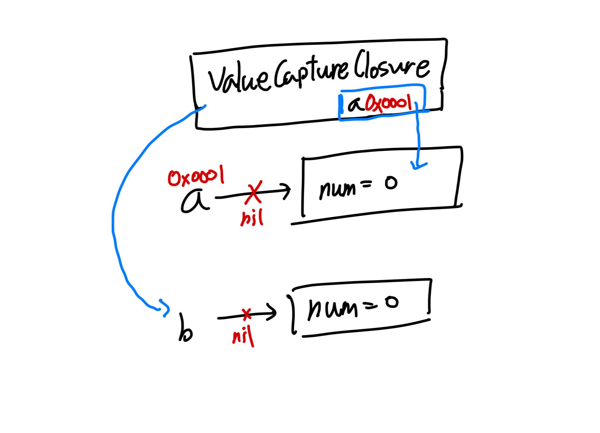
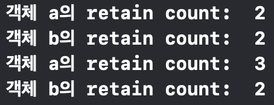

## 들어가며

`RxSwift`로 프로젝트를 진행하다보니 클로저를 정말 수도 없이 사용하게 되었다. `weak self`로 코드를 작성하다보니 바인딩 로직이 너무 복잡해져서, `unowned self` 기반으로 코드를 작성해도 되는지 찾아보다가 스택오버플로우에서 `disposeBag` 기반으로 동작하는 옵저버블은 괜찮다고 하는 글이 있어서 `unowned self` 기반으로 코드를 작성했었다.

왜 이러한 코드가 안전한지, 안전한건 실제로 맞는 지에 대한 면밀한 검증없이 코드를 작성한 것이 자꾸 마음에 걸려 이번 기회에 정리해보려고 한다.

## Capturing

클로저는 참조 타입이어서 함수 묶음의 주소가 힙 영역에 남는다. 이때 클로저 내에서 외부 값을 사용하게 될때 **외부 값의 주소를** 클로저 내에서 참조하게 된다.

```swift
var stored = 0

let closure = { (number: Int) -> Int in
    stored += number
    return stored
}

print(closure(3)) // 3
print(stored) // 3
```

위 예시코드에서 `closure`라는 이름의 클로저는 외부 값인 `stored` 변수의 참조를 갖는다. 이에 따라 `closure(3)`이 `stored` 변수 값을 직접 변경하는 동작이 이루어진 것이다.

```swift
func calculateFunc() -> ((Int) -> Int) {
    var sum = 0

    func square(num: Int) -> Int {
        sum += (num * num)
        return sum
    }

    return square
}

let returnedFunc = calculateFunc()

returnedFunc(3) // square 호출 후 캡처중인 sum에 9 더하기
returnedFunc(4) // square 호출 후 캡처중인 sum에 16 더하기
// 최종 sum값은 25가 됨
```

1. `calculateFunc` 호출로 스택 프레임에 함수가 하나 쌓임
2. `sum` 변수를 캡처링하는 `square` 함수를 리턴하며 스택 프레임 해제
3. 리턴된 `square` 함수 묶음은 힙에 저장

`square` 함수가 클로저로 힙에 저장되면서 동시에 `sum`변수를 캡처링하여 힙에서 참조를 하게 된다. 이에 따라 클로저 호출로 `sum` 변수에 콜 바이 레퍼런스 동작이 이루어진다.

:::tip @escaping 키워드

함수 파라미터에 전달되는 클로저를 외부 변수에 저장하려면 파라미터 앞에 `@escaping`키워드를 붙여야 한다.

```swift
var handler: () -> () = { print("HANDLER") } // 클로저 저장

func performEscaping(completion: @escaping () -> ()) {
    print("HI")
    handler = completion // 파라미터의 completion 클로저를 외부 변수에 할당
    // 캡처링이 이루어짐
}

handler() // HANDLER

performEscaping { // perfomEscaping 실행과 함께 HI 출력
    print("YEAH") // print("YEAH") 클로저가 handler에 할당
}

handler() // YEAH
```

:::

## 캡처 리스트

### 값 타입 캡처리스트

캡처리스트는 쉽게 말해 외부에 참조하려는 변수에 저장된 값을 복사해오는 리스트라고 이해하면 된다. 먼저 값 타입 복사를 살펴보자.

```swift
var num = 1

let valueCaptureClosure = { [num] in
    print(num)
}

valueCaptureClosure()
num = 2
valueCaptureClosure()
```

위의 출력결과를 예상해보자. 아래 두 선택지 중 어떤 것이 정답일까?

1. `1`이 출력된 후 `2`가 출력된다.
2. `1`이 출력된 후 `1`이 출력된다.

현재 `num`이라는 외부 변수를 `valueCaptureClosure`에서 캡처링하는데, 캡처 리스트에 등록된 상태이다. 클로저가 힙에 저장되는 시점에, `num` 변수의 값을 복사하여 할당해놓는 것이다. 따라서 정답은 2번으로 외부 변수의 값이 변경되더라도 클로저 기준에서는 복사된 값만 출력하게 된다.

### 참조 타입 캡처리스트

```swift
class Some {
    var num = 0
    var name = ""

    deinit {
        print("deinit: \(self.name)")
    }
}

var a: Some? = Some()
var b: Some? = Some()

let valueCaptureClosure = { [a] in
    print(a?.num)
    print(b?.num)
}

a?.num = 1
b?.num = 1

a?.name = "a"
b?.name = "b"

a = nil
b = nil

valueCaptureClosure()
```

위 코드를 봤을때 `a`, `b` 객체는 모두 소멸자를 호출할까? 아래 그림을 살펴보자.



위 그림의 구조에 따르면 `a`객체와 `b`객체 모두 `nil`을 할당하더라도 클로저의 캡처 리스트에 등록된 `a` 변수로 인해 주소값 자체를 복사하여 클로저 내에 저장된다.

`a`를 참조하지 않고 주소값을 복사하여 클로저 내에서 보관하기 때문에 인스턴스를 여전히 참조하게 되고, 소멸자 호출이 이루어지지 않는 것이다.

:::tip 객체 RC값 출력하는 방법

```swift
import Foundation

print(CFGetRetainCount(객체))
```

:::

위의 예시 코드에서 `valueCaptureClosure`가 메모리에 할당되는 시점 전후로 RC값을 출력해보자.

```swift
print(CFGetRetainCount(a))
print(CFGetRetainCount(b))

let valueCaptureClosure = { [a] in
    print(a?.num)
    print(b?.num)
}

print(CFGetRetainCount(a))
print(CFGetRetainCount(b))
```

그림에 따르면 `a`객체의 RC값이 `b` 객체의 RC값보다 하나 더 많아야 한다. 출력해보면 클로저 할당 시점 이후에 RC값이 3으로 증가되어 있는 것을 볼 수 있다.



`a` 변수에 직접 `nil`값을 할당하여 `a`라는 이름의 변수를 통해 증가된 RC값은 1 감소하게 된다. 그럼에도 캡처리스트에 등록된 `a`가 가리키던 인스턴스 주소가 클로저 내에서 살아있기 때문에, 객체에 여전히 접근 가능한 상태가 된다.

```swift
a?.num = 1
b?.num = 1

a?.name = "a"
b?.name = "b"

let valueCaptureClosure = { [a] in
    print("num of object a: ",a?.num)
    print("num of object b: ",b?.num)
}

a = nil
b = nil

valueCaptureClosure()
// num of object a:  Optional(1)
// num of object b:  nil
```

이름만 외부 변수명 `a`와 동일한 것이지, 메모리 상의 주소값이 복사되어 클로저 내에서 활용되고 있는 상태인 것이다.

## weak, strong, unowned 참조

객체가 소멸되어야 하는 시점에 메모리 상의 참조관계로 인해 `nil` 할당 이후에도 메모리에 객체가 살아있다는 것이 바로 메모리 누수 문제이다.

```swift
class Singer {
    func playSong() {
        print("Shake it off!")
    }
}

func sing() -> () -> Void {
    let taylor = Singer()

    let singing = { [taylor] in
        taylor.playSong()
        return
    }

    return singing
}

let singFunction = sing()
singFunction()
```

### 1. weak 참조 (약한 참조)

`weak`으로 캡처 리스트에 외부 변수를 등록하는 경우 클로저에 의해 외부 변수를 살아있게 할 수 없게 된다. 즉, 인스턴스의 생성과 소멸의 책임이 클로저에게 없어서 외부에서 객체가 소멸되는지 여부에 맞추어 클로저도 동작하게 되는 것이다.

이러한 이유로 인해 약한 참조 대상들은 옵셔널 기반으로 동작하게 되는 것이다. 클로저에서 인스턴스의 생존 시점을 모르기 때문에 책임을 외부로 전가한다는 의미가 내포된 것으로 생각해도 될 것이다.

### 2. unowned 참조 (비소유 참조)

비소유 참조는 약한참조와 동일하게 클로저에 의해 외부 변수를 살아있게 하지 않는다. 즉 클로저를 통해 RC값을 증가시키지 않는다는 것인데, 비소유 참조의 차이점은 **외부에서 객체가 소멸되는지 여부에 상관없이 클로저 코드가 실행되는 환경에서는 인스턴스가 항상 생존해있다는 것을 가정하는 것이다.**

위의 예시 코드를 비소유 참조로 캡처 리스트에 등록하여 실행하면 런타임 에러가 발생하며 종료된다. `taylor`라는 객체가 클로저에 의해 살아있을 의무가 없으므로, `singFunction` 함수가 종료되고 스택 프레임에서 `Pop out`되는 순간 객체가 메모리에서 소멸되기 때문이다.

## Reference

1. [stackoverflow - RxSwift: Is it safe to always use [unowned self] when a class has a disposeBag property?](https://stackoverflow.com/questions/46844148/rxswift-is-it-safe-to-always-use-unowned-self-when-a-class-has-a-disposebag-p)
2. [Hacking with swift - Capturing values](https://www.hackingwithswift.com/sixty/6/11/capturing-values)
3. [Hacking with swift - Capture lists in Swift: what’s the difference between weak, strong, and unowned references?](https://www.hackingwithswift.com/articles/179/capture-lists-in-swift-whats-the-difference-between-weak-strong-and-unowned-references)
4. [stackoverflow - Why does initializing this swift object produce an ARC of 2 instead of 1?](https://stackoverflow.com/questions/52599942/why-does-initializing-this-swift-object-produce-an-arc-of-2-instead-of-1)
