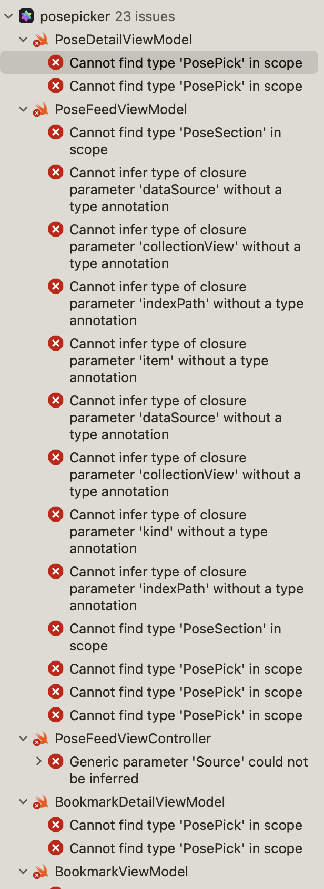

## 개요

프로젝트 팀원분들은 절대 보채시지 않으셨지만.. 어쩌다 보니 너무 빠른 호흡으로 개발이 진행되어 정말 눈에 보이는 것에만 집중된 개발을 하게 되었다. 유지보수나 앱 전체적인 구조는 크게 고려하지 않고 기능 구현 중심으로 개발을 진행했는데, 그러다 보니

테스트 코드 작성은 물론이거니와 아래와 같은 문제도 발생했다.



뷰모델에서 데이터를 직접적으로 소유하다 보니 데이터 타입 명세서가 변경되자 마자 미친듯한 에러가 발생하였다. 이것이 유지보수가 고려되지 않은 앱이라는 것을 절실히 깨닫는 지점이었다.

문제를 직접 경험하다 보니 레파지토리 패턴이라던지, 클린 아키텍처 관점에서 도메인과 프레젠테이션, 데이터 형태로 계층을 구분하여 앱을 개발하는 이유를 조금이나마 헤아려볼 수 있었던 것 같다.

이 글에서는 출시 준비중인 포즈피커 앱에 클린 아키텍처를 적용해가는 과정을 정리하려고 한다. 이 글 작성에 많은 도움이 된 [메이트러너 클린 아키텍처 도입기 글을](https://jeonyeohun.tistory.com/305) 꼭 정독하면 좋을 것 같다!

## 가장 간단한 것부터

전체 코드를 뒤엎기 전 어디부터 손대야 할지 결정해야 했다. 현재 포즈피커 앱에서는 네컷 포즈를 단어 형태로 랜덤하게 제공해주는 기능이 있는데, 해당 씬의 경우 데이터 요청 동작이 GET 하나일 뿐 아니라 불러온 인스턴스로부터 `String`값만 추출하여 화면에 바인딩하면 되는게 다라서 여기부터 리팩토링을 하기로 결정했다.


## 레퍼런스 프로젝트

https://github.com/boostcampwm-2021/iOS06-MateRunner

→ 메이트러너 클린 아키텍처

## 진행 단계

-   [x] 레파지토리 인터페이스 정의
    -   [x] 유저 도메인
    -   [x] 포즈 도메인

### 포즈톡 클린 아키텍처 적용

iOS에서 클린 아키텍처는 기본적으로 엔티티 개념이 씬으로 갈음됨 (화면 단위)

1. 포즈톡 씬에 대해 도메인 모델 & 유스케이스 정의

```swift
protocol PoseTalkUseCase {
    var poseWord: PublishSubject<String> { get set }

    func fetchPoseTalk()
}
```

→ 포즈톡 씬에서 사용할 데이터 자체를 유스케이스에서 보유하고 있도록 인터페이스 작성

→ 포즈톡 데이터 요청에 대한 동작까지 정의

1. 유스케이스는 데이터에 대한 보유 및 presentation 레이어로 뿌려주는 책임만 가지므로 실제로 어떻게 요청이 날라가는지에 대한 구현 형태는 인지하지 못함
2. 따라서, 유스케이스 데이터 요청이 시작되면 `실제로 요청을 진행할 구현체`를 `레파지토리` 객체에 작성하게 됨
3. 레파지토리 객체는 외부로부터 주입된 네트워크 요청 세션 객체를 기반으로 네트워크 통신을 진행한다.
    1. 현재 구현된 범위는 HTTP 통신에 한정되어 있지만 `플랫폼 확장을 하게 되는 경우` ex) 기기 자체 저장소 → 해당 플랫폼에 대한 CRUD 요청 로직을 담고 있는 서비스 객체를 구현한 뒤 레파지토리에 주입하면 됨
4. 레파지토리 객체에 주입된 HTTP 통신 서비스 객체는 `POST` `GET` `PATCH` 등 여러 메서드에 대해 인터페이스가 먼저 정의되고, 실제 통신에 대한 내용은 인터페이스 구현체를 담고 있는 `DefaultNetworkService` 클래스에 추가된다.
    1. ex) 200~300 사이의 응답에 대한 처리 방법
    2. ex) 멀티파트 통신 처리 방법 구현체 등
5. 프레젠테이션 계층에 넘어가서는 **`뷰모델에 유스케이스를 주입해준다.`**

```swift
let poseTalkVC = PoseTalkViewController()
poseTalkVC.viewModel = PoseTalkViewModel(
    coordinator: self.coordinator,
    posetalkUseCase: DefaultPoseTalkUseCase(
        posetalkRepository: DefaultPoseTalkRepository(
            networkService: DefaultNetworkService()
        )
    )
)
```

1. Input & Output에 대한 UI 로직을 작성한다.
    1. 인풋 기반으로 데이터 요청이 필요하면 주입된 유스케이스를 통해 데이터 요청을 진행한다. → 이때 뷰모델은 유스케이스에 동작 요청만 하는 것이기 때문에 `내부 과정을 모른다.` → 목업 유스케이스를 주입하면 테스트 작성하기가 수월해짐
    2. `configureInput` 함수를 뷰모델 내에 정의해서 특정 인풋에 대해 유스케이스 데이터 요청 타이밍을 지정한다
    3. 인풋을 통해 유스케이스에 데이터 세팅이 완료되면 뷰모델에 정의해둔 **`private** **func** createOutput` 함수를 호출하여 실제 아웃풋 인스턴스를 리턴한다
    4. 뷰 컨트롤러로 아웃풋을 내보낸 뒤 UI 바인딩을 진행한다
2. 뷰 컨트롤러에서 `bindViewModel` 로 인풋을 뷰모델에 전달하고 `transform` 을 통해 리턴된 아웃풋을 뷰 컨트롤러의 `configureViewModelOutput` 함수 파라미터에 전달해준다.
    1. `configureViewModelOutput` 함수는 뷰 컨트롤러 익스텐션에 `private` 으로 정의
    2. 이 함수에서 UI 실제 바인딩이 진행된다

## 생각해본 장점

1. 테스터블한 코드가 되었다 (목업 유스케이스 작성 및 주입이 쉬움)
2. **`뷰모델이 진짜 가벼워졌다.`** → 네트워크 요청, 데이터의 정제 로직이 레파지토리로 분리되었음!

## 의문점

1. 데이터 명세 변경에 따라 수정사항을 최대한으로 줄이는 것도 클린 아키텍처의 주요한 장점중 하나인데, UI 바인딩 과정에서 RxCocoa 특성상 `String` 과 같은 특정 타입에 의존하게 되는 문제
    1. 도메인 모델 타입 변경시 유스케이스 타입 변경 → 레파지토리 타입 변경 → UI 바인딩 타입 변경,, 캐스캐이딩 하게 많은 변경이 이루어지는 것은 동일한 것 같은데 🤔
    2. → 매우 당연한 것 ! 서비스의 비즈니스 로직 및 엔티티 구성은 **`기능에 비해 상대적으로 매우 안정적이고, 변화가 적다는 것을 인지`**

## Reference

1. [Template iOS App using Clean Architecture and MVVM](https://github.com/kudoleh/iOS-Clean-Architecture-MVVM)
2. [메이트러너: MVVM + Clean Architecture + RxSwift 도입기](https://jeonyeohun.tistory.com/305)
