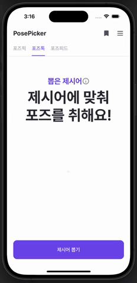

## 개요

프로젝트 팀원분들은 절대 보채시지 않으셨지만.. 어쩌다 보니 너무 빠른 호흡으로 개발이 진행되어 정말 눈에 보이는 것에만 집중된 개발을 하게 되었다. 유지보수나 앱 전체적인 구조는 크게 고려하지 않고 기능 구현 중심으로 개발을 진행했는데, 그러다 보니 테스트 코드 작성은 물론이거니와 아래와 같은 문제도 발생했다.


뷰모델에서 데이터를 직접적으로 소유하다 보니 데이터 타입 명세서가 변경되자 마자 미친듯한 에러가 발생하였다. 이것이 유지보수가 고려되지 않은 앱이라는 것을 절실히 깨닫는 지점이었다.

문제를 직접 경험하다 보니 레파지토리 패턴이라던지, 클린 아키텍처 관점에서 도메인과 프레젠테이션, 데이터 형태로 계층을 구분하여 앱을 개발하는 이유를 조금이나마 헤아려볼 수 있었던 것 같다.

이 글에서는 출시 준비중인 포즈피커 앱에 클린 아키텍처를 적용해가는 과정을 정리하려고 한다. 이 글 작성에 많은 도움이 된 [메이트러너 클린 아키텍처 도입기 글을](https://jeonyeohun.tistory.com/305) 꼭 정독하면 좋을 것 같다!

## 아키텍처 다이어그램

클린 아키텍처가 적용된 다이어그램을 보면 다음과 같다.


앱 내에 레이어들은 아래와 같이 구분된다.

1. 도메인 계층: 모델, 유스케이스 프로토콜, 유스케이스 구현체
    - 모델: JSON 디코딩에 사용될 타입
    - 유스케이스 프로토콜: 앱 Scene별로 뿌려줄 데이터 형태
    - 유스케이스 구현체: 프로토콜 채택 후 구현이 이루어진 실제 클래스
2. 데이터 계층: 레파지토리 프로토콜, 레파지토리 구현체
    - 레파지토리 프로토콜: 네트워크 요청 흐름에 대한 정의
    - 레파지토리 구현체: 프로토콜 채택 후 네트워크 요청에 대한 내부 코드. 유스케이스에 주입할 때는 타입을 프로토콜로 전달하여 내부 코드가 은닉화된다
3. 프레젠테이션 계층: Scene별로 그룹화 이후 뷰와 뷰모델, 코디네이터로 구성
    - 코디네이터: 화면 이동의 로직 전체가 정의된다. 흐름을 프로토콜로 먼저 정의하고 이에 대한 실제 구현을 클래스에 정의
    - 뷰모델: 뷰로부터의 이벤트 처리 로직 전반을 작성한다. 유스케이스를 보유하며 인풋에 따른 유스케이스 데이터 로드 타이밍을 정의하게 된다.
    - 뷰 컨트롤러: UI 구현
4. 인프라 계층: 네트워크 관련 설정 및 요청 코드 작성, 라우터 정의
    - 네트워크 서비스 프로토콜: 네트워크 요청 형태를 정의한다. 일반 네트워크 통신을 위한 Single 옵저버블을 리턴하는 함수와 멀티파트 POST 통신을 위한 `requestMultipartSingle` 함수로 구성
    - 각종 에러, URLRequest을 리턴해주는 라우터 열거형, 인증 만료 처리를 위한 네트워크 인터셉터, 디버깅을 위한 이벤트 로거 존재
5. 그 외: 상수값, 열거형, 컴포넌트 등

## 코디네이터 패턴

코디네이터는 프레젠테이션 레이어에 속한다. 화면 이동 로직들 전체를 독점적으로 관리하게 된다. `present` 혹은 `dismiss`와 같은 함수 호출은 뷰 컨트롤러 내에서 간단하게 이루어질 수 있지만, 특정 UI와의 상호작용을 통해 이루어진다는 점에서 뷰모델에서 해당 이벤트를 관찰하고 있어야 하며 이에 따른 처리 로직 역시 뷰모델 내에서 이루어져야 한다고 볼 수 있다.


위의 예시 화면을 보면 이미지 탭 이후 확대된 이미지 뷰를 보유한 컨트롤러를 present하는게 전부인 동작이지만 뷰 컨트롤러 내에 로직을 넣지 않고 코디네이터로 로직을 이동시킨다는 것이다.

```swift
override func bindViewModel() {
    let input = PosePickViewModel.Input(
        selectedPeopleCount: selection.pressIndex.asObservable(),
        posepickButtonEvent: posePickerButton.rx.tap.asObservable(),
        isAnimating: isAnimating.asObservable(),
        imageViewTapEvent: imageViewTapEvent // 이미지 탭 이벤트 전달
    )

    let output = viewModel?.transform(input: input, disposeBag: disposeBag)
    self.configureViewModelOutput(output)
}

@objc
func retrievedImageTapped() {
    guard let retrievedImage = retrievedImage.image else { return }
    imageViewTapEvent.onNext(retrievedImage)
}
```

뷰 컨트롤러 내에 `private` 선언된 옵저버블을 선언해두고 탭된 이미지를 뷰모델의 인풋으로 전달한다.

```swift
func transform(input: Input, disposeBag: DisposeBag) -> Output {
    let output = Output()

    /// 이미지뷰 탭 이후 상세 이미지 띄우기
    input.imageViewTapEvent
        .subscribe(onNext: { [weak self] in
            self?.coordinator?.presentDetailImage(retrievedImage: $0)
        })
        .disposed(by: disposeBag)

    return output
}
```

뷰모델에서는 코디네이터에 띄워줄 상세 이미지를 전달한다. 코디네이터 구현 클래스는 다음과 같다

```swift
final class DefaultPosePickCoordinator: PosePickCoordinator {
    // ...

    func presentDetailImage(retrievedImage: UIImage?) {
        let vc = ImagePopUpViewController(mainImage: retrievedImage)
        vc.modalTransitionStyle = .crossDissolve
        vc.modalPresentationStyle = .overFullScreen
        self.navigationController.present(vc, animated: true)
    }
}
```

모든 코디네이터 프로토콜은 베이스가 되는 기초 `Coordinator` 프로토콜을 상속받는다.

```swift
protocol Coordinator: AnyObject {
    var navigationController: UINavigationController { get set }
    var childCoordinators: [Coordinator] { get set }
    var type: CoordinatorType { get }
    func start()
    func finish()
    func findCoordinator(type: CoordinatorType) -> Coordinator?

    init(_ navigationController: UINavigationController)
}
```

화면 전환 흐름에 따라 네비게이션 컨트롤러를 새로 생성할 수도, 아니면 현재 네비게이션 컨트롤러에 push할지 present할지 등의 로직들은 직접 정의하면 된다.

## 가장 간단한 것부터

전체 코드를 뒤엎기 전 어디부터 손대야 할지 결정해야 했다. 현재 포즈피커 앱에서는 네컷 포즈를 단어 형태로 랜덤하게 제공해주는 기능이 있는데, 해당 씬의 경우 데이터 요청 동작이 GET 하나일 뿐 아니라 불러온 인스턴스로부터 `String`값만 추출하여 화면에 바인딩하면 되는게 다라서 여기부터 리팩토링을 하기로 결정했다.



### 리팩토링 전

기존 뷰모델 클래스를 보면 다음과 같다.

```swift
class PoseTalkViewModel: ViewModelType {
    var apiSession: APIService = APISession()
    var disposeBag = DisposeBag()

    struct Input {
        let poseTalkButtonTapped: ControlEvent<Void>
        let isAnimating: Observable<Bool>
    }

    struct Output {
        let animate: Driver<Void>
        let poseWord: Observable<String>
        let isLoading: BehaviorRelay<Bool>
    }

    func transform(input: Input) -> Output {
        let poseWord = BehaviorRelay<String>(value: "제시어에 맞춰\n포즈를 취해요!")
        let isLoading = BehaviorRelay<Bool>(value: false)

        input.poseTalkButtonTapped
            .flatMapLatest { [unowned self] _ -> Observable<PoseTalk> in
                self.apiSession.requestSingle(.retrievePoseTalk).asObservable()
            }
            .subscribe(onNext: {
                poseWord.accept($0.poseWord.content)
            })
            .disposed(by: disposeBag)

        /// 애니메이션 + 네트워크 관련 로직 추가를 고려한 설계
        input.isAnimating
            .subscribe(onNext: {
                isLoading.accept($0)
            })
            .disposed(by: disposeBag)

        return Output(animate: input.poseTalkButtonTapped.asDriver(), poseWord: poseWord.asObservable(), isLoading: isLoading)
    }
}
```

뷰모델이 네트워크 서비스 객체를 직접 소유하고 있으며 버튼 탭 이후 네트워크 요청을 뷰모델에서 직접 진행하게 된다. 이 과정에서 `APISession` 객체가 제네릭으로 선언되어 있기에 타입 명시가 이루어져야 하고 데이터 정제도 필요하기 때문에 `flatMapLatest`와 같은 오퍼레이터가 필연적으로 사용된다.

### 리팩토링 후

```swift
class PoseTalkViewModel {
    weak var coordinator: PoseTalkCoordinator?
    private let posetalkUseCase: PoseTalkUseCase

    init(coordinator: PoseTalkCoordinator?, posetalkUseCase: PoseTalkUseCase) {
        self.posetalkUseCase = posetalkUseCase
    }

    struct Input {
        let poseTalkButtonTapped: ControlEvent<Void>
        let isAnimating: BehaviorRelay<Bool>
    }

    struct Output {
        let animate = PublishSubject<Void>()
        let poseWord = PublishRelay<String>()
    }

    func transform(input: Input, disposeBag: DisposeBag) -> Output {
        self.configureInput(input, disposeBag: disposeBag)
        return createOutput(from: input, disposeBag: disposeBag)
    }

    private func configureInput(_ input: Input, disposeBag: DisposeBag) {
        input.poseTalkButtonTapped
            .subscribe(onNext: { [weak self] in
                self?.posetalkUseCase.fetchPoseTalk()
            })
            .disposed(by: disposeBag)
    }

    private func createOutput(from input: Input, disposeBag: DisposeBag) -> Output {
        let output = Output()

        input.poseTalkButtonTapped
            .subscribe(onNext: {
                output.animate.onNext(())
            })
            .disposed(by: disposeBag)

        Observable.combineLatest(self.posetalkUseCase.poseWord, input.isAnimating)
            .subscribe(onNext: { poseWord, animating in
                if !animating {
                    output.poseWord.accept(poseWord)
                }
            })
            .disposed(by: disposeBag)

        return output
    }
}
```

코드의 길이 자체는 길어졌지만 계층이 분리되어 뷰모델의 본질적인 책임인 **뷰로부터의 이벤트 상호작용 로직을 표기하는 것에** 집중도를 확 높일 수 있었다.

1. 버튼이 탭 된 이후 뷰모델에 주입된 유스케이스에 데이터를 요청한다.
2. 비동기적으로 불러올 데이터를 구독해둔 뒤 뷰에 뿌려줄 아웃풋 옵저버블에 전달한다.

### 유스케이스

유스케이스는 기본적으로 프로토콜과 이를 채택하여 구현한 클래스 두개로 구분된다. 포즈톡 씬의 유스케이스는 다음과 같이 구성된다.

```swift
protocol PoseTalkUseCase {
    var poseWord: PublishSubject<String> { get set }

    func fetchPoseTalk()
}
```

이를 채택하여 구현한 클래스의 경우 아래와 같이 작성된다.

```swift
final class DefaultPoseTalkUseCase: PoseTalkUseCase {
    private let posetalkRepository: DefaultPoseTalkRepository
    private var disposeBag = DisposeBag()

    var poseWord = PublishSubject<String>()

    init(posetalkRepository: DefaultPoseTalkRepository) {
        self.posetalkRepository = posetalkRepository
    }

    func fetchPoseTalk() {
        posetalkRepository.fetchPoseWord()
            .subscribe(onNext: { [weak self] poseTalk in
                self?.poseWord.onNext(poseTalk)
            })
            .disposed(by: disposeBag)
    }
}
```

각 유스케이스 프로토콜에서는 씬에서의 데이터 인풋과 아웃풋을 보유하는 책임을 갖도록 작성했다. 포즈톡의 경우 화면에 뿌려줄 단어가 유스케이스의 옵저버블 속성에 바인딩되어 있고, 데이터를 직접 요청하는 함수가 존재한다.

유스케이스 역시 본질적인 책임은 데이터 보유 및 전달에 있기 때문에, 데이터를 요청하는 책임은 레파지토리라는 객체에게 위임된다.

### 레파지토리

```swift
protocol PoseTalkRepository {
    func fetchPoseWord() -> Observable<String>
}
```

레파지토리는 어떤 데이터를 요청할 지에 대한 함수들을 구현하게 된다. 포즈톡의 경우 포즈 키워드를 서버에게 요청하는 함수만 구현하면 된다.

```swift
final class DefaultPoseTalkRepository: PoseTalkRepository {
    let networkService: NetworkService

    init(networkService: NetworkService) {
        self.networkService = networkService
    }

    func fetchPoseWord() -> Observable<String> {
        let request: Observable<PoseTalk> = networkService.requestSingle(.retrievePoseTalk)
            .asObservable()
        return request.map { $0.poseWord.content }
    }
}
```

포즈톡 레파지토리 구현체의 경우 네트워크 서비스 객체를 속성으로 가지며 해당 객체를 통해 데이터를 정제까지 한 뒤 옵저버블로 리턴한다.

```swift
final class DefaultPoseTalkRepository: PoseTalkRepository {
    let networkService: NetworkService

    init(networkService: NetworkService) {
        self.networkService = networkService
    }

    func fetchPoseWord() -> Observable<String> {
        return networkService.requestSingle(.retrievePoseTalk)
            .asObservable()
            .map { (poseTalk: PoseTalk) -> String in
                return poseTalk.poseWord.content
            }
    }
}
```

레파지토리에서 리턴한 옵저버블을 유스케이스에서 구독하고, 최종적으로 데이터가 방출되면 이를 뷰까지 뿌려주는 플로우를 갖는 것이다.

뷰모델에서 데이터 요청 및 정제 등 모든 작업들을 일임하다가 책임들을 유스케이스와 레파지토리에 분산시켜 관리하니 뷰모델의 직관성이 향상되었으며 포즈피드 씬의 경우 코드량 자체가 눈에띄게 줄어들게 되었다.

## 테스트코드 작성 - 1. 유스케이스

포즈피커 앱은 주된 컨텐츠가 이미지이기 때문에 캐시 기반으로 앱이 동작하게 된다. 킹피셔의 경우 메모리 혹은 디스크에 접근한 뒤 URL값을 키로 접근했을 때 이미지를 불러올 수 없는 경우 자동적으로 네트워크를 통해 이미지를 다운로드 하게 된다.

이때 목업 URL 프로토콜을 주입해놓으면 테스트 상황에서 xcode 프로젝트의 로컬에 저장되어 있는 이미지를 네트워크로부터 불러온 이미지 대체용으로 전달한 뒤 세션 객체를 종료할 수 있게 된다. 자세한 내용은 [다음 링크를](https://parkjju.github.io/vue-TIL/trash/231205-39.html) 참조하면 좋다.

따라서 유스케이스 함수 호출 이후에, 이미지 캐싱이 정상적으로 이루어지는 지에 대한 테스트 코드를 작성하게 된 것이다. 유스케이스는 기본적으로 레파지토리를 주입받는데, 의존성 주입 형태로 코드를 리팩토링 하였기에 실제 네트워크 요청을 진행하는 레파지토리 객체를 주입하는 것이 아닌, 데이터를 정상적으로 불러온 이후 상황으로 하드코딩된 가짜 데이터 옵저버블을 리턴하게 된다.

```swift
final class PosePickUseCaseTests: XCTestCase {

    private var disposeBag = DisposeBag()
    private var posepickRespository: PosePickRepository!
    private var posepickUseCase: PosePickUseCase!
    private var scheduler: TestScheduler!

    override func setUp() {
        super.setUp()

        // 킹피셔 ImageDownloader 객체에 목업 프로토콜 주입
        let imageDownloader: ImageDownloader = {
            let downloader = ImageDownloader.default
            let configuration = URLSessionConfiguration.default
            configuration.protocolClasses = [MockURLProtocol.self]
            downloader.sessionConfiguration = configuration
            return downloader
        }()

        // 포즈픽 레파지토리 주입
        self.posepickRespository = MockPosePickRepository(imageDownloader: imageDownloader)

        // 유스케이스 생성과 함께 목업 레파지토리 주입
        self.posepickUseCase = DefaultPosePickUseCase(
            posepickRepository: self.posepickRespository
        )

        self.scheduler = .init(initialClock: 0)

        ImageCache.default.clearCache()
    }

    func test_디스크_캐싱_처리가_잘_되는지 (){
        let expectation = XCTestExpectation(description: "포즈픽 유스케이스 데이터 잘 불러오는지")

        MockURLProtocol.responseWithStatusCode(code: 200)
        MockURLProtocol.responseWithDTO(type: .cacheImage)

        self.scheduler.createColdObservable([
            .next(0, ())
        ])
        .subscribe(onNext: { [weak self] in
            self?.posepickUseCase
                .fetchPosePick(peopleCount: 4)
        })
        .disposed(by: disposeBag)

        self.posepickUseCase
            .poseImage
            .subscribe(onNext: {
                print($0)
                expectation.fulfill()
            })
            .disposed(by: self.disposeBag)

        self.scheduler.start()

        wait(for: [expectation], timeout: 5)
    }

    override func tearDown() {
        super.tearDown()
        self.disposeBag = DisposeBag()
        self.posepickUseCase = nil
        self.posepickRespository = nil
        self.scheduler = nil

        ImageDownloader.default.sessionConfiguration = .default
    }
}
```

레파지토리의 경우 프로토콜 기반으로 선언된 함수 리스트만 필수적으로 구현하면 확장성 있게 객체 생성이 가능하기 때문에 테스트 코드에서도 레파지토리 타입을 프로토콜로 선언한 뒤, 실제 객체 생성 단계에서는 목업 객체를 주입하는 방식으로 구현할 수 있게 되었다.

목업 레파지토리 코드를 보면 다음과 같다.

```swift
final class MockPosePickRepository: PosePickRepository {
    func fetchPoseImage(peopleCount: Int) -> Observable<UIImage?> {
        return Observable.just("TEST URL.com")
            .withUnretained(self)
            .flatMapLatest { (owner, imageURL) -> Observable<UIImage?> in
                return owner.cacheItem(for: imageURL)
            }
    }

    let imageDownloader: ImageDownloader

    init(imageDownloader: ImageDownloader = ImageDownloader.default) {
        self.imageDownloader = imageDownloader
    }

    private func cacheItem(for imageURL: String) -> Observable<UIImage?> {
        return Observable.create { observer in
            ImageCache.default.retrieveImageInDiskCache(forKey: imageURL) { [weak self] result in
                guard let self = self else { return }
                switch result {
                case .success(let value):
                    if let image = value?.images?.first {
                        observer.onNext(image)
                    } else if let url = URL(string: imageURL) {
                        KingfisherManager.shared.retrieveImage(with: url, options: [.downloader(self.imageDownloader)]) { downloadResult in
                            switch downloadResult {
                            case .success(let downloaded):
                                observer.onNext(downloaded.image)
                            case .failure(let error):
                                observer.onError(error)
                            }
                        }
                    }
                case .failure(let error):
                    observer.onError(error)
                }
            }
            return Disposables.create {

            }
        }
    }
}
```

이미지 요청이 들어오게 되면 실제 레파지토리에서는 포즈 내의 `imageKey`라는 엔티티 속성으로부터 URL을 추출하여 킹피셔 `retrieveImage` 함수에 전달하게 된다.

테스트 코드에서는 네트워크 요청이 필요 없기 때문에 킹피셔에 하드코딩된 가짜 URL을 전달한다. 킹피셔 이미지 다운로더 객체에 주입한 목업 프로토콜로 인해 로컬에 저장된 이미지의 사이즈를 계산하여 테스트 대상 옵저버블에 이벤트로 방출하게 된다.

## 테스트코드 작성 - 2. 뷰모델

뷰모델의 경우

## 코디네이터 패턴

## Reference

1. [Template iOS App using Clean Architecture and MVVM](https://github.com/kudoleh/iOS-Clean-Architecture-MVVM)
2. [메이트러너: MVVM + Clean Architecture + RxSwift 도입기](https://jeonyeohun.tistory.com/305)
