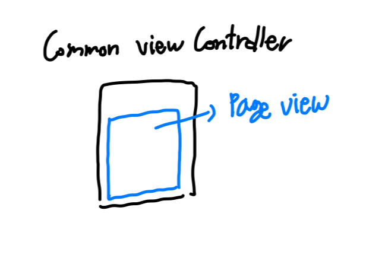
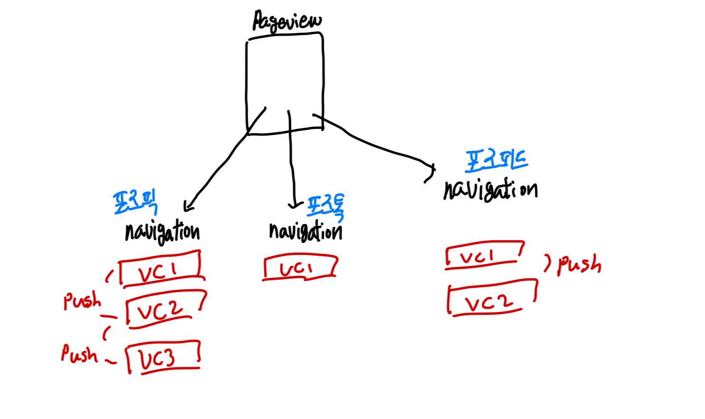

## 페이지뷰 with 코디네이터 (feat. MVVM)

코디네이터 패턴은 화면 전환 로직들을 관리하는 객체이다. 페이지뷰 컨트롤러의 경우 페이지뷰 데이터들의 정보들을 담고 있는 `dataSource`에 대한 정보, 화면 전환 동작에 대한 정보를 담고 있는 `delegate`구현 모두가 필요하다.

MVVM 패턴에 따라 앱을 설계해 갈때 뷰모델의 역할을 정의하면 뷰로부터의 이벤트 처리 로직을 담당한다는 것이라고 할 수 있다.

페이지뷰 객체의 델리게이트 및 데이터소스가 뷰 컨트롤러 생성과 동시에 정적으로 고정되어 있는 형태라고 생각할 수 있겠지만, 뷰모델의 역할을 충실히 수행할 수 있도록 인풋을 제공하는 제공자 역할이라고 생각하면 코디네이터 패턴 적용이 더 쉽다.

페이지뷰 컨트롤러가 위치하는 형태는 일반적으로 다음과 같다.



부모 뷰 컨트롤러가 있고, 페이지뷰의 view 속성이 부모 뷰의 레이아웃 자식 요소로 포함되는 형태이다. 이때 페이지뷰 화면 전환과 관련된 로직들에 대해 델리게이트 및 데이터소스가 부모 뷰 컨트롤러에 연결되는데, 코디네이터는 조금 다른 형태로 작성된다.

## 페이지뷰 주입하기

우선 페이지뷰 관련 화면 전환 로직들을 프로토콜로 작성한다.

```swift
protocol PageViewCoordinator: Coordinator {
    var pageViewController: UIPageViewController { get set }
    func selectPage(_ page: PageViewType)
    func setSelectedIndex(_ index: Int)
    func currentPage() -> PageViewType?
    func viewControllerBefore() -> UIViewController?
    func viewControllerAfter() -> UIViewController?
}
```

위의 코드에서 `PageViewType`은 페이지뷰 내에 들어갈 페이지들을 열거형으로 정의해둔 것이다.

:::details 페이지뷰 열거형 예시

```swift
enum PageViewType: String, CaseIterable {
    case posepick
    case posetalk
    case posefeed
    case bookmark
    case myPage

    init?(index: Int) {
        switch index {
        case 0: self = .posepick
        case 1: self = .posetalk
        case 2: self = .posefeed
        default: return nil
        }
    }

    init?(_ viewController: UIViewController) {
        switch viewController {
        case viewController as? PosePickViewController: self = .posepick
        case viewController as? PoseTalkViewController: self = .posetalk
        case viewController as? PoseFeedViewController: self = .posefeed
        default: return nil
        }
    }

    func pageTitleValue() -> String {
        switch self {
        case .posepick:
            return "포즈픽"
        case .posetalk:
            return "포즈톡"
        case .posefeed:
            return "포즈피드"
        case .bookmark:
            return "북마크"
        case .myPage:
            return ""
        }
    }

    func pageOrderNumber() -> Int {
        switch self {
        case .posepick:
            return 0
        case .posetalk:
            return 1
        case .posefeed:
            return 2
        case .bookmark:
            return 3
        case .myPage:
            return 4
        }
    }
}
```

:::

프로토콜을 살펴보면 구현이 필요한 속성 중 페이지뷰 컨트롤러가 있다. 프로토콜을 채택하여 구현한 코디네이터 클래스에 부모 뷰 컨트롤러를 속성으로 보유하며, 프로토콜의 페이지뷰 속성의 델리게이트 및 데이터소스를 해당 부모 뷰에 연결하는 형태로 구현하게 된다.

```swift
class DefaultPageViewCoordinator: PageViewCoordinator {
    weak var finishDelegate: CoordinatorFinishDelegate?
    var navigationController: UINavigationController
    var childCoordinators: [Coordinator] = []
    var pageViewController: UIPageViewController
    var commonViewController: CommonViewController
    var type: CoordinatorType { .pageview }

    var controllers: [UINavigationController] = []

    required init(_ navigationController: UINavigationController) {
        self.navigationController = navigationController
        self.pageViewController = UIPageViewController(transitionStyle: .scroll, navigationOrientation: .horizontal)
        self.commonViewController = CommonViewController(pageViewController: pageViewController)
        self.commonViewController.viewModel = CommonViewModel()

        navigationController.setNavigationBarHidden(true, animated: true)
    }

    // ...
    func start() {
        let pages: [PageViewType] = [.posepick, .posetalk, .posefeed]
        controllers = pages.map({
            self.createPageViewNavigationController(of: $0)
        })
        self.configurePageViewController(with: controllers)
    }

    private func configurePageViewController(with pageViewControllers: [UIViewController]) {
        self.pageViewController.delegate = commonViewController
        self.pageViewController.dataSource = commonViewController
        self.pageViewController.setViewControllers([pageViewControllers[0]], direction: .forward, animated: true)
        self.navigationController.pushViewController(self.commonViewController, animated: true)
    }
}
```

생성자 함수 호출 시점에 부모 뷰 컨트롤러를 생성하고 코디네이터의 첫 시작을 알리는 start 함수에서 델리게이트 및 데이터소스 할당이 이루어진다. `PageViewType` 배열을 순회하며 `pageviewController.viewControllers` 속성에 할당할 뷰 컨트롤러들을 생성 및 속성에 할당한다.

`configurePageViewController` 함수의 경우 페이지뷰 코디네이터 외부에서는 사용하지 않는 함수이기 때문에 `private`으로 선언하며 데이터소스 및 델리게이트 할당을 진행한다.

## 페이지뷰 델리게이트 & 데이터소스

델리게이트 및 데이터 소스 할당은 코디네이터에서 이루어지는 것이 맞는데, 실제 동작을 어떻게 구현해야 할까? 내가 구현한 것이 정답은 아니겠지만 아래와 같이 구현하였다.

```swift
extension CommonViewController: UIPageViewControllerDelegate {
    func pageViewController(
        _ pageViewController: UIPageViewController,
        didFinishAnimating finished: Bool,
        previousViewControllers: [UIViewController],
        transitionCompleted completed: Bool
    ) {
        self.pageviewControllerDidFinishEvent.accept(())
    }
}

extension CommonViewController: UIPageViewControllerDataSource {
    func pageViewController(_ pageViewController: UIPageViewController, viewControllerBefore viewController: UIViewController) -> UIViewController? {
        return viewModel?.viewControllerBefore()
    }

    func pageViewController(_ pageViewController: UIPageViewController, viewControllerAfter viewController: UIViewController) -> UIViewController? {
        return viewModel?.viewControllerAfter()
    }
}
```

델리게이트 함수가 호출되는 시점에 부모 뷰 속성에 정의해둔 옵저버블에 next 이벤트를 방출하고, 데이터소스 함수가 호출되는 시점에는 뷰모델의 `viewControlerBefore` & `viewControllerAfter` 함수를 호출한다.

델리게이트의 경우 함수 리턴타입이 `Void`이기 때문에 옵저버블을 통한 로직 구성이 온전하게 가능하지만 데이터소스의 경우 뷰 컨트롤러 객체 자체를 얻어와야 하기 때문에 뷰모델에 직접 정의한 함수로부터 컨트롤러 객체를 리턴받아와야 한다.

`viewControllerBefore` & `viewControllerAfter` 두 함수는 코디네이터를 참조하여 뷰 컨트롤러를 불러오게 된다.

## 페이지뷰 데이터소스 & 뷰모델

페이지뷰 데이터소스 처리 과정을 살펴보자. 뷰모델의 `viewControllerBefore` 함수는 다음과 같이 구현되어 있다.

```swift
/// UIPageViewController DataSource - viewControllerBefore
func viewControllerBefore() -> UIViewController? {
    return self.coordinator?.viewControllerBefore()
}

/// UIPageViewController DataSource -> viewControllerAfter
func viewControllerAfter() -> UIViewController? {
    return self.coordinator?.viewControllerAfter()
}
```

코디네이터로부터 현재 뷰 컨트롤러 기준으로 다음 인덱스의 컨트롤러 객체와 이전 순서의 컨트롤러 객체를 불러오는 로직이다.

```swift
func viewControllerBefore() -> UIViewController? {
    guard let currentIndex = currentPage()?.pageOrderNumber() else { return nil }
    if currentIndex == 0 {
        return nil
    }

    return controllers[currentIndex - 1]
}

func viewControllerAfter() -> UIViewController? {
    guard let currentIndex = currentPage()?.pageOrderNumber() else { return nil }
    if currentIndex == controllers.count - 1 {
        return nil
    }
    return controllers[currentIndex + 1]
}
```

코디네이터에 실제 구현되어 있는 함수는 다음과 같다. 코디네이터의 `currentPage`를 조회하여 전체 뷰 컨트롤러 갯수의 오버플로우가 나지 않으면 인덱스의 증감을 통해 컨트롤러 객체를 리턴해주는 것이다.

코디네이터의 `currentPage`함수는 다음과 같이 구현되어 있다.

```swift
func currentPage() -> PageViewType? {
    guard let navigationController = pageViewController.viewControllers?.first as? UINavigationController,
            let viewController = navigationController.viewControllers.first,
            let page = PageViewType(viewController) else { return .posepick }

    return page
}
```

약간은 복잡해 보일 수 있는데, 포즈피커 앱의 페이지뷰 구성이 아래와 같은 형태로 되어있기 때문에 위처럼 코드가 작성된 것이다.



단순 뷰 컨트롤러 하나만 페이지뷰에서 보이는 것이 아니라, 각 페이지뷰의 뷰마다 새로운 뷰를 present 및 push하는 로직들이 있기 때문에 네비게이션 뷰를 페이지뷰의 viewControllers 속성의 값들로 할당해주는 것이다.

다시 `currentPage`함수로 돌아가서, 타입 캐스팅 과정에서 pageViewController의 `viewControllers` 속성을 `UINavigationController` 타입으로 캐스팅하는 이유가 이러한 이유 때문인 것이다.

네비게이션 컨트롤러의 컨트롤러 속성에 접근한 뒤 push된 컨트롤러 중 `first` 타입이 `PageViewType` 열거형으로부터 생성 가능한 뷰라면 이를 현재 뷰 타입으로 리턴해주는 함수이다.

```swift
init?(_ viewController: UIViewController) {
    switch viewController {
    case viewController as? PosePickViewController: self = .posepick
    case viewController as? PoseTalkViewController: self = .posetalk
    case viewController as? PoseFeedViewController: self = .posefeed
    default: return nil
    }
}
```

타입 캐스팅을 실행했을때 정상적으로 캐스팅이 완료되면 열거형 인스턴스를 리턴해주는 방식이다.

델리게이트와 데이터소스 함수에 `print`를 찍어보면 매번 델리게이트쪽 함수가 먼저 실행되는 것을 알 수 있다. 물론, 첫 로드 이후 슬라이드가 조금이라도 감지되면 그 즉시 델리게이트 before & after 함수가 호출되며 초기 뷰 컨트롤러 기준으로 이전과 다음 인덱스를 계산해준다.

이를 통해 데이터소스와 델리게이트 사이의 관계를 대략적으로 정리해보면 다음과 같다.

1. 페이지뷰 초기화 이후 맨 처음 슬라이드가 감지되면 현재 뷰 컨트롤러 기준으로 다음 & 이전 뷰 컨트롤러를 얻어온다.
2. 초기 페이지 전환이 이루어진 이후부터는, 델리게이트 함수가 먼저 호출되고 이후 데이터소스 함수가 호출되어 세팅된 뷰 기준으로 이전 & 이후 뷰 컨트롤러를 참조하고 있게 된다.

## 페이지뷰 델리게이트 & 뷰모델

페이지뷰 델리게이트 이벤트 처리 과정을 살펴보자. 델리게이트 함수를 보면 다음과 같이 구현되어 있다.

```swift
extension CommonViewController: UIPageViewControllerDelegate {
    func pageViewController(
        _ pageViewController: UIPageViewController,
        didFinishAnimating finished: Bool,
        previousViewControllers: [UIViewController],
        transitionCompleted completed: Bool
    ) {
        self.pageviewControllerDidFinishEvent.accept(())
    }
}
```

델리게이트 함수 호출과 함께 뷰 컨트롤러의 옵저버블에서 이벤트를 새로 방출한다. 이는 뷰모델에 전달되어 코디네이터의 페이지 세팅 함수를 호출한다.

```swift
func transform(from input: Input, disposeBag: DisposeBag) -> Output {
    let output = Output()

    input.pageviewTransitionDelegateEvent
        .subscribe(onNext: { [weak self] in
            guard let self = self,
                  let coordinator = self.coordinator else {return}
            output.pageTransitionEvent.accept(coordinator.currentPage()?.pageOrderNumber() ?? 0)
        })
        .disposed(by: disposeBag)

    return output
}
```

델리게이트 호출 이후, 코디네이터에서는 참조하고 있던 next 혹은 previous 뷰 컨트롤러를 기준으로 `setViewController`를 진행하게 된다.

델리게이트 함수는 뷰 애니메이션이 모두 마친 시점에 호출되기 때문에, 코디네이터 입장에서도 반환해줄 현재 뷰 컨트롤러의 인덱스값이 화면 전환이 이루어진 뒤의 가장 최신 인덱스값을 리턴해주게 되는 것이다.

뷰모델의 아웃풋 인스턴스에 새로 세팅된 페이지 인덱스값이 전달되면, 뷰 컨트롤러에서는 **세그먼트 컴포넌트의 위치를 변경하게 된다.**
