## 개요

프로젝트 포즈피커 개발 이야기입니다! 궁금하시다면 놀러와주세요 :) [[포즈피커 다운받기🔗]](https://apps.apple.com/kr/app/%ED%8F%AC%EC%A6%88%ED%94%BC%EC%BB%A4-%EB%84%A4%EC%BB%B7%EC%82%AC%EC%A7%84-%ED%8F%AC%EC%A6%88%EC%B6%94%EC%B2%9C/id6474260471)

킹피셔는 이미지를 캐싱 처리를 도와주는 라이브러리입니다. 디스크 혹은 메모리 캐시 접근을 지원하고 캐시 미스가 발생한 경우 내부적으로 네트워크를 통한 다운로드 비동기 태스크까지 진행해주는 편리한 라이브러리입니다.

이번 글에서는 메모리 캐시, 디스크 캐시, 캐시 miss시 발생하는 성능 차이를 비교하고 어떻게 활용하면 좋을지 고민하는 과정을 소개해보겠습니다.

## 킹피셔 retrieveImage 함수

킹피셔에서는 `retrieveImage`라는 함수를 제공합니다. 해당 함수는 파라미터에 전달된 키 문자열 값을 기준으로 디스크 해시를 진행합니다. 만약 캐시 저장소에 데이터가 존재한 경우 **캐시 히트**가 발생하여 `completionHandler` 콜백의 `Result`타입 파라미터가 `success` 케이스로 분류됩니다. 반대로 데이터가 존재하지 않은 경우 **캐시 미스**가 발생하여 `completionHandler` 콜백의 `Result` 타입 파라미터가 `failure` 케이스로 분류됩니다.

이때, 캐시 미스가 발생하여 `failure`케이스로 분류되었을 때 내부적으로 네트워크를 통해 이미지 다운로드를 진행하고 다운로드된 이미지를 캐시에 저장하는 역할을 바로 `KingfisherManager.shared.retrieveImage`가 진행합니다.

이러한 흐름을 이해하고 내부 코드를 간단히 뜯어보도록 하겠습니다.

## ImageCache.default.retrieveImage 뜯어보기

내부 코드를 뜯어보면 다음과 같습니다.

```swift
open func retrieveImage(
        forKey key: String,
        options: KingfisherParsedOptionsInfo,
        callbackQueue: CallbackQueue = .mainCurrentOrAsync,
        completionHandler: ((Result<ImageCacheResult, KingfisherError>) -> Void)?)
    {
        // No completion handler. No need to start working and early return.
        guard let completionHandler = completionHandler else { return }

        // Try to check the image from memory cache first.
        if let image = retrieveImageInMemoryCache(forKey: key, options: options) {
            callbackQueue.execute { completionHandler(.success(.memory(image))) }
        } else if options.fromMemoryCacheOrRefresh {
            callbackQueue.execute { completionHandler(.success(.none)) }
        } else {

            // Begin to disk search.
            self.retrieveImageInDiskCache(forKey: key, options: options, callbackQueue: callbackQueue) {
                result in
                switch result {
                case .success(let image):

                    guard let image = image else {
                        // No image found in disk storage.
                        callbackQueue.execute { completionHandler(.success(.none)) }
                        return
                    }
                    // ... 나머지 코드
                case .failure(let error):
                    callbackQueue.execute { completionHandler(.failure(error)) }
                }
            }
        }
    }
```

위 코드의 주요 흐름을 정리하면 다음과 같습니다.

1. `completionHandler` 클로저 전달 유무에 따라 코드 실행 여부가 결정됩니다. early-return 패턴으로 함수가 조기 종료됩니다.
2. `retrieveImageInMemoryCache`: 메모리 캐시 접근을 먼저 진행합니다. 캐시 히트가 발생한 경우 `success` 케이스를 리턴하고 종료합니다.
3. `fromMemoryCacheOrRefresh`: 해당 옵션이 지정되어 있는 경우에만 코드가 실행되며, 메모리 캐시 접근 시도 후 캐시 미스가 발생하면 디스크 캐시에 접근합니다. 디스크 캐시에서도 캐시 미스가 발생한 경우 별도의 네트워크를 통한 이미지 다운로드는 처리하지 않습니다.
4. 아무 옵션도 지정되지 않고, 메모리 캐시도 미스난 경우 디스크 캐시에 접근합니다.
5. 킹피셔 에러가 발생한 경우 에러를 `Result`에 담아 콜백을 호출하고, 만약 디스크 캐시까지 미스난 경우 `.none`열거형 값을 콜백에 담아 리턴합니다. **.none**은 에러가 아님에 주의해야 합니다.
6. `.none`이 리턴되면 `success`케이스의 파라미터에는 `nil`이 담기게 됩니다. 아래 코드를 더 살펴보겠습니다.

```swift
ImageCache.default.retrieveImage(forKey: pose.poseInfo.imageKey) { result in
    switch result {
    case .success(let value):
        if let image = value.image {
            print("CACHE HIT!!: \(value.cacheType)")
        }
    case .failure:
        print("Unknown error")
        return
    }
}
```

`retrieveImage`에서 `success`케이스로 분류 되었을 때, 파라미터에는 `ImageCacheResult` 타입 값이 담겨있게 됩니다.

```swift
public enum ImageCacheResult {

    /// The image can be retrieved from disk cache.
    case disk(KFCrossPlatformImage)

    /// The image can be retrieved memory cache.
    case memory(KFCrossPlatformImage)

    /// The image does not exist in the cache.
    case none

    /// Extracts the image from cache result. It returns the associated `Image` value for
    /// `.disk` and `.memory` case. For `.none` case, `nil` is returned.
    public var image: KFCrossPlatformImage? {
        switch self {
        case .disk(let image): return image
        case .memory(let image): return image
        case .none: return nil
        }
    }

    /// Returns the corresponding `CacheType` value based on the result type of `self`.
    public var cacheType: CacheType {
        switch self {
        case .disk: return .disk
        case .memory: return .memory
        case .none: return .none
        }
    }
}
```

위와 같이 값이 구성되어 있으며 이미지 속성이 `none`인 경우 `nil`값을 리턴합니다.

옵셔널 바인딩을 통해 이미지가 정상적으로 추출되었으면 캐시 히트를 통해 이미지가 정상적으로 렌더링 될 준비가 된 것입니다.

`cacheType` 속성을 사용하면 캐시 히트 이후 어디에 캐싱 되어있는지 알 수 있습니다.

## 캐시 미스 상황

캐시 미스가 발생한 경우 이미지를 다운로드 받아야 합니다. 네트워크 통신을 통한 이미지 다운로드 기능을 지원하는 메서드는 `ImageCache.default`에 있지 않고 `KingfisherManager.shared`객체에 포함되어 있습니다.

`KingfisherManager.shared.retrieveImage` 함수 내부 구현은 중첩 호출 형태로 구현되어 있습니다. 호출되는 함수들을 쭉 파고들다 보면 아래와 같은 함수를 마주하게 됩니다.

```swift
private func retrieveImage(
    with source: Source,
    context: RetrievingContext,
    completionHandler: ((Result<RetrieveImageResult, KingfisherError>) -> Void)?) -> DownloadTask?
{
    let options = context.options
    if options.forceRefresh {
        return loadAndCacheImage(
            source: source,
            context: context,
            completionHandler: completionHandler)?.value

    } else {
        let loadedFromCache = retrieveImageFromCache(
            source: source,
            context: context,
            completionHandler: completionHandler)

        if loadedFromCache {
            return nil
        }

        if options.onlyFromCache {
            let error = KingfisherError.cacheError(reason: .imageNotExisting(key: source.cacheKey))
            completionHandler?(.failure(error))
            return nil
        }

        return loadAndCacheImage(
            source: source,
            context: context,
            completionHandler: completionHandler)?.value
    }
}
```

함수 파라미터의 `options` 중 `onlyFromCache`가 지정되어 있는 경우 캐시 미스가 발생했을 때 에러를 리턴하고 함수를 종료합니다. `forceRefresh` 옵션이 지정되어 있는 경우 캐시 체크를 하지 않고 네트워크를 통해 이미지를 새로 받아오도록 강제합니다.

해당 옵션이 지정되어 있지 않으면 `loadAndCacheImage`로 함수 호출이 넘어갑니다.

```swift
@discardableResult
func loadAndCacheImage(
    source: Source,
    context: RetrievingContext,
    completionHandler: ((Result<RetrieveImageResult, KingfisherError>) -> Void)?) -> DownloadTask.WrappedTask?
{
    let options = context.options

    switch source {
    case .network(let resource):
        let downloader = options.downloader ?? self.downloader
        let task = downloader.downloadImage(
            with: resource.downloadURL, options: options, completionHandler: _cacheImage
        )

        if let task = task {
            return .download(task)
        } else {
            return nil
        }

    case .provider(let provider):
        provideImage(provider: provider, options: options, completionHandler: _cacheImage)
        return .dataProviding
    }
}
```

위 함수에서는 `source` 파라미터를 통해 URL을 추출하고 다운로드 태스크를 통해 이미지를 로드합니다.

이때 `downloader`옵션을 체크하여 객체가 전달된 경우 해당 다운로더 객체를 통해 이미지 다운로드를 진행합니다. 이 코드를 통해 네트워크 환경 없이 로컬에 저장된 이미지를 테스트 환경에서 불러올 수 있게 됩니다. 이와 관련된 자세한 내용은 [다음 문서를](https://parkjju.github.io/vue-TIL/trash/231205-39.html) 참고해주세요.

`KingfisherManager.shared.retrieveImage`를 통해 이미지 다운로드가 가능하다는 것을 알았으니, 코드를 직접 작성해볼까요?

```swift
ImageCache.default.retrieveImage(forKey: pose.poseInfo.imageKey) { result in
    switch result {
    case .success(let value):
        if let image = value.image {
            // image UI 바인딩
            print("CACHE HIT!!: \(value.cacheType)")
        } else if let url = URL(string: pose.poseInfo.imageKey) {
            print("CACHE MISS!!")
            KingfisherManager.shared.retrieveImage(with: url) { downloadResult in
                switch downloadResult {
                case .success(let downloaded):
                    // downloaded.image에 접근 후 이미지 UI 바인딩
                case .failure(let error):
                    return
                }
            }
        }
    case .failure:
        return
    }
}
```

1. `ImageCache.default.retrieveImage`로 캐시 접근을 진행합니다.
2. 이미지가 nil값이 아니면 UI 바인딩을 진행합니다.
3. 이미지가 nil값인 경우 캐시 미스가 발생한 것이므로 `KingfisherManager.shared.retrieveImage`에서 이미지 다운로드를 진행합니다

:::tip 중첩 클로저와 Thread-safe 코드

클로저가 중첩되어도 스레드는 안전한 상태로 코드가 실행됩니다.

```swift
open var sessionDelegate: SessionDelegate {
    didSet {
        session.invalidateAndCancel()
        session = URLSession(configuration: sessionConfiguration, delegate: sessionDelegate, delegateQueue: nil)
        setupSessionHandler()
    }
}
```

`ImageDownloader`객체의 `delegateQueue` 파라미터를 보면 nil로 설정되어 있습니다. URLSession 이니셜라이저 문서 중 `delegateQueue`에 대한 일부 내용을 발췌하여 아래 내용을 볼 수 있습니다.

> If nil, the session creates a serial operation queue for performing all delegate method calls and completion handler calls.

nil로 설정된 경우 직렬 오퍼레이션 큐를 직접 생성하여 네트워크 관련 태스크들을 관리합니다.

:::

`retrieveImage`함수에서 이미지 다운로드와 프로세싱이 모두 마무리 되면 `completionHandler`가 실행됩니다. 이때 옵션 파라미터에 따로 값을 지정하지 않으면 콜백 큐로 메인 스레드가 지정됩니다.

이미지를 UI에 바인딩 해주어야 하기 때문에 메인 스레드에서 실행해야 합니다. 만약 `callbackQueue`값에 글로벌 큐를 할당하면 UI 바인딩 시 에러가 발생하게 됩니다.

```swift
KingfisherManager.shared.retrieveImage(
    with: url,
    options: [
        .callbackQueue(
            .dispatch(
                .global()
            )
        )
    ]
    )  {
    // ...
}
// 불러온 이미지를 UI에 바로 바인딩 하려고 하면 에러 발생
```

## 이미지 다운로드 시간 측정

코드 구축은 완료하였으니 캐시 히트 여부와 어떤 캐시를 사용하는 지에 따라 성능 차이가 얼마나 발생하는 지를 테스트 해보도록 하겠습니다. 먼저, 캐시 미스가 발생했을 때 이미지를 다운로드 받는 속도에 얼마나 차이가 발생하는 지를 확인해보도록 하겠습니다.

이를 테스트 하기 위해, 다른 요인들로 인해 속도 차이가 발생하는 것을 통제하는 조건들을 마련하였습니다.

1. `AppDelegate`의 `didFinishLaunchingWithOptions` 함수가 호출될 때 `ImageCache.default.clearCache()`를 호출하여 캐시를 비웠습니다.
2. 네트워크 환경은 DSL(전화선) 속도로 강제로 제한하였습니다.
3. 다운로드가 이루어지는 이미지는 총 세개입니다. 각 이미지 사이즈는 아래와 같습니다.
    - `0.12 MB`
    - `0.30 MB`
    - `1.11 MB`

네트워크 링크 컨디셔너에서의 DSL 스펙은 다음과 같습니다. (다운링크만 고려)

1. 대역폭: 2Mbps
2. 패킷 드롭: 0%
3. 딜레이 5ms

네트워크 이론에 따라 이미지 패킷이 다운링크를 따라 전송되는 시간을 계산하면 다음과 같습니다. 딜레이는 무시해도 되는 정도의 수치라 계산에서 제외하였습니다.

$$
time_{transmission}=\frac{data(Mbps)}{bandwidth}
$$

$$
time_{transmission}=\frac{0.12MB}{2Mbps} + \frac{0.30MB}{2Mbps} + \frac{1.11MB}{2Mbps}
$$

$$
\frac{0.12 \times 8 (Mbit)}{2Mbps} + \frac{0.30 \times 8 (Mbit)}{2Mbps} + \frac{1.11 \times 8 (Mbit) }{2Mbps} = 0.48s + 1.2s + 4.44s = 6.12s
$$

그렇다면 실제로 컨텐츠 다운로드까지 걸리는 시간을 계산해볼까요? 이미지 다운로드 시간 측정과 이미지 사이즈를 출력한 결과는 다음과 같습니다.

```text
processingTime: 1.971391458 seconds
MEGA: 0.11989974975585938

processingTime: 5.402707917 seconds
MEGA: 0.2960662841796875

processingTime: 6.923137832999999 seconds
MEGA: 1.0994071960449219
```

위와 같이 이미지 다운로드에 소요되는 시간을 출력하기 위해 선택한 방법은 `retrieveImage`함수의 `progressBlock`클로저를 활용하는 것이었습니다. 해당 함수는 컨텐츠 다운로드 과정에서 Foundation Framework의 `urlSession`함수 호출을 통해 현재 다운로드된 컨텐츠 사이즈, 전체 컨텐츠 사이즈를 함수 파라미터로 제공합니다.

이 함수가 호출 시작된 시점부터 최종 컨텐츠가 리턴되기까지의 시스템 시간을 `ContinousClock` API를 활용하여 측정하였습니다. 전체 코드를 알아보기 전 `progressBlock`클로저가 호출되는 과정을 자세히 알아보겠습니다.

## progressBlock 클로저 동작 이해하기

`KingfisherManager.shared.retrieveImage` 함수는 파라미터로 `progressBlock` 클로저를 전달할 수 있습니다. `progressBlock`클로저는 다음과 같이 내부적으로 호출됩니다.

```swift
func retrieveImage(
    with source: Source,
    options: KingfisherParsedOptionsInfo,
    progressBlock: DownloadProgressBlock? = nil,
    downloadTaskUpdated: DownloadTaskUpdatedBlock? = nil,
    completionHandler: ((Result<RetrieveImageResult, KingfisherError>) -> Void)?) -> DownloadTask?
{
    var info = options
    if let block = progressBlock {
        info.onDataReceived = (info.onDataReceived ?? []) + [ImageLoadingProgressSideEffect(block)]
    }
    return retrieveImage(
        with: source,
        options: info,
        downloadTaskUpdated: downloadTaskUpdated,
        progressiveImageSetter: nil,
        completionHandler: completionHandler)
}
```

`options` 변수의 타입은 `KingfisherParsedOptionsInfo`입니다. `public struct`로 선언되어 있고 `retrieveImage`함수 `options`파라미터에 전달되는 값입니다. 구조체 내부를 보면 `public`으로 선언된 옵션 프로퍼티들을 확인할 수 있습니다.

`onDataReceived` 프로퍼티는 `public`으로 선언되어 있지 않아 외부에서 접근할 수 없습니다. `progressBlock` 클로저가 정의되어 있는 경우 `ImageLoadingProgressSideEffect` 생성자에 전달되며 `onDataReceived` 값이 정의됩니다.

```swift
/// parsed and converted to a `KingfisherParsedOptionsInfo` first, and pass through the internal methods.
public struct KingfisherParsedOptionsInfo {

    // public var 옵션들 ...
    // public var 옵션들 ...
    // public var 옵션들 ...

    var onDataReceived: [DataReceivingSideEffect]? = nil

    // ...
}
```

킹피셔 옵션 객체의 `onDataReceived`는 `[DataReceivingSideEffect]`타입으로 선언되어 있습니다. `DataReceivingSideEffect`는 프로토콜이며 1급 객체로서 역할을 할 수 있습니다.

```swift
protocol DataReceivingSideEffect: AnyObject {
    var onShouldApply: () -> Bool { get set }
    func onDataReceived(_ session: URLSession, task: SessionDataTask, data: Data)
}
```

위 프로토콜을 채택하여 구현한 클래스는 `ImageLoadingProgressSideEffect`입니다.

```swift
class ImageLoadingProgressSideEffect: DataReceivingSideEffect {

    var onShouldApply: () -> Bool = { return true }

    let block: DownloadProgressBlock

    init(_ block: @escaping DownloadProgressBlock) {
        self.block = block
    }

    func onDataReceived(_ session: URLSession, task: SessionDataTask, data: Data) {
        guard self.onShouldApply() else { return }
        guard let expectedContentLength = task.task.response?.expectedContentLength,
                  expectedContentLength != -1 else
        {
            return
        }

        let dataLength = Int64(task.mutableData.count)
        DispatchQueue.main.async {
            self.block(dataLength, expectedContentLength)
        }
    }
}
```

위의 형태로 정의된 함수 중 `onDataReceived`가 호출됨에 따라 HTTP body의 content-length가 계산되고 `progressBlock` 클로저가 실행되는 것입니다. (`self.block(dataLength, expectedContentLength)`)

사이드이펙트 프로토콜을 채택하여 `onDataReceived` 구현했는데, 그렇다면 이 함수가 직접 호출되어야 하지 않을까요? 함수가 어디서 호출되는지 알아보기 위해서는 다시 `SessionDelegate`로 이동해야 합니다.

`SessionDelegate`는 킹피셔 라이브러리만의 네트워크 처리 방식을 정의해둔 클래스입니다. `URLSessionDataDelegate`프로토콜을 채택한 뒤 내부적으로 호출되는 각종 함수들의 구현부를 정의해두었습니다.

이 중 `urlSession(_ session: URLSession, dataTask: URLSessionDataTask, didReceive data: Data)`를 살펴보면 다음과 같이 정의되어 있습니다.

```swift
extension SessionDelegate: URLSessionDataDelegate {
    open func urlSession(_ session: URLSession, dataTask: URLSessionDataTask, didReceive data: Data) {
        guard let task = self.task(for: dataTask) else {
            return
        }

        task.didReceiveData(data)

        task.callbacks.forEach { callback in
            callback.options.onDataReceived?.forEach { sideEffect in
                sideEffect.onDataReceived(session, task: task, data: data)
            }
        }
    }
}
```

```swift
public protocol URLSessionDataDelegate : URLSessionTaskDelegate {
    optional func urlSession(_ session: URLSession, dataTask: URLSessionDataTask, didReceive data: Data)
}
```

위 함수는 `URLSessionDataDelegate` 프로토콜의 옵셔널 타입으로 선언되어 있습니다. 선택적 구현 대상입니다.

네트워크 통신 과정에서 내부적으로 `urlSession`함수가 호출되는데 이때 전달되는 `dataTask`가 킹피셔에서 사용되는 `SessionDataTask` 인스턴스로 래핑됩니다.

`SessionDataTask` 인스턴스에는 `callbacks` 속성이 존재합니다.

```swift
public class SessionDataTask {
    var callbacks: [SessionDataTask.TaskCallback] {
        lock.lock()
        defer { lock.unlock() }
        return Array(callbacksStore.values)
    }

    // ...

    func addCallback(_ callback: TaskCallback) -> CancelToken {
        lock.lock()
        defer { lock.unlock() }
        callbacksStore[currentToken] = callback
        defer { currentToken += 1 }
        return currentToken
    }
}
```

`callbacks` 배열은 `addCallback`함수가 호출되면서 요소들이 내부에 append됩니다. `addCallback`함수가 호출되는 시점은 `ImageDownloader`를 통해 이미지 다운로드가 시작된 이후로 이루어집니다.

```swift
open class ImageDownloader  {

    // ...

    private func addDownloadTask(
        context: DownloadingContext,
        callback: SessionDataTask.TaskCallback
    ) -> DownloadTask
    {
        // Ready to start download. Add it to session task manager (`sessionHandler`)
        let downloadTask: DownloadTask
        if let existingTask = sessionDelegate.task(for: context.url) {
            downloadTask = sessionDelegate.append(existingTask, callback: callback)
        } else {
            let sessionDataTask = session.dataTask(with: context.request)
            sessionDataTask.priority = context.options.downloadPriority
            downloadTask = sessionDelegate.add(sessionDataTask, url: context.url, callback: callback)
        }
        return downloadTask
    }
}
```

`ImageDownloader`객체에서 `addDownloadTask`함수가 호출은 `private func startDownloadTask(context:  DownloadingContext, callback: SessionDataTask.TaskCallback) -> DownloadTask` 함수 내부에서 이루어집니다.

`startDownloadTask` 함수는 또 다시 `downloadImage`함수로 거슬러 올라가고, 최종적으로 `retrieveImage`함수 내에서 `loadAndCacheImage` 함수 호출의 `.network`케이스에서 본격적인 태스크 생성과 추가의 작업이 진행됩니다.

:::tip 호출과정 이해하기

이미지 다운로드 태스크가 추가되는 과정을 이해하기 위해서는 캐시 접근을 위한 `retrieveImage`함수 호출과 네트워크 통신이 이루어지는 두 가지 방향성을 이해해야 합니다.

먼저 `retrieveImage`에서 캐시 저장소에 접근하고 캐시 미스가 발생한 경우 `retrieveImage` 재귀 호출 패턴의 말미에 있는 `loadAndCacheImage` 함수가 호출됩니다. 이때 `cacheOnly`와 같은 옵션이 지정되어 있지 않은 경우 `.network` 케이스로 분류되어 네트워크 통신을 진행합니다.

이때 이미지 다운로드 태스크는 `ImageDownloader`라는 킹피셔의 이미지 다운로드 매니저 클래스를 통해 진행됩니다.

```swift
switch source {
case .network(let resource):
    let downloader = options.downloader ?? self.downloader
    let task = downloader.downloadImage(
        with: resource.downloadURL, options: options, completionHandler: _cacheImage
    )
    // ...
}
```

`self.downloader`프로퍼티를 통해 다운로드 태스크 생성이 이루어지게 됩니다. 이때 생성되는 태스크가 바로 킹피셔의 `SessionDataTask` 오브젝트이며, 동시에 `Foundation`프레임워크에서 자동으로 호출되는 `urlSession - didReceive`함수 호출과 맞물려 최종적으로 `onDataReceived` 클로저에서 `progressBlock` 호출이 이루어지는 것입니다.

```swift
open func urlSession(_ session: URLSession, dataTask: URLSessionDataTask, didReceive data: Data) {
    guard let task = self.task(for: dataTask) else {
        return
    }

    task.didReceiveData(data)

    // SessionDataTask
    task.callbacks.forEach { callback in
        callback.options.onDataReceived?.forEach { sideEffect in
            sideEffect.onDataReceived(session, task: task, data: data)
        }
    }
}
```

:::

전체 호출 과정을 도식화하면 다음과 같습니다. `progressBlock`클로저가 실행되기까지의 과정을 염두에 두고 이해하면 좋습니다.

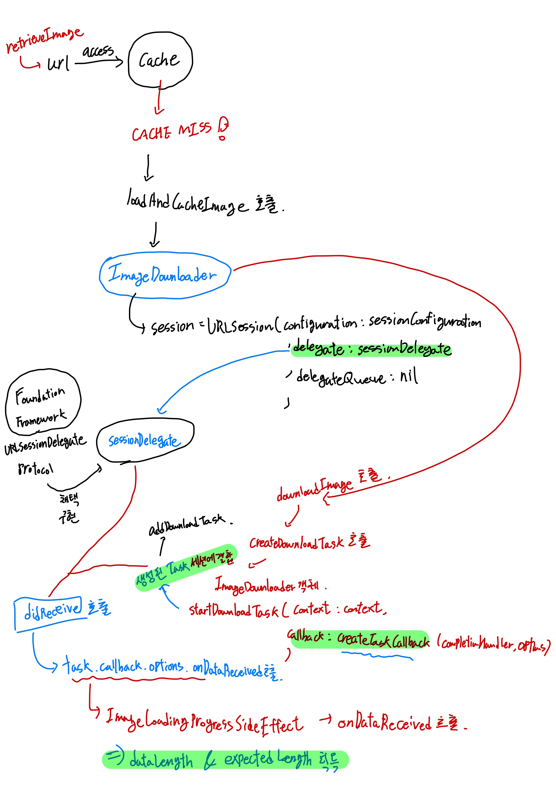

## 다운로드 소요 시간 비교 (이론 vs 실제 값)

위에서 이론적인 공식에 따라 도출한 컨텐츠 다운로드 소요 시간은 총 6.12초였습니다. 하지만 실제 총 소요시간은 약 14.29초로 무시하기에는 너무 큰 오차가 발생하게 되었습니다.

```text
processingTime: 1.971391458 seconds
MEGA: 0.11989974975585938

processingTime: 5.402707917 seconds
MEGA: 0.2960662841796875

processingTime: 6.923137832999999 seconds
MEGA: 1.0994071960449219
```

네트워크 링크 컨디셔너를 통해 분명 다운로드 속도를 고정했음에도 왜 이렇게 큰 오차가 발생할까요? 이에 대한 원인들을 몇 가지로 나누어 검증해보았습니다.

## 원인 1. Thread-safe한 코드가 아닌가?

코드 실행시간을 측정하는 코드를 아래와 같이 작성했었습니다.

```swift
KingfisherManager.shared.retrieveImage(with: url, options: []) { [weak self] processingSize, totalSize in
    guard let self = self else { return }

    if self.dict[url.absoluteString] != nil {
        self.dict[url.absoluteString]?.append(self.clock.now)
    } else {
        self.dict[url.absoluteString] = [self.clock.now]
    }

} completionHandler: { downloadResult in
    switch downloadResult {
    case .success(let downloaded):
        print("processingTime: \(self.dict[url.absoluteString]!.first!.duration(to: self.dict[url.absoluteString]!.last!))")
    case .failure(let error):
        print("error in first: ", error)
        return
    }
}
```

위 코드를 보면 레파지토리 객체에 `dict`라는 딕셔너리 속성을 마련한 것을 볼 수 있습니다. 포즈피드 특성 상 8개 컨텐츠가 저장된 S3 URL을 순회하며 이미지 다운로드가 진행되기 때문에, 각 URL을 키값으로 가지며 `progressBlock`이 실행되는 시점마다 `.now`시간을 딕셔너리 밸류에 `append`해주었습니다.

이때 별다른 `sync`메서드 없이도 Thread-safe한지 판단이 필요한데, 제가 내린 결론은 다음과 같습니다.

1. `retrieveImage`함수 호출 이후 세션 객체를 통한 컨텐츠 다운로드 태스크는 직렬 큐에서 이루어진다. (세션 객체 생성시 delegateQueue 파라미터에 nil 전달됨)
2. 직렬 큐에서 작업이 이루어지고 URL 기준으로 해시하여 접근하기 때문에 URL의 작업 수행 시간이 서로 얽힐 일은 없다.

간단히 도식화 해보면 다음과 같습니다.

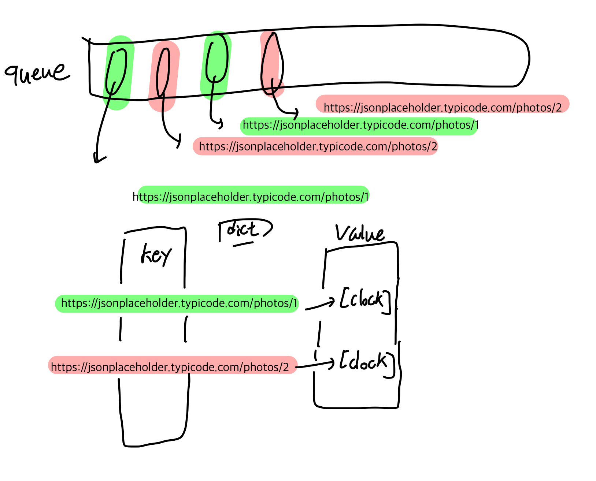

`progressBlock`함수가 실행되는 환경이 멀티스레드가 아니기 때문에 위 코드는 `Thread-safe` 하다고 결론 내릴 수 있었습니다.

## 원인 2. 네트워크 환경의 변수

그렇다면 남은 원인은 네트워크 통신 과정에서 통제하지 못한 환경적 변수들밖에 원인이 없다고 결론 짓게 되었습니다. 이를 실제로 검증하기 위해 `찰스 프록시(Charles Proxy)`라는 툴을 사용하게 되었습니다. 검증 초기에는 `WireShark`를 활용하여 패킷을 직접 분석하려고 했지만, 패킷 암호화 문제로 인해 내부 정보를 `plain text`로 확인하기가 어려웠습니다.

찰스 프록시에서 제공하는 SSL 프록싱 기능을 사용하면 네트워크 요청 과정을 평문으로 확인할 수 있습니다.

프록시 서버란 무엇일까요?

> A proxy server acts as a gateway between you and the internet. It’s an intermediary server separating end users from the websites they browse.

프록시 서버는 사용자와 사용자가 탐색하는 웹사이트를 분리하는 중개 서버입니다. 사용자가 서버에 요청한 데이터가 프록시를 거쳐 서버에 도달하고, 이에 대한 응답 데이터 역시 프록시를 거쳐 사용자에게 도달하게 됩니다.

찰스 프록시는 이러한 프록시 서버 컴퓨터 역할을 사용자 컴퓨터에서 할 수 있도록 설정해줍니다.

## SSL 동작 방법

기본적으로 제공하는 프록시에서는 패킷 암호화로 인해 자세한 정보들을 알 수 없습니다. 서버와 주고 받은 컨텐츠들을 확인할 수 없고, 컨텐츠 전송 시간 및 속도 등 여러 정보들을 확인할 수 없게 됩니다.

이때 찰스 프록시에서 제공하는 SSL 프록시 설정을 켜주면 내부 정보들을 복호화하여 볼 수 있는데, 이를 위해 SSL 인증서에 대해 알아야 합니다.

일반적인 통신 과정에서 보안을 위해 HTTP 프로토콜이 아닌 HTTPS 프로토콜을 사용하게 되는데, 보안을 위한 SSL(Secure Sockets Layer)가 추가되어 OSI 계층에서 Application Layer와 Transport Layer 사이에 위치하는 형태가 됩니다.

보안을 위해 대칭키 방식이 아닌 공개키 방식을 사용하여 데이터 암호화 및 복호화를 진행하는데 이때 SSL 인증서가 공개키 발급에 대한 책임을 갖습니다.

SSL 인증서는 다음과 같은 역할을 합니다.

1. 클라이언트가 접속한 서버가 신뢰할 만한 서버임을 보장 - CA(Certificate Authority) or Root Certificate가 담당
2. SSL 통신에 사용할 **공개키를 발급하여** 클라이언트에 전달

CA는 기업들이 담당하기도 하지만 개발 디버깅 목적으로 사용자가 직접 CA 역할을 할 수도 있다. 클라이언트는 서버 접속시 서버로부터 SSL 인증서를 전달받게 된다.

웹의 경우 브라우저 자체에 신뢰할 수 있는 CA 리스트 정보들을 가지고 있다. 리스트 정보들과 서버로부터 전달 받은 인증서 정보를 대조하여 신뢰할 수 있는 인증서인지 확인하고 리스트에 포함된 인증서이면 **해당 인증서 공개키를 가지고 인증서 데이터를 복호화한다.**

iOS에서 찰스 프록시 서버의 SSL 프록시 기능을 활용하기 위해서는 `Charles CA`인증서를 아이폰에 직접 설치해주면 된다. iOS 시스템에서 신뢰하는 인증서 리스트에 Charles CA 인증서가 존재하면 된다. [인증서 설치하는 링크](http://chls.pro/ssl) 인증서 설치 후 신뢰하는 리스트로 활성화 해주면 된다.

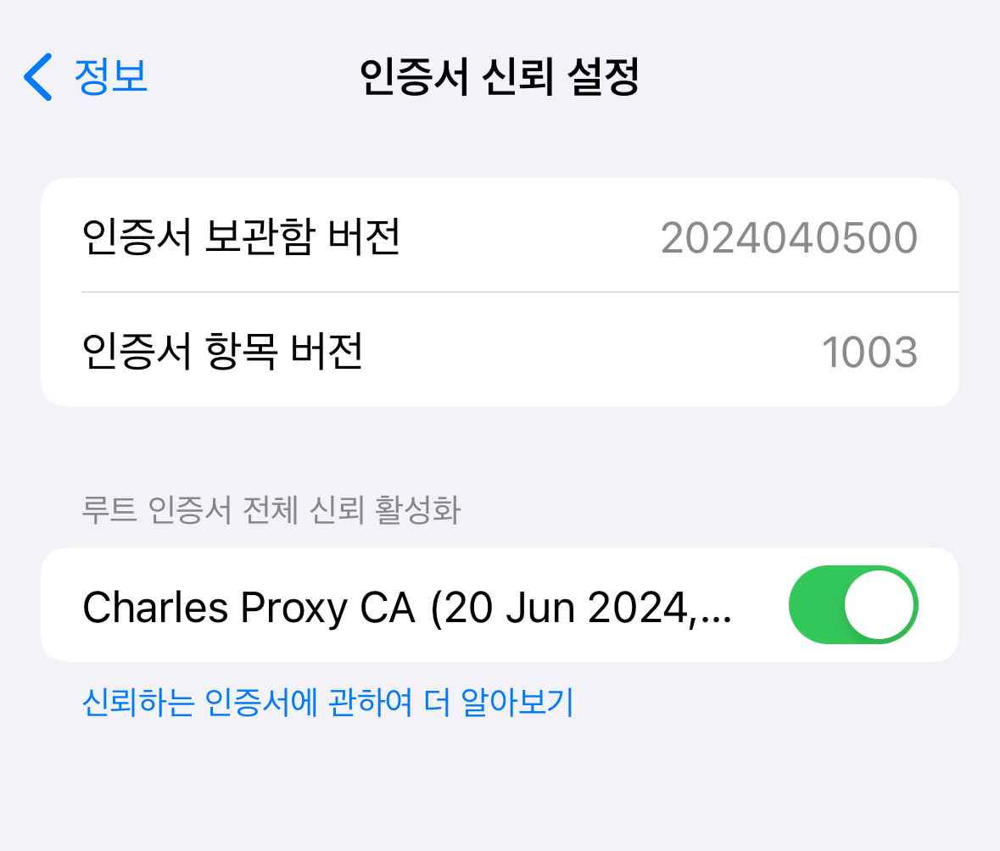

신뢰하는 인증서 리스트에 전달받은 인증서가 존재하는 경우, 인증기관의 공개키로 인증서를 복호화 한다. 인증서는 전달받는 시점에 서버로부터 서버의 개인키로 암호화 되어있고, 공개키로 복호화 되도록 설정되어 있다.

:::tip 공개키로 복호화?

공개키로 복호화한다는 의미는 인증기관의 개인키로 암호화된 인증서를 복호화 하고 싶으면 서버로부터 공개키만 전달받으면 된다는 것을 의미한다. 공개키의 접근 권한은 모든 유저에게 열려있기 때문에 이것이 보안상의 허점이라고 생각될 수 있다.

사실 이것이 의미하는 바는 **신뢰하는 CA만 암호화 할 수 있는 인증서라는 것을** 나타내기 위한 목적을 보여주는 것이다. 공개키와 함께 **쌍으로, 유일하게** 존재하는 비밀키로만 암호화가 된 것이므로 다른 CA로부터 악의적으로 전달받은 데이터가 아니라는 것을 보장하는 것으로 이해해야 한다.

:::

실제 SSL 통신에서는 공개키 방식으로 데이터 자체를 복호화 하여 주고받는 것이 아니다. 이는 컴퓨팅 파워가 너무 많이 소모되기 때문에, 실제 데이터 암호화는 **대칭키** 방식으로 진행하고 **데이터를 암호화 한 키를 한번 더 암호화 한다.** 한번 더 암호화 하는 방식을 바로 공개키 방식으로 처리하게 된다.

## 클라이언트 - 서버 연결과정

데이터를 송수신하기 위해 클라이언트와 서버 사이에는 몇가지 과정이 이루어진다. 참고로 아래에서 키 교환 과정은 RSA 방식이며, 최근에는 여러 ECDHE와 같은 방식들도 사용된다.

1. `Client Hello`
    - 클라이언트에서 생성한 랜덤 데이터 전송
    - 클라이언트에서 지원하는 암호화 기법 리스트 전달
    - 세션 유지를 위한 세션 아이디값
2. `Server Hello`
    - 서버 측에서 생성한 랜덤 데이터 전송
    - 클라이언트에서 지원하는 암호화 기법 기반으로 가장 높은 수준의 보안을 지원하는 암호화 방식 선택 - 협상 과정이라고도 불림
3. `Certificate`
    - 서버측에서 클라이언트로 인증서 전달
4. `Client Key Exchange`
    - 클라이언트에서 서버로 임의로 생성된 `pre-master secret key`값을 전달
    - 서버 공개키로 암호화 한 뒤 전달한다.
5. `Change Cipher Spec`
    - 클라이언트와 서버 각각 마스터 키 생성이 완료되면 위의 핸드셰이킹 메시지를 전송한다.
    - 클라이언트: (클라이언트 랜덤데이터) + (서버에서 받은 랜덤데이터) + (클라이언트 pre-master secret key) 조합으로 마스터 키 생성
    - 서버: **(서버 개인 키로 복호화 한 클라이언트 pre-master secret key)** + (클라이언트 랜덤 데이터) + (서버 랜덤 데이터) 조합으로 마스터 키 생성
6. `Finished` - 최근에는 `Encrypted Handshake Message` 메시지로 나타남
    - 생성된 각각의 독립적인 마스터 키를 기반으로 세션 키 생성
    - 핸드셰이크가 완료되었음을 알림
7. 세션 종료: SSL 통신 종료 후 세션 키는 폐기한다.

<figure style="display:flex; align-items:center; flex-direction:column">
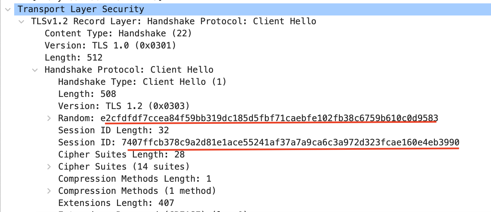
<figcaption style="font-size:1rem; color:grey; font-weight:bold; margin-top:0.8rem; margin-bottom:1rem;">Client Hello 메시지</figcaption>
</figure>

<figure style="display:flex; align-items:center; flex-direction:column">
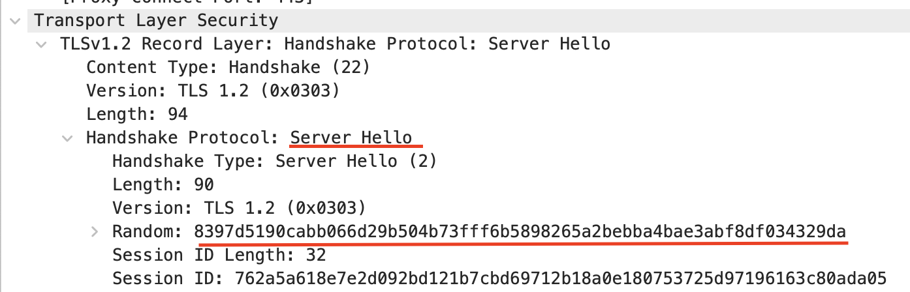
<figcaption style="font-size:1rem; color:grey; font-weight:bold; margin-top:0.8rem; margin-bottom:1rem;">Server Hello 메시지</figcaption>
</figure>

<figure style="display:flex; align-items:center; flex-direction:column">
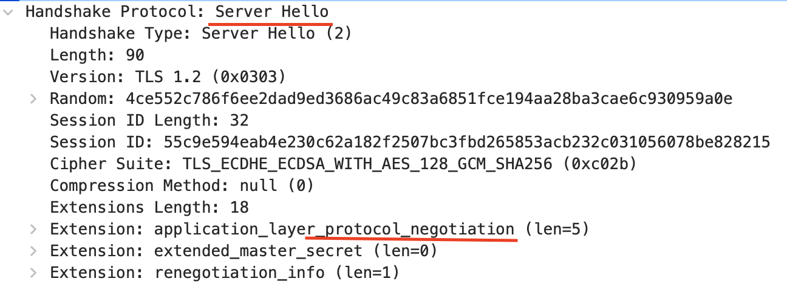
<figcaption style="font-size:1rem; color:grey; font-weight:bold; margin-top:0.8rem; margin-bottom:1rem;">Server Hello 협상 메시지</figcaption>
</figure>

<figure style="display:flex; align-items:center; flex-direction:column">
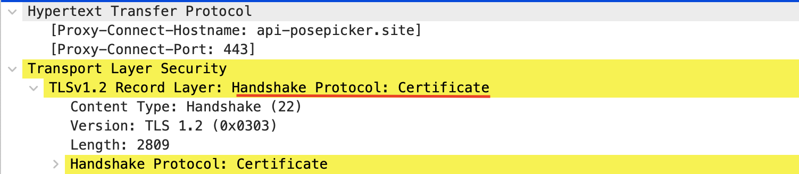
<figcaption style="font-size:1rem; color:grey; font-weight:bold; margin-top:0.8rem; margin-bottom:1rem;">Certificate 메시지</figcaption>
</figure>

<figure style="display:flex; align-items:center; flex-direction:column">
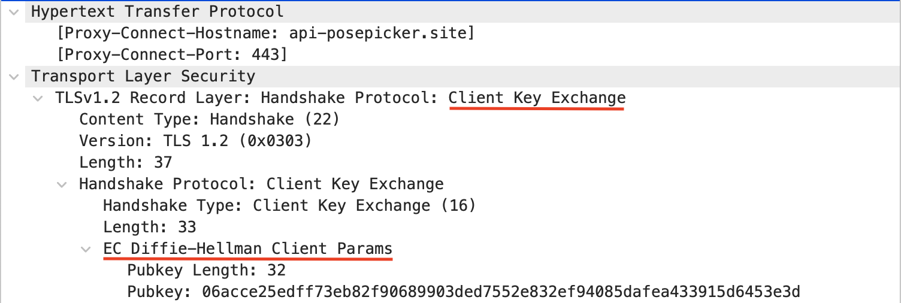
<figcaption style="font-size:1rem; color:grey; font-weight:bold; margin-top:0.8rem; margin-bottom:1rem;">Client Key Exchange 메시지</figcaption>
</figure>

<figure style="display:flex; align-items:center; flex-direction:column">
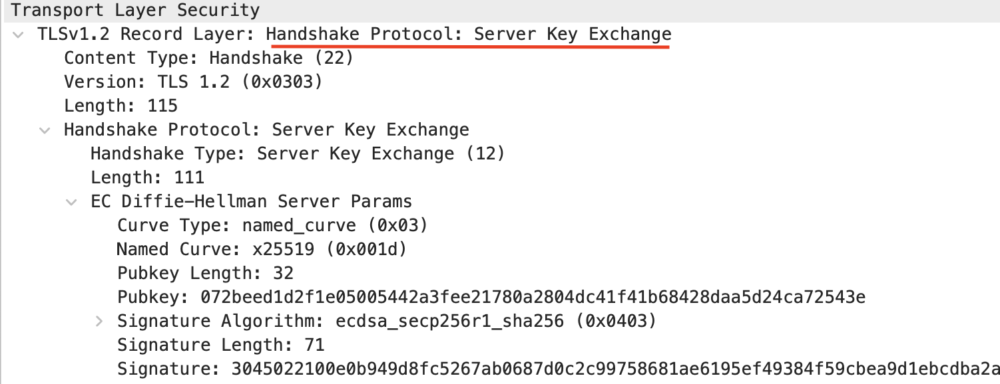
<figcaption style="font-size:1rem; color:grey; font-weight:bold; margin-top:0.8rem; margin-bottom:1rem;">Server Key Exchange 메시지</figcaption>
</figure>

<figure style="display:flex; align-items:center; flex-direction:column">
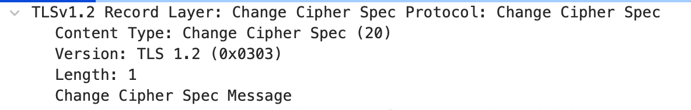
<figcaption style="font-size:1rem; color:grey; font-weight:bold; margin-top:0.8rem; margin-bottom:1rem;">Change Cipher Spec 메시지</figcaption>
</figure>

## 찰스 프록시 SSL 통신 설정하기

SSL 통신에 대해 압축적으로 확인해보았습니다. 자세한 내용은 [생활코딩 - HTTPS와 SSL 인증서](https://opentutorials.org/course/228/4894)를 참고하시면 좋습니다.

그럼 본격적으로 찰스 프록시를 활용하여 SSL 통신을 직접 진행해보겠습니다. 먼저 찰스 프록시 프로그램을 [다운로드](https://www.charlesproxy.com/) 합니다. 이후 찰스에서 제공하는 인증서 정보를 연결할 iOS기기에 설치합니다. 설치한 인증서를 신뢰하도록 설정해줘야 하며 이에 대한 내용은 SSL 동작 방식 섹션에서 간략히 언급해두었습니다.

찰스 프록시를 실행한 뒤 실제로 중간자 (MITM: Man-In-The-Middle) 역할을 하는지 확인하기 위해 WireShark를 통해 패킷을 캡처해볼 것입니다.

와이어샤크를 설치하고 iOS기기를 맥북에 연결합니다. 이후 기기의 네트워크 트래픽 캡처를 위해 명령어를 입력해야 합니다. 이때 각 애플 기기에는 UDID로 고유 식별자가 할당되는데, 해당 아이디값이 필요합니다. UDID를 얻기 위해서는 먼저 맥OS 기기에 아이폰을 연결 - Finder - 연결된 기기 탭한 뒤 아래 이미지 위치를 확인하면 됩니다.

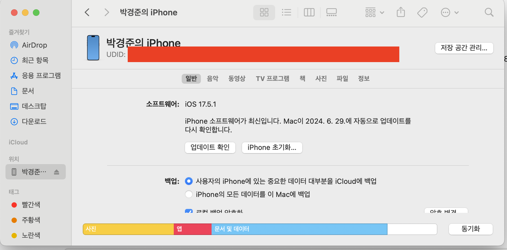

아이폰을 연결한 채로 UDID를 복사해준 뒤 쉘에 다음 명령어를 입력합니다.

```shell
rvictl -s UDID값
```

`rvictl`은 `Remote Virtual Interface Tool`의 약자이며 연결된 모바일 장치에 대한 패킷 캡처 인스턴스를 실행해줍니다. `-s`는 인스턴스를 시작하는 옵션입니다. 실행하면 아래와 같은 결과가 로그에 출력됩니다.

```shell
Starting device UDID값 [SUCCEEDED] with interface rvi0
```

이후 와이어샤크에 들어가보면 다음과 같이 rvi0이 실행되고 있을 것입니다.

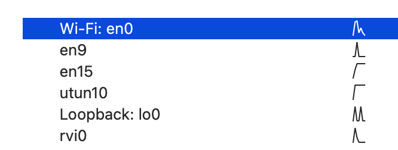

와이어샤크 실행 시 iOS 기기에서 통신이 이루어지는 모든 패킷들을 여과 없이 다 보여주기 때문에, ip주소를 기반으로 필터링을 설정해야 합니다. 위 사진에서 rvi0를 더블 클릭하여 열어준 뒤, 위의 검색창과 비슷한 UI에 디스플레이 필터를 설정해줍니다.

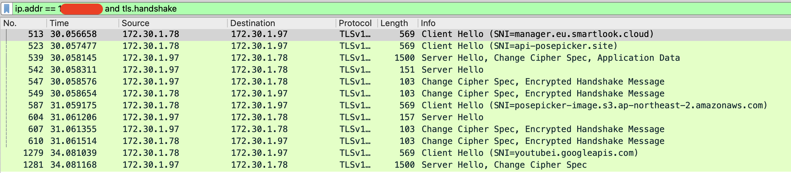

IP주소는 연결한 아이폰의 IP주소를 입력하고, 핸드셰이크 메시지들만 보기 원하기 때문에 `tls.handshake` 필터까지 추가해줍니다. 아이폰의 현재 IP주소를 보려면 연결된 와이파이 정보 자세히 보기를 눌러 확인할 수 있습니다.

이후 설치한 `Charles`를 실행해줍니다. 실행 이후 찰스가 실행되고 있는 PC는 자동적으로 MITM PC가 되어 프록시 역할을 하게 되는데, 이때 iOS기기에서 와이파이 설정에 들어가 HTTP 프록시를 수동으로 설정해주어야 합니다.

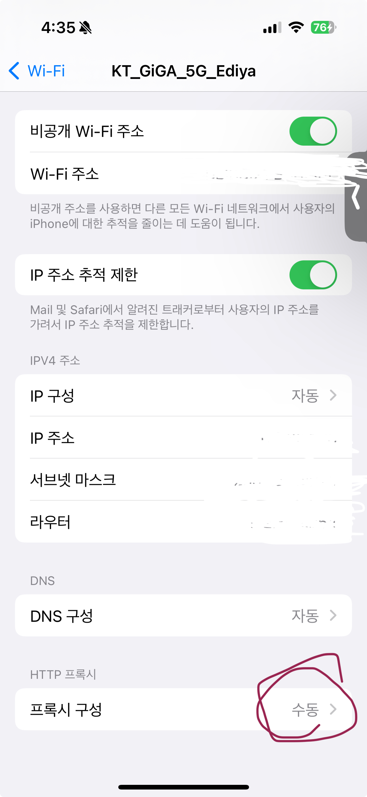

프록시 설정 기본값은 `끔`으로 설정되어 있는데, 이를 수동으로 바꿔주고 서버를 **macOS의 IP주소로**, 포트는 **8888**로 설정해줍니다. 찰스에서 기본적으로 설정한 포트가 8888입니다.

**맥에서 찰스를 실행한 상태로 iOS 기기에서 프록시 연결 설정 후 저장**을 하게 되면 아래와 같은 화면이 찰스에 뜨게 됩니다. 아래 화면에서 `Allow`해줘야 프록시 연결이 정상적으로 이루어집니다.

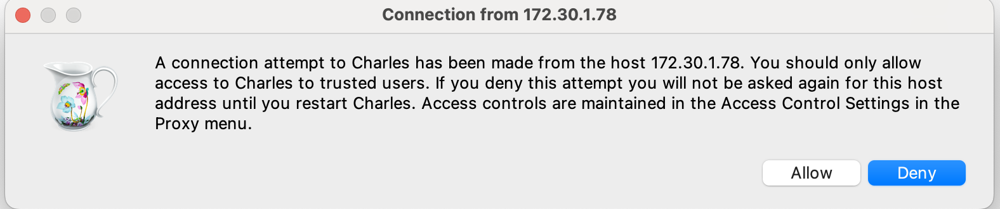

이후 패킷 캡처되는 현황을 보면 아래와 같이 나타납니다.

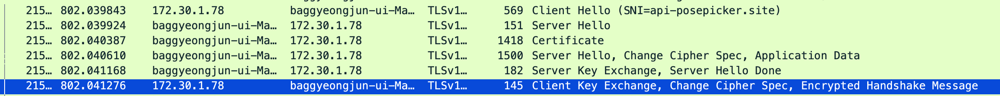

위의 패킷 캡처를 통해 알 수 있는 것은 `172.30.1.78` IP주소에서 서버로 직접 핸드셰이킹이 이루어지는 것이 아닌 프록시 역할을 하는 맥OS로 핸드셰이킹이 이루어진다는 것입니다.

프록시는 AWS 기반 웹 서버로 요청을 보낼 때 클라이언트가 되는데 프록시 서버 역할을 맥 PC가 하기 때문에 맥 PC의 시스템 루트 인증서에 `Amazon Root CA`인증서만 설치되어 있다면 아마존 웹 서버와 핸드셰이킹이 정상적으로 이루어지게 됩니다.

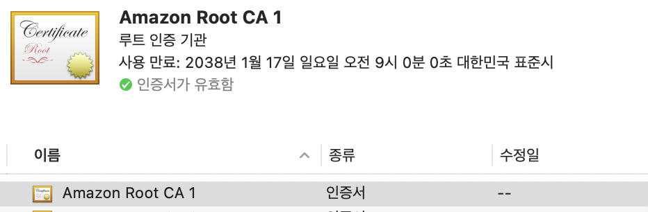

## 네트워크 통신 정량 데이터 추출

찰스 프록시 기반으로 SSL 네트워크 통신 트래픽을 캡처할 준비가 완료되었습니다. iOS 기기에서 트래픽을 캡처할 URL로 요청을 보내면 아래와 같이 기록이 남게 됩니다. 초기 통신 상태에서는 SSL 프록시 기능이 비활성화 되어 있기 때문에 인증서 신뢰 여부에 상관없이 모든 데이터가 암호화 된 채로 내부를 살펴볼 수 없게 되어 있습니다.

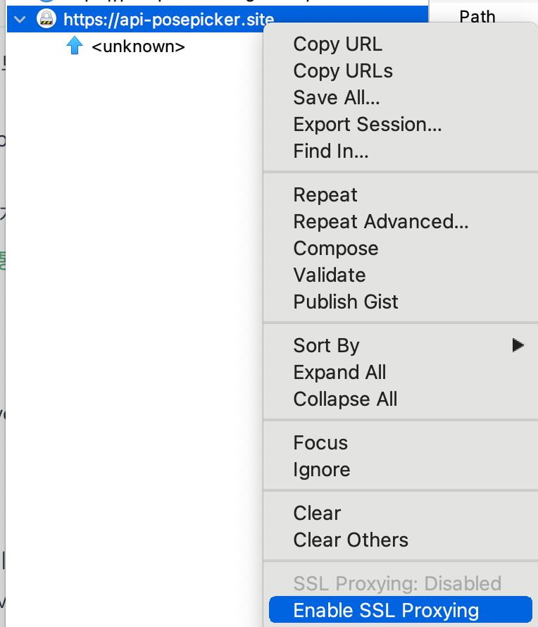

이때 해당 기록을 우클릭 하면 SSL 통신 활성화 여부를 선택할 수 있는데, `Enable SSL Proxy`를 탭하면 아래와 같이 실제 `JSON`데이터 혹은 실제 주고받는 컨텐츠를 살펴볼 수 있게 됩니다.

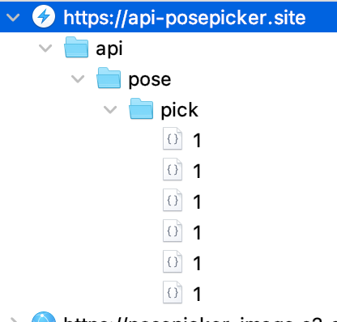

SSL 프록시 기능을 활성화 해둔 상태에서 우측에 자세한 기록들을 살펴보면 다양한 정보들을 살펴볼 수 있습니다. 여기서 가장 궁금한 정보는 다운로드 속도, 소요 시간 및 이미지 사이즈를 알아볼 예정입니다.

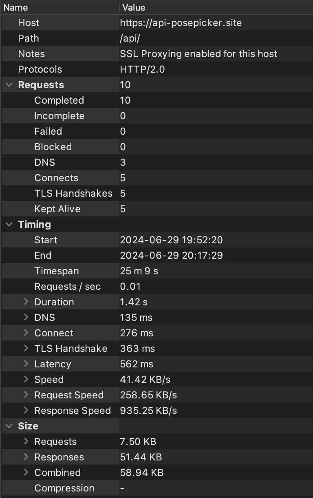

위의 리스트 중 `Timing`과 `Size`를 위주로 살펴볼 예정입니다.

먼저, 이미지 4인 & 6컷 설정 시 다운로드 받는 컨텐츠 트래픽들을 SSL 프록시를 통해 캡처합니다. DSL속도 제한 이후 출력된 이미지 다운로드 소요 시간은 아래와 같았습니다.

```text
processingTime: 1.340919417 seconds
processingTime: 2.400557375 seconds
processingTime: 7.630085416999999 seconds
```

각 이미지 컨텐츠들에 대한 사이즈와 Response 속도를 확인해보겠습니다.

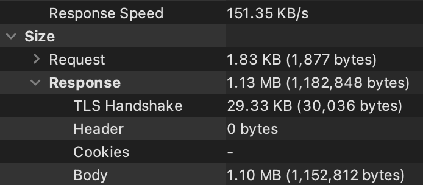
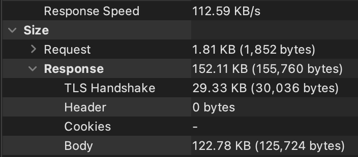
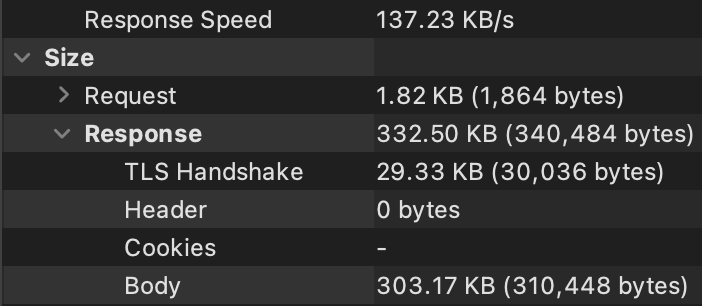

여기서 알 수 있는 점은 **DSL 속도로 네트워크 링크 컨디셔너를 설정해줘도 각 요청별로 요청에 소요되는 시간이 다를 수 밖에 없다는 점입니다.** 여러 라우팅 과정을 거치다 보면 네트워크 링크 컨디셔너를 통해 인위적으로 발생한 오버헤드 이외에 다른 변수들이 너무나 많기 때문에, **완전히 동일한 네트워크 속도로 모든 요청을 고정시킬 수 없다는 점**입니다.

이때 응답 데이터 전달이 Response에 담겨있기 때문에 `Response Size / Response Speed(KB/s)`를 계산하여 다운로드에 소요된 시간을 각각 계산합니다.

$$
\frac{(1.13 \times 1024) KB}{151.35 KB/s} + \frac{152.11 KB}{112.59 KB/s} + \frac{332.50 KB}{137.23 KB/s} = 7.645s + 1.351s + 2.423s
$$

이를 콘솔에 찍힌 각 응답 시간과 비교해보면 소숫점 둘째자리 오차 이외에는 큰 오차가 무시할만한 결괏값이 나타난 것을 볼 수 있습니다. 그렇다면 최종적으로 캡처된 트래픽 내에 찍힌 실제 소요 시간을 확인해보겠습니다.

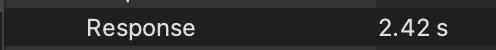


찰스 프록시에 캡처된 트래픽에서 측정된 시간 역시 소숫점 아래 2자리 이하에서만 오차가 발생한 것을 확인할 수 있었습니다.

## 캐시 성능과 비교

메모리 캐시 이전에 디스크 캐시 성능을 체크하도록 하겠습니다. 킹피셔에서 디스크 캐시를 강제하기 위해서는 메모리 캐시 리밋을 설정하면 됩니다.

```swift
ImageCache.default.memoryStorage.config.totalCostLimit = 1
ImageCache.default.memoryStorage.config.countLimit = 0
```

```swift
let startTime = self!.clock.now

ImageCache.default.retrieveImage(forKey: imageURL) { [weak self] cacheResult in
    switch cacheResult {
    case .success(let value):
        if let image = value.image {
            print("CACHE HIT💣: ", value.cacheType)
            print("CACHE ACCESS TIME⏰: ", startTime.duration(to: self!.clock.now))
        }
    // ...
}
```

네트워크를 통해 이미지를 다운로드하고 디스크 캐시가 이루어진 뒤, 캐시 액세스 타임과 캐시 타입을 출력하면 다음과 같이 콘솔에 출력됩니다.

```swift
CACHE HIT💣:  disk
CACHE ACCESS TIME⏰:  0.011027917 seconds
CACHE HIT💣:  disk
CACHE ACCESS TIME⏰:  0.012249542 seconds
CACHE HIT💣:  disk
CACHE ACCESS TIME⏰:  0.012254625 seconds
```

디스크 캐시가 아닌 메모리 캐시로 캐싱했을 때 성능차이가 얼마나 생기는지 추가 구현을 해보겠습니다.

```swift
CACHE HIT💣:  memory
CACHE ACCESS TIME⏰:  0.003838833 seconds
CACHE HIT💣:  memory
CACHE ACCESS TIME⏰:  1.8458e-05 seconds
CACHE HIT💣:  memory
CACHE ACCESS TIME⏰:  1.0125e-05 seconds
```

메모리 캐시와 디스크 캐시의 성능이 많은 차이가 있음을 확인할 수 있었습니다.

## 결론

정량적으로 추출한 데이터들을 기반으로 앱 설계에 반영해본다면 다음과 같이 기능 수정이 있을 수 있겠습니다.

1. 마이포즈, 북마크와 같이 랜덤 액세스 확률이 적어서 `Cache Hit` 비율이 높은 컨텐츠는 메모리 캐싱을 진행한다.
2. 포즈피드와 같이 랜덤으로 컨텐츠가 노출되는 경우 적정 용량 안에서 디스크 캐싱을 진행한다.
    - 사용자로부터 자주 탭이 이루어지는 태그 데이터들을 클라이언트 혹은 서버에 수집하여 `Cache Hit`비율을 늘린다.
3. 네트워크 요청에 대한 데이터는 캐시 리밋이 허락하는 한 캐시를 진행한다.

글을 정리하며, 이미지 다운로드까지 소요되는 여러 데이터를 정량적으로 측정하기 위해 배운 내용들을 요약해보겠습니다.

1. 네트워크 통신 시 Charles Proxy를 통해 트래픽 캡처가 가능하다.
2. 프록시는 클라이언트와 서버를 중개해주는 역할을 한다.
3. SSL 통신은 인증서 기반으로 동작하며 핸드셰이킹에 대한 세부 과정들을 살펴보았다.
4. `Charles Proxy`인증서를 클라이언트에서 신뢰함으로써 서버와 주고받는 암호화 데이터를 복호화 하여 살펴볼 수 있다.
5. 이를 통해 응답 시간, 컨텐츠 사이즈 등을 자세히 뜯어볼 수 있다.
6. 킹피셔 라이브러리 코드는 클로저를 중첩하여 작성해도 Thread-Safe하다.
7. 킹피셔의 progressBlock 클로저 역할과 동작 방식에 대해 자세히 알아보았다.

## Reference

1. [What is a Proxy Server and How Does it Work?](https://www.varonis.com/blog/what-is-a-proxy-server#what)
2. [그림으로 쉽게 보는 HTTPS, SSL, TLS](https://brunch.co.kr/@swimjiy/47)
3. [SSL/TLS 알아보기 – TLS 1.3과 프라이버시](https://blog.naver.com/n_privacy/221412043898)
4. [생활코딩 - HTTPS와 SSL 인증서](https://opentutorials.org/course/228/4894)
