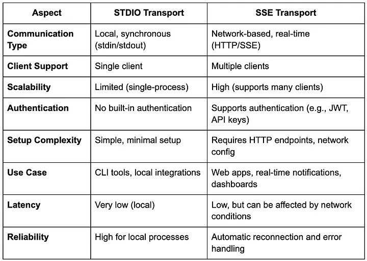

## MCP란?

MCP(**Model Context Protocol**)는 LLM에 소프트웨어 어플리케이션이 컨텍스트 정보를 전달하는 방법에 대한 하나의 표준이다. 자연어를 통해 데이터 원천과 여러 도구들과의 상호작용을 매끄럽게 하기 위한 목적성을 갖는다.

MCP라는 개념이 필요해진 이유가 곧 용어의 정의가 된다. 모델 성능은 날이 갈수록 향상되는데 데이터 연결성이 부족하니 프로덕트로서 확장을 하기 어려운 것이다. AI 시스템이 필요로 하는 데이터에 더 쉽고 믿을만하게 접근할 수 있는 방법이 MCP이다.

개발자는 **MCP 서버를** 통해 자신의 데이터 소스를 전달하고, 해당 서버에 연결하는 AI 어플리케이션을 구현하면 된다. (**MCP 클라이언트**)

MCP서버는 오픈소스로 제공되는 SDK를 사용해 직접 구현하거나, 이미 개발된 오픈소스 MCP 서버들을 활용한다. 클로드 데스크톱 앱을 활용하면 로컬 MCP를 서버를 실행할 수 있다.

## MCP server <-> client 데이터 통신 방식

MCP 서버와 클라이언트 간 데이터를 주고받는 방식은 STDIO와 SSE로 구분된다.

1. STDIO(Standard Input / Ouput)
   - 클라이언트가 서버로 표준 입력에 따라 데이터를 전달
   - 서버가 클라이언트로 표준 출력에 따라 데이터를 전달
   - 클라이언트와 서버가 같은 프로세스에서 통합 운영되는 경우 활용한다.
2. SSE (Server-Sent Events)
   - long-lived HTTP 네트워크 통신을 기반으로 서버가 클라이언트로 실시간 응답을 전달하는 기술이다.
   - MCP 컨텍스트에서는 서버와 클라이언트의 소통을 가능하게 하는 전송 방식으로 활용된다.
   - SSE를 통해 MCP 서버는 여러 클라이언트에 대한 연결을 처리할 수 있고, 인증 및 확장성 기능도 지원할 수 있게 된다.
   - 서버는 SSE 엔드포인트와 HTTP POST 엔드포인트를 제공한다.
   - SSE 엔드포인트: 클라이언트는 SSE 엔드포인트에 연결하여 응답을 수신한다.
   - HTTP POST 엔드포인트: 클라이언트는 서버로 메시지를 송신하기 위해 HTTP POST 엔드포인트를 사용한다.

## Reference

1. [Anthropic document - Introducing the Model Context Protocol](https://www.anthropic.com/news/model-context-protocol)
2. [Medium - MCP Clients: STDIO vs SSE](https://medium.com/@vkrishnan9074/mcp-clients-stdio-vs-sse-a53843d9aabb)
3. [MCP Github - Swift SDK](https://github.com/modelcontextprotocol/swift-sdk?tab=readme-ov-file)
