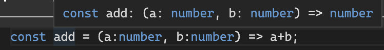

## Call Signature

이전에 객체에 대한 타입을 지정했었는데, **함수에 대한 타입도 지정할 수 있다.**

함수에 대한 타입이라고 하여 단순히 인자 / 리턴값에 대해 선언하는 것 뿐만 아니라 함수가 갖는 프로퍼티 타입에 대해서도 선언할 수 있다. 자세한 내용은 [다음의 링크](https://velog.io/@zerozoo-front/Call-signature)를 참조해보자.

복잡한 이야기는 뒤로 하고, 간단히 정의하면 TS Call Signature를 통해서 **사용자가 함수를 어떠한 형태를 갖고 호출해야 하는 지 알려주는 것이라 할 수 있다.(함수 인자 타입, 리턴값 타입)**



위 사진을 보면 함수에 대한 대략적인 형태가 나타나 있는 것을 확인할 수 있다.

```javascript
type Add = (a: number, b: number) => number;

const add: Add = (a, b) => a + b;
```

Call Signature 정의 후에 함수에 등록만 해주면 타입스크립트에서 별다른 에러를 출력하지 않는다.

## 오버로딩

Call Signature 정의 시 다음과 같이 코드를 작성할 수도 있다.

```javascript
type Add = {
    (a: number, b: number): number,
};
```

중괄호로 감싸 타입을 정의하게 되면 **동일한 이름의 다양한 인자/리턴값 타입을 갖는 함수들에 대해 정의할 수 있게 된다.**

```javascript
type Add = {
    (a: number, b: number) : number
    (a: number, b: string) : number
}

const add: Add = (a,b) => a+b
```

위와 같이 Call Signature를 통해 함수 오버로딩을 구현할 수 있는데 위의 예시는 나쁜 예시이며 실제로 사용되는 방식은 다음과 같다.

1. Next.js의 `Router.push`메서드를 사용한다. 원래는 `string`타입의 url만 전달할 수 있다.
2. Call Signature정의를 통해 url path 뿐만 아니라 state까지 전달하려고 한다.

```javascript
type Config = {
    path: string,
    state: object
}

// Push call signature 정의
type Push = {
    // 기존 함수 타입
    (path:string): void

    // 유저 커스터마이징 함수 타입
    // 인자에 대한 타입을 따로 정의하여 전달하였다.
    (config:Config): void
}

const push:Push = (config) => {
    // 1. (path: string):void 타입의 함수로 호출되었을 때
    if(typeof config === "string"){
        console.log(config)
    // 2. (config:Config): void 타입의 함수로 호출되었을 때
    }else{
        console.log(config.path);
    }
}
```

함수 오버로딩은 파라미터의 개수에 따라서도 구현된다.

```javascript
type Add = {
    (a:number, b:number): number
    (a:number, b:number, c:number): number
}

// 추가 파라미터 c에 대해 옵셔널 선언
const add:Add = (a,b,c?:number) => {
    if(c) return a+b+c;
    return a+b
}
```

가장 적은 수의 파라미터를 갖는 Call Signature가 함수의 기본 형태가 되며 이후 추가로 붙은 파라미터들에 대해서는 **옵션취급을 하게 된다.** 따라서 함수 타입 정의 후 실제 함수를 작성할 때에 추가 파라미터에 대해서는 옵셔널이라고 선언해야한다.

## 다형성 (Polymorphism)

다형성,Poly-morphism은 **다양한 형태를** 의미한다. 위의 함수 오버로딩도 다형성의 일부이다.

오버로딩의 예시를 하나 들어보면 다음과 같다.

```javascript
type SuperPrint = {
    (arr: number[]): void,
    (arr: string[]): void,
    (arr: boolean[]): void,
};

const printFunction: SuperPrint = (arr) => {
    arr.forEach((item) => console.log(item));
};
```

`printFunction`에 `SuperPrint`라는 `Call Signature`를 지정하였고 이에 따라 앞으로 함수를 정의할 때에 다양한 파라미터 타입을 다룰 수 있게 되었다.

이때 위의 예시에서 다뤄진 타입들, `number`, `string`, `boolean`, `[]`, `void` 등은 모두 `concrete type`으로 자바스크립트 자체에서 다뤄지는 타입들이다.

만약 `SuperPrint`라는 콜 시그니쳐에 더 다양한 형태의 배열을 전달하고 싶다면 어떻게 해야할까? 아래와 같이 콘크리트 타입의 조합으로 이루어진 파라미터를 새롭게 정의해야 한다.

```javascript
type SuperPrint = {
    // ... 기존 콜 시그니쳐 생략 ...
    (arr: (number | string)[]): void,
};
```

매번 새로운 콘크리트 타입들의 조합으로 콜 시그니쳐를 작성하기에는 무리가 있다. 이때 사용하는 것이 타입스크립트의 **제네릭(generic)이다.** 제네릭은 타입스크립트의 placeholder라고도 표현된다. (타입의 대체)

간단히 정리하여 제네릭을 활용하여 콜 시그니쳐를 정의하면 **명시적 타입 선언의 콜 시그니쳐가 아닌 묵시적 선언, 타입스크립트 자체의 타입 추론을 통한 콜 시그니쳐가 작성된다.**

제네릭이 더 좋은 것은 제네릭 도입 전 명시적 타입 선언의 `SuperPrint`가 0번째 인덱스를 리턴한다고 가정하였을 때 **어떤 타입의 값을 리턴할 것인지에 대해서도 선언해놔야 한다는 것이다.** 제네릭을 사용하게 되면 묵시적 타입 추론을 통해 자동으로 타입에 대한 콜 시그니쳐도 등록된다.

제네릭 사용법은 다음과 같다.

```javascript
type SuperPrint = {
    // T or V를 주로 제네릭의 이름으로 사용한다.
    // 아무 이름으로 해도 상관없음.
    <T>(arr: T[]): T,
};

const printFunction: SuperPrint = (arr) => {
    return arr[0];
};

// printFunction 콜 시그니쳐에 대한 묵시적 선언이 이루어진다.
// T가 number로 대체된다.
// 리턴값의 타입도 number가 된다.
const value1 = printFunction([1, 2, 3]);

// printFunction 콜 시그니쳐에 대한 묵시적 선언이 이루어진다.
// 파라미터에 대한 T가 (number|boolean|string)으로 대체된다.
// 리턴값의 타입도 number|boolean|string으로 대체된다.
const value2 = printFunction([1, false, 'Hello']);
```

## Reference

1. [Velog TS Call Signature](https://velog.io/@zerozoo-front/Call-signature)
2. [노마드코더 Typescript](https://nomadcoders.co/typescript-for-beginners/lobby)
