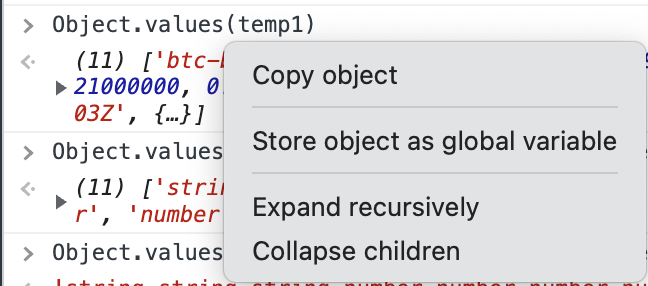

## 타입 지정

컴포넌트에 프롭스를 전달할때 타입 지정하는 방법을 알아보겠습니다. `index.tsx`에서 `App.tsx`를 호출하고 `App.tsx`에서 `Box.tsx`의 Box 컴포넌트를 호출합니다.

`App` 컴포넌트에서 Box를 호출할 때에 커스텀 프로퍼티인 `bgColor`를 전달합니다.

```javascript
function App(){
    return (
        <div>
            <Box bgColor='teal' />
            <Box bgColor='tomato' />
        </div>
    );  
}
```

`Box` 컴포넌트 입장에서는 커스텀 프로퍼티 `bgColor`를 받았고 `Box.tsx`로 이동하여 `Box`함수로 이동, 파라미터를 확인한다. 현재 작업중인 언어가 **자바스크립트가 아닌 타입스크립트이므로** `Box`함수에는 프롭스의 타입이 (파라미터의 타입) 지정되어 있어야 한다. 

```javascript
// Box.tsx
function Box({bgColor}: BoxProps){
  //...
}
```

**이때 프롭스에 대한 타입 지정은 타입스크립트의 interface 키워드를 활용한다.** (위 코드의 `BoxProps`) 

```javascript
interface BoxProps{
  bgColor: string;
}

function Box({bgColor}: BoxProps){
  return <Inner></Inner>;
}
```

이때 설정한 프롭스들은 모두 **required** 상태이다. **타입을 지정해둔 프롭스를 사용하지 않으면 에러가 발생한다.** 프롭스 값이 `undefined`가 될 수 있음을 나타내려면 프롭스 인터페이스에 다음과 같이 표시하면 된다.

```javascript
interface ContainerProps{
  borderColor?: string,
  backgroundColor: string
}
```
`ContainerProps`에서 프롭스 타입을 지정할 때에 물음표`?`만 붙이면 된다.

:::tip 프롭스 내리기
`App` -> `Box` -> `Inner` 컴포넌트로 프롭스를 내린다고 가정해보자. `color`라는 프롭스를 내린다고 가정하면 다음과 같은 코드가 작성된다.

```javascript
function App(){
  return (
    <div>
      <Box color="white"/>
    </div>
  )
}
```

```javascript
interface InnerProps{
  color:string
}

const Inner = styled.div<InnerProps>`
  color: ${(props) => props.color};
`

interface BoxProps = {
  color?:string
}

function Box({color}: BoxProps){
  return (
    <Inner color={color}/>
  )
}
```

현재 위 코드에서 **BoxProps의** `color` 타입은 `required`가 아닌 상태로 프롭스를 받고 있으며 내려받은 프롭스를 다시 `Inner`로 내려보내고 `Inner` 타입 인터페이스에서 내려받은 프롭스 타입을 정의할때 `InnerProps`에서는 `color`라는 이름의 프롭스 타입이 `required`이다. 이렇게 되면 에러가 발생하게 된다.

컴포넌트 간에 주고받는 프롭스는 타입뿐만 아니라 `required` 여부도 엄격하게 검증한다. 
:::

## 프롭스 디폴트 값

프롭스에는 디폴트 값을 지정할 수 있다. 프로퍼티에 값이 전달되지 않았을 때 디폴트 프롭스 값을 대신 집어넣게 된다. 타입은 `required`상태가 **아니어야 한다.**

```javascript
interface InnerProps{
  color?: string
}

const Inner = styled.div<InnerProps>`
  color: ${(props) => props.color};
`

interface BoxProps{
  color?: string
}

function Box({color}: BoxProps){
  return(
    <Inner color={color ?? 'red'}/>
  )
}
```
```javascript
// App.js
function App(){
  return (
    <Box color="green"></Box>
    <Box></Box>
  )
}
```

Box 컴포넌트 두개를 부착하였는데 하나는 `color` 프로퍼티를 주고 하나는 아무 프로퍼티도 주지 않았다. 이때 아무 프로퍼티도 전달하지 않은 두 번째 프로퍼티는 디폴트 값이 등록되어 있으므로 자동으로 `Box` -> ` Inner`에서 폰트 색이 `red`로 적용된다.

`required` 하지 않은 프롭스를 **옵셔널 프롭스(optional props)라고 한다.**

:::tip 널 병합 연산자
프롭스에 `undefined`가 전달되었을 때 활용했던 `??` 연산자는 ES6의 널 병합 연산자이다. `undefined` 대신 `||`인 OR 연산자를 사용해도 되지만 `||` 연산자는 0, `NaN`, `''` 등을 유효한 값으로 가정할 때에는 사용하면 안된다. (falsy한 값, 조건문에서 통과되지 않는 값들) 이들 값이 OR 연산자에 전달되면 오른편에 전달된 결과를 리턴하게 된다.

```javascript
function check(checkParam){
  const title = checkParam ?? "Falsy";
  return title;
}

const result = check("Hello");
console.log(result); // Hello

const isFalsy = check("");
console.log(falsy); // ""
  
const realFalsy = check(); // undefined전달
console.log(realFalst); // Falsy
```

자세한 내용은 [다음의 문서를 참조해주세요.](https://joshua1988.github.io/vue-camp/es6+/nullish-coalescing-operator.html)
:::

## React event type
리액트에서 이벤트 기반으로 값을 조정할 때에 이벤트핸들러 함수의 파라미터로 `event`를 전달하게 된다. 이때 `event`는 타입스크립트에서 **any 타입으로 적용되어 있는데** 이는 타입스크립트 언어 내에서는 최대한 자제해야 한다. 타입스크립트가 적용된 리액트 프로젝트에서 이벤트 타입을 지정하는 코드는 다음과 같다.

```javascript
const onClick = (event : React.FormEvent<HTMLInputElement>) => {
  const {
    currentTarget: {value},
  } = event; // const value = event.currentTarget.value;
}
```

타입스크립트가 설치되어 있는 이상 `React`의 프로퍼티로 접근하게 되면 여러가지 이벤트들이 나열된다. 폼과 관련된 이벤트를 비롯하여 여러가지 이벤트들이 있는데 이는 적재 적소에 다른 이벤트로 타입을 등록해야하기 때문에 구글링을 통해 진행하도록 하자.

이벤트를 결정했으면 **어떤 요소로부터 이벤트가 트리거되는지까지 지정해야한다.** 꺽쇠로 열어서 지정하면 된다.

위와 같은 특별한 형태의 이벤트를 리액트에서 **Synthetic event라고 한다.** 

## 크기가 큰 객체 타입 설명하기 
객체를 구성하는 프로퍼티의 종류가 다양하다면 이에 대한 인터페이스를 하나 하나 정의해주기가 여간 번거로운게 아니다. 조금이나마 편리하게 작업하는 방식을 소개한다.

먼저 객체를 콘솔에 출력한다. 출력된 객체를 우클릭 하게 되면 몇가지 탭이 보이는데 `store object as global variable`을 클릭하자.



콘솔 상의 전역 변수로 선언되어 해당 객체에 접근 및 객체 내장 메서드를 활용하여 작업할 수 있게 된다.

먼저 해야할 작업은 인터페이스에 등록할 객체 프로퍼티 이름들을 가져오는 것이다. 전역변수 temp1에 객체 프로퍼티 명이 저장되어 있다고 가정한다. 아래 코드를 실행하면 객체 프로퍼티 키값(프로퍼티명)들이 join되어 한 문자열로 반환된다.

```javascript
Object.keys(temp1).join();
```

이 문자열을 복사하여 VSC로 가져간 후 Command + D 로 쉼표를 일괄 삭제하고 Alt + Shift + I 로 동시 커서 생성을 한뒤 콜론과 세미콜론을 같이 찍어주자.

객체 프로퍼티에 대한 설명은 이루어졌으니 어떤 타입인지 설명해야한다.
```javascript
Object.values(temp1).map(item => typeof item).join();
```
temp1 객체의 프로퍼티 값들을 모두 가져오고 각 값에 `map` 함수를 통해 원소값들을 각 원소의 타입값으로 변환해준다. 조인까지 사용하여 한 문자열로 반환하고 프로퍼티 이름을 인터페이스에 등록할때처럼 VSC에서 작업하면 된다.

:::warning Object Type
객체 프로퍼티의 Array타입이 Object로 인식이 되는데 이때 타입스크립트에는 각 배열 원소가 어떤 타입인지도 설명해줘야 한다.

```javascript
interface IArrayInterface{
  arr: IMyType[];
}

interface IMyType{
  ....
}
```
:::

:::tip 타입스크립트 내부 타입 재사용
기존에 사용했던 인터페이스의 내부 타입들 중 재사용하고 싶은 타입이 있다면 다음과 같이 사용하면 된다.

```javascript
interface IString{
  text: "ONE"|"TWO"|"THREE"
}

const myFunction = (param: IString["text"]){
  // ...
}
```
:::
## Reference 
1. [Cracking Vue.js - 널 병합 연산자](https://joshua1988.github.io/vue-camp/es6+/nullish-coalescing-operator.html)
2. [Nomad coders - 리액트 마스터 클래스](https://nomadcoders.co/react-masterclass/lobby)