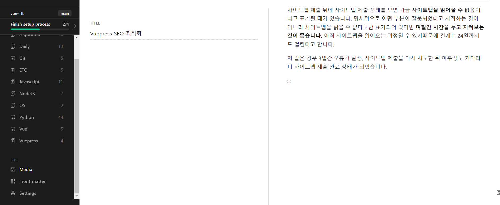
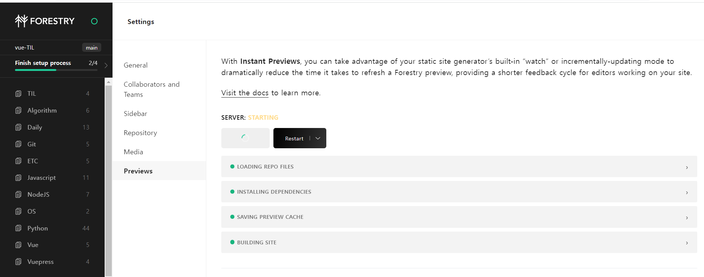
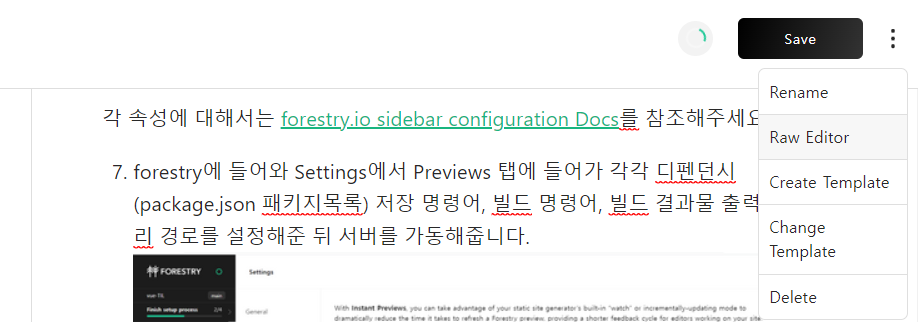

## Monolithic CMS

CMS는 `Content Management System`의 약자로 프론트 단(Presentation layer)에 표시되는 각종 컨텐츠들을 저장하고 관리하는 공간입니다.

기존의 CMS는 모놀리틱(Monolithic)하다는 문제가 있었습니다. 이게 뭐냐하면, 모놀리틱을 직역하면 **"단단히 짜여 하나로 되어 있는"** 이라는 의미를 갖는데 프레젠테이션 계층과 백 단에서의 관리 층이 분리되지 않고 한 시스템 안에서 묶여있는 것을 의미합니다.

CMS 페이지 하나를 예시로 보여드리겠습니다.


위 페이지는 보시다시피 등록 컨텐츠에 대한 뷰가 백엔드 단에서 함께 표기되고 있습니다. 메뉴에 대한 뎁스와 각 컨텐츠가 갖는 속성(번호, 썸네일, 제목 등)들을 모두 관리하면서 뷰도 보여주고 있습니다.

레거시 CMS, 즉 기존의 CMS 시스템의 문제점은 **페이지 트래픽에 따라 안정성, 보안, 성능 등의 지표에 영향을 미칠 수 있다는 것입니다.** 뷰와 더불어 대용량 데이터까지 다루게 되니 이러한 한계점은 당연하다고 볼 수 있겠네요.

## Headless CMS

레거시 CMS의 한계를 극복하기 위해 등장한 시스템이 바로 **헤드리스 CMS(Headless CMS) 입니다.** 헤드리스 CMS란 프론트엔드와 백엔드를 분리시켜 컨텐츠 접근 방식을 API를 통해 이루어지도록 한 CMS입니다.



현재 제가 배포중인 뷰프레스 사이트에 실제 적용중인 CMS 페이지입니다. [forestry.io](https://forestry.io/)라는 사이트에서 확인하실 수 있으며 `git`을 기반으로 하는 서비스입니다.

레거시 CMS와 다른 점이라고 하면 **CMS상에 뷰가 표시되지 않는다는 것입니다.** 헤드리스 CMS의 가장 큰 특징은 API를 통해 컨텐츠를 관리하는 것입니다.

> A headless CMS has no presentation layer and makes content available through APIs. With a headless CMS, the task of the content presentation is performed by an external client consuming APIs exposed by headless CMS.
>
> 출처 -[ WebriQ, WTF is Headless CMS?](https://www.webriq.com/monolithic-cms-versus-headless-cms)

위와 같은 특징으로 인해 헤드리스 CMS는 **API-first** 라고도 불립니다. 가끔 **Content Infratstructure**, **Content Hubs**, **Content as a Service** 와 같은 명칭으로도 불리는 경우가 있지만 실상은 컨텐츠 중심이 아닌 컨텐츠 접근 API를 중심으로 사이트가 구현되기 때문에 올바른 표현은 아니라고 할 수 있습니다.

:::details API란?

> API stands for Application Programming Interface, which means that you get content in a way that is easier to integrate with existing or new software solutions.

API는 소프트웨어와 쉽게 소통할 수 있도록 **컨텐츠를 얻는** **방식**을 말합니다.

네트워크 상에서 컨텐츠를 주고 받을 때에는 네트워크 요청과 응답에 의해 이루어집니다. 특정 웹 페이지 방문을 예시로 해당 페이지의 컨텐츠를 요청한다고 할 때에 사용자는 **"**[**https://mydomain.com/api/posts/**](https://mydomain.com/api/posts/ 'https://mydomain.com/api/posts/')" 와 같은 주소로 네트워크 요청을 보냅니다. 사용자들은 요청에 대한 응답으로 위 페이지에 대한 컨텐츠를 받게 되지만 개발자들은 **위 페이지를 구성하는 요소들에 대한 리스트를 얻습니다.** 이 컨텐츠에 대한 구성요소 리스트가 바로 **API**입니다.

:::

위에 들었던 코맥스 CMS 페이지 예시를 다시 생각해봅시다. 레거시 CMS의 경우 뷰가 정해져있습니다. 코맥스의 공지사항을 예시로 들어 컨텐츠를 표시한다고 가정하면, 공지사항이라는 페이지에 들어갈 데이터가 제목, 내용, 작성자, 작성일자 등 선험적으로 정해진 상태여야만 CMS상에서 컨텐츠 등록 및 수정을 진행할 수 있습니다.

이에 비해 헤드리스 CMS의 경우 문서의 성격을 그때 그때 다르게 정의할 수 있습니다. forestry에서 작성하는 문서의 경우 `.yml`파일의 `frontmatter` 정의에 따라 글 속성을 새롭게 정의할 수 있게 됩니다. 글에 대한 API를 직접 다루게 됨으로써 블로그 시스템 구축이 훨씬 자유로워진 것입니다.

레거시 CMS에서는 데이터 전달을 담당하는 프론트엔드, 데이터 관리를 담당하는 백엔드가 뷰라는 결과물로 단단히 묶여있는 **모놀리틱(Monolithic) 상태가 되지만,** 헤드리스 CMS는 이러한 부분에서 자유롭습니다.

## Forestry로 CMS 구축하기

[forestry.io](https://app.forestry.io/dashboard/#/)는 깃(git)을 기반으로 하는 헤드리스 CMS를 제공하는 서비스입니다.

API관리 및 플러그인 설치와 같은 블로그 구축의 자유성을 위해 뷰프레스나 지킬(Jekyll)같은 정적 사이트 생성기를 이용하지만 마크다운으로 작성한 문서가 어떻게 반영되는지 실시간으로 확인하기가 어려운 것은 사실입니다. 매번 빌드를 해야하고 빌드 후에 `frontmatter`의 수정이 있으면 로컬호스트에서 돌리던 서버를 종료한 뒤 다시 빌드해야하는 번거로움이 있습니다.

이에 반해 기존의 블로그 제공 사이트인 티스토리나 네이버 등은 글 작성 뒤 별다른 중간 과정 없이 업로드가 진행되어 빠르게 그 결과물을 확인할 수 있게 됩니다.

위의 장점을 forestry가 가진다고 생각하시면 됩니다.

forestry를 활용하여 CMS를 구축하는 과정은 다음과 같습니다.

1. [forestry.io](https://app.forestry.io/dashboard/#/)에 로그인한 뒤 Dashboard에 들어갑니다.
2. Add site를 클릭합니다.
3. 자신의 정적사이트 생성기에 해당하는 메뉴를 클릭합니다. (뷰프레스 기준으로 작성합니다.)
4. forestry에 연결할 깃 프로바이더를 선택합니다. (깃헙 기준으로 작성합니다.) 하단에 **Quick Setup via OAuth** 옵션은 켜준 상태로 진행합니다.
5. 레포지토리와 해당 레포의 브랜치를 선택합니다. 뷰프레스의 경우 `gh-pages`가 아닌 `main`브랜치를 선택합니다.
6. CMS페이지를 생성한 뒤 로컬 환경에서 뷰프레스 프로젝트 루트 디렉토리에 **.forestry** 폴더를 생성 후 내부에 **settings.yml** 파일을 생성합니다. 푸시 후 원격 저장소에 반영해둔 상태여야 합니다.

```yml
---
new_page_extension: md
auto_deploy: false
admin_path:
webhook_url:
sections:
    - type: directory
      path: docs/TIL
      label: TIL
      create: documents
      match: '*.md'
      templates:
          - post
upload_dir: docs/.vuepress/assets
public_path: '../.vuepress/assets'
front_matter_path: ''
use_front_matter_path: false
file_template: ':filename:'
build:
    preview_output_directory: docs/.vuepress/dist
    install_dependencies_command: npm install
    preview_docker_image: forestryio/node:12
    mount_path: '/srv'
    working_dir: '/srv'
    instant_preview_command: npm run build && npm run dev
```

각 속성에 대해서는 [forestry.io sidebar configuration Docs](https://forestry.io/docs/settings/content-sections/)를 참조해주세요.

7. forestry에 들어와 Settings에서 Previews 탭에 들어가 각각 디펜던시(package.json 패키지목록) 저장 명령어, 빌드 명령어, 빌드 결과물 출력 디렉토리 경로를 설정해준 뒤 서버를 가동해줍니다. 
8. forestry를 새로고침하면 기존에 연결해둔 원격 레포지토리의 settings.yml을 감지하여 각종 문서들을 불러온 상태가 됩니다. (자동으로 진행됩니다.)

코드블럭을 코드에 따라 다르게 하이라이팅 하고 싶다면 forestry 에디터가 아닌 raw 에디터로 전환하여 진행하면 됩니다. 문서 수정 페이지의 우측 상단 수정버튼을 클릭하면 됩니다.



이제 문서 수정 시 forestry에서 자동으로 감지하여 빌드와 배포 모든 과정을 진행해줍니다. 애셋 파일 관리가 주제별로 묶기 힘들어지는 점만 제외하면 현재까지 아주 편하게 사용하는 기능이니 뷰프레스를 비롯한 정적 사이트 생성기를 활용하시는 분들은 꼭 사용해보시면 좋을 것 같습니다!
