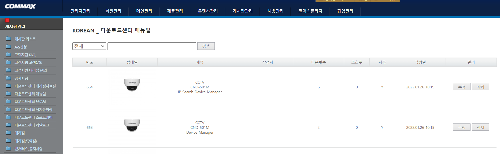

## Monolithic CMS

CMS는 `Content Management System`의 약자로 프론트 단(Presentation layer)에 표시되는 각종 컨텐츠들을 저장하고 관리하는 공간입니다.

기존의 CMS는 모놀리틱(Monolithic)하다는 문제가 있었습니다. 이게 뭐냐하면, 모놀리틱을 직역하면 **"단단히 짜여 하나로 되어 있는"** 이라는 의미를 갖는데 프레젠테이션 계층과 백 단에서의 관리 층이 분리되지 않고 한 시스템 안에서 묶여있는 것을 의미합니다.

CMS 페이지 하나를 예시로 보여드리겠습니다.

위 페이지는 보시다시피 등록 컨텐츠에 대한 뷰가 백엔드 단에서 함께 표기되고 있습니다. 메뉴에 대한 뎁스와 각 컨텐츠가 갖는 속성(번호, 썸네일, 제목 등)들을 모두 관리하면서 뷰도 보여주고 있습니다.

레거시 CMS, 즉 기존의 CMS 시스템의 문제점은 **페이지 트래픽에 따라 안정성, 보안, 성능 등의 지표에 영향을 미칠 수 있다는 것입니다.** 뷰와 더불어 대용량 데이터까지 다루게 되니 이러한 한계점은 당연하다고 볼 수 있겠네요.

## Headless CMS

레거시 CMS의 한계를 극복하기 위해 등장한 시스템이 바로 **헤드리스 CMS(Headless CMS) 입니다.**

현재 제가 배포중인 뷰프레스 사이트에 실제 적용중인 CMS 페이지입니다. [forestry.io](https://forestry.io/)라는 사이트에서 확인하실 수 있으며 `git`을 기반으로 하는 서비스입니다.

레거시 CMS와 다른 점이라고 하면 **CMS상에 뷰가 표시되지 않는다는 것입니다.** 헤드리스 CMS의 가장 큰 특징은 API를 통해 컨텐츠를 관리하는 것입니다.

> A headless CMS has no presentation layer and makes content available through APIs. With a headless CMS, the task of the content presentation is performed by an external client consuming APIs exposed by headless CMS.
>
> 출처 -[ WebriQ, WTF is Headless CMS?](https://www.webriq.com/monolithic-cms-versus-headless-cms)

위와 같은 특징으로 인해 헤드리스 CMS는 **API-first** 라고도 불립니다. 가끔  **Content Infratstructure**, **Content Hubs**, **Content as a Service** 와 같은 명칭으로도 불리는 경우가 있지만 실상은 컨텐츠 중심이 아닌 컨텐츠 접근 API를 중심으로 사이트가 구현되기 때문에 올바른 표현은 아니라고 할 수 있습니다.