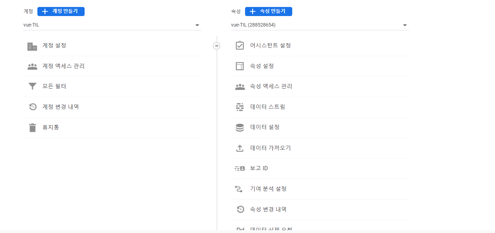
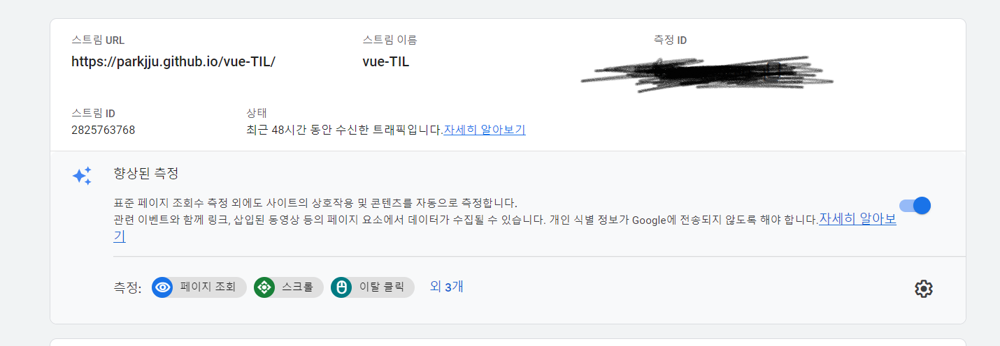

## Google Analytics

구글 어낼리틱스 등록 과정 자체는 간단하지만 최근 GA 버전 업이 진행되면서 발급되는 코드 앞자리가 달라지는 문제가 발생했습니다. 이전 `UA-000000`형식의 코드는 더 이상 적용되지 않습니다. 코드 발급 형식이 달라지게 되면서 `GA-`형식의 코드를 등록하는 방법 자체도 달라지게 되었습니다.

먼저 구글 어낼리틱스 플러그인을 설치합니다.

```sh
yarn add -D @vuepress/plugin-google-analytics
```

이후 `config.js`의 헤드태그 영역에 다음 코드를 추가합니다.

```js
module.exports = {
    //...
    head: [
        [
            'script',
            {
                async: true,
                src: 'https://www.googletagmanager.com/gtag/js?id=G-XXXXXXXXXX',
                // GA에서 발급받은 코드
            },
        ],
        [
            'script',
            {},
            [
                "window.dataLayer = window.dataLayer || []; function gtag(){dataLayer.push(arguments);} gtag('js', new Date()); gtag('config', 'G-XXXXXXXXXX');",
            ],
        ],
    ],
};
```

위 코드에 `G-XXXX`라고 표기되어 있는 부분을 구글 어낼리틱스에서 발급받은 코드로 대체하면 됩니다.

GA에서 코드를 발급받는 방법은 다음과 같습니다.

1. GA접속, 로그인
2. 설정 메뉴 - 속성 만들기



3. 기본 설정 체크
4. 속성 - 데이터스트림 - 스트림 추가



측정 ID라고 되어있는 부분을 `G-XXX`에 작성하면 됩니다.

코드 작성이 끝나고 배포까지 완료되면 배포 사이트 개발자 도구 - 콘솔에 들어가서 `gtag`을 입력해봅니다.

```js
gtag
ƒ gtag(){dataLayer.push(arguments);}
```

아래와 같이 `gtag` 함수에 대한 정의가 나오면 정상적으로 GA에 등록이 된 것입니다.
