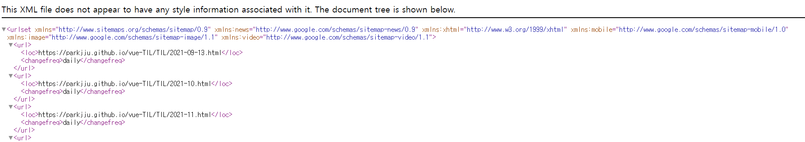

## SEO, GA

SEO란 Search Engine Optimization의 약자로 직역하면 검색 엔진 최적화를 의미합니다. 성능, 접근성 등 몇 가지 지표로 점수를 매겨 포털 사이트 검색 결과로 페이지 노출 우선순위를 결정하게 되며, SEO가 높은 사이트의 게시글은 검색창에서 찾기 쉬워지게 됩니다.

현재까지 제 블로그에 적용한 SEO요소는 몇 가지 메타태그와 HTML의 타이틀 태그,구글 서치콘솔(Google Search Console), pwa가 있고 성능적인 측면에서는 뷰프레스에서 제공하는 부분이므로 따로 설정한 부분은 없습니다. SEO 최적화 방식은 다양하지만 이번에 등록한 PWA와 구글 서치콘솔을 중심으로 글을 작성해보도록 하겠습니다.

또한 블로그 방문 지표를 통해 사이트 개선 방안을 물색할 수 있으므로 관련된 도구를 등록하는 것에 흥미가 있었는데 바로 **Google Analytics**가 이러한 기능을 제공하고 있었습니다.

## Google Search Console

구글 서치콘솔을 등록하기 위해서는 배포중인 뷰프레스 사이트에 `sitemap.xml`이라는 파일이 필요합니다. 뷰프레스에서 이를 위한 플러그인을 따로 제공중이므로 `npm` 또는 `yarn`을 통해 설치해주면 됩니다.

```sh
yarn add -D vuepress-plugin-sitemap

npm install -D vuepress-plugin-sitemap
```

플러그인 설치가 완료되었으면 `config.js`파일에 들어가서 `plugins` 속성에 `"sitemap"`을 추가해줍니다.

```js
plugins: [
  ["sitemap", { hostname: "https://Username.github.io/TIL" }],
  "@vuepress/plugin-back-to-top",
  // ....
  // 위의 예시는 깃헙페이지 baseURL이 있는 것을 기준으로 합니다.
];
```

플러그인 등록이 완료되었으면 먼저 사이트맵이 제대로 생성되었는지 확인해야합니다. 플러그인으로 등록한 링크에 `sitemap.xml`을 추가하여 접속합니다. `https://Username.github.io/TIL/sitemap.xml`의 형식을 띠게 됩니다.

<figure>



<figcaption>
위와 같은 형태로 xml 페이지가 나타나게 됩니다.
</figcaption>

</figure>

`xml`형식의 페이지가 정상적으로 나왔다면 플러그인 등록은 정상적으로 완료된 것입니다.

사이트맵 등록 후에는 `robots.txt` 파일을 추가해야합니다. [노경환님의 기억보다 기록을 - SEO 최적화](https://kyounghwan01.github.io/blog/Vue/vuepress/seo/#sitemap) 게시글을 보시면,`robots.txt`는 웹 크롤러들의 접근을 제어하기 위한 규약이라고 되어 있습니다.

`robots.txt` 파일의 내용은 다음과 같이 작성하면 됩니다.

```
User-agent: *
Allow: /
Sitemap: https://Username.github.io/TIL/sitemap.xml
```

`Sitemap`에 자신의 사이트에 등록된 `sitemap.xml` 위치만 적으면 됩니다.

`robots.txt`까지 작성이 되었으면 구글 서치콘솔에 사이트를 등록하기만 하면 됩니다.

등록 과정은 다음과 같습니다.

1. [구글 서치콘솔 사이트에](https://search.google.com/search-console/about) 들어간다.
2. 속성 추가를 한다.
3. URL 접두어라고 되어있는 곳에 사이트맵 URL을 입력한다. 위의 예시에 따르면 `https://Username.github.io/TIL/sitemap.xml`를 작성하면 됩니다.
4. 소유권 확인을 위해서는 여러가지 방법이 제시되어 있는데 위 방법들 중 **HTML태그**라고 되어있는 방법이 가장 간단합니다. (엄청난 삽질 끝에 알아낸 방법)

기본적으로 뷰프레스는 빌드 시 인덱스 페이지에 작성할 `head`태그 속 메타데이터들을 모두 `config.js`파일로부터 참조하게 됩니다. 따라서 `config.js`파일에 `head`태그에 들어갈 내용들을 작성하면 페이지가 빌드 되면서 자동적으로 태그가 삽입되게 되는 것입니다.

```js
head: [
  ["link", { rel: "shortcut icon", href: "./favicon.ico" }],
  //...
];
```

위와 같이 `head` 태그가 정의되어 있고 그 안에 메타데이터들을 추가하면 되는데 이때 소유권 확인의 방법 중 하나인 HTML태그 삽입 코드를 그대로 복사하여 `js`파일 형식에 맞춰 옮겨주면 됩니다.

```html
<meta name="google-site-verification" content="..." />
```

위와 같은 태그라면

```js
head: [
  ["meta", { name: "google-site-verification", content: "..." }],
  //...
];
```

위와 같은 방식으로 옮겨 작성하면 됩니다.

소유권 확인 뒤에는 URL검사를 먼저 진행합니다. 구글 서치콘솔 내의 검색창에 본인 사이트의 URL을 입력하고 **색인 생성을 진행합니다.** 1~2분의 간단한 색인 생성 테스트를 진행한 뒤 크롤링 대기열에 사이트가 추가됩니다.

마지막으로 **Sitemaps** 메뉴에 들어가 사이트의 사이트맵을 추가해주면 마무리됩니다. 본인 페이지의 사이트맵 위치를 작성하면 됩니다.

:::warning

사이트맵 제출 뒤에 사이트맵 제출 상태를 보면 가끔 **사이트맵을 읽어올 수 없음**이라고 표기될 때가 있습니다. 명시적으로 어떤 부분이 잘못되었다고 지적하는 것이 아니라 사이트맵을 읽을 수 없다고만 표기되어 있다면 **며칠간 시간을 두고 지켜보는 것이 좋습니다.** 아직 사이트맵을 읽어오는 과정일 수 있기때문에 길게는 24일까지도 걸린다고 합니다.

저 같은 경우 3일간 오류가 발생, 사이트맵 제출을 다시 시도한 뒤 하루정도 기다리니 사이트맵 제출 완료 상태가 되었습니다.

:::

## Google Analytics

구글 어낼리틱스 등록 과정 자체는 간단하지만 최근 GA 버전 업이 진행되면서 발급되는 코드 앞자리가 달라지는 문제가 발생했습니다. 이전 `UA-000000`형식의 코드는 더 이상 적용되지 않습니다. 코드 발급 형식이 달라지게 되면서 `GA-`형식의 코드를 등록하는 방법 자체도 달라지게 되었습니다.

먼저 구글 어낼리틱스 플러그인을 설치합니다.

```sh
yarn add -D @vuepress/plugin-google-analytics
```
