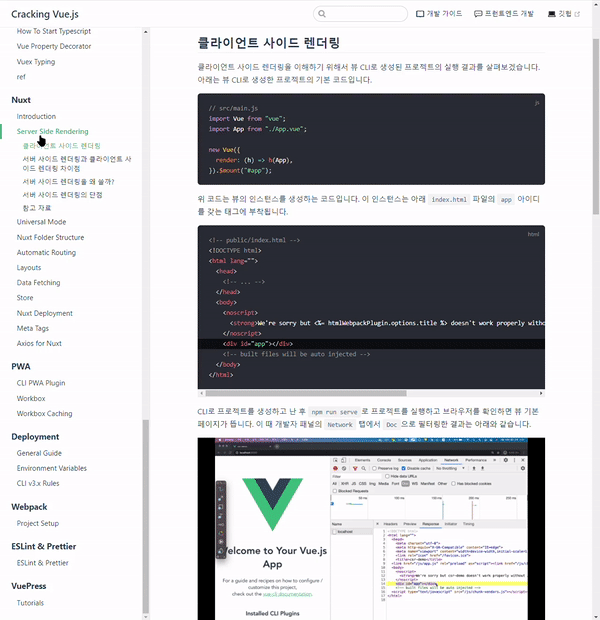
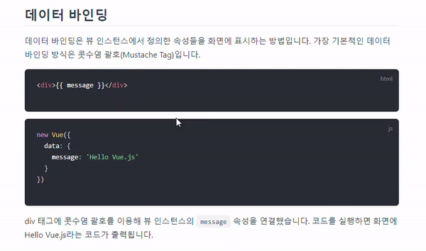

## Static Site Generator

뷰프레스는 `Vue` 기반의 정적 사이트 생성기입니다. 하나부터 열까지 페이지를 직접 제작할 수도 있지만 현실적으로 어려운 경우가 많기 때문에 다양한 장점을 갖는 정적 사이트 생성기들을 이용하게 됩니다.

1. 마크다운 문법을 빌드 시에 html파일로 변환해줍니다.
2. 빌트인 레이아웃, 템플릿들이 많습니다.
3. 빌트인 SEO 기능이 있습니다.
4. 다양한 라이브러리, 플러그인들을 통해 확장성을 키울 수 있습니다.

Gatsby, Jekyll 등 종류가 매우 다양하지만, 이번 문서에서는 뷰프레스를 어떻게 활용하면 되는지 기초부터 알아보도록 하겠습니다 🗣

## Vuepress 설치

뷰프레스 사이트를 배포할 레포지토리를 생성합니다. `<Yourname>.github.io`로 생성하면 깃헙에서 제공하는 Github pages의 홈 URL로 연결되며, 그 외의 레포지토리로 생성할 경우 `<Yourname>.github.io.<YourRepository>`로 연결이 됩니다. **추후 베이스 URL을 설정해야 404페이지가 뜨지 않습니다.**

```sh
yarn create vuepress-site
```

위 명령어를 실행하면 뷰프레스 기본 테마로 사이트 하나를 생성하게 됩니다. 기본 세팅 질문들이 몇 가지 정도 되는데, 가장 처음에 묻는 프로젝트 명을 `docs`라고 설정해줍시다. 설치가 끝나면 `docs`폴더 밑에 `src`를 비롯한 뷰프레스 기본 파일들이 생성됩니다.

1. `.vuepress` - 뷰프레스 `configure`, 설정파일들과 빌드 결과물이 모이는 장소입니다.
2. `config`, `guide`, `index.md` - 디폴트 테마의 뷰프레스 페이지를 나타내는 기본 마크다운 파일들입니다.
3. `.gitignore`, `package.json` - 이그노어 파일, 패키지 설정파일입니다. 이 파일들은 루트 위치에 이동시킵니다.

`package.json`을 루트에 옮겼으니, 뷰프레스 빌드를 위한 스크립트 명령어를 `src`에서 `docs`로 변경합니다. `docs` 폴더를 빌드하며 자동으로 `.vuepress` 폴더를 생성하게 될텐데, `yarn create vuepress-site` 명령어를 실행하며 생성되었던 `.vuepress`폴더를 `docs` 폴더 하위에 옮겨놓았으므로 빌드 결과물은 자동으로 해당 위치에 생성됩니다.

```json
{
    "name": "docs",
    "version": "0.0.1",
    "description": "",
    "main": "index.js",
    "authors": {
        "name": "",
        "email": ""
    },
    "repository": "/docs",
    "scripts": {
        "dev": "vuepress dev docs", // 수정!
        "build": "vuepress build docs" // 수정!
    },
    "license": "MIT",
    "devDependencies": {
        "vuepress": "^1.5.3"
    }
}
```

`src` 폴더에서 모든 파일들을 꺼내 **docs** 하위에 위치시킵니다. `src` 폴더는 삭제합니다. 그후 레포지토리 루트 위치에서 다음 명령어를 실행합니다.

:::tip 폴더 구조 짚어보기
`yarn create vuepress-site` 직후 폴더 구조는 다음과 같습니다.

```text
docs-
    |-- package.json
    |-- .gitignore
    |-- src
         |-- .vuepress
         		 |-- components
                 |-- styles
                 |-- config.js
                 |-- enhanceApp.js
         |-- config
         |-- guide
```

폴더구조 개편 이후는 다음과 같습니다.

```text
package.json
.gitignore
docs-
	|-- .vuepress
    		|-- components
            |-- styles
            |-- config.js
            |-- enhanceApp.js
    |-- config
    |-- guide
```

:::

```sh
yarn add -D vuepress
```

위 명령어를 실행하면 폴더 루트 위치에 뷰프레스 패키지의 디펜던시들이 `node_modules`에 모이게 됩니다.

이후 다음의 명령어를 실행해봅니다. **package.json** 루트에 위치해야하고, 스크립트 명령어의 "vuepress dev src", "vuepress build src"의 `src`도 `docs`로 변경한 상태여야 합니다.

```sh
yarn build
```

위 명령어를 실행하면 `docs/.vuepress`폴더 하위에 `dist`폴더가 생성되며 마크다운 파일 및 정적 파일들이 html로 변환되어 생성됩니다.

```sh
yarn dev
```

위 명령어를 이후 실행하면 로컬호스트에서 `dist`폴더 내용을 렌더링하게 됩니다.

:::warning Base URL
뷰프레스 사이트 배포를 위한 레포지토리를 `<Username>.github.io`로 생성하지 않고 개별 레포지토리로 생성한 분들은 **반드시** `.vuepress` 폴더의 `config.js`의 `base` 값을 설정해야합니다. 베이스 페이지를 설정하지 않으면 **스타일 임포트도 안되며 404페이지만 뜨게 됩니다.**

```js
module.exports = {
    base: '/repositoryName/',
    //...
};
```

:::

## Vuepress 배포

설치가 끝났으니 이제 배포를 할 차례입니다. 자동 배포와 같은 것들은 `Github Actions`를 활용한 자동 배포 글에 작성해두었으니, [다음의 링크를](https://parkjju.github.io/vue-TIL/git/GA.html) 참조해주세요.

먼저 `docs` 폴더 하위에 쉘 스크립트 `deploy.sh`를 생성해줍니다. 파일 명은 아무거나 해도 상관없습니다. 이후 다음 코드를 복사하여 붙여넣어줍니다.

```sh
#!/usr/bin/env sh

# abort on errors
set -e

# build commands
yarn build

# navigate into the build output directory
cd .vuepress/dist

git init
git add -A
git commit -m "deploy with vuepress script"
git push -f https://github.com/<Username>/<Repository>.git main:gh-pages

cd -
```

위 코드를 뜯어보겠습니다.

1. `set -e` : [다음의 링크를](https://frankler.tistory.com/59) 참조해주세요.
2. `yarn build` : 뷰프레스 빌드를 명령합니다.
3. `cd .vuepress/dist` : 뷰프레스 빌드 결과물이 모여있는 위치로 이동합니다. **현재 디렉토리는 deploy.sh가 위치한 곳을 기준으로 합니다.**
4. `git init` ~ `git push -f ..` - 배포 대상 레포지토리에 푸시하는 작업을 진행합니다. `gh-pages` 브랜치에 배포하게 되며, 푸시 링크는 레포지토리 링크를 복사하여 붙여넣어줍니다. **배포 레포지토리의 디폴트 브랜치가 Main인지 master인지 확인합시다.**
5. `cd - ` : 이전 경로로 이동합니다.

`deploy.sh`를 생성하였으면 해당 파일이 있는 위치로 터미널을 이동시킨 후 다음 명령어를 실행합니다.

```sh
sh deploy.sh
```

이후 자동으로 빌드 및 배포를 진행하게 됩니다.

## Vuepress 문서 작성하기

뷰프레스에서 문서를 작성하는 방법은 다음과 같습니다. `docs` 폴더 아래에 작성할 문서를 주제별로 폴더를 생성하여 묶어줍니다. `javascript`, `react`폴더를 생성한다고 가정하겠습니다. ES6, hoisting 문서를 자바스크립트 폴더에 넣고 JSX, useState내용을 리액트 폴더에 넣겠습니다.

폴더 구조는 다음과 같아집니다.

```text
docs
  |-- .vuepress/
  |-- javascript
  		  |-- es6.md
          |-- hoisting.md
  |-- react
  		  |-- jsx.md
          |-- usestate.md
```

마크다운 기반으로 문서를 먼저 작성합니다. 마크다운 문법은 [다음을 참고](https://gist.github.com/ihoneymon/652be052a0727ad59601)해주세요.

문서 작성이 완료되었으면 **문서를 등록해줘야 합니다.** 등록은 `config.js` 파일에 진행합니다. `config.js`의 `sidebar`를 보겠습니다.

```js
module.exports = {
    themeConfig: {
        //.. 각종 설정
        sidebar: [
            {
                title: 'Javascript',
                collapsable: false,
                children: ['/javascript/es6', '/javascript/hoisting'],
            },
            {
                title: 'React',
                collapsable: true,
                children: ['/react/jsx', '/react/usestate'],
            },
        ],
    },
};
```

위와 같이 등록하게 됩니다.

1. `title`: 사이드바에 문서들을 모아둘 카테고리 명 입니다.
2. `collapsable`: `Boolean`값을 받으며, `false`로 설정할 경우 사이드바 카테고리 내의 문서 목록이 오픈된 채로 사이트가 열립니다.
3. `children` : 카테고리 내부 문서 목록들을 등록합니다. 확장자는 필요 없고, 폴더 명과 파일 명만 입력하면 됩니다.

## 플러그인 설치

뷰프레스는 각종 플러그인들을 설치하여 더 기능적으로 우수한 블로그를 만들어갈 수 있습니다. 뷰프레스 버전 1 플러그인 목록은 [다음의 링크](https://github.com/vuepress/awesome-vuepress/blob/main/v1.md)에서 확인하실 수 있습니다. 현재 블로그에 설치해둔 유용한 플러그인 몇가지를 소개해드리겠습니다.

### 0. 설치와 등록

먼저 플러그인 설치와 등록 방법입니다. `yarn add` 또는 `npm install` 명령어를 통해 설치합니다. 뷰프레스 플러그인들은 `devDependencies`로 분류가 되기 때문에 `yarn add -D` 옵션으로 설치하도록 합시다.

`config.js` 파일의 `module.exports = {}`에 `plugins:[]` 로 플러그인 목록을 등록할 공간을 생성합니다. 패키지 매니저를 통해 설치한 플러그인을 위 공간에 등록하는 것입니다.

```javascript
module.exports = {
    plugins: [
        'reading-progress',
        '@vuepress/plugins-back-to-top',
        // ... 플러그인 등록
    ],
};
```

### 1. reading-progress

`reading-progress`는 문서 스크롤 시 얼마나 읽었는지 상단 게이지 바를 통해 알려주는 플러그인입니다.


```sh
yarn add -D vuepress-plugin-reading-progress
```

```javascript
module.exports = {
    plugins: ['reading-progress'],
};
```

### 2. smooth-scroll

`smooth-scroll`은 문서 이동 시 스크롤을 부드럽게 해줍니다.

<figure>
  
  <figcaption>출처 - <a href="https://github.com/joshua1988/vue-camp/pull/141">Joshua Cracking vue.js Github PR</a></figcaption>
</figure>

```sh
yarn add -D vuepress-plugin-smooth-scroll
```

```javascript
module.exports = {
    plugins: ['vuepress-plguin-smooth-scroll'],
};
```

### 3. code-copy

`code-copy` 플러그인은 코드블럭 복사 기능을 추가해줍니다.

<figure>
  
  <figcaption><a href="https://github.com/joshua1988/vue-camp/pull/84">Joshua Cracking vue.js Github PR</a></figcaption>
</figure>

```sh
yarn add -D vuepress-plugin-code-copy
```

```javascript
module.exports = {
    plugins: [
        [
            'vuepress-plugin-code-copy',
            {
                backgroundColor: '#42b883',
                color: '#42b883',
                backgroundTransition: true,
                successText: 'copied!',
                staticIcon: false,
            },
        ],
    ],
};
```

아이콘 색, 코드블럭 카피 아이콘 클릭 시 배경색 변화 효과 등 몇 가지 옵션들을 추가하였습니다.

## 마무리

뷰프레스 정적 사이트 생성기를 이용하여 기술 블로그의 기본 세팅을 진행해보았습니다. 추후 작성되는 문서들을 보며 더 블로그를 확장시켜보세요 👍

## Reference

1. [Top 5 static site generators in 2022](https://kinsta.com/blog/static-site-generator/)
2. [Bash shell set -e 옵션과 set -x 옵션 사용 방법](https://frankler.tistory.com/59)
3. [how-to-write-by-markdown](https://gist.github.com/ihoneymon/652be052a0727ad59601)
4. [github - awesome-vuepress/v1](https://github.com/vuepress/awesome-vuepress/blob/main/v1.md)
